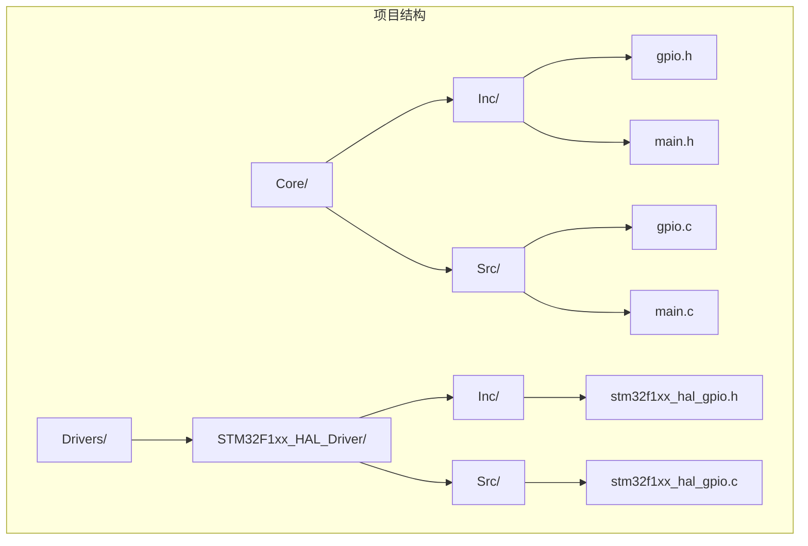
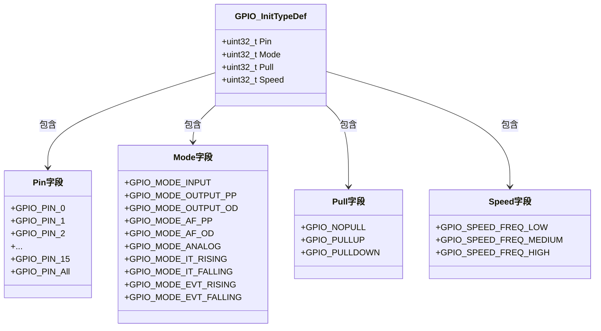
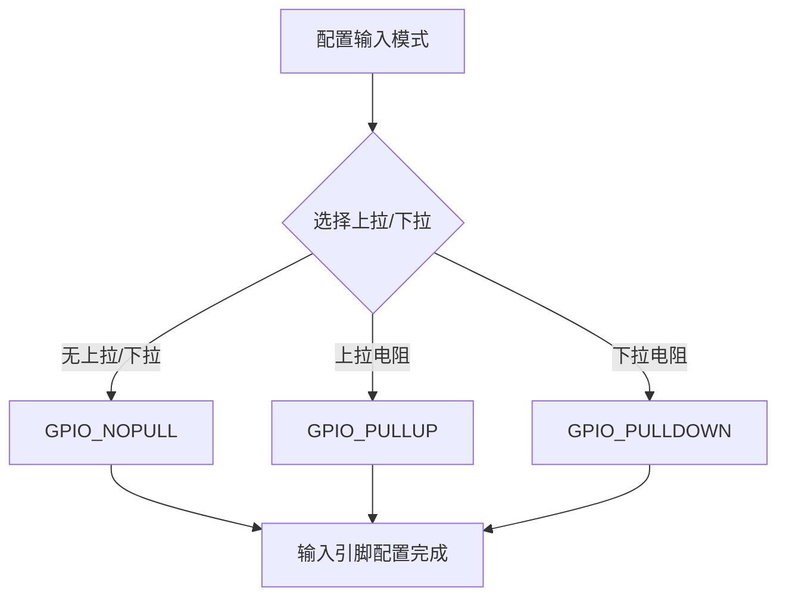
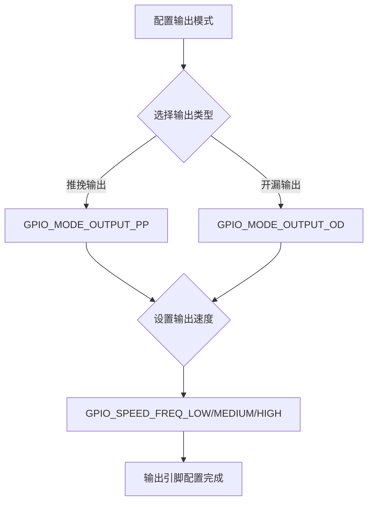
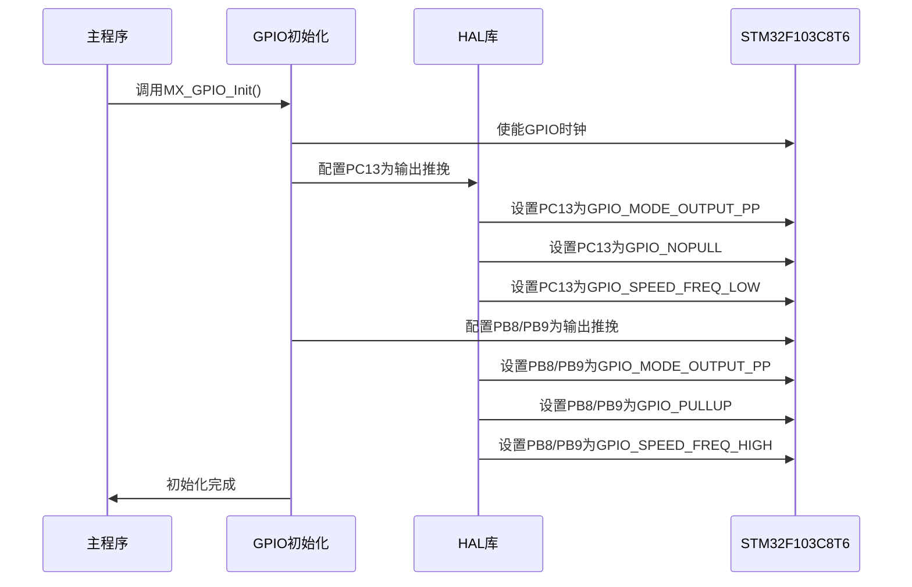
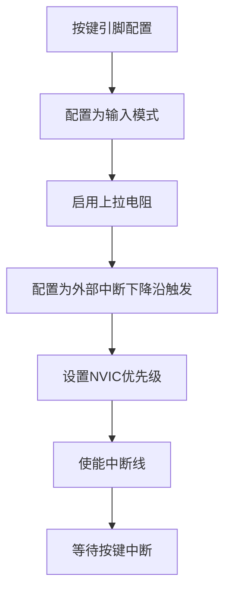
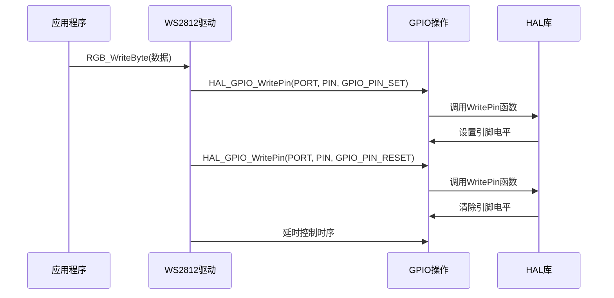
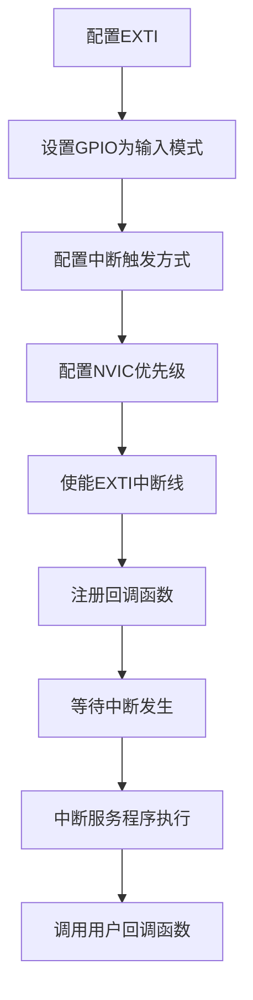

# GPIO HAL库使用

<cite>
**本文档引用的文件**
- [Core/Inc/gpio.h](file://Core/Inc/gpio.h)
- [Core/Src/gpio.c](file://Core/Src/gpio.c)
- [Drivers/STM32F1xx_HAL_Driver/Inc/stm32f1xx_hal_gpio.h](file://Drivers/STM32F1xx_HAL_Driver/Inc/stm32f1xx_hal_gpio.h)
- [Drivers/STM32F1xx_HAL_Driver/Src/stm32f1xx_hal_gpio.c](file://Drivers/STM32F1xx_HAL_Driver/Src/stm32f1xx_hal_gpio.c)
- [Core/Inc/main.h](file://Core/Inc/main.h)
- [Core/Src/main.c](file://Core/Src/main.c)
- [Drivers/STM32F1xx_HAL_Driver/Inc/stm32f1xx_hal_exti.h](file://Drivers/STM32F1xx_HAL_Driver/Inc/stm32f1xx_hal_exti.h)
</cite>

## 目录
1. [简介](#简介)
2. [项目结构](#项目结构)
3. [GPIO初始化结构体详解](#gpio初始化结构体详解)
4. [GPIO模式配置详解](#gpio模式配置详解)
5. [GPIO引脚配置示例](#gpio引脚配置示例)
6. [GPIO读写操作函数](#gpio读写操作函数)
7. [EXTI外部中断功能](#exti外部中断功能)
8. [完整使用示例](#完整使用示例)
9. [最佳实践和常见错误](#最佳实践和常见错误)
10. [故障排除指南](#故障排除指南)
11. [总结](#总结)

## 简介

本指南详细介绍了STM32F1系列GPIO HAL库的使用方法，基于实际的STM32F103C8T6项目代码。该指南涵盖了GPIO_InitTypeDef结构体的各个字段含义、GPIO模式配置、引脚初始化、读写操作以及EXTI外部中断功能的完整使用流程。

## 项目结构

该项目采用标准的STM32CubeMX项目结构，主要涉及以下关键文件：



**图表来源**
- [Core/Inc/gpio.h](file://Core/Inc/gpio.h#L1-L50)
- [Core/Src/gpio.c](file://Core/Src/gpio.c#L1-L94)
- [Drivers/STM32F1xx_HAL_Driver/Inc/stm32f1xx_hal_gpio.h](file://Drivers/STM32F1xx_HAL_Driver/Inc/stm32f1xx_hal_gpio.h#L1-L307)

**章节来源**
- [Core/Inc/gpio.h](file://Core/Inc/gpio.h#L1-L50)
- [Core/Src/gpio.c](file://Core/Src/gpio.c#L1-L94)
- [Drivers/STM32F1xx_HAL_Driver/Inc/stm32f1xx_hal_gpio.h](file://Drivers/STM32F1xx_HAL_Driver/Inc/stm32f1xx_hal_gpio.h#L1-L307)

## GPIO初始化结构体详解

### GPIO_InitTypeDef结构体定义

GPIO_InitTypeDef是GPIO初始化的核心结构体，包含四个关键字段：



**图表来源**
- [Drivers/STM32F1xx_HAL_Driver/Inc/stm32f1xx_hal_gpio.h](file://Drivers/STM32F1xx_HAL_Driver/Inc/stm32f1xx_hal_gpio.h#L46-L59)

### 字段详细说明

#### Pin引脚选择
- **作用**：指定要配置的GPIO引脚
- **取值范围**：GPIO_PIN_0到GPIO_PIN_15，或GPIO_PIN_All（全部引脚）
- **使用方式**：可以单独指定单个引脚，也可以通过按位或运算同时配置多个引脚

#### Mode模式设置
- **GPIO_MODE_INPUT**：输入模式（浮空输入）
- **GPIO_MODE_OUTPUT_PP**：输出推挽模式
- **GPIO_MODE_OUTPUT_OD**：输出开漏模式
- **GPIO_MODE_AF_PP**：复用功能推挽模式
- **GPIO_MODE_AF_OD**：复用功能开漏模式
- **GPIO_MODE_ANALOG**：模拟模式
- **GPIO_MODE_IT_RISING**：外部中断上升沿触发
- **GPIO_MODE_IT_FALLING**：外部中断下降沿触发
- **GPIO_MODE_EVT_RISING**：事件产生上升沿触发
- **GPIO_MODE_EVT_FALLING**：事件产生下降沿触发

#### Pull上拉下拉配置
- **GPIO_NOPULL**：不使用上拉/下拉电阻
- **GPIO_PULLUP**：内部上拉电阻
- **GPIO_PULLDOWN**：内部下拉电阻

#### Speed输出速度控制
- **GPIO_SPEED_FREQ_LOW**：低速输出
- **GPIO_SPEED_FREQ_MEDIUM**：中速输出
- **GPIO_SPEED_FREQ_HIGH**：高速输出

**章节来源**
- [Drivers/STM32F1xx_HAL_Driver/Inc/stm32f1xx_hal_gpio.h](file://Drivers/STM32F1xx_HAL_Driver/Inc/stm32f1xx_hal_gpio.h#L46-L59)
- [Drivers/STM32F1xx_HAL_Driver/Inc/stm32f1xx_hal_gpio.h](file://Drivers/STM32F1xx_HAL_Driver/Inc/stm32f1xx_hal_gpio.h#L105-L157)

## GPIO模式配置详解

### 输入模式配置

输入模式适用于按键检测、传感器信号读取等场景：



**图表来源**
- [Drivers/STM32F1xx_HAL_Driver/Inc/stm32f1xx_hal_gpio.h](file://Drivers/STM32F1xx_HAL_Driver/Inc/stm32f1xx_hal_gpio.h#L115-L122)

### 输出模式配置

输出模式用于控制LED、继电器等外部设备：



**图表来源**
- [Drivers/STM32F1xx_HAL_Driver/Inc/stm32f1xx_hal_gpio.h](file://Drivers/STM32F1xx_HAL_Driver/Inc/stm32f1xx_hal_gpio.h#L116-L119)

### 复用功能模式

复用功能模式用于连接到片内外设：
- **GPIO_MODE_AF_PP**：连接到复用外设（如USART、SPI等）
- **GPIO_MODE_AF_OD**：开漏复用功能

### 模拟模式

模拟模式用于ADC、DAC等模拟电路接口：
- **GPIO_MODE_ANALOG**：完全模拟输入，无数字缓冲器

**章节来源**
- [Drivers/STM32F1xx_HAL_Driver/Inc/stm32f1xx_hal_gpio.h](file://Drivers/STM32F1xx_HAL_Driver/Inc/stm32f1xx_hal_gpio.h#L105-L131)

## GPIO引脚配置示例

### LED引脚配置

根据项目中的实际配置，LED引脚配置如下：



**图表来源**
- [Core/Src/gpio.c](file://Core/Src/gpio.c#L42-L89)

### 按键引脚配置

按键引脚配置展示了外部中断的使用：



**图表来源**
- [Core/Src/gpio.c](file://Core/Src/gpio.c#L66-L89)

**章节来源**
- [Core/Src/gpio.c](file://Core/Src/gpio.c#L42-L89)

## GPIO读写操作函数

### HAL_GPIO_ReadPin函数

用于读取GPIO引脚状态：

```c
GPIO_PinState HAL_GPIO_ReadPin(GPIO_TypeDef *GPIOx, uint16_t GPIO_Pin);
```

- **参数**：
  - `GPIOx`：GPIO端口号（GPIOA、GPIOB、GPIOC等）
  - `GPIO_Pin`：要读取的引脚号
- **返回值**：GPIO_PIN_SET或GPIO_PIN_RESET

### HAL_GPIO_WritePin函数

用于设置GPIO引脚状态：

```c
void HAL_GPIO_WritePin(GPIO_TypeDef *GPIOx, uint16_t GPIO_Pin, GPIO_PinState PinState);
```

- **参数**：
  - `GPIOx`：GPIO端口号
  - `GPIO_Pin`：要设置的引脚号
  - `PinState`：GPIO_PIN_SET或GPIO_PIN_RESET

### HAL_GPIO_TogglePin函数

用于切换GPIO引脚状态：

```c
void HAL_GPIO_TogglePin(GPIO_TypeDef *GPIOx, uint16_t GPIO_Pin);
```

- **功能**：将当前状态切换为相反状态

### 实际应用示例

在项目中，这些函数被广泛应用于LED控制和WS2812驱动：



**图表来源**
- [Core/Src/main.c](file://Core/Src/main.c#L122-L146)

**章节来源**
- [Drivers/STM32F1xx_HAL_Driver/Inc/stm32f1xx_hal_gpio.h](file://Drivers/STM32F1xx_HAL_Driver/Inc/stm32f1xx_hal_gpio.h#L233-L238)
- [Drivers/STM32F1xx_HAL_Driver/Src/stm32f1xx_hal_gpio.c](file://Drivers/STM32F1xx_HAL_Driver/Src/stm32f1xx_hal_gpio.c#L431-L499)

## EXTI外部中断功能

### EXTI配置流程

EXTI（外部中断/事件控制器）允许GPIO引脚作为外部中断源：



**图表来源**
- [Core/Src/gpio.c](file://Core/Src/gpio.c#L79-L89)

### 中断触发方式

EXTI支持多种触发方式：
- **上升沿触发**：GPIO_PIN_SET → GPIO_PIN_RESET
- **下降沿触发**：GPIO_PIN_RESET → GPIO_PIN_SET
- **双边沿触发**：同时响应上升沿和下降沿

### 回调函数处理

用户需要实现`HAL_GPIO_EXTI_Callback`函数来处理中断：

```c
void HAL_GPIO_EXTI_Callback(uint16_t GPIO_Pin)
{
    // 用户自定义的中断处理代码
    if(GPIO_Pin == KEY1_Pin)
    {
        // 处理KEY1按键中断
    }
}
```

**章节来源**
- [Core/Src/main.c](file://Core/Src/main.c#L527-L558)
- [Drivers/STM32F1xx_HAL_Driver/Inc/stm32f1xx_hal_exti.h](file://Drivers/STM32F1xx_HAL_Driver/Inc/stm32f1xx_hal_exti.h#L129-L136)

## 完整使用示例

### LED引脚初始化示例

基于项目中的实际配置，LED引脚初始化代码如下：

```c
// LED引脚初始化
void MX_GPIO_Init(void)
{
    GPIO_InitTypeDef GPIO_InitStruct = {0};
    
    // 使能GPIO时钟
    __HAL_RCC_GPIOC_CLK_ENABLE();
    __HAL_RCC_GPIOD_CLK_ENABLE();
    __HAL_RCC_GPIOB_CLK_ENABLE();
    __HAL_RCC_GPIOA_CLK_ENABLE();
    
    // 设置PC13初始状态为低电平
    HAL_GPIO_WritePin(GPIOC, GPIO_PIN_13, GPIO_PIN_RESET);
    
    // 配置PC13为输出推挽模式
    GPIO_InitStruct.Pin = GPIO_PIN_13;
    GPIO_InitStruct.Mode = GPIO_MODE_OUTPUT_PP;
    GPIO_InitStruct.Pull = GPIO_NOPULL;
    GPIO_InitStruct.Speed = GPIO_SPEED_FREQ_LOW;
    HAL_GPIO_Init(GPIOC, &GPIO_InitStruct);
}
```

**章节来源**
- [Core/Src/gpio.c](file://Core/Src/gpio.c#L42-L64)

### 按键引脚初始化示例

按键引脚配置展示了外部中断的完整使用：

```c
// 按键引脚初始化
void MX_GPIO_Init(void)
{
    GPIO_InitTypeDef GPIO_InitStruct = {0};
    
    // 配置按键引脚为外部中断下降沿触发
    GPIO_InitStruct.Pin = KEY1_Pin|KEY2_Pin|KEY3_Pin;
    GPIO_InitStruct.Mode = GPIO_MODE_IT_FALLING;
    GPIO_InitStruct.Pull = GPIO_PULLUP;
    HAL_GPIO_Init(GPIOB, &GPIO_InitStruct);
    
    // 配置NVIC优先级和使能中断
    HAL_NVIC_SetPriority(EXTI0_IRQn, 0, 0);
    HAL_NVIC_EnableIRQ(EXTI0_IRQn);
    
    HAL_NVIC_SetPriority(EXTI1_IRQn, 0, 0);
    HAL_NVIC_EnableIRQ(EXTI1_IRQn);
    
    HAL_NVIC_SetPriority(EXTI2_IRQn, 0, 0);
    HAL_NVIC_EnableIRQ(EXTI2_IRQn);
}
```

**章节来源**
- [Core/Src/gpio.c](file://Core/Src/gpio.c#L66-L89)

### LED控制示例

在主程序中，LED控制通过以下方式实现：

```c
// LED闪烁示例
while(1)
{
    HAL_GPIO_WritePin(GPIOB, GPIO_PIN_8, GPIO_PIN_SET);  // 点亮LED
    HAL_Delay(500);
    HAL_GPIO_WritePin(GPIOB, GPIO_PIN_8, GPIO_PIN_RESET); // 熄灭LED
    HAL_Delay(500);
}
```

**章节来源**
- [Core/Src/main.c](file://Core/Src/main.c#L425-L484)

## 最佳实践和常见错误

### 最佳实践

1. **时钟使能顺序**
   - 始终先使能GPIO时钟，再进行GPIO配置
   - 使用`__HAL_RCC_GPIOx_CLK_ENABLE()`宏

2. **引脚配置原则**
   - 输出模式时，根据负载能力选择合适的输出速度
   - 输入模式时，合理选择上拉/下拉电阻
   - 外部中断时，确保引脚配置为输入模式

3. **NVIC配置**
   - 为每个EXTI线配置适当的优先级
   - 确保中断线对应的NVIC中断已使能

4. **电源管理**
   - 在低功耗应用中，合理配置GPIO为高阻态
   - 使用`HAL_GPIO_DeInit()`释放GPIO资源

### 常见错误及解决方案

1. **未使能GPIO时钟**
   - **问题**：GPIO配置无效
   - **解决**：确保调用相应的时钟使能函数

2. **中断优先级配置错误**
   - **问题**：中断无法正常触发
   - **解决**：检查NVIC优先级设置和中断使能

3. **上拉/下拉电阻配置不当**
   - **问题**：按键检测不稳定
   - **解决**：根据具体应用选择合适的上拉/下拉电阻

4. **输出速度设置不合理**
   - **问题**：驱动能力不足或功耗过大
   - **解决**：根据负载特性选择合适的速度等级

**章节来源**
- [Drivers/STM32F1xx_HAL_Driver/Src/stm32f1xx_hal_gpio.c](file://Drivers/STM32F1xx_HAL_Driver/Src/stm32f1xx_hal_gpio.c#L63-L79)

## 故障排除指南

### GPIO初始化失败

**症状**：GPIO配置后无响应
**排查步骤**：
1. 检查时钟是否正确使能
2. 验证GPIO引脚是否被其他外设占用
3. 确认GPIO_InitStruct参数设置正确

### 中断不触发

**症状**：按键无反应
**排查步骤**：
1. 检查EXTI配置是否正确
2. 验证NVIC中断优先级设置
3. 确认回调函数已正确实现

### 读写操作异常

**症状**：LED不亮或状态异常
**排查步骤**：
1. 检查GPIO模式配置（输入/输出）
2. 验证引脚电平状态
3. 确认外部电路连接正确

### 性能问题

**症状**：系统响应缓慢
**排查步骤**：
1. 检查GPIO速度配置
2. 优化中断处理函数
3. 减少不必要的GPIO操作

**章节来源**
- [Drivers/STM32F1xx_HAL_Driver/Src/stm32f1xx_hal_gpio.c](file://Drivers/STM32F1xx_HAL_Driver/Src/stm32f1xx_hal_gpio.c#L178-L342)

## 总结

本文档基于实际的STM32F103C8T6项目代码，全面介绍了STM32F1系列GPIO HAL库的使用方法。通过深入分析GPIO_InitTypeDef结构体的各个字段、各种GPIO模式的应用场景、完整的初始化示例以及EXTI外部中断功能，读者可以掌握GPIO配置的完整流程。

关键要点包括：
- 正确理解GPIO_InitTypeDef结构体的四个核心字段
- 掌握各种GPIO模式的适用场景和配置方法
- 熟练使用GPIO读写操作函数
- 正确配置EXTI外部中断功能
- 遵循最佳实践，避免常见错误

通过参考本指南和项目中的实际代码示例，开发者可以快速上手STM32F1系列GPIO HAL库的开发工作。