# HAL库API参考手册

<cite>
**本文档引用的文件**
- [stm32f1xx_hal.h](file://Drivers/STM32F1xx_HAL_Driver/Inc/stm32f1xx_hal.h)
- [stm32f1xx_hal_def.h](file://Drivers/STM32F1xx_HAL_Driver/Inc/stm32f1xx_hal_def.h)
- [stm32f1xx_hal_gpio.h](file://Drivers/STM32F1xx_HAL_Driver/Inc/stm32f1xx_hal_gpio.h)
- [stm32f1xx_hal_uart.h](file://Drivers/STM32F1xx_HAL_Driver/Inc/stm32f1xx_hal_uart.h)
- [stm32f1xx_hal_rcc.h](file://Drivers/STM32F1xx_HAL_Driver/Inc/stm32f1xx_hal_rcc.h)
- [stm32f1xx_hal_dma.h](file://Drivers/STM32F1xx_HAL_Driver/Inc/stm32f1xx_hal_dma.h)
- [stm32f1xx_hal_flash.h](file://Drivers/STM32F1xx_HAL_Driver/Inc/stm32f1xx_hal_flash.h)
- [stm32f1xx_hal_exti.h](file://Drivers/STM32F1xx_HAL_Driver/Inc/stm32f1xx_hal_exti.h)
- [stm32f1xx_hal_pwr.h](file://Drivers/STM32F1xx_HAL_Driver/Inc/stm32f1xx_hal_pwr.h)
- [stm32f1xx_hal_cortex.h](file://Drivers/STM32F1xx_HAL_Driver/Inc/stm32f1xx_hal_cortex.h)
- [stm32f1xx_hal_gpio_ex.h](file://Drivers/STM32F1xx_HAL_Driver/Inc/stm32f1xx_hal_gpio_ex.h)
- [stm32f1xx_hal_dma_ex.h](file://Drivers/STM32F1xx_HAL_Driver/Inc/stm32f1xx_hal_dma_ex.h)
- [stm32f1xx_hal_flash_ex.h](file://Drivers/STM32F1xx_HAL_Driver/Inc/stm32f1xx_hal_flash_ex.h)
- [stm32_hal_legacy.h](file://Drivers/STM32F1xx_HAL_Driver/Inc/Legacy/stm32_hal_legacy.h)
</cite>

## 目录
1. [引言](#引言)
2. [项目结构](#项目结构)
3. [核心组件](#核心组件)
4. [架构概览](#架构概览)
5. [详细组件分析](#详细组件分析)
6. [依赖关系分析](#依赖关系分析)
7. [性能考虑](#性能考虑)
8. [故障排除指南](#故障排除指南)
9. [结论](#结论)
10. [附录](#附录)

## 引言

本手册为STM32F1系列HAL（硬件抽象层）库的完整API参考文档。HAL库通过统一的编程接口屏蔽了不同STM32系列芯片的硬件差异，为开发者提供了可移植、易用且高效的嵌入式软件开发框架。

STM32F1系列基于ARM Cortex-M3内核，具有丰富的外设资源和灵活的时钟系统。HAL库在保持高性能的同时，提供了高级别的抽象，使得开发者能够专注于应用逻辑而非底层硬件细节。

本手册涵盖以下核心功能模块：
- 系统初始化与控制
- 外设驱动（GPIO、UART、DMA、FLASH等）
- 中断与异常管理
- 电源管理与低功耗模式
- 时钟系统配置
- 外设扩展功能

## 项目结构

STM32F1 HAL库采用模块化设计，主要包含以下目录结构：

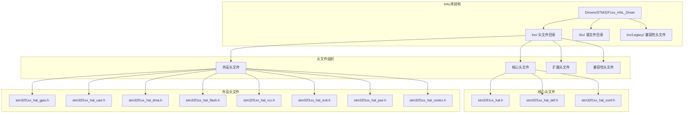

**图表来源**
- [stm32f1xx_hal.h](file://Drivers/STM32F1xx_HAL_Driver/Inc/stm32f1xx_hal.h#L1-L358)
- [stm32f1xx_hal_def.h](file://Drivers/STM32F1xx_HAL_Driver/Inc/stm32f1xx_hal_def.h#L1-L212)

**章节来源**
- [stm32f1xx_hal.h](file://Drivers/STM32F1xx_HAL_Driver/Inc/stm32f1xx_hal.h#L1-L358)
- [stm32f1xx_hal_def.h](file://Drivers/STM32F1xx_HAL_Driver/Inc/stm32f1xx_hal_def.h#L1-L212)

## 核心组件

### HAL基础框架

HAL库的核心基础定义位于stm32f1xx_hal_def.h中，包含了所有外设共享的基础类型、枚举和宏定义。

#### 基础数据类型

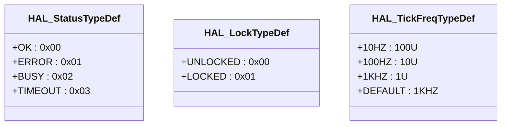

**图表来源**
- [stm32f1xx_hal_def.h](file://Drivers/STM32F1xx_HAL_Driver/Inc/stm32f1xx_hal_def.h#L38-L53)

#### 锁定机制

HAL库实现了基于原子操作的锁定机制，用于防止多线程环境下的资源竞争：

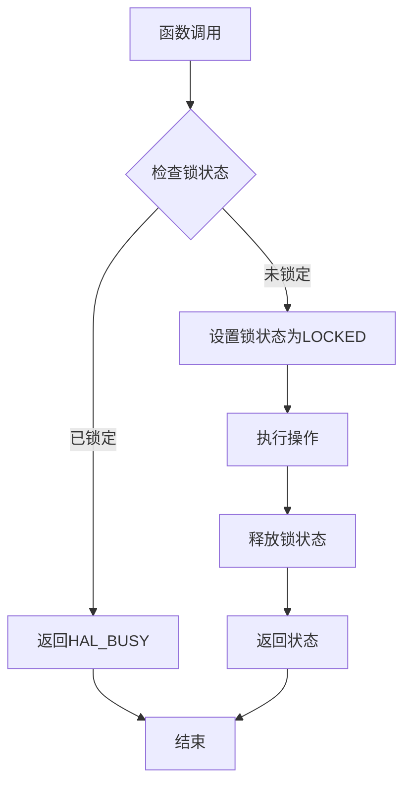

**图表来源**
- [stm32f1xx_hal_def.h](file://Drivers/STM32F1xx_HAL_Driver/Inc/stm32f1xx_hal_def.h#L92-L107)

**章节来源**
- [stm32f1xx_hal_def.h](file://Drivers/STM32F1xx_HAL_Driver/Inc/stm32f1xx_hal_def.h#L35-L212)

### 系统初始化与控制

HAL库提供了完整的系统初始化和控制功能，包括外设初始化、时钟配置和调试支持。

#### 系统初始化流程

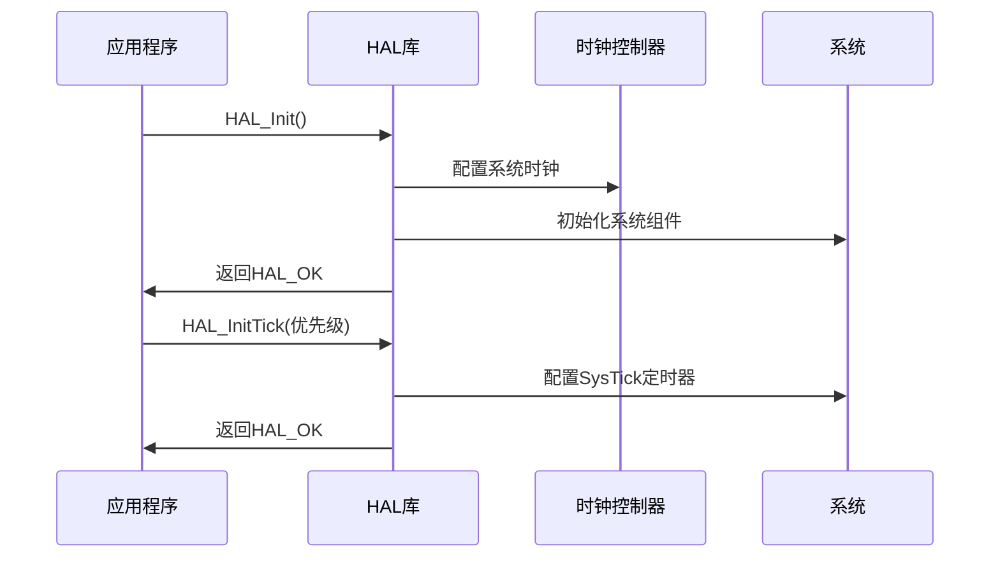

**图表来源**
- [stm32f1xx_hal.h](file://Drivers/STM32F1xx_HAL_Driver/Inc/stm32f1xx_hal.h#L282-L286)

**章节来源**
- [stm32f1xx_hal.h](file://Drivers/STM32F1xx_HAL_Driver/Inc/stm32f1xx_hal.h#L274-L321)

## 架构概览

### 整体架构设计

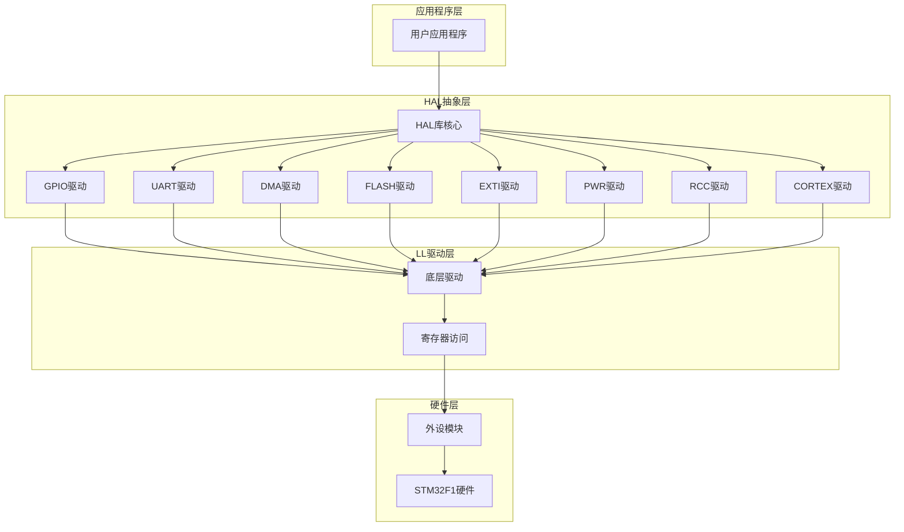

**图表来源**
- [stm32f1xx_hal.h](file://Drivers/STM32F1xx_HAL_Driver/Inc/stm32f1xx_hal.h#L31-L37)
- [stm32f1xx_hal_def.h](file://Drivers/STM32F1xx_HAL_Driver/Inc/stm32f1xx_hal_def.h#L28-L31)

### 外设驱动架构

每个外设驱动都遵循统一的架构模式：

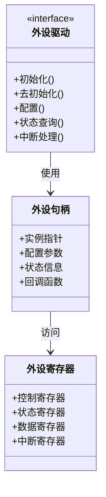

**图表来源**
- [stm32f1xx_hal_gpio.h](file://Drivers/STM32F1xx_HAL_Driver/Inc/stm32f1xx_hal_gpio.h#L160-L213)
- [stm32f1xx_hal_uart.h](file://Drivers/STM32F1xx_HAL_Driver/Inc/stm32f1xx_hal_uart.h#L159-L213)

## 详细组件分析

### GPIO驱动

GPIO（通用输入输出）是STM32F1系列最常用的外设之一，提供了灵活的数字I/O功能。

#### GPIO初始化配置

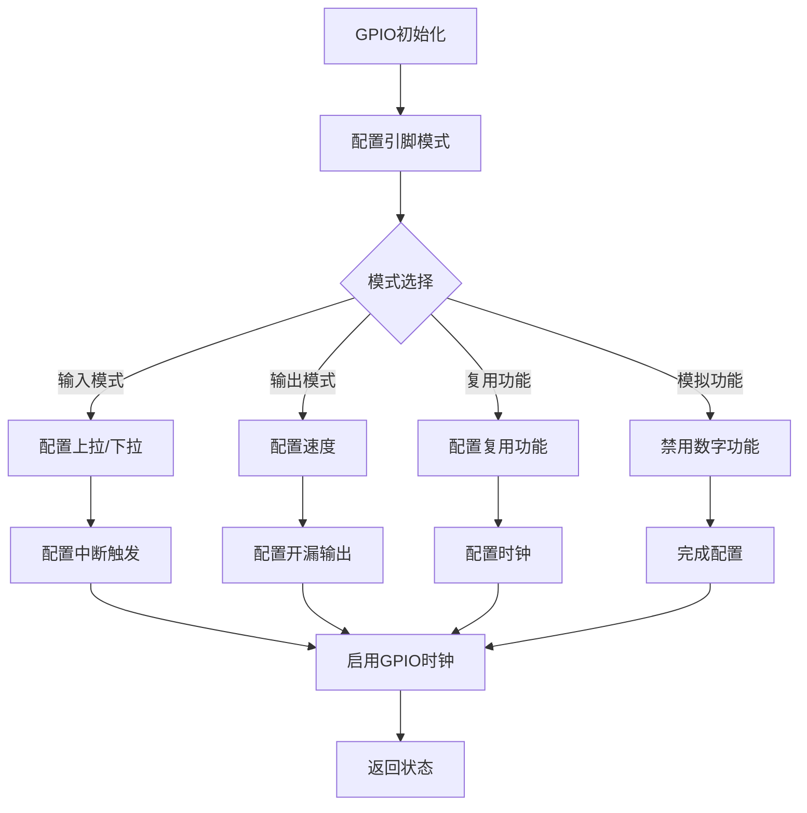

**图表来源**
- [stm32f1xx_hal_gpio.h](file://Drivers/STM32F1xx_HAL_Driver/Inc/stm32f1xx_hal_gpio.h#L46-L59)

#### GPIO模式定义

GPIO支持多种工作模式：

| 模式类型 | 描述 | 应用场景 |
|---------|------|----------|
| 输入模式 | 浮空输入 | 一般输入检测 |
| 上拉输入 | 内部上拉电阻 | 按键检测 |
| 下拉输入 | 内部下拉电阻 | 漏极开路输出 |
| 输出推挽 | 推挽输出 | LED驱动 |
| 输出开漏 | 开漏输出 | I2C总线 |
| 复用推挽 | 复用功能 | UART通信 |
| 复用开漏 | 复用开漏 | I2C通信 |
| 模拟模式 | 模拟输入 | ADC采样 |

**章节来源**
- [stm32f1xx_hal_gpio.h](file://Drivers/STM32F1xx_HAL_Driver/Inc/stm32f1xx_hal_gpio.h#L105-L157)

### UART驱动

UART（通用异步收发传输器）是串行通信的主要接口，广泛应用于调试、传感器数据传输等场景。

#### UART数据传输流程

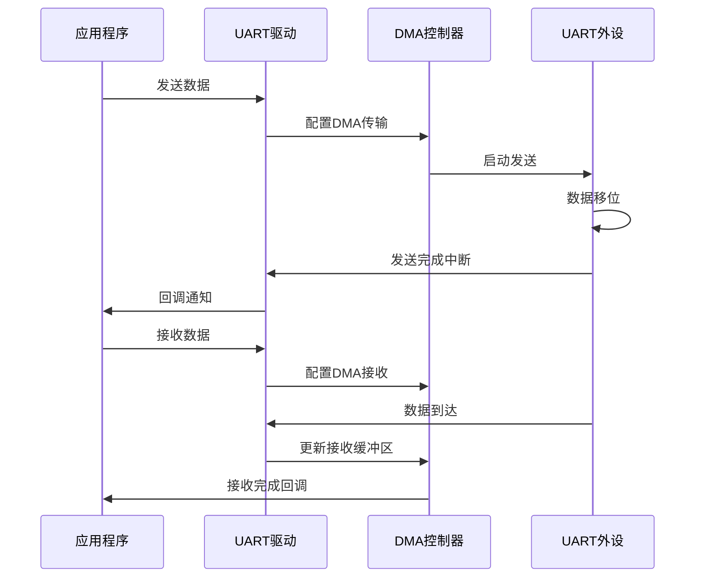

**图表来源**
- [stm32f1xx_hal_uart.h](file://Drivers/STM32F1xx_HAL_Driver/Inc/stm32f1xx_hal_uart.h#L749-L757)

#### UART配置参数

UART驱动支持灵活的配置选项：

**波特率配置**
- 支持标准波特率：9600、19200、38400、57600、115200
- 可编程分频系数实现精确波特率控制
- 支持16倍和8倍过采样模式

**数据格式配置**
- 数据位：5、6、7、8、9位可选
- 停止位：1、1.5、2位可选
- 校验位：无校验、偶校验、奇校验可选

**传输模式**
- 查询模式：阻塞式传输
- 中断模式：非阻塞式传输
- DMA模式：高效批量传输

**章节来源**
- [stm32f1xx_hal_uart.h](file://Drivers/STM32F1xx_HAL_Driver/Inc/stm32f1xx_hal_uart.h#L43-L75)

### DMA驱动

DMA（直接存储器访问）提供了高速的数据传输能力，减少了CPU的负担。

#### DMA传输类型

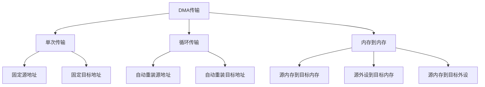

**图表来源**
- [stm32f1xx_hal_dma.h](file://Drivers/STM32F1xx_HAL_Driver/Inc/stm32f1xx_hal_dma.h#L65-L72)

#### DMA优先级配置

DMA支持四种优先级级别：

| 优先级 | 描述 | 适用场景 |
|--------|------|----------|
| 低优先级 | 最低优先级 | 背景数据传输 |
| 中优先级 | 中等优先级 | 实时数据传输 |
| 高优先级 | 较高优先级 | 关键数据传输 |
| 超高优先级 | 最高优先级 | 紧急数据传输 |

**章节来源**
- [stm32f1xx_hal_dma.h](file://Drivers/STM32F1xx_HAL_Driver/Inc/stm32f1xx_hal_dma.h#L208-L226)

### FLASH驱动

FLASH存储器用于程序代码和数据的长期存储，HAL库提供了完整的编程和擦除功能。

#### FLASH编程流程

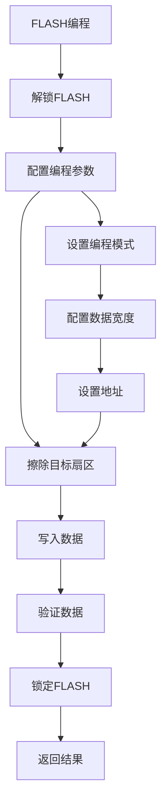

**图表来源**
- [stm32f1xx_hal_flash.h](file://Drivers/STM32F1xx_HAL_Driver/Inc/stm32f1xx_hal_flash.h#L257-L258)

#### FLASH错误处理

| 错误类型 | 错误码 | 描述 |
|----------|--------|------|
| 无错误 | 0x00 | 正常操作 |
| 编程错误 | 0x01 | 编程过程中发生错误 |
| 写保护错误 | 0x02 | 写保护阻止操作 |
| 选项字节错误 | 0x04 | 选项字节配置错误 |

**章节来源**
- [stm32f1xx_hal_flash.h](file://Drivers/STM32F1xx_HAL_Driver/Inc/stm32f1xx_hal_flash.h#L111-L122)

### 外部中断EXTI

EXTI（外部中断）控制器提供了灵活的外部事件检测和中断功能。

#### 中断触发配置

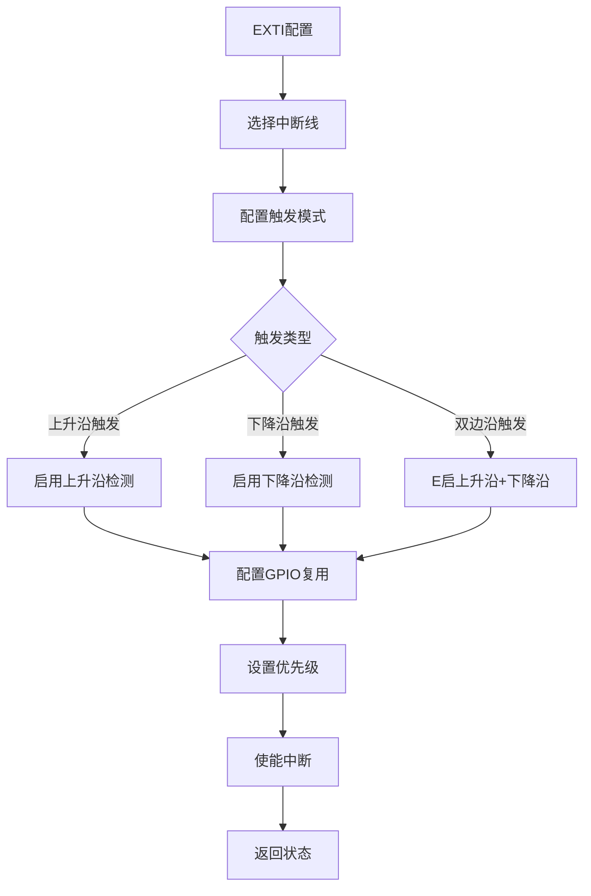

**图表来源**
- [stm32f1xx_hal_exti.h](file://Drivers/STM32F1xx_HAL_Driver/Inc/stm32f1xx_hal_exti.h#L129-L135)

**章节来源**
- [stm32f1xx_hal_exti.h](file://Drivers/STM32F1xx_HAL_Driver/Inc/stm32f1xx_hal_exti.h#L87-L159)

### 电源管理PWR

PWR模块提供了完整的电源管理和低功耗控制功能。

#### 低功耗模式

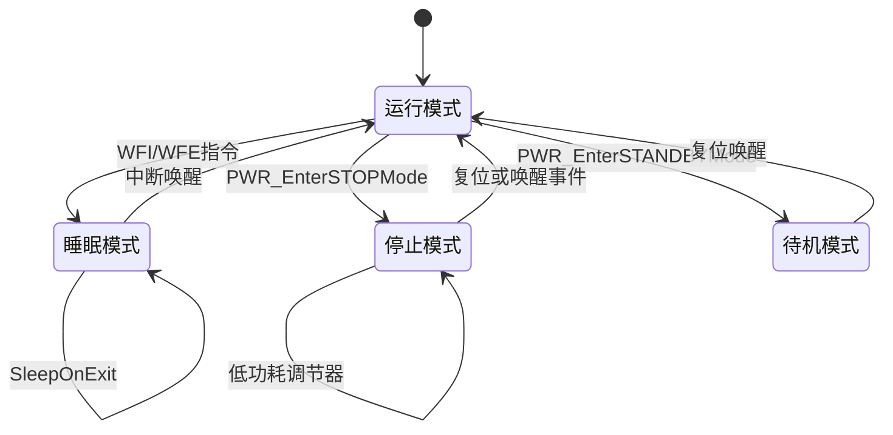

**图表来源**
- [stm32f1xx_hal_pwr.h](file://Drivers/STM32F1xx_HAL_Driver/Inc/stm32f1xx_hal_pwr.h#L351-L353)

**章节来源**
- [stm32f1xx_hal_pwr.h](file://Drivers/STM32F1xx_HAL_Driver/Inc/stm32f1xx_hal_pwr.h#L123-L151)

### 时钟控制RCC

RCC（复位和时钟控制）模块管理着整个系统的时钟树和时钟源。

#### 时钟配置流程

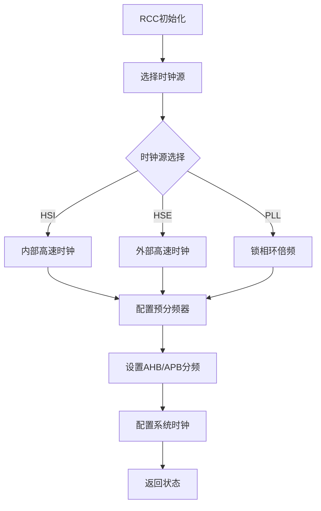

**图表来源**
- [stm32f1xx_hal_rcc.h](file://Drivers/STM32F1xx_HAL_Driver/Inc/stm32f1xx_hal_rcc.h#L62-L78)

**章节来源**
- [stm32f1xx_hal_rcc.h](file://Drivers/STM32F1xx_HAL_Driver/Inc/stm32f1xx_hal_rcc.h#L84-L198)

### CORTEX系统

CORTEX驱动提供了对ARM Cortex-M3内核特性的访问和控制。

#### NVIC优先级配置

| 优先级组 | 抢占优先级位数 | 子优先级位数 |
|----------|----------------|--------------|
| NVIC_PRIORITYGROUP_0 | 0 | 4 |
| NVIC_PRIORITYGROUP_1 | 1 | 3 |
| NVIC_PRIORITYGROUP_2 | 2 | 2 |
| NVIC_PRIORITYGROUP_3 | 3 | 1 |
| NVIC_PRIORITYGROUP_4 | 4 | 0 |

**章节来源**
- [stm32f1xx_hal_cortex.h](file://Drivers/STM32F1xx_HAL_Driver/Inc/stm32f1xx_hal_cortex.h#L86-L99)

## 依赖关系分析

### 外设驱动依赖图

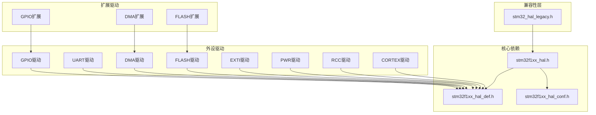

**图表来源**
- [stm32f1xx_hal.h](file://Drivers/STM32F1xx_HAL_Driver/Inc/stm32f1xx_hal.h#L28-L29)
- [stm32f1xx_hal_gpio_ex.h](file://Drivers/STM32F1xx_HAL_Driver/Inc/stm32f1xx_hal_gpio_ex.h#L27-L28)

### 头文件包含关系

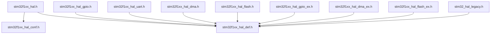

**图表来源**
- [stm32f1xx_hal_gpio.h](file://Drivers/STM32F1xx_HAL_Driver/Inc/stm32f1xx_hal_gpio.h#L27-L28)
- [stm32f1xx_hal_uart.h](file://Drivers/STM32F1xx_HAL_Driver/Inc/stm32f1xx_hal_uart.h#L27-L28)

**章节来源**
- [stm32f1xx_hal.h](file://Drivers/STM32F1xx_HAL_Driver/Inc/stm32f1xx_hal.h#L28-L31)
- [stm32f1xx_hal_gpio.h](file://Drivers/STM32F1xx_HAL_Driver/Inc/stm32f1xx_hal_gpio.h#L27-L28)

## 性能考虑

### 时钟频率优化

STM32F1系列支持多种时钟源和分频方案：

| 时钟源 | 频率范围 | 特点 |
|--------|----------|------|
| HSI | 8MHz | 内部RC振荡器，无需外部器件 |
| HSE | 4-24MHz | 外部晶振，精度高 |
| LSI | ~40kHz | 内部低速振荡器 |
| LSE | 32.768kHz | 外部低速晶振，RTC专用 |

### DMA传输优化

DMA传输相比CPU直接传输具有显著优势：

- **带宽优势**：DMA直接访问内存，不占用CPU总线
- **延迟优势**：批量传输减少中断次数
- **功耗优势**：CPU可以进入低功耗模式

### 中断处理优化

合理的中断优先级配置可以提高系统响应性能：

1. **优先级分组**：根据应用需求合理分配抢占优先级和子优先级
2. **中断嵌套**：利用中断嵌套机制处理紧急任务
3. **中断合并**：将多个相关中断合并处理

## 故障排除指南

### 常见错误诊断

#### HAL状态错误

| 错误类型 | 可能原因 | 解决方案 |
|----------|----------|----------|
| HAL_ERROR | 参数验证失败 | 检查函数参数有效性 |
| HAL_BUSY | 资源被占用 | 等待当前操作完成 |
| HAL_TIMEOUT | 操作超时 | 检查时钟配置和硬件连接 |
| HAL_OK | 正常状态 | 继续执行后续操作 |

#### 外设初始化失败

**GPIO初始化失败排查**：
1. 检查GPIO时钟是否已启用
2. 验证引脚配置与外设功能匹配
3. 确认复用功能配置正确

**UART初始化失败排查**：
1. 检查波特率计算是否正确
2. 验证引脚映射关系
3. 确认时钟分频配置

**DMA初始化失败排查**：
1. 检查DMA通道冲突
2. 验证缓冲区地址对齐
3. 确认传输方向和数据宽度

#### 电源管理问题

**低功耗模式唤醒失败**：
1. 检查唤醒源配置
2. 验证唤醒引脚电平
3. 确认时钟恢复时间

**系统复位问题**：
1. 检查看门狗配置
2. 验证电源电压稳定性
3. 确认复位引脚状态

**章节来源**
- [stm32f1xx_hal_def.h](file://Drivers/STM32F1xx_HAL_Driver/Inc/stm32f1xx_hal_def.h#L38-L44)
- [stm32f1xx_hal_pwr.h](file://Drivers/STM32F1xx_HAL_Driver/Inc/stm32f1xx_hal_pwr.h#L351-L353)

## 结论

STM32F1 HAL库通过其模块化的架构设计和丰富的功能特性，为嵌入式开发者提供了强大而灵活的开发平台。该库的主要优势包括：

1. **统一抽象**：屏蔽了不同STM32系列的硬件差异
2. **模块化设计**：每个外设都有独立的驱动模块
3. **灵活配置**：支持丰富的配置选项和参数调整
4. **性能优化**：提供DMA、中断等高性能特性
5. **易于使用**：简洁的API设计和完善的错误处理

在实际应用中，开发者应根据具体需求选择合适的外设驱动和配置参数，充分利用HAL库提供的抽象优势，同时注意性能优化和错误处理的最佳实践。

## 附录

### API版本兼容性

#### 向后兼容性

HAL库通过`stm32_hal_legacy.h`头文件维护向后兼容性：

- **常量别名**：为旧版本常量提供新的名称映射
- **函数别名**：保持API名称的一致性
- **行为兼容**：确保新版本的行为与旧版本相同

#### 版本升级注意事项

1. **编译器兼容性**：确保使用支持的编译器版本
2. **头文件路径**：正确配置包含路径
3. **链接器脚本**：更新链接器配置以适应新版本

### 最佳实践建议

#### 代码组织

1. **模块化设计**：将功能相关的代码组织在同一模块中
2. **错误处理**：始终检查HAL函数的返回状态
3. **资源管理**：及时释放占用的系统资源
4. **配置验证**：在运行前验证所有配置参数

#### 性能优化

1. **DMA优先**：对于大量数据传输优先使用DMA
2. **中断优化**：合理配置中断优先级和处理函数
3. **时钟管理**：根据应用需求调整系统时钟频率
4. **低功耗设计**：在空闲时进入适当的低功耗模式

#### 安全考虑

1. **边界检查**：验证数组索引和指针有效性
2. **内存对齐**：确保数据结构按要求对齐
3. **中断安全**：在关键代码段禁用中断
4. **超时处理**：为可能阻塞的操作设置超时机制