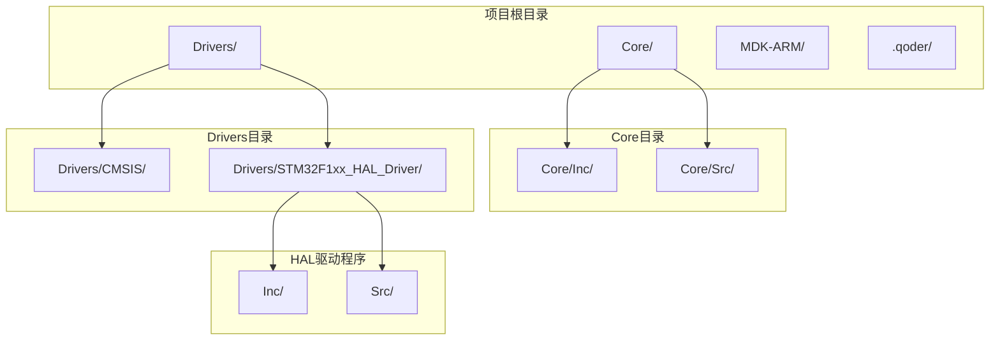
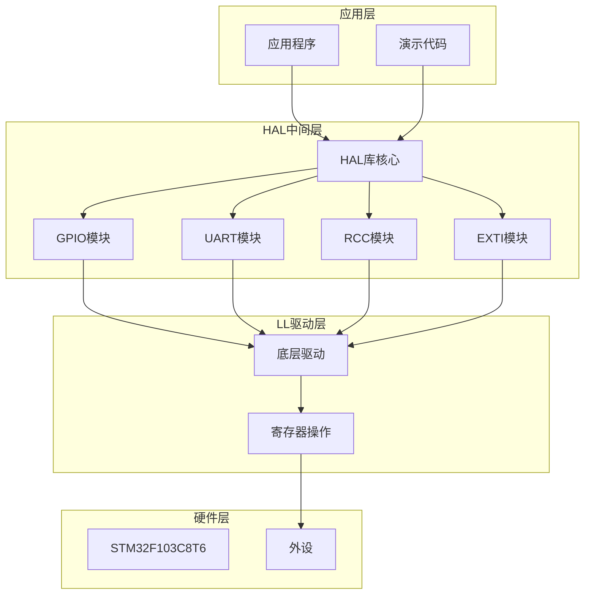
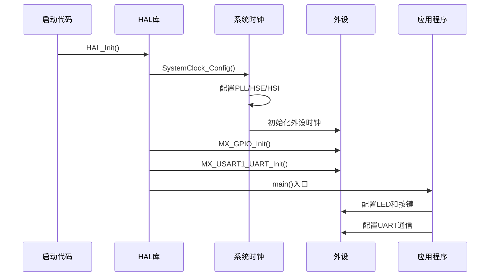
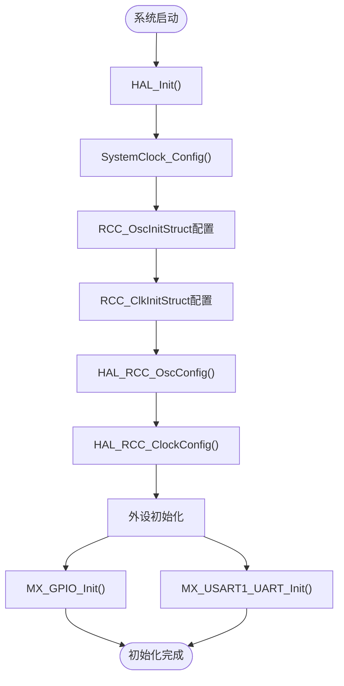
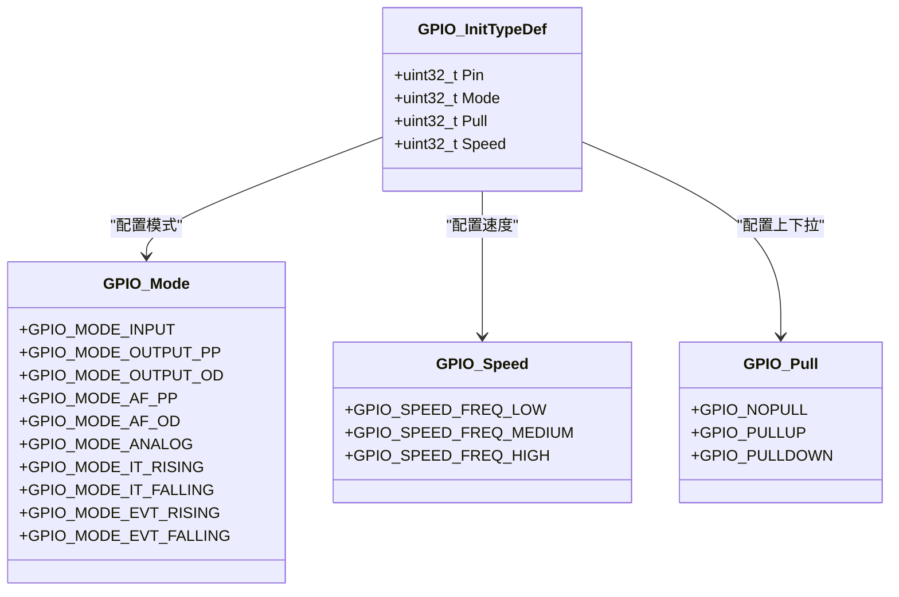
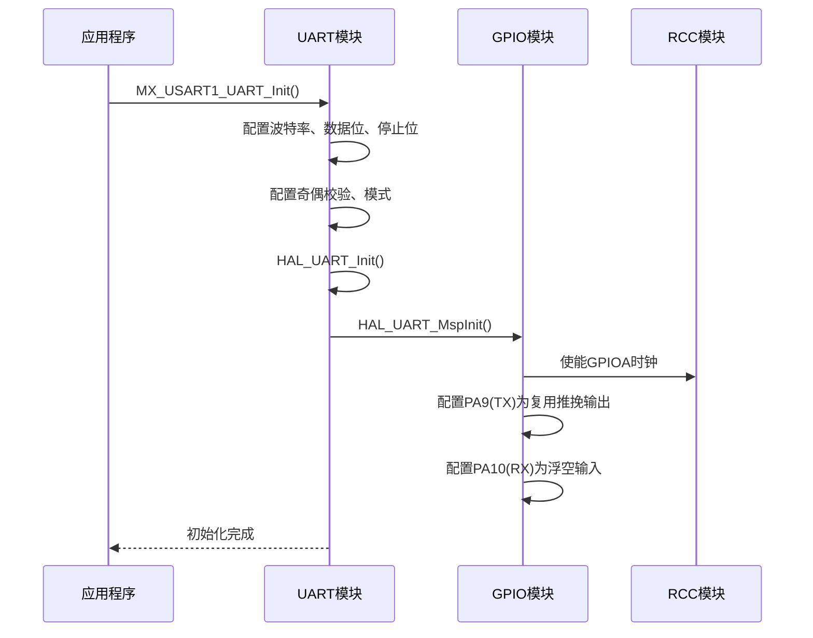
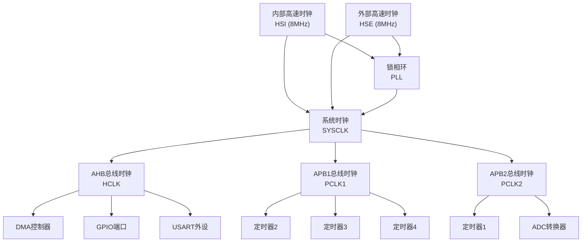
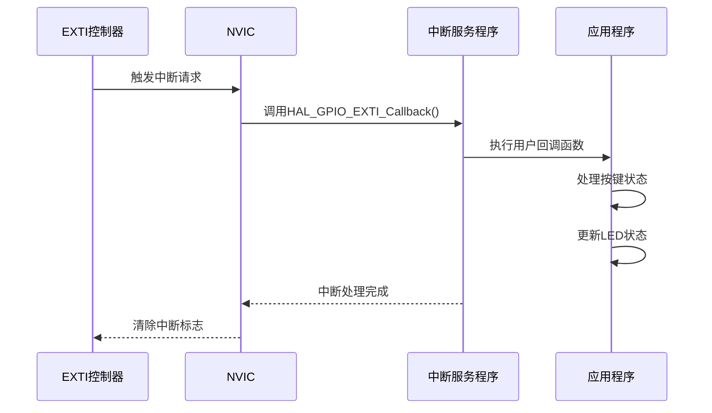
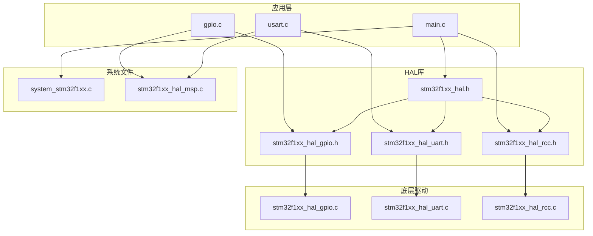
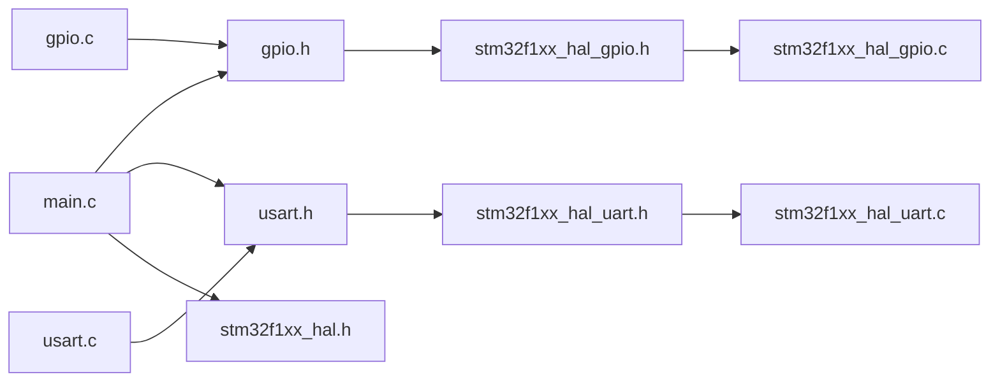

# HAL库使用指南

<cite>
**本文档引用的文件**
- [main.c](file://Core/Src/main.c)
- [gpio.c](file://Core/Src/gpio.c)
- [usart.c](file://Core/Src/usart.c)
- [stm32f1xx_hal_msp.c](file://Core/Src/stm32f1xx_hal_msp.c)
- [system_stm32f1xx.c](file://Core/Src/system_stm32f1xx.c)
- [gpio.h](file://Core/Inc/gpio.h)
- [usart.h](file://Core/Inc/usart.h)
- [stm32f1xx_hal.h](file://Drivers/STM32F1xx_HAL_Driver/Inc/stm32f1xx_hal.h)
- [stm32f1xx_hal_gpio.h](file://Drivers/STM32F1xx_HAL_Driver/Inc/stm32f1xx_hal_gpio.h)
- [stm32f1xx_hal_uart.h](file://Drivers/STM32F1xx_HAL_Driver/Inc/stm32f1xx_hal_uart.h)
- [stm32f1xx_hal_rcc.h](file://Drivers/STM32F1xx_HAL_Driver/Inc/stm32f1xx_hal_rcc.h)
- [stm32f1xx_hal_gpio.c](file://Drivers/STM32F1xx_HAL_Driver/Src/stm32f1xx_hal_gpio.c)
- [stm32f1xx_hal_uart.c](file://Drivers/STM32F1xx_HAL_Driver/Src/stm32f1xx_hal_uart.c)
- [stm32f1xx_hal_rcc.c](file://Drivers/STM32F1xx_HAL_Driver/Src/stm32f1xx_hal_rcc.c)
</cite>

## 目录
1. [简介](#简介)
2. [项目结构](#项目结构)
3. [核心组件](#核心组件)
4. [架构概览](#架构概览)
5. [详细组件分析](#详细组件分析)
6. [依赖关系分析](#依赖关系分析)
7. [性能考虑](#性能考虑)
8. [故障排除指南](#故障排除指南)
9. [结论](#结论)
10. [附录](#附录)

## 简介

本指南面向STM32 HAL库的使用者，旨在帮助开发者全面掌握STM32硬件抽象层库的使用方法。HAL库通过统一的API接口封装了STM32微控制器的各种外设功能，提供了跨系列芯片的兼容性，简化了嵌入式开发流程。

本项目基于STM32F103C8T6微控制器，展示了HAL库在实际项目中的应用，包括GPIO配置、UART通信、RCC时钟管理等核心功能的完整实现。

## 项目结构

该项目采用标准的STM32CubeMX项目结构，主要包含以下目录：

**图表来源**
- [main.c](file://Core/Src/main.c#L1-L50)
- [stm32f1xx_hal.h](file://Drivers/STM32F1xx_HAL_Driver/Inc/stm32f1xx_hal.h#L1-L50)

**章节来源**
- [main.c](file://Core/Src/main.c#L1-L50)
- [stm32f1xx_hal.h](file://Drivers/STM32F1xx_HAL_Driver/Inc/stm32f1xx_hal.h#L1-L50)

## 核心组件

### HAL库架构概述

STM32 HAL库采用分层架构设计，主要分为以下几个层次：

**图表来源**
- [stm32f1xx_hal.h](file://Drivers/STM32F1xx_HAL_Driver/Inc/stm32f1xx_hal.h#L282-L315)
- [stm32f1xx_hal_gpio.h](file://Drivers/STM32F1xx_HAL_Driver/Inc/stm32f1xx_hal_gpio.h#L38-L71)

### 主要模块功能

1. **GPIO模块**: 提供通用输入输出引脚的配置和控制功能
2. **UART模块**: 实现串行通信协议的初始化和数据传输
3. **RCC模块**: 管理系统时钟配置和外设时钟控制
4. **EXTI模块**: 处理外部中断请求
5. **系统Tick模块**: 提供系统节拍和延时功能

**章节来源**
- [stm32f1xx_hal_gpio.h](file://Drivers/STM32F1xx_HAL_Driver/Inc/stm32f1xx_hal_gpio.h#L38-L71)
- [stm32f1xx_hal_uart.h](file://Drivers/STM32F1xx_HAL_Driver/Inc/stm32f1xx_hal_uart.h#L38-L76)
- [stm32f1xx_hal_rcc.h](file://Drivers/STM32F1xx_HAL_Driver/Inc/stm32f1xx_hal_rcc.h#L38-L82)

## 架构概览

### 系统初始化流程

**图表来源**
- [main.c](file://Core/Src/main.c#L383-L398)
- [system_stm32f1xx.c](file://Core/Src/system_stm32f1xx.c#L175-L187)

### HAL库初始化序列

**图表来源**
- [main.c](file://Core/Src/main.c#L490-L523)
- [gpio.c](file://Core/Src/gpio.c#L42-L89)
- [usart.c](file://Core/Src/usart.c#L31-L57)

**章节来源**
- [main.c](file://Core/Src/main.c#L383-L523)
- [system_stm32f1xx.c](file://Core/Src/system_stm32f1xx.c#L175-L200)

## 详细组件分析

### GPIO配置详解

#### 引脚模式配置

GPIO模块支持多种工作模式：

**图表来源**
- [stm32f1xx_hal_gpio.h](file://Drivers/STM32F1xx_HAL_Driver/Inc/stm32f1xx_hal_gpio.h#L46-L59)
- [stm32f1xx_hal_gpio.h](file://Drivers/STM32F1xx_HAL_Driver/Inc/stm32f1xx_hal_gpio.h#L105-L157)

#### 实际配置示例

在本项目中，GPIO配置展示了多种应用场景：

**LED指示灯配置**：
- 端口：GPIOC
- 引脚：PC13
- 模式：推挽输出
- 速度：低速
- 初始状态：低电平

**按键输入配置**：
- 端口：GPIOB
- 引脚：KEY1、KEY2、KEY3
- 模式：下降沿触发外部中断
- 上下拉：上拉电阻
- 中断优先级：0级

**WS2812数据线配置**：
- 端口：GPIOB
- 引脚：PB8、PB9
- 模式：推挽输出
- 速度：高速
- 初始状态：高电平

**章节来源**
- [gpio.c](file://Core/Src/gpio.c#L42-L89)
- [stm32f1xx_hal_gpio.h](file://Drivers/STM32F1xx_HAL_Driver/Inc/stm32f1xx_hal_gpio.h#L105-L157)

### UART外设初始化

#### UART初始化流程

**图表来源**
- [usart.c](file://Core/Src/usart.c#L31-L57)
- [usart.c](file://Core/Src/usart.c#L59-L90)

#### UART参数配置选项

UART模块提供了丰富的配置选项：

**波特率配置**：
- 支持标准波特率：9600、19200、38400、57600、115200
- 通过公式计算：IntegerDivider = PCLK/(16 × BaudRate)
- 分数部分：FractionalDivider = (IntegerDivider - floor(IntegerDivider)) × 16 + 0.5

**数据格式配置**：
- 数据位：5、6、7、8位
- 停止位：1、1.5、2位
- 奇偶校验：无、偶校验、奇校验

**工作模式**：
- 单工：仅发送或仅接收
- 双工：同时支持发送和接收
- 半双工：通过控制引脚实现双向通信

**章节来源**
- [usart.c](file://Core/Src/usart.c#L31-L57)
- [stm32f1xx_hal_uart.h](file://Drivers/STM32F1xx_HAL_Driver/Inc/stm32f1xx_hal_uart.h#L46-L75)

### RCC时钟配置

#### 时钟系统架构

**图表来源**
- [main.c](file://Core/Src/main.c#L490-L523)
- [stm32f1xx_hal_rcc.h](file://Drivers/STM32F1xx_HAL_Driver/Inc/stm32f1xx_hal_rcc.h#L47-L78)

#### RCC配置参数详解

**振荡器配置**：
- HSE：外部高速晶体振荡器，频率范围4-16MHz
- HSI：内部高速RC振荡器，默认8MHz
- HSE预分频：支持1分频
- HSI：内部高速时钟

**PLL配置**：
- 输入源：HSE或HSI/2
- 倍频系数：2-16倍
- 输出频率：最大72MHz

**总线时钟配置**：
- AHB预分频：1、2、4、8、16、64、128、256、512
- APB1预分频：1、2、4、8、16
- APB2预分频：1、2、4、8、16

**章节来源**
- [main.c](file://Core/Src/main.c#L490-L523)
- [stm32f1xx_hal_rcc.h](file://Drivers/STM32F1xx_HAL_Driver/Inc/stm32f1xx_hal_rcc.h#L47-L78)

### 中断处理机制

#### 外部中断配置

**图表来源**
- [main.c](file://Core/Src/main.c#L526-L558)
- [gpio.c](file://Core/Src/gpio.c#L79-L89)

#### 中断优先级配置

系统支持抢占优先级和子优先级的嵌套向量中断控制器(NVIC)：

- 抢劫优先级：0-15级，数值越小优先级越高
- 子优先级：0-15级，数值越小优先级越高
- 优先级分组：支持不同的分组方式

**章节来源**
- [gpio.c](file://Core/Src/gpio.c#L79-L89)
- [main.c](file://Core/Src/main.c#L526-L558)

## 依赖关系分析

### 模块间依赖关系

**图表来源**
- [main.c](file://Core/Src/main.c#L20-L22)
- [gpio.c](file://Core/Src/gpio.c#L22-L22)
- [usart.c](file://Core/Src/usart.c#L21-L21)

### 头文件包含关系

**图表来源**
- [main.c](file://Core/Src/main.c#L20-L22)
- [gpio.h](file://Core/Inc/gpio.h#L28-L29)
- [usart.h](file://Core/Inc/usart.h#L28-L29)

**章节来源**
- [main.c](file://Core/Src/main.c#L20-L22)
- [gpio.h](file://Core/Inc/gpio.h#L28-L29)
- [usart.h](file://Core/Inc/usart.h#L28-L29)

## 性能考虑

### 时钟配置优化

1. **时钟源选择**：
   - 高精度应用：优先使用HSE外部晶振
   - 低成本应用：可使用HSI内部时钟
   - 功耗优化：在不使用时关闭不必要的时钟

2. **预分频器配置**：
   - AHB总线：通常设置为1，获得最高性能
   - APB1总线：设置为2，满足低速外设需求
   - APB2总线：设置为1，保证高速外设性能

3. **Flash等待周期**：
   - 0-24MHz：0个等待周期
   - 24-48MHz：1个等待周期
   - 48-72MHz：2个等待周期

### GPIO性能优化

1. **输出速度选择**：
   - 高速外设：选择GPIO_SPEED_FREQ_HIGH
   - 一般应用：选择GPIO_SPEED_FREQ_MEDIUM
   - 低功耗：选择GPIO_SPEED_FREQ_LOW

2. **上下拉电阻配置**：
   - 输入上拉：按键检测时使用
   - 输入下拉：减少干扰
   - 浮空输入：避免不必要的电流消耗

### UART通信优化

1. **波特率选择**：
   - 标准通信：115200波特率
   - 高速传输：460800或更高
   - 低功耗：降低波特率

2. **DMA传输**：
   - 大量数据传输：使用DMA模式
   - 减少CPU占用
   - 提高系统效率

## 故障排除指南

### 常见问题及解决方案

#### HAL库初始化失败

**问题现象**：
- HAL_RCC_OscConfig()返回错误
- HAL_RCC_ClockConfig()返回错误

**可能原因**：
- 晶体振荡器未稳定
- PLL配置参数超出范围
- 时钟源切换失败

**解决方法**：
1. 检查外部晶振连接
2. 验证PLL倍频系数
3. 确认FLASH等待周期设置

#### GPIO配置异常

**问题现象**：
- 引脚状态不符合预期
- 中断不触发

**可能原因**：
- GPIO时钟未启用
- 引脚复用配置错误
- 中断优先级设置不当

**解决方法**：
1. 确保调用__HAL_RCC_GPIOx_CLK_ENABLE()
2. 检查GPIO_InitStruct参数
3. 验证NVIC配置

#### UART通信错误

**问题现象**：
- 数据传输失败
- 波特率不正确

**可能原因**：
- GPIO引脚配置错误
- 时钟分频设置不当
- 波特率计算错误

**解决方法**：
1. 检查USART时钟使能
2. 验证GPIO复用功能
3. 重新计算波特率参数

**章节来源**
- [main.c](file://Core/Src/main.c#L505-L522)
- [gpio.c](file://Core/Src/gpio.c#L48-L51)
- [usart.c](file://Core/Src/usart.c#L68-L84)

### 调试技巧

1. **使用调试器观察寄存器状态**
2. **启用HAL库的错误回调函数**
3. **使用printf进行调试输出**
4. **验证时钟频率测量**

## 结论

STM32 HAL库通过提供统一的API接口，显著简化了嵌入式开发流程。本项目展示了HAL库在实际应用中的完整使用方法，包括GPIO配置、UART通信、RCC时钟管理等核心功能。

通过合理配置时钟系统、优化GPIO设置、正确使用中断机制，开发者可以构建高性能、低功耗的嵌入式应用。HAL库的优势在于其跨系列芯片的兼容性和丰富的外设抽象，使得代码具有更好的可移植性。

建议开发者在项目初期就制定清晰的时钟配置策略，合理选择GPIO模式和速度，充分利用HAL库提供的中断和DMA功能，以获得最佳的系统性能。

## 附录

### 常用HAL函数参考

#### GPIO相关函数
- HAL_GPIO_Init()：GPIO初始化
- HAL_GPIO_WritePin()：设置引脚状态
- HAL_GPIO_ReadPin()：读取引脚状态
- HAL_GPIO_TogglePin()：翻转引脚状态

#### UART相关函数
- HAL_UART_Init()：UART初始化
- HAL_UART_Transmit()：阻塞发送
- HAL_UART_Receive()：阻塞接收
- HAL_UART_Transmit_IT()：中断发送
- HAL_UART_Receive_IT()：中断接收

#### RCC相关函数
- HAL_RCC_OscConfig()：振荡器配置
- HAL_RCC_ClockConfig()：时钟配置
- HAL_RCC_GetSysClockFreq()：获取系统时钟频率

### 最佳实践建议

1. **时钟配置**：优先使用外部晶振，合理设置预分频器
2. **GPIO配置**：根据应用需求选择合适的模式和速度
3. **中断处理**：保持中断服务程序简洁高效
4. **内存管理**：合理使用静态和动态内存分配
5. **错误处理**：实现完善的错误检测和恢复机制