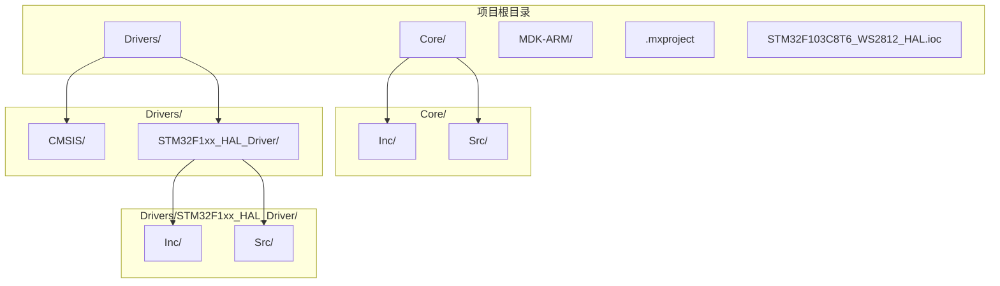
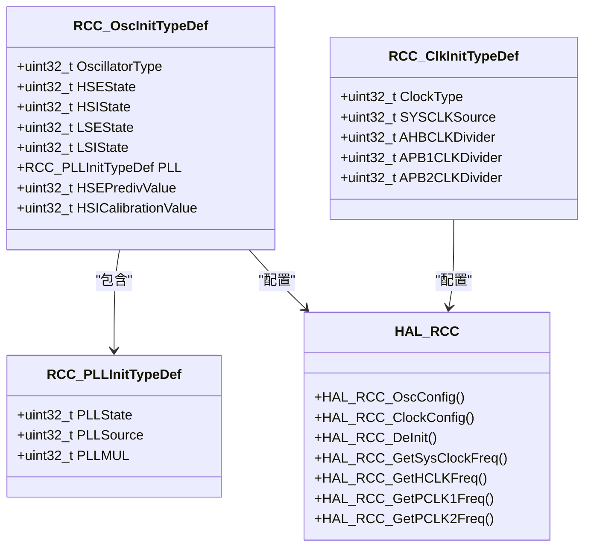
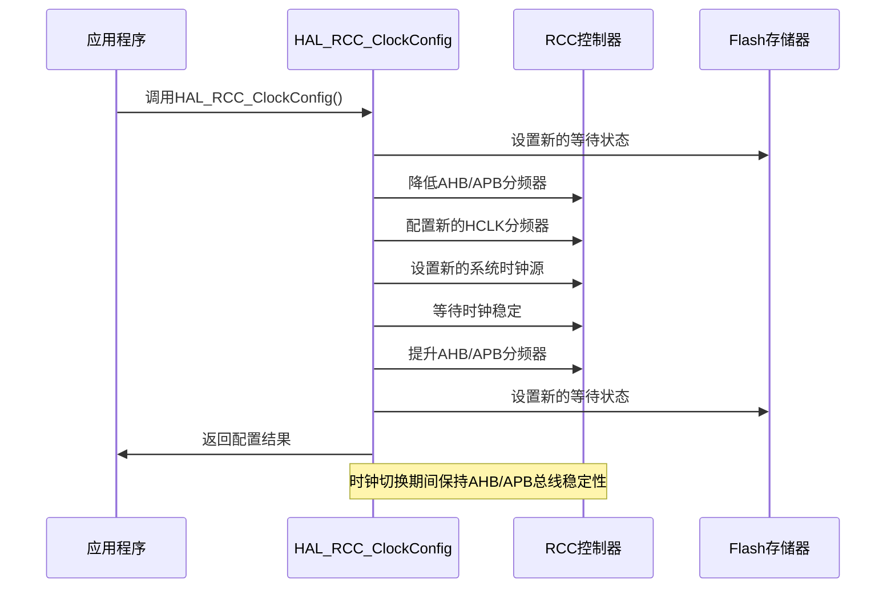
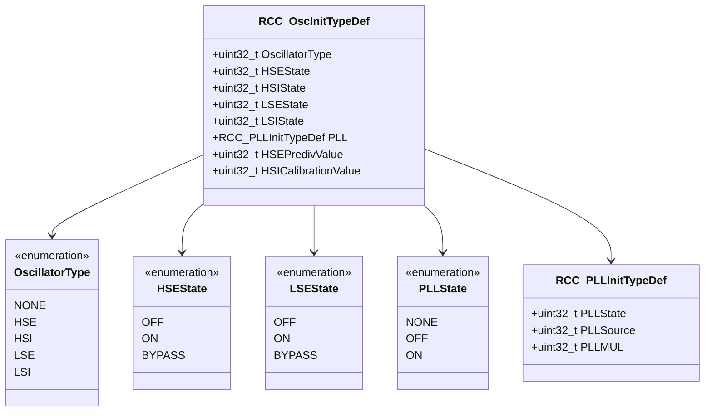
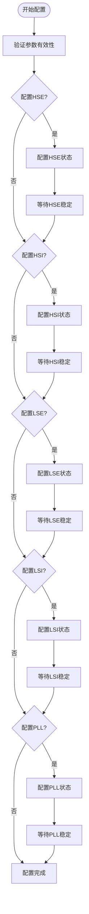
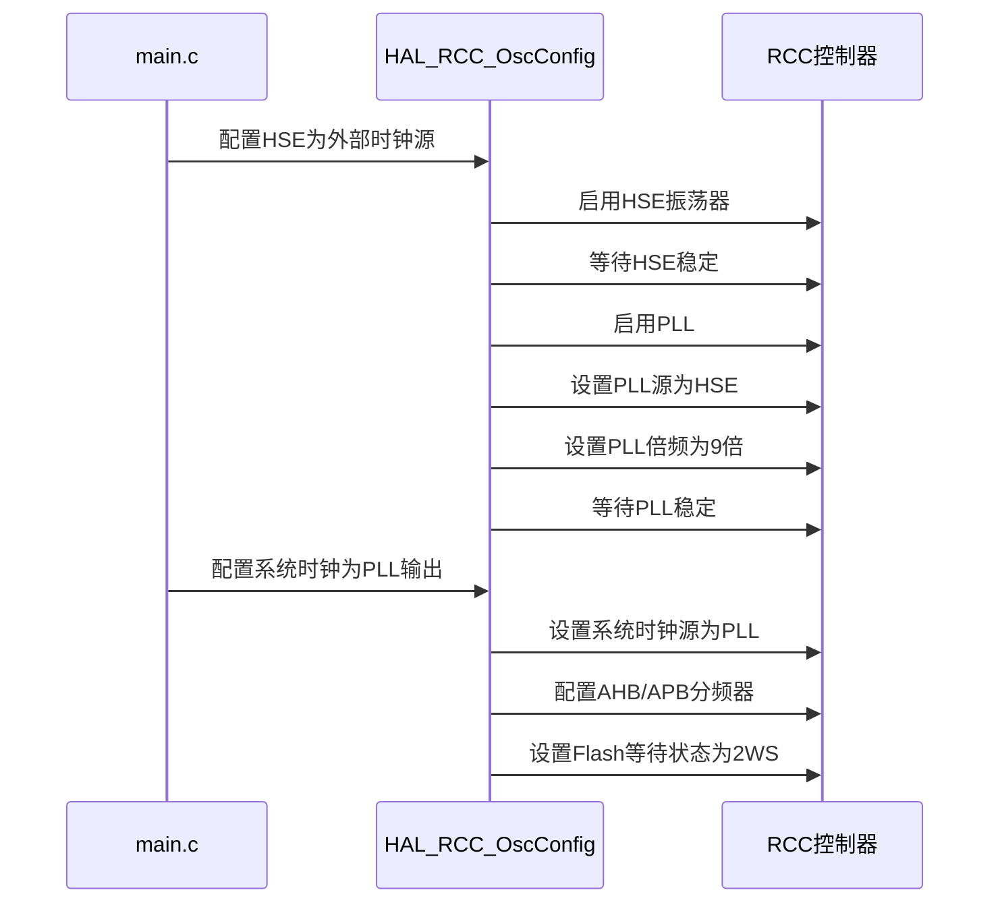
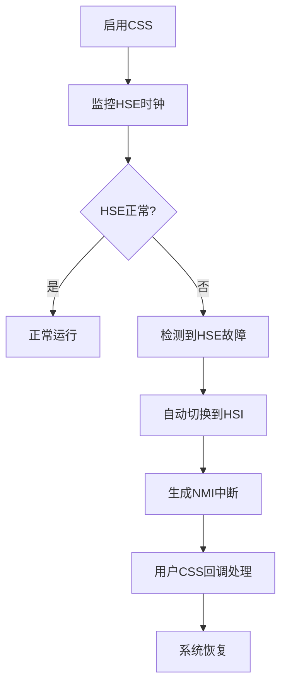
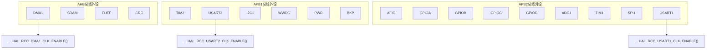
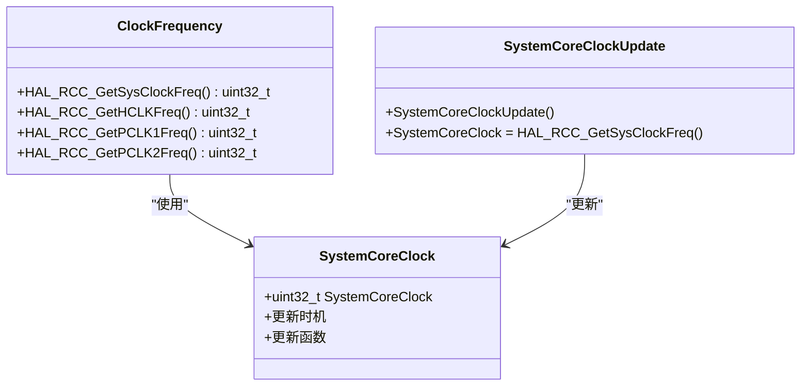

# RCC HAL库使用

<cite>
**本文档引用的文件**
- [stm32f1xx_hal_rcc.h](file://Drivers/STM32F1xx_HAL_Driver/Inc/stm32f1xx_hal_rcc.h)
- [stm32f1xx_hal_rcc.c](file://Drivers/STM32F1xx_HAL_Driver/Src/stm32f1xx_hal_rcc.c)
- [system_stm32f1xx.c](file://Core/Src/system_stm32f1xx.c)
- [stm32f1xx_hal_rcc_ex.h](file://Drivers/STM32F1xx_HAL_Driver/Inc/stm32f1xx_hal_rcc_ex.h)
- [main.c](file://Core/Src/main.c)
</cite>

## 目录
1. [简介](#简介)
2. [项目结构](#项目结构)
3. [核心组件](#核心组件)
4. [架构概览](#架构概览)
5. [详细组件分析](#详细组件分析)
6. [依赖关系分析](#依赖关系分析)
7. [性能考虑](#性能考虑)
8. [故障排除指南](#故障排除指南)
9. [结论](#结论)
10. [附录](#附录)

## 简介

本文档为STM32F1系列RCC HAL库提供了详细的使用指南。RCC（Reset and Clock Control）控制器负责管理STM32F1系列微控制器的所有时钟系统，包括内部和外部振荡器、PLL倍频器以及AHB和APB总线时钟分频器。

STM32F103C8T6作为典型的ARM Cortex-M3处理器，支持多种时钟源：
- **HSI内部高速时钟**：8MHz内部RC振荡器，精度±1%
- **HSE外部高速时钟**：4-24MHz外部晶体振荡器或3-25MHz外部时钟源
- **LSE低功耗时钟**：32.768kHz低功耗晶体振荡器
- **LSI低功耗时钟**：约40kHz内部低功耗RC振荡器

## 项目结构

该项目采用标准的STM32CubeMX项目结构，主要包含以下关键目录：



**图表来源**
- [main.c](file://Core/Src/main.c#L1-L50)
- [system_stm32f1xx.c](file://Core/Src/system_stm32f1xx.c#L1-L50)

**章节来源**
- [main.c](file://Core/Src/main.c#L1-L50)
- [system_stm32f1xx.c](file://Core/Src/system_stm32f1xx.c#L1-L50)

## 核心组件

### RCC时钟系统架构

STM32F1的RCC时钟系统采用分层架构设计：

```mermaid
flowchart TD
subgraph "时钟源层"
HSI[HSI 8MHz<br/>内部RC振荡器]
HSE[HSE 8MHz<br/>外部晶体振荡器]
LSE[LSE 32.768kHz<br/>低功耗晶体]
LSI[LSI ~40kHz<br/>低功耗RC]
end
subgraph "PLL处理层"
HSE_DIV[HSE预分频器<br/>HSE/PREDIV1]
PLL[主PLL<br/>倍频器]
USB_PLL[USB专用PLL<br/>48MHz输出]
end
subgraph "系统时钟层"
SYSCLK[系统时钟(SYSCLK)<br/>最高72MHz]
AHB[HCLK<br/>AHB总线时钟]
APB1[PCLK1<br/>APB1总线时钟<br/>最高36MHz]
APB2[PCLK2<br/>APB2总线时钟<br/>最高72MHz]
end
HSI --> SYSCLK
HSE --> HSE_DIV
HSE_DIV --> PLL
HSE --> SYSCLK
PLL --> SYSCLK
SYSCLK --> AHB
AHB --> APB1
AHB --> APB2
subgraph "专用时钟层"
RTC[RTC时钟<br/>32.768kHz]
IWDG[IWDG看门狗<br/>LSI或独立时钟]
end
LSE --> RTC
LSI --> RTC
LSI --> IWDG
```

**图表来源**
- [stm32f1xx_hal_rcc.h](file://Drivers/STM32F1xx_HAL_Driver/Inc/stm32f1xx_hal_rcc.h#L120-L190)
- [stm32f1xx_hal_rcc.c](file://Drivers/STM32F1xx_HAL_Driver/Src/stm32f1xx_hal_rcc.c#L120-L170)

### 主要时钟源特性

| 时钟源 | 频率范围 | 精度 | 功耗 | 应用场景 |
|--------|----------|------|------|----------|
| HSI | 8MHz | ±1% | 低 | 启动时钟、备用时钟 |
| HSE | 4-24MHz | ±0.1-0.5% | 中等 | 主系统时钟、高精度应用 |
| LSE | 32.768kHz | ±20ppm | 极低 | RTC实时时钟 |
| LSI | ~40kHz | ±15% | 极低 | 独立看门狗、低功耗模式 |

**章节来源**
- [stm32f1xx_hal_rcc.h](file://Drivers/STM32F1xx_HAL_Driver/Inc/stm32f1xx_hal_rcc.h#L89-L155)
- [stm32f1xx_hal_rcc.c](file://Drivers/STM32F1xx_HAL_Driver/Src/stm32f1xx_hal_rcc.c#L125-L140)

## 架构概览

### RCC模块接口设计

RCC HAL库采用面向对象的设计模式，通过结构化配置和状态管理来简化时钟配置：



**图表来源**
- [stm32f1xx_hal_rcc.h](file://Drivers/STM32F1xx_HAL_Driver/Inc/stm32f1xx_hal_rcc.h#L47-L78)
- [stm32f1xx_hal_rcc.h](file://Drivers/STM32F1xx_HAL_Driver/Inc/stm32f1xx_hal_rcc.h#L1154-L1182)

### 时钟切换流程

系统时钟切换是一个复杂的状态转换过程，涉及多个阶段的安全检查：



**图表来源**
- [stm32f1xx_hal_rcc.c](file://Drivers/STM32F1xx_HAL_Driver/Src/stm32f1xx_hal_rcc.c#L811-L948)

**章节来源**
- [stm32f1xx_hal_rcc.c](file://Drivers/STM32F1xx_HAL_Driver/Src/stm32f1xx_hal_rcc.c#L811-L948)

## 详细组件分析

### HAL_RCC_OscConfig函数详解

HAL_RCC_OscConfig函数负责配置所有振荡器和PLL设置，是RCC配置的核心入口：

#### 函数参数结构



**图表来源**
- [stm32f1xx_hal_rcc.h](file://Drivers/STM32F1xx_HAL_Driver/Inc/stm32f1xx_hal_rcc.h#L47-L108)

#### 配置流程图



**图表来源**
- [stm32f1xx_hal_rcc.c](file://Drivers/STM32F1xx_HAL_Driver/Src/stm32f1xx_hal_rcc.c#L345-L786)

#### 实际配置示例

基于项目中的实际配置，展示了如何将系统时钟配置为72MHz：



**图表来源**
- [main.c](file://Core/Src/main.c#L490-L523)
- [stm32f1xx_hal_rcc.c](file://Drivers/STM32F1xx_HAL_Driver/Src/stm32f1xx_hal_rcc.c#L345-L786)

**章节来源**
- [stm32f1xx_hal_rcc.c](file://Drivers/STM32F1xx_HAL_Driver/Src/stm32f1xx_hal_rcc.c#L345-L786)
- [main.c](file://Core/Src/main.c#L490-L523)

### HAL_RCC_ClockConfig函数详解

HAL_RCC_ClockConfig函数负责配置系统时钟、AHB和APB总线时钟的分频器：

#### 分频器配置结构

| 分频器 | 可选值 | 描述 |
|--------|--------|------|
| AHB (HCLK) | DIV1, DIV2, DIV4, DIV8, DIV16, DIV64, DIV128, DIV256, DIV512 | 系统总线时钟，CPU和内存接口 |
| APB1 (PCLK1) | DIV1, DIV2, DIV4, DIV8, DIV16 | 低速外设总线，最大36MHz |
| APB2 (PCLK2) | DIV1, DIV2, DIV4, DIV8, DIV16 | 高速外设总线，最大72MHz |

#### 时钟频率计算公式

对于STM32F103系列：
- **系统时钟频率**：SYSCLK = HSE × (PLL倍频系数) / (HSE预分频系数)
- **AHB总线频率**：HCLK = SYSCLK / AHB分频系数
- **APB1总线频率**：PCLK1 = HCLK / APB1分频系数
- **APB2总线频率**：PCLK2 = HCLK / APB2分频系数

在项目示例中：
- HSE = 8MHz
- PLL倍频系数 = 9
- HSE预分频系数 = 1
- 因此：SYSCLK = 8MHz × 9 / 1 = 72MHz

**章节来源**
- [stm32f1xx_hal_rcc.c](file://Drivers/STM32F1xx_HAL_Driver/Src/stm32f1xx_hal_rcc.c#L811-L948)
- [main.c](file://Core/Src/main.c#L510-L523)

### 时钟安全系统(CSS)配置

时钟安全系统提供HSE时钟故障检测和自动保护机制：

#### CSS启用流程



**图表来源**
- [stm32f1xx_hal_rcc.c](file://Drivers/STM32F1xx_HAL_Driver/Src/stm32f1xx_hal_rcc.c#L1037-L1049)

#### CSS中断处理

CSS中断通过NMI异常向量处理，需要在应用程序中实现回调函数：

```c
void HAL_RCC_CSSCallback(void)
{
    // 用户自定义的CSS处理逻辑
    // 可以进行系统状态记录、错误报告等操作
}
```

**章节来源**
- [stm32f1xx_hal_rcc.c](file://Drivers/STM32F1xx_HAL_Driver/Src/stm32f1xx_hal_rcc.c#L1037-L1049)
- [stm32f1xx_hal_rcc.h](file://Drivers/STM32F1xx_HAL_Driver/Inc/stm32f1xx_hal_rcc.h#L1168-L1182)

## 依赖关系分析

### 外设时钟配置

RCC HAL库提供了丰富的外设时钟控制宏定义：



**图表来源**
- [stm32f1xx_hal_rcc.h](file://Drivers/STM32F1xx_HAL_Driver/Inc/stm32f1xx_hal_rcc.h#L321-L575)

### 时钟频率查询函数

RCC HAL库提供了完整的时钟频率查询功能：



**图表来源**
- [stm32f1xx_hal_rcc.h](file://Drivers/STM32F1xx_HAL_Driver/Inc/stm32f1xx_hal_rcc.h#L1170-L1175)
- [system_stm32f1xx.c](file://Core/Src/system_stm32f1xx.c#L224-L330)

**章节来源**
- [stm32f1xx_hal_rcc.h](file://Drivers/STM32F1xx_HAL_Driver/Inc/stm32f1xx_hal_rcc.h#L1170-L1175)
- [system_stm32f1xx.c](file://Core/Src/system_stm32f1xx.c#L224-L330)

## 性能考虑

### Flash等待状态优化

STM32F1系列的Flash访问需要根据系统时钟频率设置适当的等待状态：

| 等待状态 | 系统时钟频率 | 描述 |
|----------|--------------|------|
| 0WS | 0 < SYSCLK ≤ 24MHz | 1个CPU周期等待 |
| 1WS | 24 < SYSCLK ≤ 48MHz | 2个CPU周期等待 |
| 2WS | 48 < SYSCLK ≤ 72MHz | 3个CPU周期等待 |

在72MHz工作频率下，必须设置2WS等待状态以确保Flash正确读取。

### 时钟切换延迟

时钟切换过程中存在必要的延迟，以确保系统稳定性和外设兼容性：

- **HSE启动延迟**：典型值为HSE_STARTUP_TIMEOUT
- **HSI启动延迟**：固定2ms
- **PLL锁定延迟**：固定2ms
- **系统时钟切换超时**：5秒

**章节来源**
- [stm32f1xx_hal_rcc.c](file://Drivers/STM32F1xx_HAL_Driver/Src/stm32f1xx_hal_rcc.c#L173-L184)
- [stm32f1xx_hal_rcc.h](file://Drivers/STM32F1xx_HAL_Driver/Inc/stm32f1xx_hal_rcc.h#L1195-L1208)

## 故障排除指南

### 常见时钟配置错误

#### HSE配置失败
**症状**：HSE无法稳定或超时
**原因**：
- 外部晶体不匹配
- 负载电容不正确
- PCB布线问题

**解决方法**：
1. 检查外部晶体规格和频率
2. 验证负载电容值（通常为22pF或30pF）
3. 检查PCB走线阻抗匹配

#### PLL配置错误
**症状**：PLL无法锁定或输出不稳定
**原因**：
- 输入频率超出范围
- 倍频系数设置不当
- 预分频系数配置错误

**解决方法**：
1. 确认HSE输入频率在允许范围内
2. 检查PLL倍频系数的有效范围
3. 验证预分频系数设置

#### 时钟切换失败
**症状**：系统时钟切换超时
**原因**：
- 目标时钟源未准备好
- 分频器配置冲突
- Flash等待状态设置不当

**解决方法**：
1. 确保目标时钟源已稳定
2. 检查分频器配置的合理性
3. 验证Flash等待状态设置

### 时钟安全系统故障

#### CSS中断频繁触发
**症状**：系统频繁进入CSS中断处理
**原因**：
- HSE信号质量差
- 电源纹波干扰
- 环境温度变化

**解决方法**：
1. 改善HSE电路设计
2. 增加滤波电容
3. 优化PCB布局

**章节来源**
- [stm32f1xx_hal_rcc.c](file://Drivers/STM32F1xx_HAL_Driver/Src/stm32f1xx_hal_rcc.c#L1345-L1356)
- [stm32f1xx_hal_rcc.h](file://Drivers/STM32F1xx_HAL_Driver/Inc/stm32f1xx_hal_rcc.h#L1195-L1208)

## 结论

STM32F1系列RCC HAL库提供了强大而灵活的时钟管理系统，支持多种时钟源和复杂的时钟配置选项。通过合理配置HSI、HSE、PLL和分频器，可以实现从低功耗到高性能的各种应用场景。

关键要点总结：
1. **系统时钟配置**：建议使用HSE作为系统时钟源，配合PLL实现更高的系统频率
2. **时钟安全**：启用CSS功能确保系统在HSE故障时的可靠性
3. **性能优化**：正确设置Flash等待状态以获得最佳性能
4. **调试便利**：利用HAL提供的时钟频率查询函数进行实时监控

通过遵循本文档的指导原则和最佳实践，开发者可以构建稳定可靠的STM32F1应用系统。

## 附录

### 时钟配置验证方法

#### 实时频率监测
```c
void VerifyClockConfiguration(void)
{
    uint32_t sysclk_freq = HAL_RCC_GetSysClockFreq();
    uint32_t hclk_freq = HAL_RCC_GetHCLKFreq();
    uint32_t pclk1_freq = HAL_RCC_GetPCLK1Freq();
    uint32_t pclk2_freq = HAL_RCC_GetPCLK2Freq();
    
    // 输出到串口或其他调试接口
    printf("SYSCLK: %lu Hz\n", sysclk_freq);
    printf("HCLK: %lu Hz\n", hclk_freq);
    printf("PCLK1: %lu Hz\n", pclk1_freq);
    printf("PCLK2: %lu Hz\n", pclk2_freq);
}
```

#### 时钟源状态检查
```c
void CheckClockSources(void)
{
    if (__HAL_RCC_GET_FLAG(RCC_FLAG_HSIRDY)) {
        printf("HSI Ready\n");
    }
    if (__HAL_RCC_GET_FLAG(RCC_FLAG_HSERDY)) {
        printf("HSE Ready\n");
    }
    if (__HAL_RCC_GET_FLAG(RCC_FLAG_PLLRDY)) {
        printf("PLL Ready\n");
    }
    if (__HAL_RCC_GET_FLAG(RCC_FLAG_LSERDY)) {
        printf("LSE Ready\n");
    }
    if (__HAL_RCC_GET_FLAG(RCC_FLAG_LSIRDY)) {
        printf("LSI Ready\n");
    }
}
```

### 低功耗模式时钟管理

在低功耗模式下，建议：
1. 关闭不必要的外设时钟
2. 使用LSI或LSE维持RTC功能
3. 在唤醒后重新配置系统时钟

**章节来源**
- [stm32f1xx_hal_rcc.h](file://Drivers/STM32F1xx_HAL_Driver/Inc/stm32f1xx_hal_rcc.h#L314-L610)