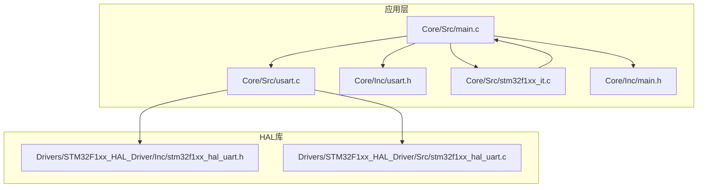
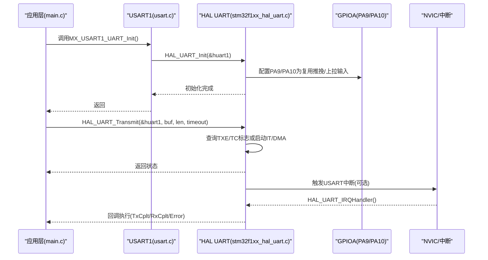
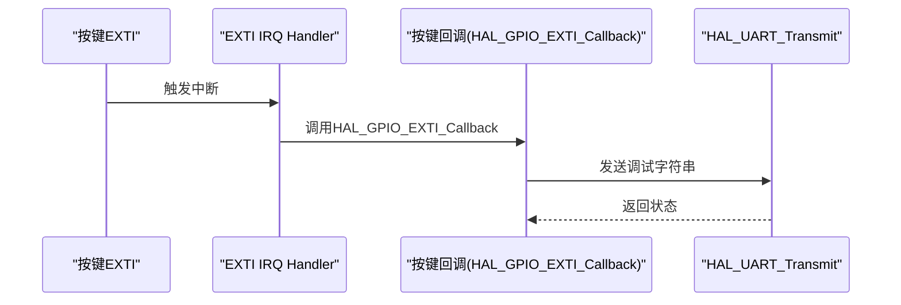
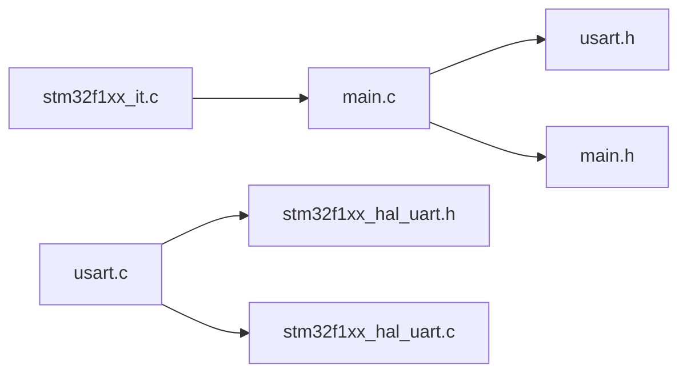

# UART HAL库使用

<cite>
**本文引用的文件**
- [main.c](file://Core/Src/main.c)
- [usart.c](file://Core/Src/usart.c)
- [usart.h](file://Core/Inc/usart.h)
- [stm32f1xx_hal_uart.h](file://Drivers/STM32F1xx_HAL_Driver/Inc/stm32f1xx_hal_uart.h)
- [stm32f1xx_hal_uart.c](file://Drivers/STM32F1xx_HAL_Driver/Src/stm32f1xx_hal_uart.c)
- [stm32f1xx_it.c](file://Core/Src/stm32f1xx_it.c)
- [main.h](file://Core/Inc/main.h)
</cite>

## 目录
1. [简介](#简介)
2. [项目结构](#项目结构)
3. [核心组件](#核心组件)
4. [架构总览](#架构总览)
5. [详细组件分析](#详细组件分析)
6. [依赖关系分析](#依赖关系分析)
7. [性能考虑](#性能考虑)
8. [故障排除指南](#故障排除指南)
9. [结论](#结论)
10. [附录](#附录)

## 简介
本指南面向STM32F1系列MCU的UART HAL库使用，围绕USART1的初始化、数据收发、中断与DMA传输、调试输出以及常见问题排查进行系统化讲解。文档以仓库现有代码为基础，结合HAL库官方接口与实现，帮助开发者快速掌握UART配置与应用。

## 项目结构
该项目采用典型的CubeMX工程布局：
- Core/Src：应用层源码，包含主程序、USART配置、中断服务等
- Core/Inc：应用层头文件，包含外设声明与公共宏定义
- Drivers/STM32F1xx_HAL_Driver：STM32F1 HAL库，包含UART驱动头文件与实现
- MDK-ARM：Keil工程产物目录（编译链接结果）
- STM32F103C8T6_WS2812_HAL.ioc：CubeMX工程配置文件

图表来源
- [main.c](file://Core/Src/main.c#L1-L50)
- [usart.c](file://Core/Src/usart.c#L1-L60)
- [stm32f1xx_hal_uart.h](file://Drivers/STM32F1xx_HAL_Driver/Inc/stm32f1xx_hal_uart.h#L1-L40)
- [stm32f1xx_hal_uart.c](file://Drivers/STM32F1xx_HAL_Driver/Src/stm32f1xx_hal_uart.c#L1-L60)

章节来源
- [main.c](file://Core/Src/main.c#L1-L120)
- [usart.c](file://Core/Src/usart.c#L1-L60)
- [stm32f1xx_hal_uart.h](file://Drivers/STM32F1xx_HAL_Driver/Inc/stm32f1xx_hal_uart.h#L1-L60)

## 核心组件
- UART初始化结构体：UART_InitTypeDef，包含波特率、字长、停止位、奇偶校验、模式、硬件流控、过采样等字段
- USART1实例：huart1，全局句柄，贯穿初始化、收发、中断/DMA配置
- HAL UART API：HAL_UART_Init、HAL_UART_Transmit、HAL_UART_Receive、HAL_UART_Transmit_IT、HAL_UART_Receive_IT、HAL_UART_Transmit_DMA、HAL_UART_Receive_DMA、HAL_UART_IRQHandler、回调函数等
- 中断与NVIC：按键外部中断通过EXTI触发，USART中断由HAL UART驱动处理
- 调试输出：通过HAL_UART_Transmit在主循环与按键事件中输出文本

章节来源
- [usart.c](file://Core/Src/usart.c#L27-L57)
- [stm32f1xx_hal_uart.h](file://Drivers/STM32F1xx_HAL_Driver/Inc/stm32f1xx_hal_uart.h#L46-L75)
- [main.c](file://Core/Src/main.c#L398-L420)

## 架构总览
下图展示了USART1初始化、数据收发与中断/DMA路径的整体关系。

图表来源
- [usart.c](file://Core/Src/usart.c#L31-L57)
- [stm32f1xx_hal_uart.c](file://Drivers/STM32F1xx_HAL_Driver/Src/stm32f1xx_hal_uart.c#L1069-L1150)
- [stm32f1xx_it.c](file://Core/Src/stm32f1xx_it.c#L194-L241)

## 详细组件分析

### UART初始化结构体UART_InitTypeDef详解
- 字段含义与取值范围
  - BaudRate：波特率，受PCLK分频与过采样影响；HAL内部根据时钟与公式计算BRR寄存器
  - WordLength：数据位，8位或9位
  - StopBits：停止位，1位或2位
  - Parity：无校验、偶校验、奇校验
  - Mode：仅发送、仅接收、收发皆可
  - HwFlowCtl：无硬件流控、RTS、CTS、RTS+CTS
  - OverSampling：16倍采样（F1系列固定为16）
- 关键约束
  - F1系列OverSampling仅支持16（8倍采样不适用于F1）
  - 奇偶校验启用时，MSB作为校验位插入（9位数据时为第9位，8位数据时为第8位）

章节来源
- [stm32f1xx_hal_uart.h](file://Drivers/STM32F1xx_HAL_Driver/Inc/stm32f1xx_hal_uart.h#L46-L75)
- [stm32f1xx_hal_uart.h](file://Drivers/STM32F1xx_HAL_Driver/Inc/stm32f1xx_hal_uart.h#L269-L336)
- [stm32f1xx_hal_uart.h](file://Drivers/STM32F1xx_HAL_Driver/Inc/stm32f1xx_hal_uart.h#L863-L884)

### USART1初始化流程与参数设置
- 实例与句柄
  - 全局句柄：UART_HandleTypeDef huart1
  - 实例：USART1
- 关键参数
  - 波特率：115200
  - 字长：8位
  - 停止位：1位
  - 奇偶校验：无
  - 模式：收发皆可
  - 硬件流控：无
  - 过采样：16
- GPIO配置（MSP）
  - TX：PA9，复用推挽输出，高速
  - RX：PA10，浮空输入
- 初始化调用
  - MX_USART1_UART_Init()设置参数并调用HAL_UART_Init()
  - HAL_UART_MspInit()使能时钟并配置GPIO

章节来源
- [usart.c](file://Core/Src/usart.c#L27-L57)
- [usart.c](file://Core/Src/usart.c#L59-L90)

### 数据收发函数使用方法
- 同步阻塞模式
  - HAL_UART_Transmit：发送指定长度数据，超时参数控制等待时间
  - HAL_UART_Receive：接收指定长度数据，超时参数控制等待时间
- 异步中断模式
  - HAL_UART_Transmit_IT：启动非阻塞发送，完成后触发TxCpltCallback
  - HAL_UART_Receive_IT：启动非阻塞接收，完成后触发RxCpltCallback
- 异步DMA模式
  - HAL_UART_Transmit_DMA：启动DMA发送，完成后触发TxCpltCallback/TxHalfCpltCallback
  - HAL_UART_Receive_DMA：启动DMA接收，完成后触发RxCpltCallback/RxHalfCpltCallback
- 接收回调扩展
  - HAL_UARTEx_ReceiveToIdle：按IDLE事件结束接收，适合未知长度帧
  - HAL_UARTEx_RxEventCallback：接收事件回调，区分TC/HT/IDLE

章节来源
- [stm32f1xx_hal_uart.h](file://Drivers/STM32F1xx_HAL_Driver/Inc/stm32f1xx_hal_uart.h#L748-L784)
- [stm32f1xx_hal_uart.c](file://Drivers/STM32F1xx_HAL_Driver/Src/stm32f1xx_hal_uart.c#L1069-L1150)
- [stm32f1xx_hal_uart.c](file://Drivers/STM32F1xx_HAL_Driver/Src/stm32f1xx_hal_uart.c#L1310-L1390)
- [stm32f1xx_hal_uart.c](file://Drivers/STM32F1xx_HAL_Driver/Src/stm32f1xx_hal_uart.c#L1381-L1460)

### 异步与同步模式区别与适用场景
- 同步阻塞
  - 优点：简单直观，无需额外中断/DMA配置
  - 缺点：占用CPU，无法并发处理其他任务
  - 适用：短报文、低频交互、调试输出
- 中断非阻塞
  - 优点：CPU释放，事件驱动，可并发处理
  - 缺点：需要正确配置NVIC优先级与回调处理
  - 适用：实时性要求较高、数据量适中
- DMA非阻塞
  - 优点：CPU零拷贝，高吞吐，适合大数据块
  - 缺点：需要DMA通道与缓冲区管理
  - 适用：大量数据传输、网络协议栈、日志记录

章节来源
- [stm32f1xx_hal_uart.c](file://Drivers/STM32F1xx_HAL_Driver/Src/stm32f1xx_hal_uart.c#L150-L186)

### 中断驱动的UART通信实现示例
- 中断入口与处理
  - HAL_UART_IRQHandler由NVIC调用，内部分发至具体中断处理
  - 用户回调：HAL_UART_TxCpltCallback、HAL_UART_RxCpltCallback、HAL_UART_ErrorCallback
- 本项目中的应用
  - 主循环与按键事件通过HAL_UART_Transmit进行调试输出
  - 外部按键中断通过EXTI触发，按键回调中调用HAL_UART_Transmit输出状态

图表来源
- [stm32f1xx_it.c](file://Core/Src/stm32f1xx_it.c#L200-L241)
- [main.c](file://Core/Src/main.c#L526-L558)

章节来源
- [stm32f1xx_it.c](file://Core/Src/stm32f1xx_it.c#L200-L241)
- [main.c](file://Core/Src/main.c#L526-L558)

### DMA方式的UART数据传输配置与使用
- DMA配置要点
  - 为TX/RX分别申请DMA通道与句柄
  - 使能DMA时钟，配置通道优先级与中断
  - 将DMA句柄关联到UART的hdmatx/hdmarx
- 启动与回调
  - HAL_UART_Transmit_DMA/HAL_UART_Receive_DMA启动传输
  - 传输完成回调：HAL_UART_TxCpltCallback/HAL_UART_RxCpltCallback
  - 半传输回调：HAL_UART_TxHalfCpltCallback/HAL_UART_RxHalfCpltCallback
- 注意事项
  - 缓冲区生命周期：确保DMA传输期间数据不被释放
  - 中断优先级：DMA与UART中断优先级需合理配置，避免抢占

章节来源
- [stm32f1xx_hal_uart.c](file://Drivers/STM32F1xx_HAL_Driver/Src/stm32f1xx_hal_uart.c#L168-L186)
- [stm32f1xx_hal_uart.c](file://Drivers/STM32F1xx_HAL_Driver/Src/stm32f1xx_hal_uart.c#L1381-L1460)

### UART调试输出实现示例
- 在主循环与按键事件中使用HAL_UART_Transmit输出文本
- 示例路径
  - 应用层发送调试字符串：见主程序中的调试输出调用
  - 按键触发发送：按键回调中调用HAL_UART_Transmit输出状态

章节来源
- [main.c](file://Core/Src/main.c#L415-L418)
- [main.c](file://Core/Src/main.c#L533-L555)

## 依赖关系分析
- 应用层依赖
  - main.c依赖usart.h与GPIO头文件
  - usart.c依赖stm32f1xx_hal_uart.h与GPIO时钟宏
- HAL库依赖
  - HAL UART对外暴露初始化、收发、中断/DMA、回调等接口
  - MSP回调负责GPIO与时钟配置
- 中断依赖
  - EXTI线程通过stm32f1xx_it.c转发至HAL_GPIO_EXTI_IRQHandler
  - UART中断由HAL_UART_IRQHandler统一处理

图表来源
- [main.c](file://Core/Src/main.c#L20-L30)
- [usart.c](file://Core/Src/usart.c#L21-L30)
- [stm32f1xx_hal_uart.h](file://Drivers/STM32F1xx_HAL_Driver/Inc/stm32f1xx_hal_uart.h#L28-L30)
- [stm32f1xx_it.c](file://Core/Src/stm32f1xx_it.c#L20-L30)

章节来源
- [main.c](file://Core/Src/main.c#L20-L30)
- [usart.c](file://Core/Src/usart.c#L21-L30)
- [stm32f1xx_it.c](file://Core/Src/stm32f1xx_it.c#L20-L30)

## 性能考虑
- 波特率选择
  - 115200bps在F1系列常用且稳定；更高波特率需确认时钟与过采样配置
- 传输模式选择
  - 小数据短报文：阻塞模式可简化逻辑
  - 大数据块：优先DMA，减少CPU占用
  - 实时交互：中断模式，降低延迟
- 中断优先级
  - UART TX/RX中断优先级应高于通用中断，避免调度抖动
- DMA效率
  - 合理设置缓冲区大小，避免频繁中断
  - 使用半传输回调进行流水式处理

[本节为通用指导，不直接分析具体文件]

## 故障排除指南
- 无法通信
  - 检查GPIO配置：TX/RX引脚是否正确复用，速率与模式是否匹配
  - 检查时钟：是否已使能USART1与GPIOA时钟
  - 检查波特率：实际波特率与对端一致
- 接收乱码/丢帧
  - 校验位设置：若对端使用奇偶校验，需在Init中开启相应校验
  - 停止位：确认双方停止位一致
  - 过采样：F1系列固定16倍采样，避免误配8倍
- 中断不触发
  - NVIC优先级：确保中断优先级高于当前屏蔽级别
  - 中断使能：确认__HAL_UART_ENABLE_IT已启用所需中断
  - 回调注册：如使用回调，确保回调函数已正确实现
- DMA异常
  - 缓冲区生命周期：确保DMA传输期间数据有效
  - 通道冲突：避免与其他外设共享同一路DMA通道
- 错误状态查询
  - 可通过HAL_UART_GetError获取错误码，定位PE/FE/NE/ORE等错误

章节来源
- [stm32f1xx_hal_uart.h](file://Drivers/STM32F1xx_HAL_Driver/Inc/stm32f1xx_hal_uart.h#L253-L267)
- [stm32f1xx_hal_uart.c](file://Drivers/STM32F1xx_HAL_Driver/Src/stm32f1xx_hal_uart.c#L3212-L3223)

## 结论
本指南基于仓库现有代码，系统梳理了STM32F1系列UART HAL库的初始化结构体、USART1配置、数据收发、中断与DMA使用、调试输出及故障排除。建议在实际项目中：
- 明确应用场景选择同步/中断/DMA模式
- 严格匹配波特率、字长、停止位与校验设置
- 合理配置NVIC优先级与回调处理
- 使用DMA进行大批量数据传输，提升系统吞吐

[本节为总结性内容，不直接分析具体文件]

## 附录

### UART_InitTypeDef字段与取值速查
- BaudRate：任意不超过上限的数值（HAL内部计算BRR）
- WordLength：8位或9位
- StopBits：1位或2位
- Parity：无、偶、奇
- Mode：仅发送、仅接收、收发皆可
- HwFlowCtl：无、RTS、CTS、RTS+CTS
- OverSampling：16（F1固定）

章节来源
- [stm32f1xx_hal_uart.h](file://Drivers/STM32F1xx_HAL_Driver/Inc/stm32f1xx_hal_uart.h#L269-L336)

### USART1初始化参数参考
- 实例：USART1
- 波特率：115200
- 字长：8位
- 停止位：1位
- 奇偶校验：无
- 模式：收发皆可
- 硬件流控：无
- 过采样：16

章节来源
- [usart.c](file://Core/Src/usart.c#L41-L49)

### 数据收发API调用路径
- 同步：HAL_UART_Transmit / HAL_UART_Receive
- 中断：HAL_UART_Transmit_IT / HAL_UART_Receive_IT
- DMA：HAL_UART_Transmit_DMA / HAL_UART_Receive_DMA
- 回调：HAL_UART_TxCpltCallback / HAL_UART_RxCpltCallback / HAL_UART_ErrorCallback

章节来源
- [stm32f1xx_hal_uart.h](file://Drivers/STM32F1xx_HAL_Driver/Inc/stm32f1xx_hal_uart.h#L748-L784)