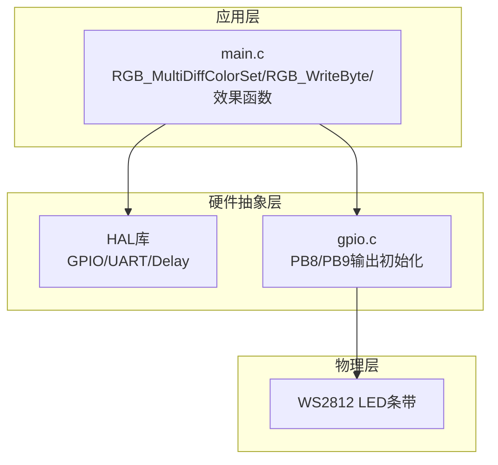
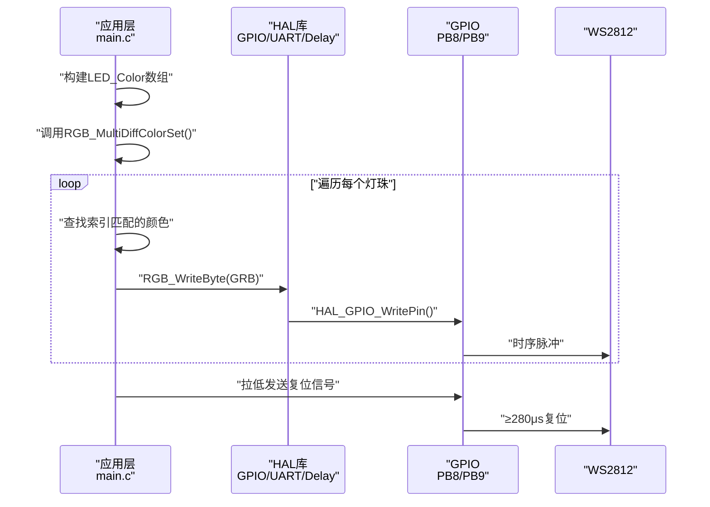
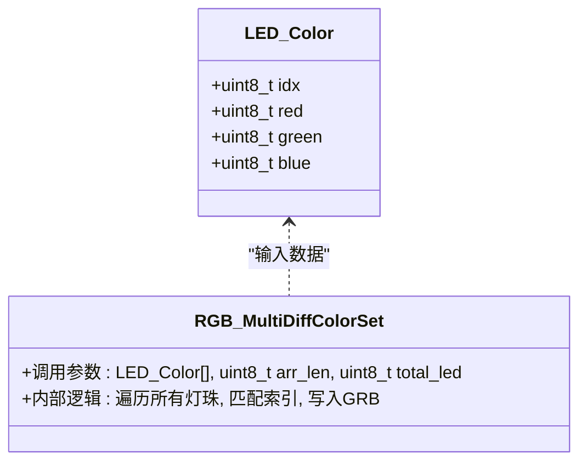
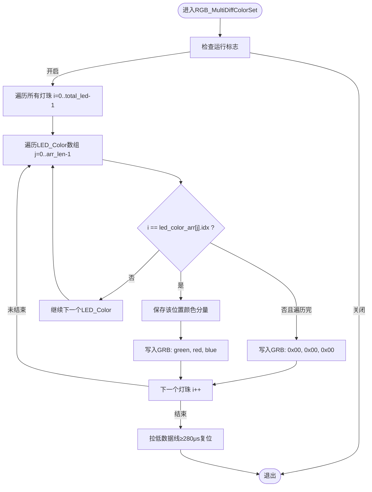
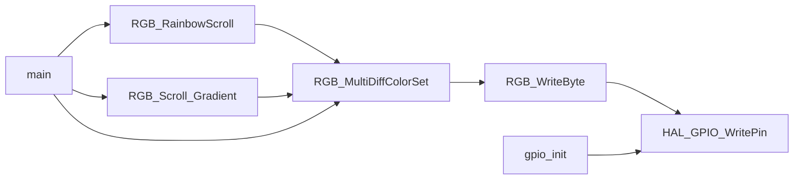

# 多灯异色显示

<cite>
**本文引用的文件**
- [main.c](file://Core/Src/main.c)
- [main.h](file://Core/Inc/main.h)
- [gpio.c](file://Core/Src/gpio.c)
</cite>

## 目录
1. [简介](#简介)
2. [项目结构](#项目结构)
3. [核心组件](#核心组件)
4. [架构概览](#架构概览)
5. [详细组件分析](#详细组件分析)
6. [依赖关系分析](#依赖关系分析)
7. [性能考量](#性能考量)
8. [故障排查指南](#故障排查指南)
9. [结论](#结论)
10. [附录](#附录)

## 简介
本技术文档围绕STM32F103C8T6平台上的WS2812多灯异色显示功能展开，重点解析RGB_MultiDiffColorSet函数的实现原理，阐述LED_Color结构体的设计思想与多灯颜色管理机制，详解WS2812 GRB数据格式的处理方式与颜色写入顺序，并对比多灯异色显示与单灯显示的差异与优势。文档还提供了LED_Color数组的创建与管理方法（含预定义颜色与动态颜色设置）、效果组合使用场景（如模式4中两组不同颜色灯珠交替显示）以及完整的使用示例与最佳实践建议。

## 项目结构
该项目采用典型的CubeMX工程组织方式，核心逻辑集中在主程序文件中，GPIO初始化位于独立模块，便于移植与维护：
- Core/Src/main.c：包含RGB_MultiDiffColorSet、RGB_WriteByte等关键函数，以及多模式演示逻辑
- Core/Inc/main.h：外部中断按键定义与通用头文件
- Core/Src/gpio.c：GPIO端口初始化，配置PB8/PB9为输出，用于驱动WS2812

图表来源
- [main.c](file://Core/Src/main.c#L121-L176)
- [gpio.c](file://Core/Src/gpio.c#L42-L88)

章节来源
- [main.c](file://Core/Src/main.c#L1-L120)
- [gpio.c](file://Core/Src/gpio.c#L1-L94)

## 核心组件
- LED_Color结构体：用于描述每个灯珠的索引与其对应的RGB颜色分量，是多灯异色显示的核心数据载体
- RGB_WriteByte函数：实现WS2812严格时序的单字节写入，按GRB顺序发送
- RGB_MultiDiffColorSet函数：多灯异色显示的核心，负责遍历所有灯珠并根据索引匹配颜色
- 效果函数：RGB_RainbowScroll与RGB_Scroll_Gradient通过动态生成LED_Color数组展示复杂效果
- 模式4演示：通过两组LED_Color数组交替显示，实现不同颜色分组的同步或交错效果

章节来源
- [main.c](file://Core/Src/main.c#L83-L89)
- [main.c](file://Core/Src/main.c#L121-L146)
- [main.c](file://Core/Src/main.c#L218-L248)
- [main.c](file://Core/Src/main.c#L250-L348)
- [main.c](file://Core/Src/main.c#L401-L414)

## 架构概览
多灯异色显示的控制流程自上而下分为三层：
- 应用层：定义LED_Color数组，调用RGB_MultiDiffColorSet进行渲染
- HAL层：提供GPIO写入、延时与系统时钟等底层支持
- 物理层：WS2812接收GRB序列，按位编码呈现颜色

图表来源
- [main.c](file://Core/Src/main.c#L218-L248)
- [main.c](file://Core/Src/main.c#L121-L146)
- [gpio.c](file://Core/Src/gpio.c#L42-L88)

## 详细组件分析

### LED_Color结构体与多灯颜色管理
- 结构体字段
  - idx：灯珠索引，用于将颜色映射到具体位置
  - red/green/blue：颜色分量，范围0x00~0xFF
- 管理机制
  - 通过LED_Color数组保存“索引+颜色”的键值对
  - RGB_MultiDiffColorSet遍历所有灯珠，按索引匹配颜色，未匹配则写入黑色
  - 支持预定义颜色表与动态生成颜色两种方式

图表来源
- [main.c](file://Core/Src/main.c#L83-L89)
- [main.c](file://Core/Src/main.c#L218-L248)

章节来源
- [main.c](file://Core/Src/main.c#L83-L89)
- [main.c](file://Core/Src/main.c#L218-L248)

### RGB_MultiDiffColorSet函数实现原理
- 输入参数
  - led_color_arr：LED_Color数组指针
  - arr_len：LED_Color数组长度（即参与异色显示的元素数量）
  - total_led：总灯珠数量（用于遍历所有灯珠）
- 查找逻辑
  - 双重循环：外层遍历0..total_led-1的每个灯珠，内层遍历LED_Color数组寻找匹配索引
  - 匹配成功则记录该位置的颜色分量，否则使用黑色（0x00）
- 颜色写入顺序
  - 严格遵循WS2812的GRB时序：先绿后红再蓝
  - 每个颜色分量写入一个字节，随后发送复位信号
- 复位信号
  - 在完成一轮所有灯珠的写入后，拉低数据线至少280μs以刷新显示

图表来源
- [main.c](file://Core/Src/main.c#L218-L248)

章节来源
- [main.c](file://Core/Src/main.c#L218-L248)

### WS2812 GRB数据格式与写入顺序
- 数据格式
  - WS2812使用脉冲宽度编码：高电平持续时间决定0/1
  - 0码与1码的时间阈值严格要求，以保证正确识别
- 写入顺序
  - RGB_MultiDiffColorSet按GRB顺序写入，即先绿、后红、再蓝
  - RGB_WriteByte内部通过精确延时与GPIO电平切换实现时序
- 复位信号
  - 每次完整写入一轮后，拉低数据线至少280μs，确保WS2812更新显示

章节来源
- [main.c](file://Core/Src/main.c#L121-L146)
- [main.c](file://Core/Src/main.c#L218-L248)

### 多灯异色显示 vs 单灯显示
- 多灯异色显示
  - 优点：可同时为不同位置的灯珠设置不同颜色，实现复杂图案与动态效果
  - 实现：通过LED_Color数组与RGB_MultiDiffColorSet的索引匹配机制
- 单灯显示
  - 优点：实现简单，资源占用少
  - 实现：通过RGB_ColorSet直接为目标索引写入颜色，其余灯珠写入黑色
- 适用场景
  - 多灯异色：流水灯、渐变滚动、彩虹滚动、分组显示等
  - 单灯：指示灯、单点高亮等

章节来源
- [main.c](file://Core/Src/main.c#L150-L176)
- [main.c](file://Core/Src/main.c#L218-L248)

### LED_Color数组的创建与管理
- 预定义颜色
  - 使用预定义颜色数组与宏定义快速构建LED_Color数组
  - 示例：在主函数中定义两组LED_Color数组，分别指定不同索引与颜色
- 动态颜色设置
  - 运行时根据算法生成LED_Color数组，例如渐变滚动与彩虹滚动
  - HSVtoRGB函数将色相、饱和度、明度转换为RGB分量，供LED_Color使用
- 管理建议
  - arr_len应与实际参与异色显示的元素数量一致
  - total_led应与实际灯珠总数一致，确保遍历完整性
  - 注意索引唯一性，避免重复索引导致覆盖

章节来源
- [main.c](file://Core/Src/main.c#L71-L81)
- [main.c](file://Core/Src/main.c#L401-L414)
- [main.c](file://Core/Src/main.c#L250-L348)
- [main.c](file://Core/Src/main.c#L284-L309)

### 效果组合使用场景：模式4两组不同颜色交替显示
- 场景描述
  - 模式4中，先调用RGB_MultiDiffColorSet(leds1, 4, 8)，再调用RGB_MultiDiffColorSet(leds2, 4, 8)
  - 两组数组分别点亮不同索引的灯珠，颜色互不相同
- 实现要点
  - 两组数组的索引集合应互补，避免重叠
  - 通过两次调用实现交替显示，形成视觉上的分组效果
- 典型用途
  - 左右分组显示、前后分段、对称图案等

章节来源
- [main.c](file://Core/Src/main.c#L401-L414)
- [main.c](file://Core/Src/main.c#L455-L464)

### 使用示例与最佳实践
- 示例一：预定义两组LED_Color数组交替显示
  - 在主函数中定义leds1与leds2，分别包含4个LED_Color元素
  - 调用RGB_MultiDiffColorSet交替渲染，实现两组不同颜色的同步显示
- 示例二：动态生成渐变滚动
  - 使用RGB_Scroll_Gradient与RGB_RainbowScroll，动态计算每个灯珠的亮度与色相
  - 将结果写入LED_Color数组并调用RGB_MultiDiffColorSet
- 最佳实践
  - 确保arr_len与数组实际元素数量一致
  - total_led与实际灯珠数量一致，避免越界
  - 使用合适的延时与复位时间，保证WS2812稳定刷新
  - 对于大量灯珠，注意内存分配与堆栈使用（动态效果可能使用malloc/free）

章节来源
- [main.c](file://Core/Src/main.c#L401-L414)
- [main.c](file://Core/Src/main.c#L250-L348)
- [main.c](file://Core/Src/main.c#L886-L907)

## 依赖关系分析
- 函数间依赖
  - RGB_MultiDiffColorSet依赖RGB_WriteByte进行GRB写入
  - RGB_RainbowScroll与RGB_Scroll_Gradient依赖RGB_MultiDiffColorSet进行最终渲染
  - 主函数main通过不同模式选择调用相应效果函数
- HAL与GPIO依赖
  - RGB_WriteByte与RGB_MultiDiffColorSet依赖HAL_GPIO_WritePin进行电平控制
  - gpio.c负责PB8/PB9的GPIO初始化，确保WS2812数据线输出正常

图表来源
- [main.c](file://Core/Src/main.c#L121-L146)
- [main.c](file://Core/Src/main.c#L218-L248)
- [main.c](file://Core/Src/main.c#L886-L907)
- [gpio.c](file://Core/Src/gpio.c#L42-L88)

章节来源
- [main.c](file://Core/Src/main.c#L121-L146)
- [main.c](file://Core/Src/main.c#L218-L248)
- [main.c](file://Core/Src/main.c#L886-L907)
- [gpio.c](file://Core/Src/gpio.c#L42-L88)

## 性能考量
- 时间复杂度
  - RGB_MultiDiffColorSet：双重循环，时间复杂度O(total_led × arr_len)
  - 对于固定数量的灯珠与较小的LED_Color数组，开销可控
- 时序精度
  - RGB_WriteByte通过精确延时与NOP指令保证WS2812时序
  - 建议在更高频率的MCU上运行以获得更稳定的时序
- 内存与堆栈
  - 动态效果可能使用malloc/free，需关注堆栈与碎片问题
  - 预编译数组可减少动态分配带来的不确定性
- 并发与中断
  - 外部按键中断处理不影响WS2812写入，但需避免在写入过程中修改GPIO状态

## 故障排查指南
- 现象：部分灯珠不亮或颜色异常
  - 排查：确认LED_Color数组中索引与颜色分量是否正确
  - 复核：arr_len与total_led是否与实际一致
- 现象：所有灯珠全黑
  - 排查：检查运行标志与函数调用路径
  - 复核：确认RGB_MultiDiffColorSet的查找逻辑与写入顺序
- 现象：颜色错位或闪烁
  - 排查：检查GPIO初始化与PB8/PB9输出状态
  - 复核：确认复位信号时间≥280μs
- 现象：动态效果卡顿
  - 排查：HAL_Delay与SCROLL_SPEED参数是否合理
  - 复核：是否存在频繁的malloc/free操作影响实时性

章节来源
- [main.c](file://Core/Src/main.c#L218-L248)
- [main.c](file://Core/Src/main.c#L121-L146)
- [gpio.c](file://Core/Src/gpio.c#L42-L88)

## 结论
RGB_MultiDiffColorSet通过LED_Color结构体实现了灵活的多灯异色显示，结合WS2812严格的GRB时序与复位机制，能够稳定呈现复杂的灯光效果。配合RGB_RainbowScroll与RGB_Scroll_Gradient等效果函数，可轻松实现渐变滚动、彩虹滚动等动态展示。通过预定义与动态生成两种方式管理LED_Color数组，既能满足快速开发需求，也能实现高度定制化的视觉效果。在实际部署中，应重点关注索引一致性、时序精度与资源管理，以确保系统的稳定性与可维护性。

## 附录
- 关键函数与数据结构路径
  - LED_Color结构体定义：[main.c](file://Core/Src/main.c#L83-L89)
  - RGB_WriteByte函数：[main.c](file://Core/Src/main.c#L121-L146)
  - RGB_MultiDiffColorSet函数：[main.c](file://Core/Src/main.c#L218-L248)
  - RGB_RainbowScroll函数：[main.c](file://Core/Src/main.c#L313-L348)
  - RGB_Scroll_Gradient函数：[main.c](file://Core/Src/main.c#L250-L282)
  - HSVtoRGB函数：[main.c](file://Core/Src/main.c#L284-L309)
  - GPIO初始化：[gpio.c](file://Core/Src/gpio.c#L42-L88)
  - 按键中断回调：[main.c](file://Core/Src/main.c#L526-L558)