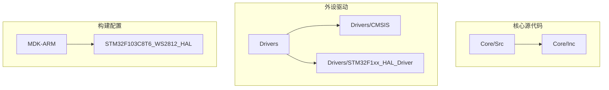
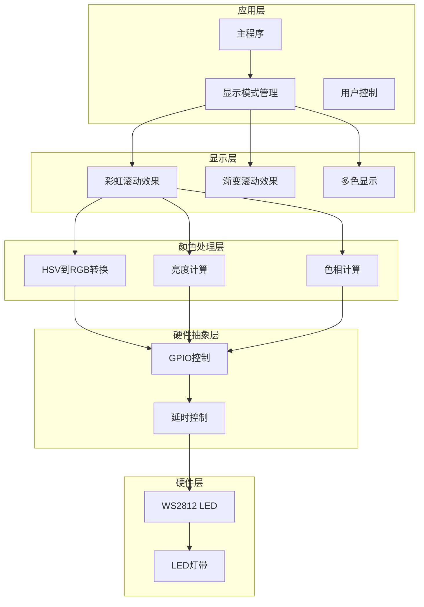
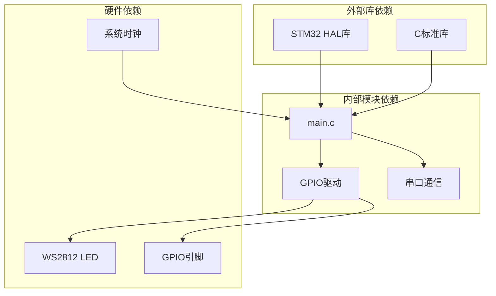

# 彩虹滚动效果

<cite>
**本文档引用的文件**
- [main.c](file://Core/Src/main.c)
- [main.h](file://Core/Inc/main.h)
- [gpio.c](file://Core/Src/gpio.c)
- [usart.c](file://Core/Src/usart.c)
- [gpio.h](file://Core/Inc/gpio.h)
- [usart.h](file://Core/Inc/usart.h)
</cite>

## 目录
1. [简介](#简介)
2. [项目结构](#项目结构)
3. [核心组件](#核心组件)
4. [架构概览](#架构概览)
5. [详细组件分析](#详细组件分析)
6. [依赖关系分析](#依赖关系分析)
7. [性能考虑](#性能考虑)
8. [故障排除指南](#故障排除指南)
9. [结论](#结论)

## 简介

本项目实现了基于WS2812 LED灯带的彩虹滚动效果，通过HSV到RGB的颜色转换算法和精确的时序控制，创造出流畅的彩虹色带滚动视觉效果。该系统使用STM32F103C8T6微控制器，通过GPIO引脚输出精确的脉冲序列来驱动WS2812 LED。

## 项目结构

项目采用标准的STM32CubeMX工程结构，主要包含以下关键目录：



**图表来源**
- [main.c](file://Core/Src/main.c#L1-L50)
- [main.h](file://Core/Inc/main.h#L1-L30)

**章节来源**
- [main.c](file://Core/Src/main.c#L1-L50)
- [main.h](file://Core/Inc/main.h#L1-L30)

## 核心组件

### WS2812 LED驱动模块

系统的核心功能围绕WS2812 LED控制展开，主要包括：

- **RGB_WriteByte函数**：实现WS2812精确时序的字节写入
- **RGB_MultiDiffColorSet函数**：支持多灯异色显示的高级控制
- **RGB_RainbowScroll函数**：实现彩虹滚动效果的核心算法

### 颜色处理系统

系统集成了完整的颜色处理管道：

- **HSVtoRGB函数**：实现HSV到RGB的颜色空间转换
- **亮度衰减算法**：基于距离的线性亮度衰减
- **色相计算机制**：每LED 20°的色相偏移

**章节来源**
- [main.c](file://Core/Src/main.c#L121-L248)
- [main.c](file://Core/Src/main.c#L284-L309)

## 架构概览

系统采用分层架构设计，从底层硬件抽象到高层应用逻辑：



**图表来源**
- [main.c](file://Core/Src/main.c#L313-L348)
- [main.c](file://Core/Src/main.c#L284-L309)
- [main.c](file://Core/Src/main.c#L121-L176)

## 详细组件分析

### RGB_RainbowScroll函数详解

RGB_RainbowScroll是整个彩虹效果的核心函数，实现了完整的色彩滚动算法：

#### 函数架构

```mermaid
flowchart TD
START([函数入口]) --> INIT[初始化参数<br/>center_led=0<br/>base_hue=0]
INIT --> LOOP[主循环]
LOOP --> CALC_DISTANCE[计算距离<br/>distance = abs(i - center_led)]
CALC_DISTANCE --> BRIGHTNESS[亮度计算<br/>brightness = (distance ≤ 3) ? (255 - distance*35) : 0]
BRIGHTNESS --> HUE[色相计算<br/>current_hue = (base_hue + i * 20) % 360]
HUE --> HSV_CONVERT[HSV到RGB转换<br/>HSVtoRGB(current_hue, 255, brightness)]
HSV_CONVERT --> UPDATE[更新LED颜色]
UPDATE --> DELAY[延时控制<br/>HAL_Delay(SCROLL_SPEED)]
DELAY --> MOVE_CENTER[移动中心LED<br/>center_led = (center_led + 1) % total_led]
MOVE_CENTER --> MOVE_HUE[移动色相<br/>base_hue = (base_hue + 5) % 360]
MOVE_HUE --> LOOP
```

**图表来源**
- [main.c](file://Core/Src/main.c#L313-L348)

#### HSV到RGB转换算法

HSVtoRGB函数实现了标准的HSV到RGB颜色空间转换：

```mermaid
flowchart TD
INPUT[输入HSV值] --> CHECK_SAT{饱和度=0?}
CHECK_SAT --> |是| GRAY[灰度输出<br/>R=G=B=Val]
CHECK_SAT --> |否| DIVIDE[计算色相分区<br/>region = hue / 60]
DIVIDE --> REMAINDER[计算余数<br/>remainder = hue % 60]
REMAINDER --> CALC_P[计算P值<br/>p = (val * (255 - sat)) / 255]
CALC_P --> CALC_Q[计算Q值<br/>q = (val * (255 - (sat * remainder) / 60)) / 255]
CALC_Q --> CALC_T[计算T值<br/>t = (val * (255 - (sat * (60 - remainder)) / 60)) / 255]
CALC_T --> SWITCH[按分区赋值]
SWITCH --> CASE0[R=val, G=t, B=p]
SWITCH --> CASE1[R=q, G=val, B=p]
SWITCH --> CASE2[R=p, G=val, B=t]
SWITCH --> CASE3[R=p, G=q, B=val]
SWITCH --> CASE4[R=t, G=p, B=val]
SWITCH --> CASE5[R=val, G=p, B=q]
CASE0 --> OUTPUT[输出RGB]
CASE1 --> OUTPUT
CASE2 --> OUTPUT
CASE3 --> OUTPUT
CASE4 --> OUTPUT
CASE5 --> OUTPUT
```

**图表来源**
- [main.c](file://Core/Src/main.c#L284-L309)

#### 距离计算机制

距离计算是实现亮度衰减的关键逻辑：

```mermaid
flowchart TD
LED_INDEX[i] --> ABSOLUTE[计算绝对值<br/>abs((int)i - (int)center_led)]
ABSOLUTE --> CHECK_DISTANCE{distance ≤ 3?}
CHECK_DISTANCE --> |是| LINEAR[线性衰减<br/>brightness = 255 - distance * 35]
CHECK_DISTANCE --> |否| ZERO[brightness = 0]
LINEAR --> APPLY[应用到LED]
ZERO --> APPLY
APPLY --> RESULT[最终亮度值]
```

**图表来源**
- [main.c](file://Core/Src/main.c#L327-L328)

#### 色相计算机制

色相计算实现了每LED 20°的色相偏移：

| LED索引 | 色相偏移(°) | 实际色相(°) |
|---------|-------------|------------|
| 0       | 0           | base_hue   |
| 1       | 20          | base_hue + 20 |
| 2       | 40          | base_hue + 40 |
| 3       | 60          | base_hue + 60 |
| ...     | ...         | ...        |
| n       | n×20        | base_hue + n×20 |

**图表来源**
- [main.c](file://Core/Src/main.c#L332)

### 参数调节指南

#### 滚动速度控制

SCROLL_SPEED宏定义控制滚动速度：
- **默认值**：100ms
- **影响**：值越小滚动越快，值越大滚动越慢
- **调节范围**：建议50-200ms之间

#### 彩虹宽度控制

通过调整亮度衰减阈值控制彩虹宽度：
- **当前设置**：distance ≤ 3
- **效果**：每个LED周围3个LED形成渐变
- **调节方法**：修改比较条件中的阈值

#### 亮度范围控制

亮度衰减公式：`brightness = (distance ≤ 3) ? (255 - distance * 35) : 0`

| 距离 | 亮度值 |
|------|--------|
| 0    | 255    |
| 1    | 220    |
| 2    | 185    |
| 3    | 150    |
| 4    | 0      |

**章节来源**
- [main.c](file://Core/Src/main.c#L42-L42)
- [main.c](file://Core/Src/main.c#L313-L348)
- [main.c](file://Core/Src/main.c#L327-L328)

## 依赖关系分析

系统各组件之间的依赖关系如下：



**图表来源**
- [main.c](file://Core/Src/main.c#L20-L30)
- [main.c](file://Core/Src/main.c#L121-L176)
- [gpio.c](file://Core/Src/gpio.c#L42-L88)

**章节来源**
- [main.c](file://Core/Src/main.c#L20-L30)
- [gpio.c](file://Core/Src/gpio.c#L42-L88)

## 性能考虑

### 时序精度

WS2812对时序要求极其严格，系统通过精确的延时函数保证：

- **数据位传输**：使用`delay_nus()`函数实现纳秒级精确延时
- **复位信号**：确保至少280μs的低电平复位时间
- **总线竞争**：通过GPIO状态控制避免总线冲突

### 内存使用

- **静态分配**：LED颜色数组在栈上分配，避免动态内存管理
- **局部变量**：所有中间变量均为局部作用域，减少内存占用
- **常量定义**：使用宏定义替代硬编码数值，提高可维护性

### 处理器负载

- **轮询控制**：采用轮询方式而非中断，简化实时性控制
- **批处理更新**：一次性更新所有LED状态，减少总线操作次数
- **延迟优化**：合理设置延时参数平衡视觉效果和处理器负载

## 故障排除指南

### 常见问题及解决方案

#### LED不亮或显示异常

1. **检查硬件连接**
   - 确认WS2812电源和地线连接正确
   - 验证数据线连接到正确的GPIO引脚

2. **验证时序设置**
   - 检查`delay_nus()`函数的延时准确性
   - 确认复位信号持续时间足够

3. **调试步骤**
   ```c
   // 添加调试输出
   HAL_UART_Transmit(&huart1, "LED initialization failed\n", 25, 100);
   ```

#### 彩虹效果不连续

1. **检查滚动速度**
   - 调整SCROLL_SPEED宏定义
   - 确保HAL_Delay()调用正常执行

2. **验证色相计算**
   - 检查base_hue变量的递增逻辑
   - 确认模运算的正确性

#### 亮度不均匀

1. **校准亮度衰减**
   - 调整距离阈值以改变彩虹宽度
   - 修改衰减系数以控制亮度范围

2. **检查LED质量**
   - 确认所有LED亮度一致性
   - 验证电源供应稳定性

**章节来源**
- [main.c](file://Core/Src/main.c#L107-L116)
- [main.c](file://Core/Src/main.c#L174-L175)
- [main.c](file://Core/Src/main.c#L342-L344)

## 结论

本项目成功实现了基于WS2812 LED的高质量彩虹滚动效果。通过精确的HSV到RGB颜色转换、合理的亮度衰减算法和稳定的时序控制，创造出了流畅自然的视觉体验。

### 技术亮点

1. **精确时序控制**：通过自定义延时函数实现WS2812严格的时序要求
2. **高效颜色算法**：优化的HSV到RGB转换减少处理器负担
3. **灵活参数调节**：提供多种参数可调，适应不同应用场景
4. **稳定可靠**：完善的错误处理和调试机制

### 应用前景

该系统可广泛应用于：
- LED装饰照明
- 音乐可视化设备
- 舞台灯光效果
- 科研教学演示

通过进一步的优化和扩展，可以实现更多复杂的LED显示效果，为各种应用场景提供优秀的视觉解决方案。