# 渐变滚动效果

<cite>
**本文档引用的文件**
- [main.c](file://Core/Src/main.c)
- [main.h](file://Core/Inc/main.h)
- [gpio.c](file://Core/Src/gpio.c)
- [gpio.h](file://Core/Inc/gpio.h)
- [usart.c](file://Core/Src/usart.c)
- [usart.h](file://Core/Inc/usart.h)
- [system_stm32f1xx.c](file://Core/Src/system_stm32f1xx.c)
- [stm32f1xx_hal_conf.h](file://Core/Inc/stm32f1xx_hal_conf.h)
- [stm32f1xx_hal_gpio.h](file://Drivers/STM32F1xx_HAL_Driver/Inc/stm32f1xx_hal_gpio.h)
- [stm32f1xx_hal_uart.h](file://Drivers/STM32F1xx_HAL_Driver/Inc/stm32f1xx_hal_uart.h)
</cite>

## 目录
1. [简介](#简介)
2. [项目结构](#项目结构)
3. [核心组件](#核心组件)
4. [架构概览](#架构概览)
5. [详细组件分析](#详细组件分析)
6. [依赖关系分析](#依赖关系分析)
7. [性能考虑](#性能考虑)
8. [故障排除指南](#故障排除指南)
9. [结论](#结论)

## 简介

本项目实现了基于WS2812 LED灯带的渐变滚动效果，通过RGB_Scroll_Gradient函数创建了一个具有中心最亮、边缘渐暗的光晕效果。该效果利用了距离衰减算法和循环滚动机制，在8个LED灯珠上实现了流畅的视觉体验。

项目采用STM32F103C8T6微控制器，使用HAL库进行外设控制，通过GPIO引脚驱动WS2812 LED灯带，并通过USART接口进行调试输出。

## 项目结构

项目采用标准的CubeMX工程结构，主要包含以下目录：

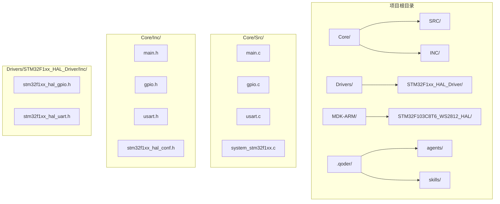

**图表来源**
- [main.c](file://Core/Src/main.c#L1-L50)
- [main.h](file://Core/Inc/main.h#L1-L30)
- [gpio.c](file://Core/Src/gpio.c#L1-L30)
- [usart.c](file://Core/Src/usart.c#L1-L30)

**章节来源**
- [main.c](file://Core/Src/main.c#L1-L50)
- [main.h](file://Core/Inc/main.h#L1-L30)

## 核心组件

### 主要功能模块

项目的核心功能由以下几个主要组件构成：

1. **RGB_Scroll_Gradient函数** - 实现渐变滚动效果的核心算法
2. **RGB_MultiDiffColorSet函数** - 多灯异色显示函数
3. **RGB_WriteByte函数** - WS2812时序写入函数
4. **HSVtoRGB函数** - HSV色彩空间转换函数
5. **系统时钟配置** - 系统时钟初始化

### 关键数据结构

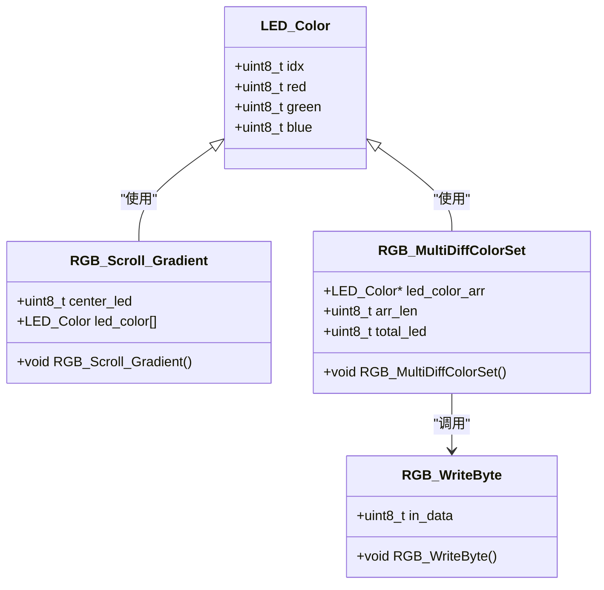

**图表来源**
- [main.c](file://Core/Src/main.c#L84-L89)
- [main.c](file://Core/Src/main.c#L219-L248)
- [main.c](file://Core/Src/main.c#L122-L146)

**章节来源**
- [main.c](file://Core/Src/main.c#L84-L89)
- [main.c](file://Core/Src/main.c#L219-L248)
- [main.c](file://Core/Src/main.c#L122-L146)

## 架构概览

项目采用分层架构设计，从底层硬件抽象到高层应用逻辑：

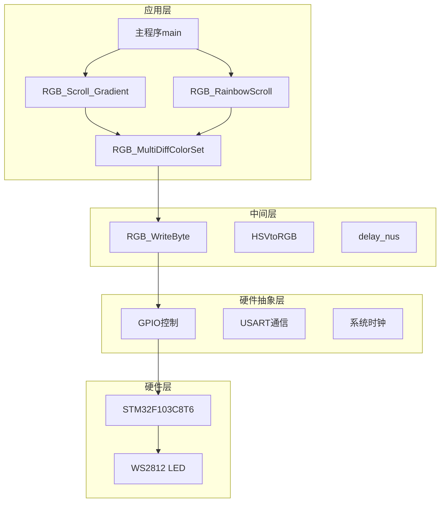

**图表来源**
- [main.c](file://Core/Src/main.c#L373-L484)
- [main.c](file://Core/Src/main.c#L251-L282)
- [main.c](file://Core/Src/main.c#L313-L348)

## 详细组件分析

### RGB_Scroll_Gradient函数详解

RGB_Scroll_Gradient函数是渐变滚动效果的核心实现，其算法设计体现了精妙的数学原理：

#### 核心算法流程

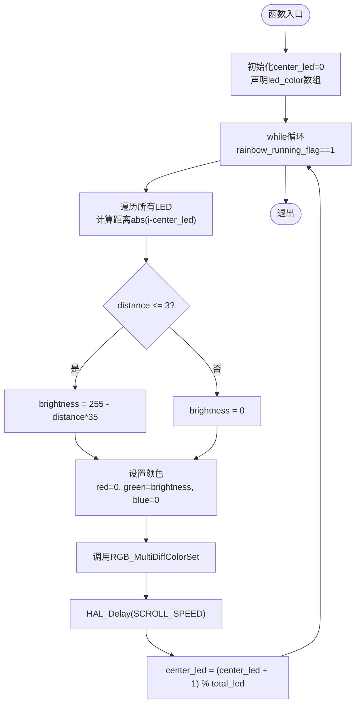

**图表来源**
- [main.c](file://Core/Src/main.c#L251-L282)

#### 距离衰减算法分析

距离衰减算法是该效果的关键，其数学表达式为：
- 当 `distance ≤ 3` 时：`brightness = 255 - distance × 35`
- 当 `distance > 3` 时：`brightness = 0`

这个算法的特点：
1. **阈值设定**：距离阈值为3，确保只有中心周围4个LED（包括中心LED）会发光
2. **线性衰减**：亮度按距离线性递减，形成平滑的渐变效果
3. **亮度范围**：最大亮度255，最小亮度0，覆盖整个有效范围

#### 中心灯珠滚动机制

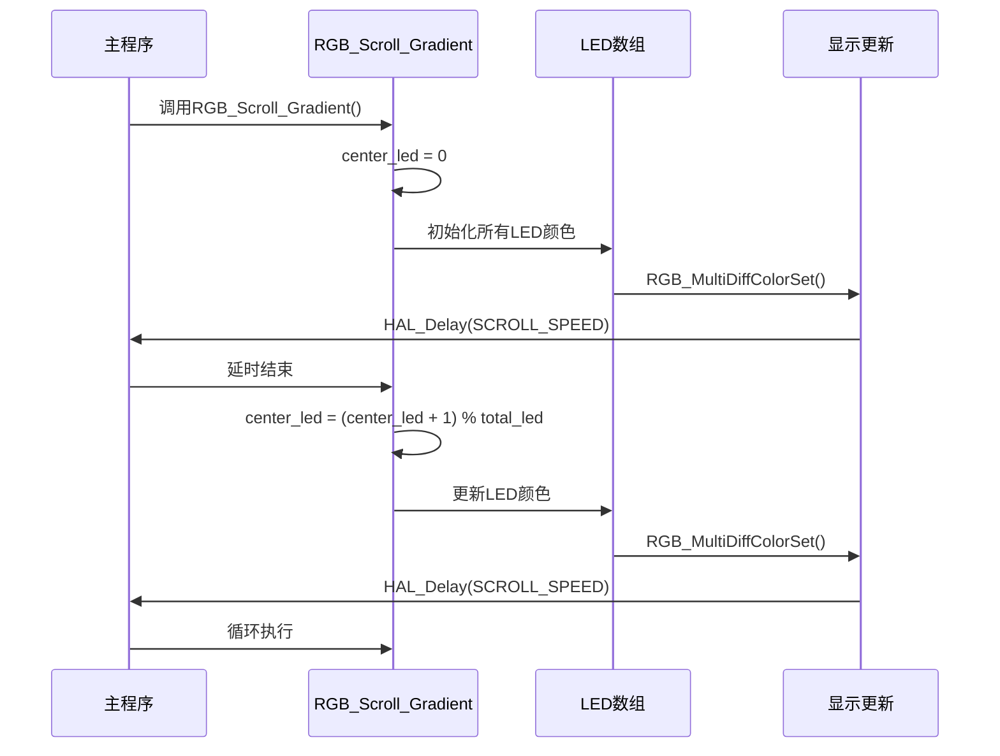

**图表来源**
- [main.c](file://Core/Src/main.c#L251-L282)

**章节来源**
- [main.c](file://Core/Src/main.c#L251-L282)

### RGB_MultiDiffColorSet函数应用

RGB_MultiDiffColorSet函数在渐变效果中扮演着关键角色：

#### 函数工作原理

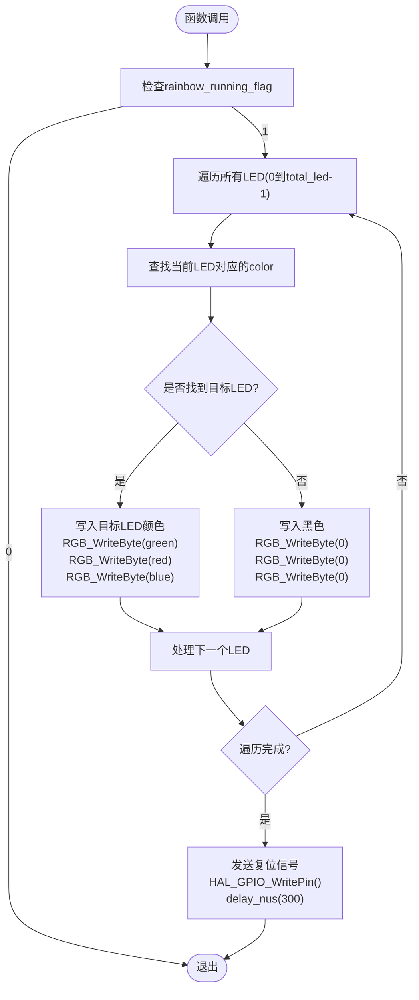

**图表来源**
- [main.c](file://Core/Src/main.c#L219-L248)

#### 在渐变效果中的作用

1. **批量颜色设置**：一次性为所有LED设置不同的颜色值
2. **WS2812协议支持**：严格按照WS2812时序要求发送数据
3. **GRB格式转换**：将RGB颜色值转换为WS2812所需的GRB格式

**章节来源**
- [main.c](file://Core/Src/main.c#L219-L248)

### RGB_WriteByte函数时序控制

RGB_WriteByte函数实现了WS2812 LED驱动器所需的精确时序：

#### 时序实现细节

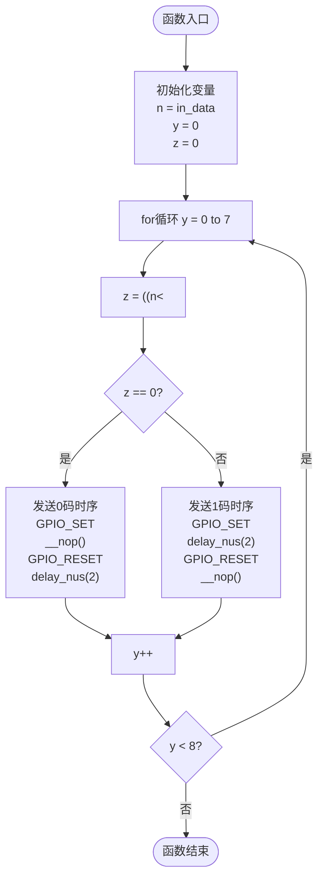

**图表来源**
- [main.c](file://Core/Src/main.c#L122-L146)

#### 时序精度保证

- **0码时序**：高电平持续较短时间，低电平持续较长时间
- **1码时序**：高电平持续较长时间，低电平持续较短时间
- **精确延时**：使用delay_nus函数实现微秒级精确延时

**章节来源**
- [main.c](file://Core/Src/main.c#L122-L146)

### HSV色彩空间转换

HSVtoRGB函数提供了HSV色彩空间到RGB色彩空间的转换能力：

#### HSV转换算法

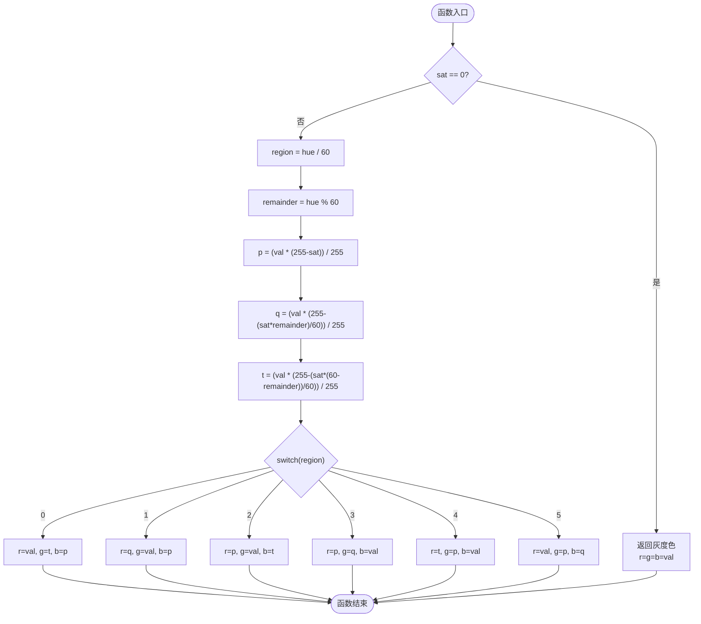

**图表来源**
- [main.c](file://Core/Src/main.c#L284-L309)

**章节来源**
- [main.c](file://Core/Src/main.c#L284-L309)

## 依赖关系分析

### 外设依赖关系

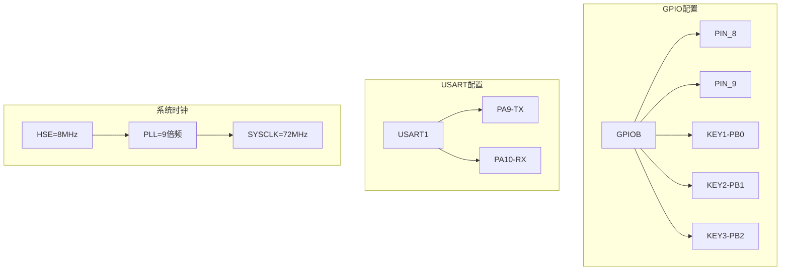

**图表来源**
- [gpio.c](file://Core/Src/gpio.c#L42-L88)
- [usart.c](file://Core/Src/usart.c#L31-L56)
- [system_stm32f1xx.c](file://Core/Src/system_stm32f1xx.c#L490-L523)

### 头文件包含关系

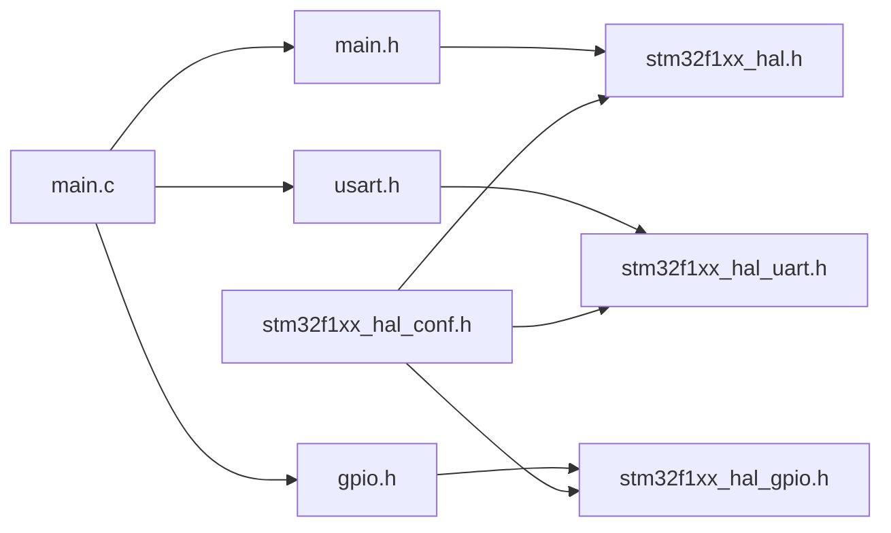

**图表来源**
- [main.c](file://Core/Src/main.c#L19-L30)
- [main.h](file://Core/Inc/main.h#L29-L31)
- [stm32f1xx_hal_conf.h](file://Core/Inc/stm32f1xx_hal_conf.h#L28-L31)

**章节来源**
- [gpio.c](file://Core/Src/gpio.c#L42-L88)
- [usart.c](file://Core/Src/usart.c#L31-L56)
- [system_stm32f1xx.c](file://Core/Src/system_stm32f1xx.c#L490-L523)

## 性能考虑

### 时序优化策略

1. **精确延时控制**：使用delay_nus函数实现微秒级精确延时
2. **循环优化**：采用简单的for循环结构，减少函数调用开销
3. **内存访问优化**：使用连续内存布局存储LED颜色数据

### 资源使用分析

- **CPU占用率**：主要消耗在延时函数和循环操作上
- **内存使用**：每个LED需要3字节存储颜色信息，共24字节
- **功耗特性**：LED亮度按距离线性衰减，降低整体功耗

### 可扩展性考虑

1. **LED数量扩展**：可通过修改total_led宏定义扩展LED数量
2. **滚动速度调节**：通过调整SCROLL_SPEED宏控制滚动速度
3. **颜色方案定制**：可修改RGB_Scroll_Gradient函数中的颜色计算逻辑

## 故障排除指南

### 常见问题及解决方案

#### LED不亮或显示异常

**可能原因**：
1. WS2812时序错误
2. GPIO引脚配置不当
3. 电源供电不足

**解决步骤**：
1. 检查RGB_WriteByte函数的时序参数
2. 验证GPIO初始化配置
3. 确认LED供电电压稳定

#### 滚动效果不流畅

**可能原因**：
1. SCROLL_SPEED设置过小
2. CPU时钟配置错误
3. 中断冲突

**解决步骤**：
1. 调整SCROLL_SPEED宏定义值
2. 验证SystemClock_Config函数配置
3. 检查中断优先级设置

#### 调试信息输出

系统通过USART接口提供调试信息输出：

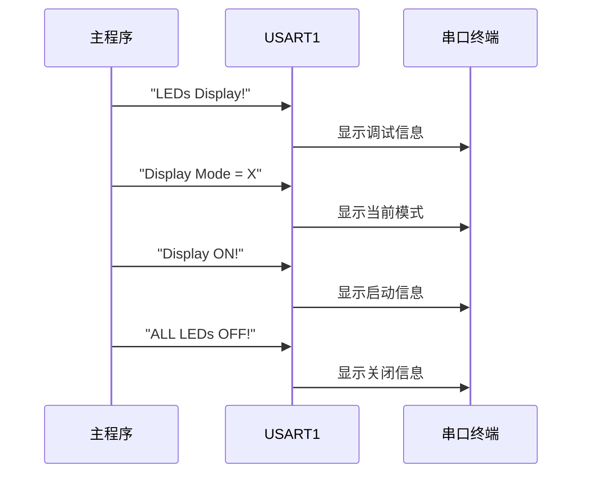

**图表来源**
- [main.c](file://Core/Src/main.c#L416-L418)
- [main.c](file://Core/Src/main.c#L534-L543)

**章节来源**
- [main.c](file://Core/Src/main.c#L527-L558)

## 结论

本项目成功实现了基于WS2812 LED灯带的渐变滚动效果，通过精心设计的距离衰减算法和循环滚动机制，创造出了中心最亮、边缘渐暗的光晕视觉效果。

### 技术亮点

1. **精确的时序控制**：RGB_WriteByte函数实现了WS2812协议的严格时序要求
2. **高效的算法设计**：距离衰减算法简单高效，适合嵌入式环境
3. **良好的可扩展性**：代码结构清晰，易于修改和扩展功能

### 应用价值

该效果可以广泛应用于各种装饰照明、氛围营造和交互展示场景，为用户提供流畅自然的视觉体验。通过参数调节，可以适应不同的应用场景和用户需求。

### 改进建议

1. **增加动态参数调节**：通过按键或串口命令实时调节滚动速度和亮度范围
2. **扩展颜色方案**：支持更多样式的渐变效果和颜色组合
3. **优化功耗管理**：在LED不使用时自动降低功耗