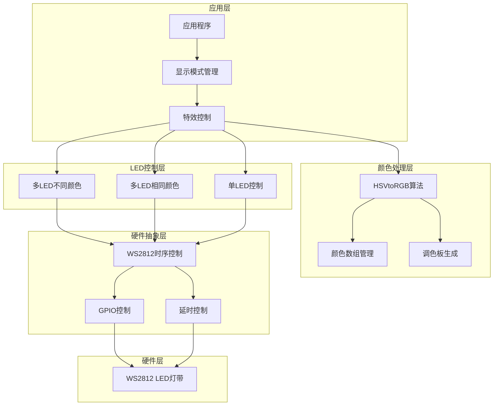
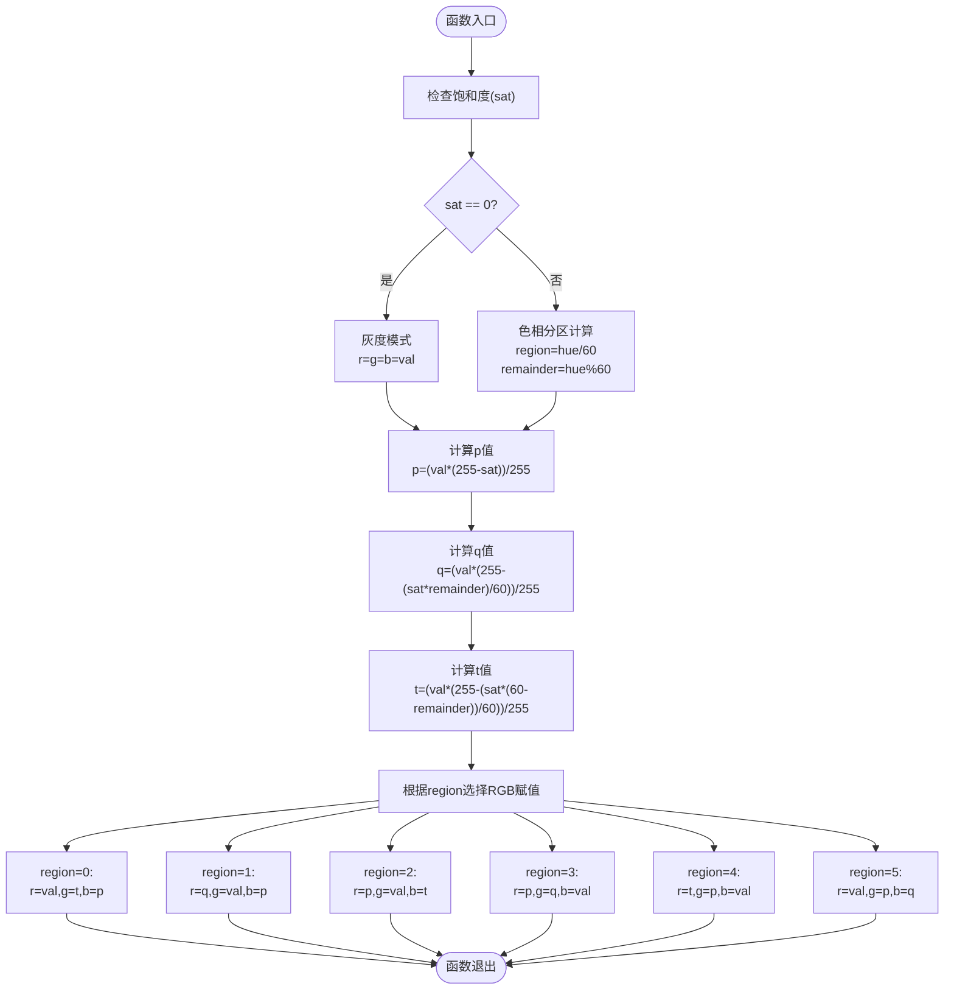
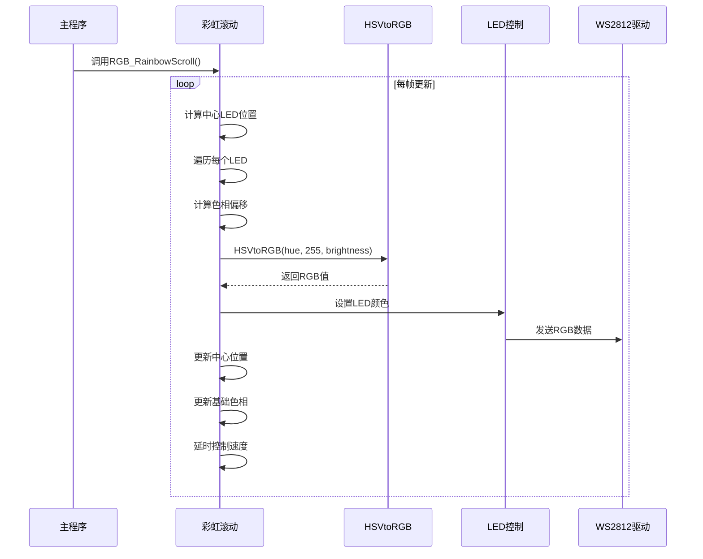
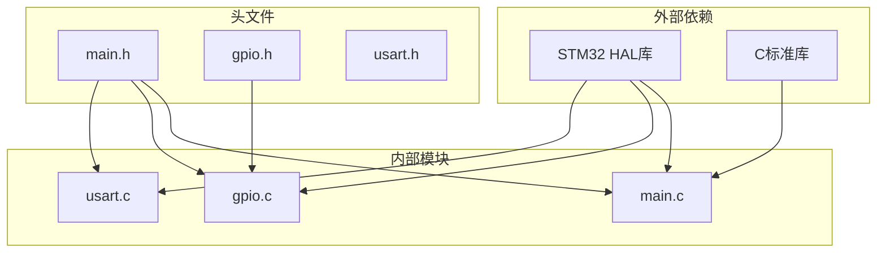

# 颜色处理算法

<cite>
**本文档引用的文件**
- [main.c](file://Core/Src/main.c)
- [main.h](file://Core/Inc/main.h)
- [gpio.h](file://Core/Inc/gpio.h)
</cite>

## 目录
1. [简介](#简介)
2. [项目结构](#项目结构)
3. [核心组件](#核心组件)
4. [架构概览](#架构概览)
5. [详细组件分析](#详细组件分析)
6. [依赖关系分析](#依赖关系分析)
7. [性能考虑](#性能考虑)
8. [故障排除指南](#故障排除指南)
9. [结论](#结论)

## 简介

本项目实现了基于STM32F103C8T6微控制器的WS2812 LED灯带控制系统，重点展示了HSV到RGB颜色空间转换算法的完整实现。该算法通过数学公式将色相(Hue)、饱和度(Saturation)和明度(Value)转换为RGB三通道颜色值，支持8个预定义颜色和动态彩虹效果生成。

系统采用嵌套式颜色处理架构，从底层的WS2812时序控制到高层的颜色算法，形成了完整的LED显示解决方案。本文档将深入解析HSVtoRGB函数的数学原理和实现细节，并提供实际应用场景和性能优化建议。

## 项目结构

该项目采用标准的STM32CubeMX工程结构，主要包含以下关键目录：

```mermaid
graph TB
subgraph "项目根目录"
Root[项目根目录]
subgraph "Core"
Core[Core/]
subgraph "Inc"
Inc[Core/Inc/]
IncMain[main.h]
IncGpio[gpio.h]
end
subgraph "Src"
Src[Core/Src/]
SrcMain[main.c]
SrcGpio[gpio.c]
SrcUsart[usart.c]
end
end
subgraph "Drivers"
Drivers[Drivers/]
subgraph "CMSIS"
CMSIS[CMSIS/]
end
subgraph "STM32F1xx_HAL_Driver"
HAL[STM32F1xx_HAL_Driver/]
end
end
subgraph "MDK-ARM"
MDK[MDK-ARM/]
end
end
```

**图表来源**
- [main.c](file://Core/Src/main.c#L1-L50)
- [main.h](file://Core/Inc/main.h#L1-L30)

**章节来源**
- [main.c](file://Core/Src/main.c#L1-L50)
- [main.h](file://Core/Inc/main.h#L1-L30)

## 核心组件

### 颜色处理核心算法

项目的核心是HSV到RGB的颜色转换算法，该算法实现了标准的HSV颜色空间转换公式：

#### HSV参数范围定义
- **色相(Hue)**: 0-360°范围，表示颜色的基本色调
- **饱和度(Saturation)**: 0-255范围，表示颜色的纯度
- **明度(Value)**: 0-255范围，表示颜色的亮度

#### 预定义颜色数组
系统内置了8种标准颜色，每种颜色都以RGB三通道值的形式存储：

| 颜色名称 | RGB值 | 十六进制表示 |
|---------|-------|-------------|
| 黑色 | (0,0,0) | 0x000000 |
| 红色 | (255,0,0) | 0xFF0000 |
| 绿色 | (0,255,0) | 0x00FF00 |
| 蓝色 | (0,0,255) | 0x0000FF |
| 黄色 | (255,255,0) | 0xFFFF00 |
| 紫色 | (255,0,255) | 0xFF00FF |
| 青色 | (0,255,255) | 0x00FFFF |
| 白色 | (255,255,255) | 0xFFFFFF |

**章节来源**
- [main.c](file://Core/Src/main.c#L44-L81)

### WS2812控制接口

系统提供了完整的WS2812 LED控制接口，包括：

- **RGB_WriteByte**: 实现WS2812严格的时序要求
- **RGB_ColorSet**: 设置单个LED颜色
- **RGB_MultiSameColorSet**: 同时设置多个LED相同颜色
- **RGB_MultiDiffColorSet**: 设置多个LED不同颜色

**章节来源**
- [main.c](file://Core/Src/main.c#L121-L248)

## 架构概览

系统采用分层架构设计，从底层硬件抽象到高层应用逻辑：



**图表来源**
- [main.c](file://Core/Src/main.c#L284-L348)
- [main.c](file://Core/Src/main.c#L121-L248)

## 详细组件分析

### HSVtoRGB算法详解

HSVtoRGB函数是整个颜色处理系统的核心，实现了标准的HSV到RGB转换算法：

#### 数学原理分析

算法的核心数学关系如下：

1. **饱和度检查**: 当饱和度为0时，直接返回灰度值
2. **色相分区**: `region = hue / 60` 将360°色相范围分为6个分区
3. **中间变量计算**:
   - `p = (val × (255 - sat)) / 255`
   - `q = (val × (255 - (sat × remainder) / 60)) / 255`
   - `t = (val × (255 - (sat × (60 - remainder)) / 60)) / 255`

4. **分区间RGB赋值**: 根据不同的色相分区选择相应的RGB组合

#### 算法流程图



**图表来源**
- [main.c](file://Core/Src/main.c#L284-L309)

#### 参数处理机制

系统对HSV参数采用了特定的处理策略：

- **色相范围(0-360°)**: 通过模运算确保色相值在有效范围内
- **饱和度范围(0-255)**: 直接使用饱和度值进行计算
- **明度范围(0-255)**: 直接使用明度值作为最大亮度参考

**章节来源**
- [main.c](file://Core/Src/main.c#L284-L309)

### 彩虹滚动效果实现

RGB_RainbowScroll函数实现了动态的彩虹滚动效果：

#### 核心算法流程



**图表来源**
- [main.c](file://Core/Src/main.c#L313-L348)

#### 性能优化策略

系统在实现中采用了多项性能优化措施：

1. **整数运算优化**: 全部使用整数运算避免浮点计算开销
2. **内存局部性**: 使用栈上分配减少堆内存操作
3. **循环优化**: 减少不必要的条件判断和分支
4. **时序精确控制**: 通过精确的延时控制确保WS2812时序正确

**章节来源**
- [main.c](file://Core/Src/main.c#L313-L348)

### WS2812时序控制

RGB_WriteByte函数实现了WS2812严格的时序要求：

#### 时序规范

WS2812对时序有严格的要求：
- **逻辑1**: 高电平持续约600ns，然后低电平约600ns
- **逻辑0**: 高电平持续约300ns，然后低电平约900ns
- **复位信号**: 低电平至少280μs

#### 实现策略

系统通过精确的延时控制实现这些时序要求：
- 使用`delay_nus()`函数实现纳秒级精确延时
- 通过内联汇编`__nop()`实现微秒级延时
- 动态调整延时参数确保在不同系统频率下都能正确工作

**章节来源**
- [main.c](file://Core/Src/main.c#L107-L146)
- [main.c](file://Core/Src/main.c#L121-L146)

## 依赖关系分析

系统各组件之间的依赖关系如下：



**图表来源**
- [main.c](file://Core/Src/main.c#L19-L30)
- [main.h](file://Core/Inc/main.h#L29-L30)

**章节来源**
- [main.c](file://Core/Src/main.c#L19-L30)
- [main.h](file://Core/Inc/main.h#L29-L30)

## 性能考虑

### 算法性能分析

#### 时间复杂度
- **HSVtoRGB**: O(1) - 固定的常数时间操作
- **RGB_RainbowScroll**: O(n) - n为LED数量
- **RGB_WriteByte**: O(1) - 固定的8次位操作

#### 空间复杂度
- **HSVtoRGB**: O(1) - 只使用局部变量
- **RGB_RainbowScroll**: O(n) - 需要LED_Color数组存储颜色信息

### 优化建议

1. **批处理优化**: 对于大量LED的场景，可以考虑批量处理减少函数调用开销
2. **缓存机制**: 对于重复使用的颜色值，可以实现简单的缓存机制
3. **并行处理**: 在更高性能的MCU上，可以考虑多线程处理不同LED段
4. **内存池**: 对于频繁分配的LED_Color数组，可以使用内存池减少碎片

### 实际应用场景

该颜色处理算法适用于以下场景：

- **装饰照明**: 彩虹滚动、渐变效果
- **状态指示**: 不同颜色表示不同状态
- **氛围营造**: 可调节的环境照明
- **艺术装置**: 动态色彩展示

## 故障排除指南

### 常见问题及解决方案

#### LED不亮或显示异常
1. **检查硬件连接**: 确认WS2812的数据线连接正确
2. **验证时序**: 检查RGB_WriteByte函数的延时参数
3. **确认电源**: 确保LED灯带获得足够的电流

#### 颜色显示不正确
1. **检查HSV参数范围**: 确保输入参数在有效范围内
2. **验证颜色数组**: 检查预定义颜色数组的值
3. **调试算法**: 逐步跟踪HSVtoRGB函数的执行过程

#### 性能问题
1. **优化循环**: 减少不必要的计算和分支
2. **调整刷新率**: 根据LED数量调整刷新频率
3. **内存管理**: 避免频繁的内存分配和释放

**章节来源**
- [main.c](file://Core/Src/main.c#L107-L146)
- [main.c](file://Core/Src/main.c#L284-L309)

## 结论

本项目成功实现了完整的WS2812 LED控制系统，其中HSVtoRGB算法是核心技术之一。该算法通过精确的数学公式实现了从HSV颜色空间到RGB颜色空间的高效转换，支持丰富的颜色效果和动态显示功能。

系统的设计充分考虑了嵌入式环境的限制，在保证功能完整性的同时实现了良好的性能表现。通过合理的架构设计和优化策略，该系统能够稳定地运行在资源受限的STM32微控制器上。

未来可以在以下方面进一步改进：
- 支持更多的颜色空间转换算法
- 实现更复杂的颜色效果和动画
- 优化内存使用和处理效率
- 增加用户自定义颜色方案的功能