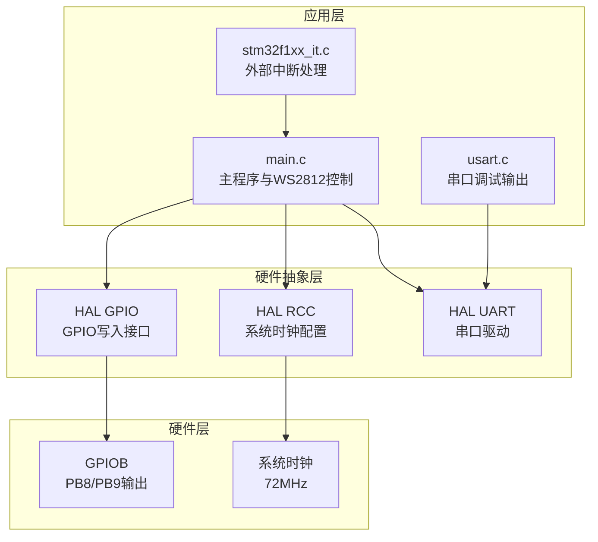
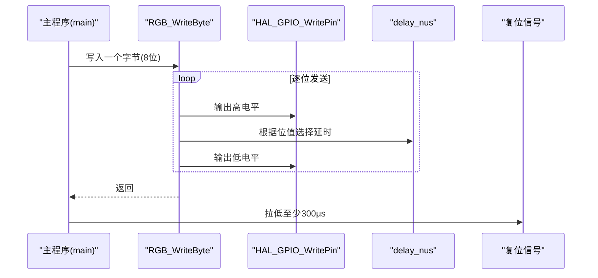
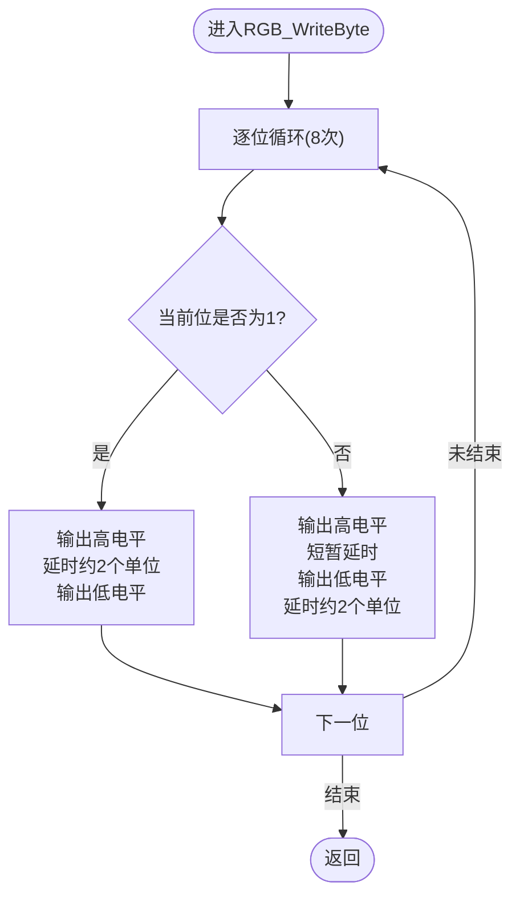
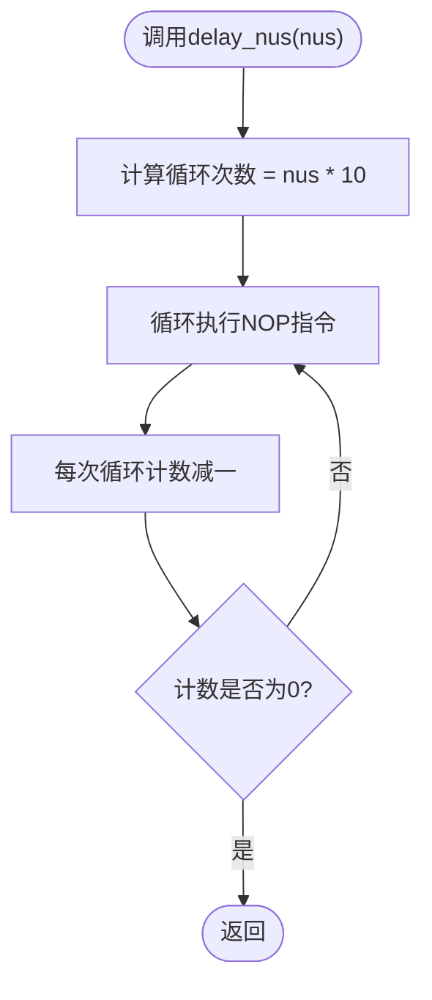
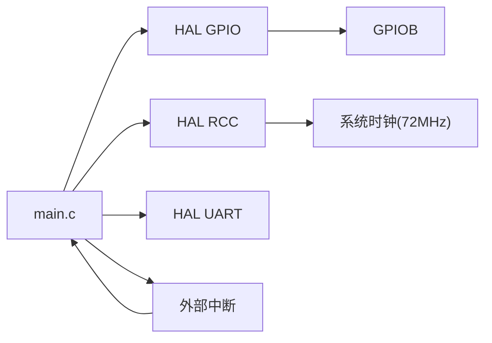

# WS2812 LED控制核心

<cite>
**本文引用的文件列表**
- [Core/Src/main.c](file://Core/Src/main.c)
- [Core/Inc/main.h](file://Core/Inc/main.h)
- [Core/Src/gpio.c](file://Core/Src/gpio.c)
- [Core/Src/system_stm32f1xx.c](file://Core/Src/system_stm32f1xx.c)
- [Core/Src/usart.c](file://Core/Src/usart.c)
- [Core/Src/stm32f1xx_it.c](file://Core/Src/stm32f1xx_it.c)
- [Drivers/STM32F1xx_HAL_Driver/Inc/stm32f1xx_hal_gpio.h](file://Drivers/STM32F1xx_HAL_Driver/Inc/stm32f1xx_hal_gpio.h)
- [Drivers/STM32F1xx_HAL_Driver/Inc/stm32f1xx_ll_gpio.h](file://Drivers/STM32F1xx_HAL_Driver/Inc/stm32f1xx_ll_gpio.h)
- [Drivers/STM32F1xx_HAL_Driver/Inc/stm32f1xx_ll_utils.h](file://Drivers/STM32F1xx_HAL_Driver/Inc/stm32f1xx_ll_utils.h)
- [Drivers/STM32F1xx_HAL_Driver/Inc/stm32f1xx_ll_system.h](file://Drivers/STM32F1xx_HAL_Driver/Inc/stm32f1xx_ll_system.h)
- [Drivers/STM32F1xx_HAL_Driver/Inc/stm32f1xx_hal_rcc.h](file://Drivers/STM32F1xx_HAL_Driver/Inc/stm32f1xx_hal_rcc.h)
- [Drivers/STM32F1xx_HAL_Driver/Inc/stm32f1xx_hal_rcc_ex.h](file://Drivers/STM32F1xx_HAL_Driver/Inc/stm32f1xx_hal_rcc_ex.h)
- [Drivers/STM32F1xx_HAL_Driver/Inc/stm32f1xx_hal_uart.h](file://Drivers/STM32F1xx_HAL_Driver/Inc/stm32f1xx_hal_uart.h)
- [Drivers/CMSIS/Device/ST/STM32F1xx/Include/stm32f103xb.h](file://Drivers/CMSIS/Device/ST/STM32F1xx/Include/stm32f103xb.h)
- [Drivers/CMSIS/Include/core_cm3.h](file://Drivers/CMSIS/Include/core_cm3.h)
</cite>

## 目录
1. [简介](#简介)
2. [项目结构](#项目结构)
3. [核心组件](#核心组件)
4. [架构总览](#架构总览)
5. [详细组件分析](#详细组件分析)
6. [依赖关系分析](#依赖关系分析)
7. [性能考量](#性能考量)
8. [故障排查指南](#故障排查指南)
9. [结论](#结论)
10. [附录](#附录)

## 简介
本技术文档围绕STM32F103C8T6平台上的WS2812 LED控制核心模块展开，重点解释WS2812协议的时序要求、RGB_WriteByte函数的实现机制、GRB颜色通道顺序的由来与影响、复位信号的重要性及300微秒最小持续时间要求，并结合72MHz系统时钟进行延时精度分析与优化建议。文档通过时序图、波形图与流程图帮助开发者从底层理解WS2812控制的实现原理。

## 项目结构
该项目采用典型的CubeMX工程组织方式，核心逻辑集中在主程序文件中，外设初始化通过HAL库完成。WS2812控制的核心位于主程序源文件，GPIO与系统时钟配置分别在对应的源文件中实现，串口用于调试输出，外部中断用于按键控制。

图表来源
- [Core/Src/main.c](file://Core/Src/main.c#L106-L176)
- [Core/Src/gpio.c](file://Core/Src/gpio.c#L42-L88)
- [Core/Src/usart.c](file://Core/Src/usart.c#L31-L56)
- [Core/Src/stm32f1xx_it.c](file://Core/Src/stm32f1xx_it.c#L204-L241)
- [Drivers/STM32F1xx_HAL_Driver/Inc/stm32f1xx_hal_gpio.h](file://Drivers/STM32F1xx_HAL_Driver/Inc/stm32f1xx_hal_gpio.h#L84-L107)
- [Core/Src/system_stm32f1xx.c](file://Core/Src/system_stm32f1xx.c#L490-L523)

章节来源
- [Core/Src/main.c](file://Core/Src/main.c#L106-L176)
- [Core/Src/gpio.c](file://Core/Src/gpio.c#L42-L88)
- [Core/Src/usart.c](file://Core/Src/usart.c#L31-L56)
- [Core/Src/stm32f1xx_it.c](file://Core/Src/stm32f1xx_it.c#L204-L241)

## 核心组件
- WS2812协议时序与复位信号
  - 1码与0码的高电平持续时间与时序要求
  - 复位信号的必要性与最小持续时间（≥280μs）
- RGB_WriteByte函数
  - 逐位发送与精确延时机制
  - GRB通道顺序的实现与影响
- 系统时钟与延时精度
  - 72MHz系统时钟下的延时计算
  - 延时函数的实现与误差分析
- 外设与中断
  - GPIO输出配置与外部中断按键控制
  - 串口调试输出

章节来源
- [Core/Src/main.c](file://Core/Src/main.c#L106-L176)
- [Core/Src/main.c](file://Core/Src/main.c#L121-L146)
- [Core/Src/main.c](file://Core/Src/main.c#L173-L176)
- [Core/Src/system_stm32f1xx.c](file://Core/Src/system_stm32f1xx.c#L490-L523)

## 架构总览
WS2812控制的执行路径从主程序入口开始，根据运行模式选择不同的显示函数；每个显示函数通过RGB_WriteByte逐位发送RGB数据，最后发送复位信号以锁存数据。GPIO输出通过HAL库封装，系统时钟由RCC配置为72MHz，延时函数基于CPU周期进行精确计数。

图表来源
- [Core/Src/main.c](file://Core/Src/main.c#L121-L146)
- [Core/Src/main.c](file://Core/Src/main.c#L173-L176)

## 详细组件分析

### WS2812协议与时序要求
- 1码与0码的高电平持续时间与时序
  - 1码：高电平持续时间较长，随后拉低
  - 0码：高电平持续时间较短，随后拉低
  - 两种码型的组合构成完整的位序列
- 复位信号
  - 必须在数据帧结束后拉低至少280μs，以触发LED锁存新数据
  - 实现中使用300μs确保稳定可靠

章节来源
- [Core/Src/main.c](file://Core/Src/main.c#L121-L146)
- [Core/Src/main.c](file://Core/Src/main.c#L173-L176)

### RGB_WriteByte函数实现机制
- 逐位发送策略
  - 从最高有效位开始逐位发送
  - 根据当前位值选择1码或0码的时序
- 精确延时机制
  - 1码：先输出高电平，延时约2个单位，再拉低
  - 0码：先输出高电平，短暂延时后拉低，再延时约2个单位
  - 延时通过循环NOP指令实现，与系统时钟频率相关

图表来源
- [Core/Src/main.c](file://Core/Src/main.c#L121-L146)

章节来源
- [Core/Src/main.c](file://Core/Src/main.c#L121-L146)

### GRB颜色通道顺序与影响
- GRB顺序的实现
  - 在设置颜色时，按绿、红、蓝顺序发送，形成GRB通道排列
- 对显示的影响
  - 若期望RGB显示，需在调用处交换参数顺序
  - 不同LED对通道顺序敏感，需确保与LED规格一致

章节来源
- [Core/Src/main.c](file://Core/Src/main.c#L160-L163)
- [Core/Src/main.c](file://Core/Src/main.c#L198-L201)

### 复位信号与300微秒最小持续时间
- 复位信号的作用
  - 触发LED锁存当前帧数据，使新颜色生效
- 时间要求
  - 规范要求≥280μs，实现中使用300μs以保证可靠性
- 实现位置
  - 每次颜色写入完成后调用，确保所有LED同步更新

章节来源
- [Core/Src/main.c](file://Core/Src/main.c#L173-L176)
- [Core/Src/main.c](file://Core/Src/main.c#L212-L215)
- [Core/Src/main.c](file://Core/Src/main.c#L244-L246)

### 延时精度分析与72MHz系统时钟下的计算
- 系统时钟配置
  - 使用HSE作为时钟源，PLL倍频至72MHz
  - 系统时钟配置在主程序中完成
- 延时函数实现
  - 基于循环NOP指令，每10个单位对应1微秒（在72MHz下）
  - 通过循环计数实现精确延时
- 计算方法
  - 目标延时n微秒：循环次数≈n×10
  - 实际精度受编译器优化、指令周期与系统负载影响

图表来源
- [Core/Src/main.c](file://Core/Src/main.c#L106-L116)
- [Core/Src/system_stm32f1xx.c](file://Core/Src/system_stm32f1xx.c#L490-L523)

章节来源
- [Core/Src/main.c](file://Core/Src/main.c#L106-L116)
- [Core/Src/system_stm32f1xx.c](file://Core/Src/system_stm32f1xx.c#L490-L523)

### 外设与中断集成
- GPIO配置
  - PB8/PB9配置为推挽输出，用于WS2812数据线
  - 输出初始状态与速度设置满足协议要求
- 外部中断
  - KEY1/KEY2/KEY3按键触发外部中断，切换显示模式与开关
- 串口调试
  - 通过串口输出运行状态信息，便于调试

章节来源
- [Core/Src/gpio.c](file://Core/Src/gpio.c#L42-L88)
- [Core/Src/stm32f1xx_it.c](file://Core/Src/stm32f1xx_it.c#L204-L241)
- [Core/Src/usart.c](file://Core/Src/usart.c#L31-L56)

## 依赖关系分析
WS2812控制模块主要依赖以下组件：
- HAL_GPIO：提供GPIO写入接口
- HAL_RCC：提供系统时钟配置与查询
- HAL_UART：提供串口调试输出
- 外部中断：按键控制显示模式与开关
- 系统时钟：72MHz确保延时精度

图表来源
- [Core/Src/main.c](file://Core/Src/main.c#L106-L176)
- [Core/Src/gpio.c](file://Core/Src/gpio.c#L42-L88)
- [Core/Src/stm32f1xx_it.c](file://Core/Src/stm32f1xx_it.c#L204-L241)
- [Core/Src/usart.c](file://Core/Src/usart.c#L31-L56)
- [Core/Src/system_stm32f1xx.c](file://Core/Src/system_stm32f1xx.c#L490-L523)

章节来源
- [Core/Src/main.c](file://Core/Src/main.c#L106-L176)
- [Core/Src/gpio.c](file://Core/Src/gpio.c#L42-L88)
- [Core/Src/stm32f1xx_it.c](file://Core/Src/stm32f1xx_it.c#L204-L241)
- [Core/Src/usart.c](file://Core/Src/usart.c#L31-L56)
- [Core/Src/system_stm32f1xx.c](file://Core/Src/system_stm32f1xx.c#L490-L523)

## 性能考量
- 延时精度与系统时钟
  - 72MHz下，延时函数以NOP循环实现，精度取决于编译器优化与指令周期
  - 建议在空闲时段执行WS2812更新，避免任务调度抖动影响时序
- 通道顺序与数据量
  - GRB顺序减少调用处的参数交换，但需确保与LED规格一致
  - 多灯异色时，注意总数据量与复位信号的及时性
- 外设配置
  - GPIO输出速度设置为高速，有助于缩短上升/下降沿时间
  - 外部中断优先级设置合理，避免按键抖动导致的状态误判

[本节为通用性能建议，不直接分析具体文件]

## 故障排查指南
- LED不显示或显示异常
  - 检查GPIO配置与输出电平是否正确
  - 确认延时函数是否被正确调用且参数正确
  - 验证复位信号是否满足≥280μs的要求
- 颜色错位
  - 检查GRB顺序是否与LED规格一致
  - 若期望RGB显示，需在调用处调整参数顺序
- 按键无响应
  - 检查外部中断初始化与NVIC优先级设置
  - 确认按键上拉/下拉配置与中断触发边沿一致
- 串口输出异常
  - 检查串口初始化参数与引脚配置
  - 确认波特率与主机端一致

章节来源
- [Core/Src/main.c](file://Core/Src/main.c#L173-L176)
- [Core/Src/main.c](file://Core/Src/main.c#L198-L201)
- [Core/Src/gpio.c](file://Core/Src/gpio.c#L42-L88)
- [Core/Src/stm32f1xx_it.c](file://Core/Src/stm32f1xx_it.c#L204-L241)
- [Core/Src/usart.c](file://Core/Src/usart.c#L31-L56)

## 结论
本项目通过精确的延时控制与严格的WS2812时序实现，提供了稳定的LED控制能力。RGB_WriteByte函数以逐位发送与NOP循环延时为核心，配合GRB通道顺序与复位信号，实现了可靠的数据传输。在72MHz系统时钟下，延时精度满足WS2812协议要求。通过合理的外设配置与中断处理，系统具备良好的交互性与可维护性。开发者可根据实际需求调整延时参数与显示模式，进一步优化性能与体验。

[本节为总结性内容，不直接分析具体文件]

## 附录
- 关键宏与常量
  - 系统时钟配置：HSE=8MHz，PLL=9倍，SYSCLK=72MHz
  - 延时函数：每微秒约10个NOP循环
  - 复位时间：≥280μs，实现中使用300μs
- 推荐实践
  - 在空闲时段执行WS2812更新，避免任务调度抖动
  - 确保GPIO输出速度与协议要求匹配
  - 如需RGB显示，调整调用处参数顺序或在函数内部转换

[本节为补充信息，不直接分析具体文件]