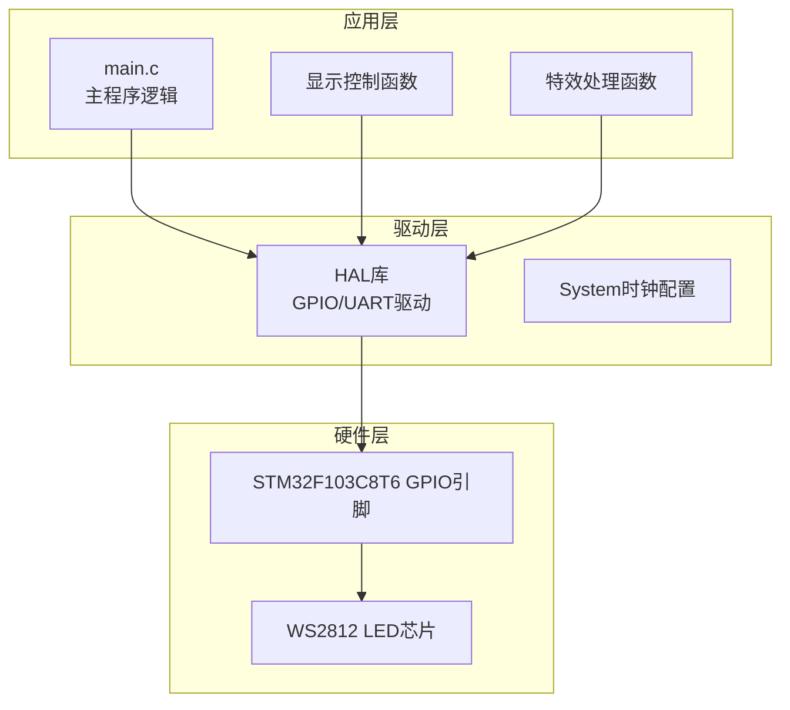
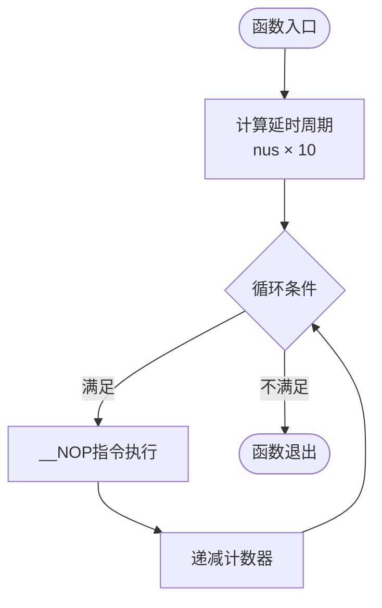
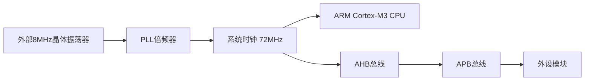
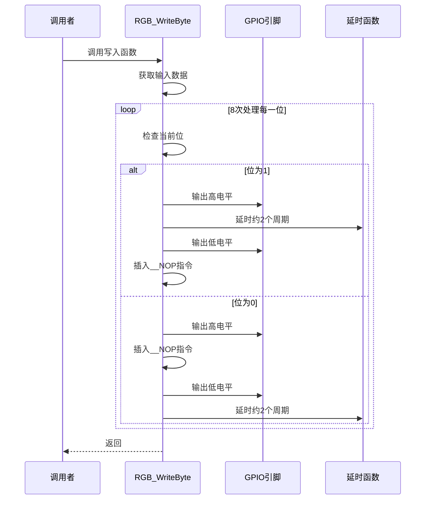
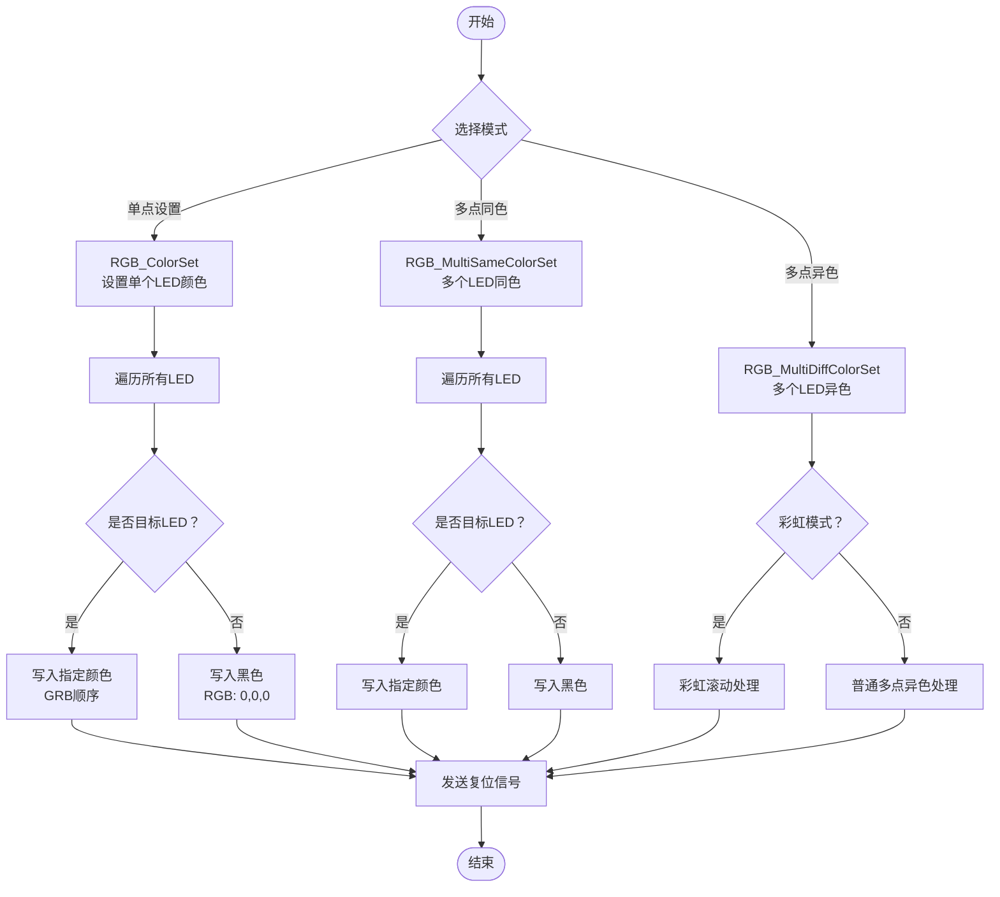
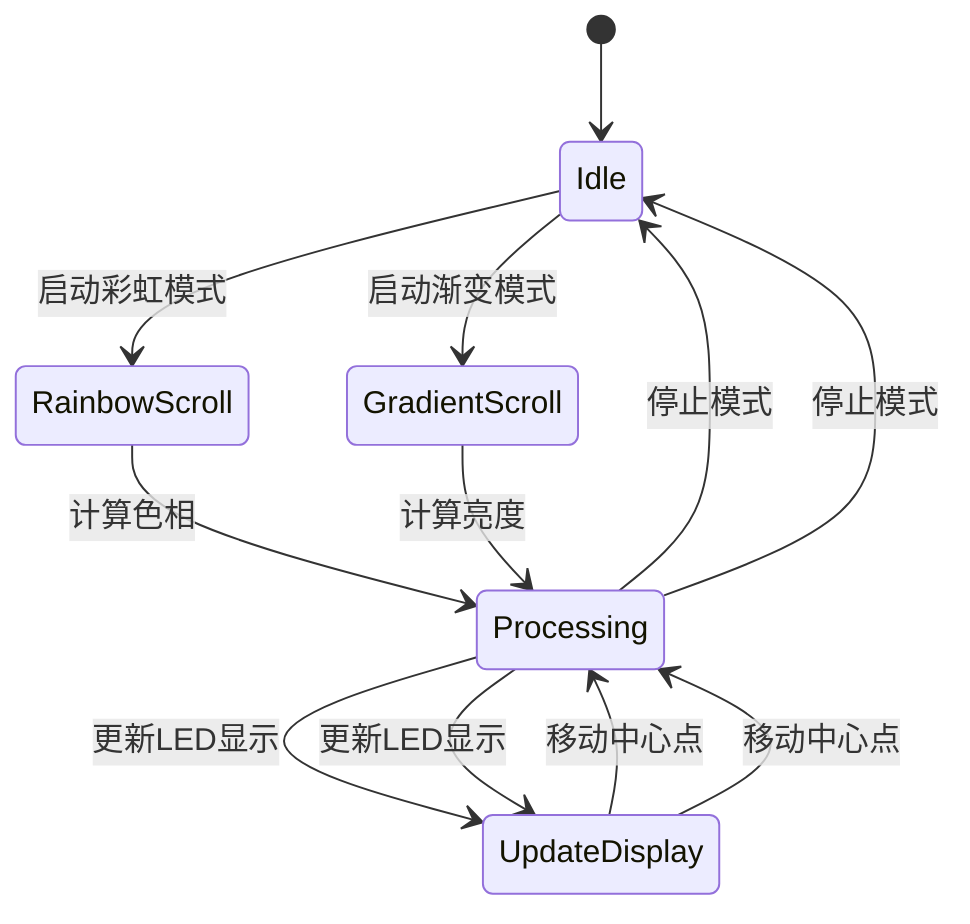
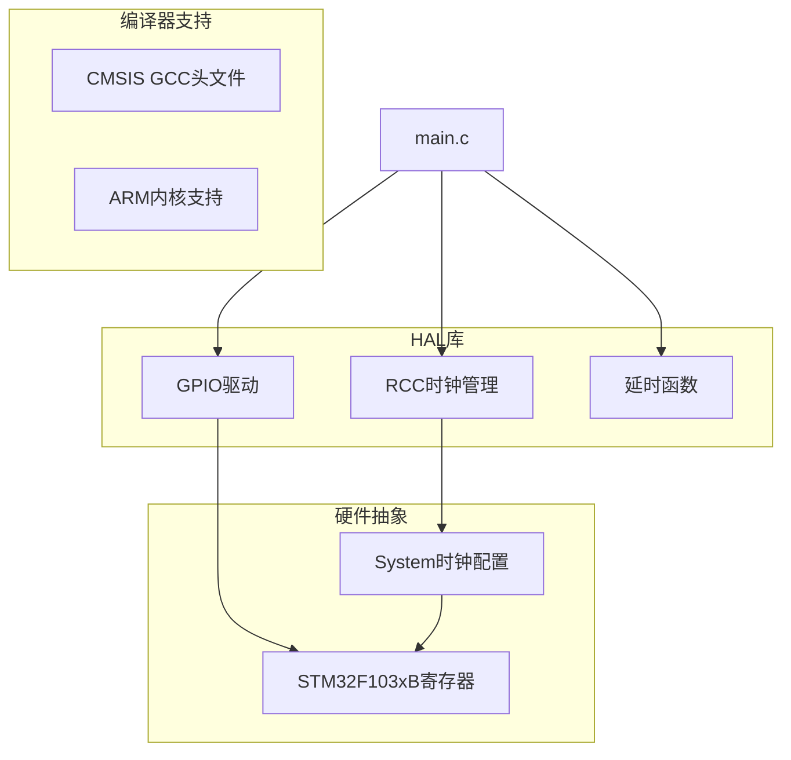
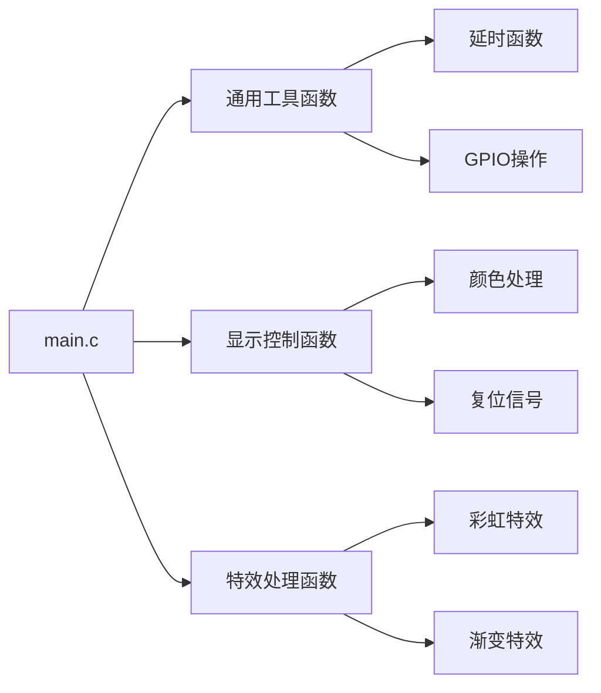

# WS2812协议原理

<cite>
**本文档引用的文件**
- [main.c](file://Core/Src/main.c)
- [main.h](file://Core/Inc/main.h)
- [gpio.c](file://Core/Src/gpio.c)
- [system_stm32f1xx.c](file://Core/Src/system_stm32f1xx.c)
- [stm32f103xb.h](file://Drivers/CMSIS/Device/ST/STM32F1xx/Include/stm32f103xb.h)
- [cmsis_gcc.h](file://Drivers/CMSIS/Include/cmsis_gcc.h)
</cite>

## 目录
1. [简介](#简介)
2. [项目结构](#项目结构)
3. [核心组件](#核心组件)
4. [架构概览](#架构概览)
5. [详细组件分析](#详细组件分析)
6. [依赖关系分析](#依赖关系分析)
7. [性能考虑](#性能考虑)
8. [故障排除指南](#故障排除指南)
9. [结论](#结论)

## 简介

本文件详细阐述了WS2812 LED芯片的工作原理和驱动实现。WS2812是一种集成了控制电路和RGB三色LED的智能像素芯片，广泛应用于LED灯带、装饰灯等产品中。该芯片采用单线串行通信方式，通过精确的时序控制实现数据传输和LED点亮。

WS2812的核心特性包括：
- 单线数字接口，无需额外控制线
- 内置存储器，支持级联连接
- 24位颜色数据（8位×3通道）
- 独特的脉冲宽度编码方式
- 自恢复数据总线

## 项目结构

该项目基于STM32F103C8T6微控制器，使用HAL库进行开发。项目采用典型的分层架构设计：



**图表来源**
- [main.c](file://Core/Src/main.c#L373-L484)
- [gpio.c](file://Core/Src/gpio.c#L42-L89)

**章节来源**
- [main.c](file://Core/Src/main.c#L1-L592)
- [main.h](file://Core/Inc/main.h#L1-L79)

## 核心组件

### WS2812协议实现

项目中的WS2812协议实现主要包含以下核心功能：

#### 1. 精确延时控制
系统采用72MHz主频，通过自定义延时函数实现精确的时间控制：



**图表来源**
- [main.c](file://Core/Src/main.c#L107-L116)

#### 2. 数据编码机制
WS2812采用独特的脉冲宽度编码方式，通过不同的高电平持续时间区分数据位：

| 数据位 | 时序要求 | 高电平持续时间 | 时序特征 |
|--------|----------|----------------|----------|
| 1码 | 1.25μs周期 | 0.8μs高电平 | 高电平占主导 |
| 0码 | 1.25μs周期 | 0.35μs高电平 | 低电平占主导 |

#### 3. 复位信号处理
每个数据帧传输完成后需要发送复位信号，确保下一次数据传输的正确性。

**章节来源**
- [main.c](file://Core/Src/main.c#L107-L176)

## 架构概览

### 系统时钟配置

系统采用外部高速晶体振荡器（HSE）作为时钟源，通过PLL倍频获得72MHz系统时钟频率：



**图表来源**
- [main.c](file://Core/Src/main.c#L490-L523)
- [system_stm32f1xx.c](file://Core/Src/system_stm32f1xx.c#L175-L200)

### GPIO配置

项目使用PB8和PB9引脚作为WS2812数据输出引脚，配置为推挽输出模式：

| 引脚 | 功能 | 配置 | 用途 |
|------|------|------|------|
| PB8 | WS2812数据输出 | 推挽输出 | 主要LED控制 |
| PB9 | WS2812数据输出 | 推挽输出 | 备用LED控制 |
| PC13 | 用户指示灯 | 推挽输出 | 系统状态指示 |

**章节来源**
- [gpio.c](file://Core/Src/gpio.c#L42-L89)
- [main.h](file://Core/Inc/main.h#L60-L68)

## 详细组件分析

### WS2812数据传输流程

#### 1. 字节写入函数



**图表来源**
- [main.c](file://Core/Src/main.c#L121-L146)

#### 2. 颜色设置函数

项目提供了多种颜色设置函数，支持单点、多点同色、多点异色等不同应用场景：



**图表来源**
- [main.c](file://Core/Src/main.c#L151-L248)

#### 3. 特效处理函数

项目实现了多种LED特效，包括彩虹滚动、渐变滚动等：



**图表来源**
- [main.c](file://Core/Src/main.c#L251-L348)

**章节来源**
- [main.c](file://Core/Src/main.c#L121-L348)

### 时序控制详解

#### 1. 时序参数分析

根据项目实现，WS2812的时序参数如下：

| 参数 | 1码(逻辑1) | 0码(逻辑0) | 共同要求 |
|------|------------|------------|----------|
| 高电平持续时间 | 0.8μs | 0.35μs | 1.25μs总周期 |
| 低电平持续时间 | 0.45μs | 0.9μs | - |
| 总周期 | 1.25μs | 1.25μs | 500ns-1000ns范围 |
| 复位信号 | ≥300μs | - | 确保下一次传输 |

#### 2. 延时精度计算

在72MHz系统时钟下，每个时钟周期时间为13.89ns：

```
延时1μs = 72个时钟周期
延时0.8μs ≈ 56个时钟周期
延时0.35μs ≈ 25个时钟周期
```

项目通过`delay_nus()`函数实现精确延时，配合`__NOP`指令确保时序精度。

#### 3. 时序偏差影响

时序偏差对LED显示的影响：

- **高电平时间过短**：可能导致LED识别为0码
- **高电平时间过长**：可能导致LED识别为1码
- **总周期偏差**：可能影响后续数据位的识别
- **复位信号不足**：LED无法正确接收下一帧数据

**章节来源**
- [main.c](file://Core/Src/main.c#L107-L176)

## 依赖关系分析

### 外部依赖

项目的主要外部依赖包括：



**图表来源**
- [main.c](file://Core/Src/main.c#L20-L30)
- [cmsis_gcc.h](file://Drivers/CMSIS/Include/cmsis_gcc.h#L1-L200)

### 内部模块依赖



**图表来源**
- [main.c](file://Core/Src/main.c#L107-L348)

**章节来源**
- [main.c](file://Core/Src/main.c#L1-L592)
- [cmsis_gcc.h](file://Drivers/CMSIS/Include/cmsis_gcc.h#L1-L200)

## 性能考虑

### 1. 时钟频率优化

系统采用72MHz主频，相比较低频率系统具有以下优势：
- 更高的时序控制精度
- 更短的延时计算误差
- 更稳定的PWM信号生成

### 2. 代码优化策略

项目采用了多种优化策略来确保WS2812时序的准确性：

- **内联汇编优化**：使用`__NOP`指令精确控制时序
- **循环展开**：减少分支判断开销
- **内存访问优化**：直接操作GPIO寄存器

### 3. 功耗考虑

- GPIO引脚配置为推挽输出，功耗相对较低
- 系统时钟配置合理，避免不必要的高频运行
- LED驱动电流受控，避免过载

## 故障排除指南

### 常见问题及解决方案

#### 1. LED不亮或显示异常

**可能原因**：
- 时序控制不准确
- 复位信号未正确发送
- GPIO引脚配置错误

**解决步骤**：
1. 检查GPIO引脚配置是否正确
2. 验证延时函数的精度
3. 确认复位信号的时长

#### 2. 颜色显示错误

**可能原因**：
- GRB颜色顺序错误
- 数据传输顺序问题
- 时序偏差过大

**解决步骤**：
1. 确认WS2812的GRB颜色顺序
2. 检查数据位传输顺序
3. 调整延时参数

#### 3. 多LED同步问题

**可能原因**：
- LED数量过多导致时序累积误差
- 复位信号时间不足
- 电源供应不稳定

**解决步骤**：
1. 分段控制LED数量
2. 增加复位信号时间
3. 检查电源质量

**章节来源**
- [main.c](file://Core/Src/main.c#L565-L592)
- [gpio.c](file://Core/Src/gpio.c#L42-L89)

## 结论

本项目成功实现了WS2812 LED芯片的精确时序控制，通过72MHz系统时钟和精心设计的延时算法，确保了数据传输的可靠性。项目的主要特点包括：

1. **精确的时序控制**：通过`delay_nus()`函数和`__NOP`指令实现微秒级延时精度
2. **灵活的显示模式**：支持单点、多点同色、多点异色等多种显示模式
3. **丰富的特效功能**：实现了彩虹滚动、渐变滚动等视觉效果
4. **良好的代码结构**：模块化设计便于维护和扩展

该实现为WS2812 LED控制提供了一个可靠的参考方案，适用于各种LED显示应用场景。通过进一步优化时序参数和增加错误检测机制，可以进一步提升系统的稳定性和可靠性。