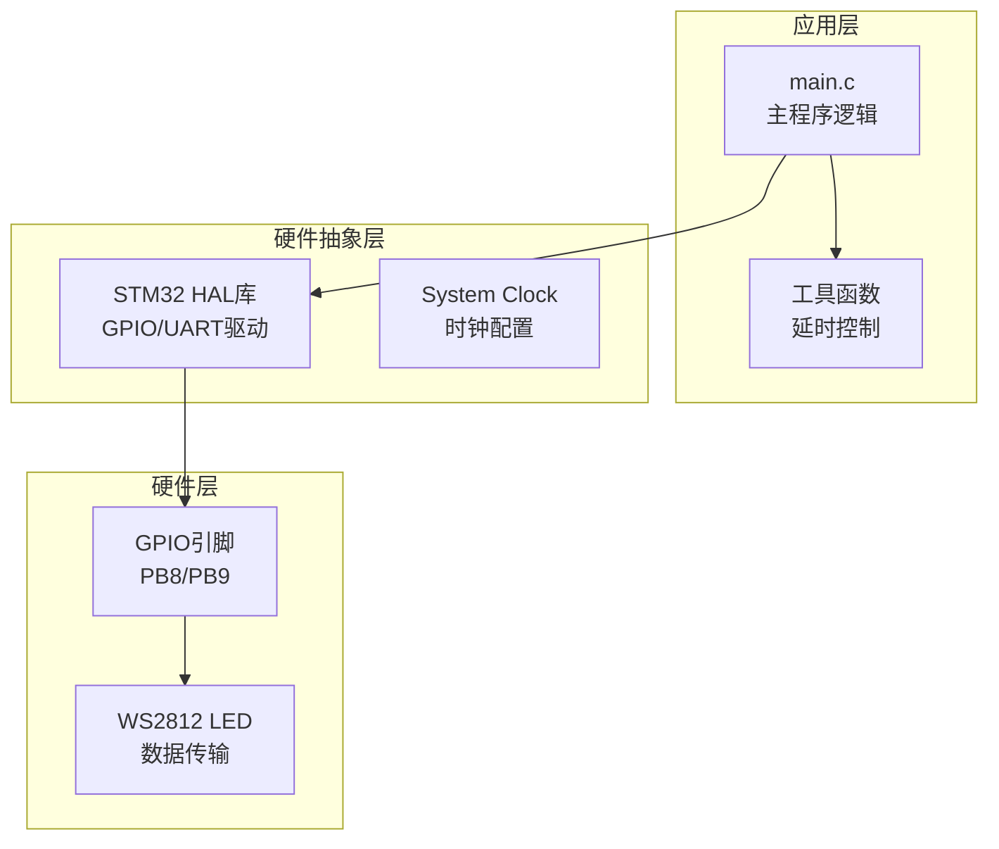
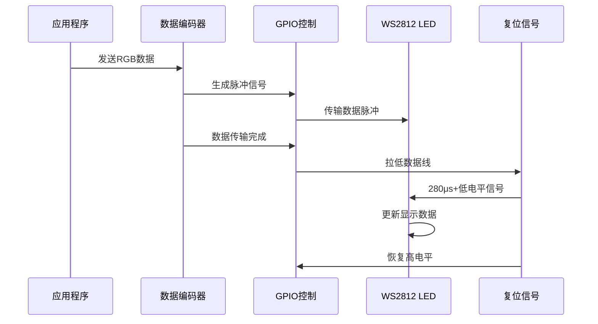
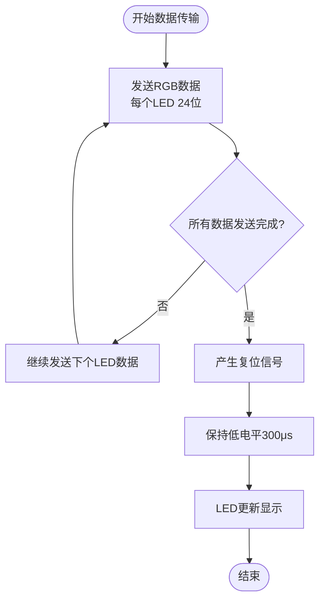
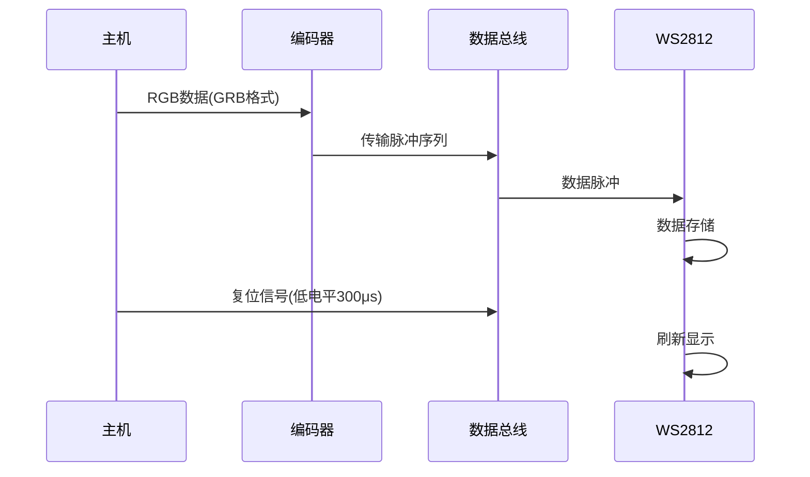
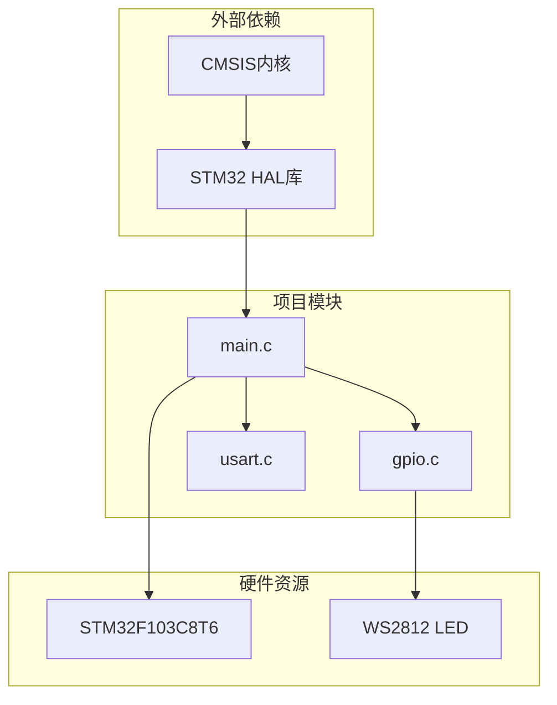

# 复位信号要求

<cite>
**本文档引用的文件**
- [main.c](file://Core/Src/main.c)
- [main.h](file://Core/Inc/main.h)
- [gpio.c](file://Core/Src/gpio.c)
- [usart.c](file://Core/Src/usart.c)
- [usart.h](file://Core/Inc/usart.h)
</cite>

## 目录
1. [简介](#简介)
2. [项目结构](#项目结构)
3. [核心组件](#核心组件)
4. [架构概览](#架构概览)
5. [详细组件分析](#详细组件分析)
6. [依赖关系分析](#依赖关系分析)
7. [性能考虑](#性能考虑)
8. [故障排除指南](#故障排除指南)
9. [结论](#结论)

## 简介

本文件针对WS2812 LED驱动器的复位信号要求进行深入技术分析。WS2812是一种集成了控制电路和RGB驱动功能的智能LED，通过单线串行接口接收数据。复位信号是WS2812通信协议中的关键要素，它标志着一次完整数据传输的结束，并触发LED芯片更新显示数据。

在本项目中，复位信号的时序要求严格遵循WS2812规范：低电平持续时间必须≥280微秒，实际实现中采用300微秒的延时以确保可靠性和容差。本文将详细解释复位信号的重要性、工作机制、时序要求、触发时机以及相关故障诊断方法。

## 项目结构

该项目基于STM32F103C8T6微控制器构建，采用HAL库进行外设管理。项目采用典型的分层架构设计：

**图表来源**
- [main.c](file://Core/Src/main.c#L373-L484)
- [gpio.c](file://Core/Src/gpio.c#L42-L89)

**章节来源**
- [main.c](file://Core/Src/main.c#L1-L592)
- [main.h](file://Core/Inc/main.h#L1-L79)

## 核心组件

### WS2812数据传输核心模块

项目实现了完整的WS2812数据传输功能，包括：

1. **精确延时控制**：基于72MHz系统时钟的微秒级精确延时函数
2. **数据编码**：将RGB数据转换为WS2812所需的脉冲宽度调制信号
3. **复位信号管理**：严格控制复位信号的时序和触发时机

### 复位信号实现机制

复位信号通过以下方式实现：
- 将数据线拉低至逻辑低电平
- 维持至少280微秒的低电平状态（实际实现为300微秒）
- 确保LED芯片有足够时间处理接收到的数据

**章节来源**
- [main.c](file://Core/Src/main.c#L107-L116)
- [main.c](file://Core/Src/main.c#L121-L146)

## 架构概览

**图表来源**
- [main.c](file://Core/Src/main.c#L150-L176)
- [main.c](file://Core/Src/main.c#L178-L215)

## 详细组件分析

### 复位信号时序分析

#### 时序要求详解

WS2812复位信号的关键参数：

| 参数 | 规范要求 | 实现值 | 说明 |
|------|----------|--------|------|
| 低电平持续时间 | ≥280μs | 300μs | 实际实现采用300μs确保可靠性 |
| 电压电平 | 低电平 | 0V | 逻辑低电平状态 |
| 上升沿时间 | ≤120ns | 实际值 | 快速上升沿 |
| 下降沿时间 | ≤120ns | 实际值 | 快速下降沿 |

#### 触发时机分析

复位信号必须在以下条件下触发：

1. **数据传输完成后**：所有LED的数据传输完毕
2. **最后一个比特发送后**：确保最后一个数据位已稳定
3. **无其他数据传输**：避免与其他数据传输冲突

#### 时序图展示

**图表来源**
- [main.c](file://Core/Src/main.c#L150-L176)
- [main.c](file://Core/Src/main.c#L178-L215)

### 数据编码与复位信号的关系

#### 数据传输流程

**图表来源**
- [main.c](file://Core/Src/main.c#L121-L146)
- [main.c](file://Core/Src/main.c#L150-L176)

#### 复位信号的作用机制

复位信号通过以下机制工作：

1. **电平转换**：将数据线从高电平强制拉低
2. **时间窗口**：维持特定的低电平时间窗口
3. **状态同步**：确保LED芯片内部状态机同步
4. **显示更新**：触发LED芯片更新显示缓冲区

**章节来源**
- [main.c](file://Core/Src/main.c#L121-L146)
- [main.c](file://Core/Src/main.c#L150-L176)

### 错误处理与故障诊断

#### 常见问题及解决方案

| 问题类型 | 症状表现 | 可能原因 | 解决方案 |
|----------|----------|----------|----------|
| 复位信号不足 | LED显示异常 | 延时时间过短 | 增加延时至300μs以上 |
| 时序不准确 | 颜色错误 | 脉冲宽度偏差 | 检查延时函数精度 |
| 干扰影响 | 闪烁或乱码 | 电磁干扰 | 改善PCB布线 |
| 电源纹波 | 显示不稳定 | 电源质量差 | 加装滤波电容 |

#### 测试验证方法

1. **示波器测试**：测量复位信号的脉宽和幅度
2. **逻辑分析仪**：验证时序精度
3. **LED显示测试**：观察实际显示效果
4. **多点测试**：在不同温度和电压下测试

**章节来源**
- [main.c](file://Core/Src/main.c#L173-L176)
- [main.c](file://Core/Src/main.c#L212-L215)

## 依赖关系分析

### 系统架构依赖

**图表来源**
- [main.c](file://Core/Src/main.c#L20-L30)
- [gpio.c](file://Core/Src/gpio.c#L42-L89)

### 关键依赖关系

1. **时钟系统依赖**：72MHz系统时钟为精确延时提供基础
2. **GPIO配置依赖**：PB8/PB9引脚配置影响信号质量
3. **HAL库依赖**：GPIO写入和延时函数的基础实现
4. **硬件平台依赖**：STM32F103C8T6的性能限制

**章节来源**
- [main.c](file://Core/Src/main.c#L390-L523)
- [gpio.c](file://Core/Src/gpio.c#L42-L89)

## 性能考虑

### 时序精度优化

1. **延时函数优化**：使用精确的微秒级延时函数
2. **指令流水线**：考虑处理器流水线对时序的影响
3. **编译器优化**：合理设置编译器优化级别
4. **中断影响**：避免中断对关键时序的干扰

### 资源使用分析

- **CPU占用**：复位信号期间CPU处于等待状态
- **内存使用**：主要使用栈空间存储临时变量
- **功耗考虑**：GPIO引脚在复位期间保持低电平状态

## 故障排除指南

### 复位信号问题诊断

#### 问题识别步骤

1. **观察LED行为**：记录具体的故障现象
2. **测量信号质量**：使用示波器检查时序
3. **分析代码执行**：确认复位信号是否被正确调用
4. **检查硬件连接**：验证PCB布线和电源质量

#### 常见故障现象

| 现象 | 可能原因 | 解决方案 |
|------|----------|----------|
| LED全亮或全灭 | 复位信号缺失 | 检查复位信号调用 |
| 颜色错误 | 数据编码错误 | 验证RGB数据格式 |
| 闪烁不定 | 时序不稳定 | 优化延时精度 |
| 部分LED失效 | 信号完整性差 | 改善PCB布线 |

#### 调试技巧

1. **分段测试**：分别测试单个LED和多个LED
2. **时序分析**：使用示波器捕获关键时序
3. **环境测试**：在不同温度和湿度下测试
4. **电源测试**：检查电源纹波和稳定性

**章节来源**
- [main.c](file://Core/Src/main.c#L526-L558)
- [main.c](file://Core/Src/main.c#L565-L574)

## 结论

WS2812复位信号是确保LED正常工作的关键要素。通过严格的时序控制（≥280μs，实际实现300μs）和正确的触发时机，可以确保LED芯片正确更新显示数据。本项目提供了可靠的复位信号实现方案，包括精确的延时控制、完整的数据传输流程和有效的故障诊断方法。

在实际应用中，建议：
1. 严格按照时序要求实现复位信号
2. 进行充分的测试验证
3. 注意PCB布线和电源质量
4. 建立完善的故障诊断流程

通过遵循这些指导原则，可以确保WS2812 LED系统的稳定可靠运行。