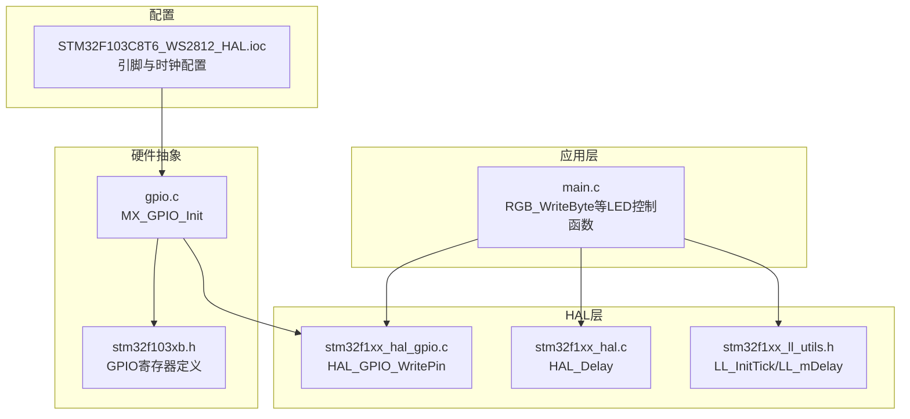
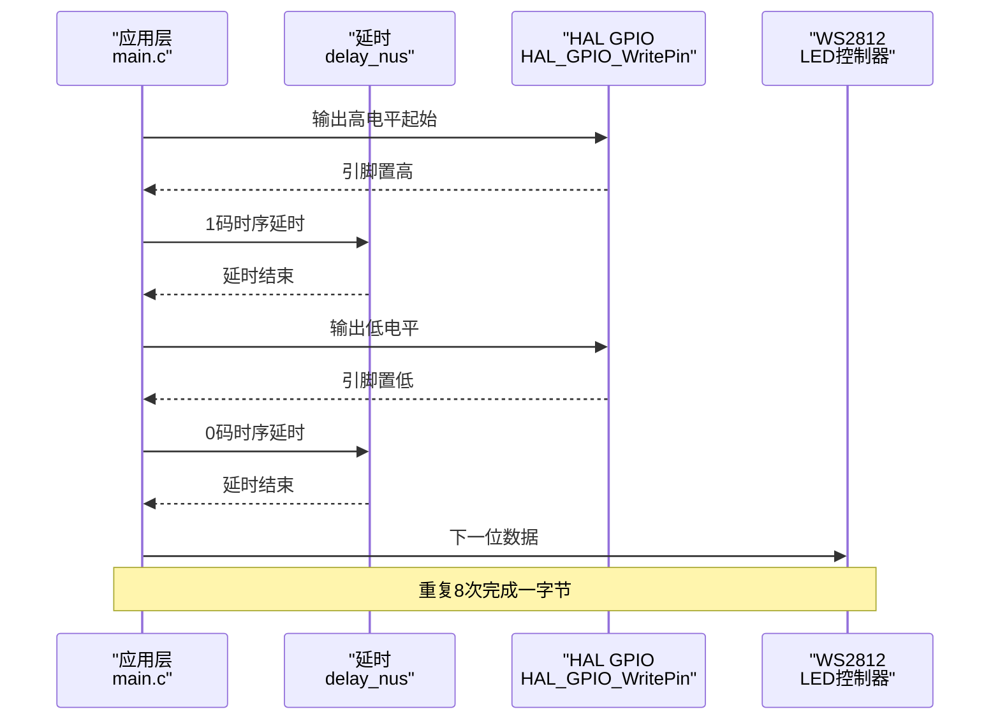
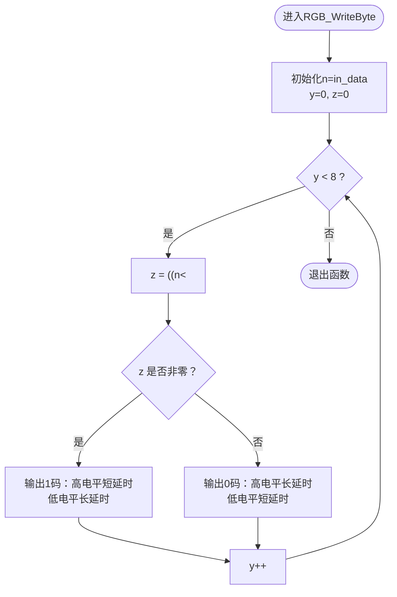
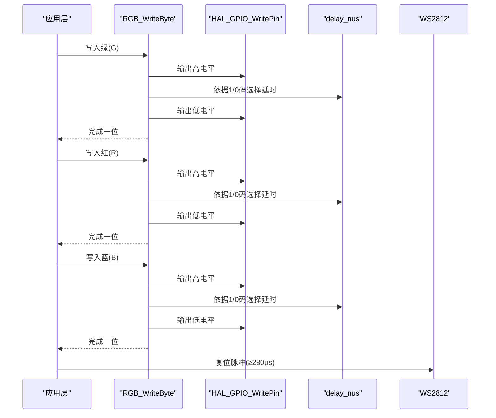
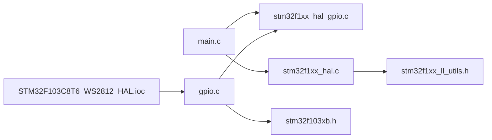

# 字节传输机制

<cite>
**本文引用的文件**
- [main.c](file://Core/Src/main.c)
- [gpio.c](file://Core/Src/gpio.c)
- [gpio.h](file://Core/Inc/gpio.h)
- [stm32f103xb.h](file://Drivers/CMSIS/Device/ST/STM32F1xx/Include/stm32f103xb.h)
- [stm32f1xx_hal_gpio.c](file://Drivers/STM32F1xx_HAL_Driver/Src/stm32f1xx_hal_gpio.c)
- [stm32f1xx_hal.c](file://Drivers/STM32F1xx_HAL_Driver/Src/stm32f1xx_hal.c)
- [stm32f1xx_hal_gpio.h](file://Drivers/STM32F1xx_HAL_Driver/Inc/stm32f1xx_hal_gpio.h)
- [stm32f1xx_ll_utils.h](file://Drivers/STM32F1xx_HAL_Driver/Inc/stm32f1xx_ll_utils.h)
- [STM32F103C8T6_WS2812_HAL.ioc](file://STM32F103C8T6_WS2812_HAL.ioc)
</cite>

## 目录
1. [简介](#简介)
2. [项目结构](#项目结构)
3. [核心组件](#核心组件)
4. [架构总览](#架构总览)
5. [详细组件分析](#详细组件分析)
6. [依赖关系分析](#依赖关系分析)
7. [性能考量](#性能考量)
8. [故障排查指南](#故障排查指南)
9. [结论](#结论)

## 简介
本技术文档围绕STM32F103C8T6平台上的WS2812 LED驱动实现，聚焦于RGB_WriteByte函数的逐位传输机制，系统性解析：
- 位操作细节：((n<<y)&0x80)如何逐位提取数据
- 1码与0码的时序差异与触发条件
- for循环中的位移与条件判断机制
- WS2812的位传输顺序与数据编码（GRB）
- 完整的数据传输流程与时序分析
- 严格时序控制的重要性与常见异常处理策略

## 项目结构
该项目基于STM32CubeMX生成的HAL工程，核心LED控制逻辑集中在main.c中，GPIO初始化位于gpio.c。CubeMX配置文件STM32F103C8T6_WS2812_HAL.ioc明确了PB8/PB9引脚作为WS2812输出，系统主频72MHz。

图表来源
- [main.c](file://Core/Src/main.c#L121-L146)
- [gpio.c](file://Core/Src/gpio.c#L42-L89)
- [stm32f1xx_hal_gpio.c](file://Drivers/STM32F1xx_HAL_Driver/Src/stm32f1xx_hal_gpio.c#L190-L210)
- [stm32f1xx_hal.c](file://Drivers/STM32F1xx_HAL_Driver/Src/stm32f1xx_hal.c#L371-L385)
- [stm32f1xx_ll_utils.h](file://Drivers/STM32F1xx_HAL_Driver/Inc/stm32f1xx_ll_utils.h#L218-L225)
- [stm32f103xb.h](file://Drivers/CMSIS/Device/ST/STM32F1xx/Include/stm32f103xb.h#L9096-L9484)
- [STM32F103C8T6_WS2812_HAL.ioc](file://STM32F103C8T6_WS2812_HAL.ioc#L71-L82)

章节来源
- [main.c](file://Core/Src/main.c#L121-L146)
- [gpio.c](file://Core/Src/gpio.c#L42-L89)
- [STM32F103C8T6_WS2812_HAL.ioc](file://STM32F103C8T6_WS2812_HAL.ioc#L71-L82)

## 核心组件
- RGB_WriteByte：逐位发送一个字节到WS2812，严格控制高低电平持续时间，决定1码/0码的识别
- delay_nus：基于CPU频率的微秒级精确延时，用于满足WS2812的时序要求
- HAL_GPIO_WritePin：底层GPIO电平控制
- MX_GPIO_Init：配置PB8/PB9为推挽输出，初始高电平，满足WS2812的空闲态要求

章节来源
- [main.c](file://Core/Src/main.c#L107-L116)
- [main.c](file://Core/Src/main.c#L121-L146)
- [gpio.c](file://Core/Src/gpio.c#L42-L89)

## 架构总览
WS2812数据链路从应用层的RGB_WriteByte开始，经HAL GPIO写入引脚，再由外部LED控制器解码为1码或0码。复位脉冲通过拉低引脚并延时实现，确保下一轮数据传输的正确性。

图表来源
- [main.c](file://Core/Src/main.c#L121-L146)
- [stm32f1xx_hal_gpio.c](file://Drivers/STM32F1xx_HAL_Driver/Src/stm32f1xx_hal_gpio.c#L190-L210)

## 详细组件分析

### RGB_WriteByte逐位传输机制
该函数负责将输入字节按位发送至WS2812，核心逻辑如下：
- 变量说明：n为输入字节；y为位索引（0~7）；z为临时结果，用于判断当前位是否为1
- 位提取：((n<<y)&0x80)将第y位左移到最高位，再与0x80进行按位与，得到非零（1）或零（0）
- 条件分支：
  - z非零：发送1码（高电平持续较短，随后低电平持续较长）
  - z为零：发送0码（高电平持续较长，随后低电平持续较短）
- 循环执行8次，完成一个字节的传输

图表来源
- [main.c](file://Core/Src/main.c#L121-L146)

章节来源
- [main.c](file://Core/Src/main.c#L121-L146)

### 位操作详解：((n<<y)&0x80)
- 左移(n<<y)：将n的第y位移动到最高位（bit7）
- 与0x80：0x80二进制为10000000，仅保留最高位
- 结果：若原n的第y位为1，则结果非零；否则为0

此方法用于从高位到低位逐位读取，符合WS2812的MSB优先编码规则。

章节来源
- [main.c](file://Core/Src/main.c#L127-L129)

### 1码与0码的时序差异
- 1码：高电平持续时间短，低电平持续时间长
- 0码：高电平持续时间长，低电平持续时间短
- 两种码型的区分完全依赖于高电平持续时间的相对长短，WS2812内部通过比较高低电平的相对比例来识别数据位

章节来源
- [main.c](file://Core/Src/main.c#L130-L144)

### for循环中的位移与条件判断
- y从0递增到7，确保按MSB到LSB顺序发送
- 每次迭代先进行位提取，再根据结果选择对应的时序路径
- 该顺序保证了WS2812接收端能正确解析每个bit

章节来源
- [main.c](file://Core/Src/main.c#L127-L145)

### WS2812位传输顺序与数据编码
- 数据编码：WS2812采用GRB顺序（绿-红-蓝），因此在写入RGB三通道时应按GRB顺序发送
- 复位脉冲：每帧数据发送完成后，需拉低引脚至少280μs，以触发WS2812更新显示

章节来源
- [main.c](file://Core/Src/main.c#L151-L176)
- [main.c](file://Core/Src/main.c#L179-L215)
- [main.c](file://Core/Src/main.c#L219-L248)
- [main.c](file://Core/Src/main.c#L350-L365)

### 完整数据传输流程与时序分析
- 单灯设置：遍历所有灯珠，目标灯珠写入指定颜色（GRB），其余写入黑色；最后发送复位脉冲
- 多灯同色：遍历所有灯珠，目标灯珠写入指定颜色（GRB），其余写入黑色；最后发送复位脉冲
- 多灯异色：遍历所有灯珠，目标灯珠写入指定颜色（GRB），其余写入黑色；最后发送复位脉冲
- 复位脉冲：拉低引脚至少300μs，确保WS2812完成数据刷新

图表来源
- [main.c](file://Core/Src/main.c#L151-L176)
- [main.c](file://Core/Src/main.c#L179-L215)
- [main.c](file://Core/Src/main.c#L219-L248)
- [main.c](file://Core/Src/main.c#L350-L365)

### 严格时序控制的重要性
- WS2812对高低电平持续时间的相对比例敏感，微秒级精度的延时直接影响数据识别
- 主频72MHz下，delay_nus通过循环NOP近似实现us级延时，确保1码与0码的时序边界稳定
- 复位脉冲的持续时间必须满足最小阈值，否则WS2812不会更新显示

章节来源
- [main.c](file://Core/Src/main.c#L107-L116)
- [main.c](file://Core/Src/main.c#L174-L175)
- [main.c](file://Core/Src/main.c#L213-L214)
- [main.c](file://Core/Src/main.c#L245-L246)
- [main.c](file://Core/Src/main.c#L361-L362)

## 依赖关系分析
- 应用层依赖HAL GPIO写引脚与HAL延时
- HAL层依赖底层LL工具初始化SysTick，提供毫秒级延时
- GPIO初始化配置PB8/PB9为推挽输出，初始高电平，满足WS2812空闲态要求

图表来源
- [main.c](file://Core/Src/main.c#L121-L146)
- [stm32f1xx_hal_gpio.c](file://Drivers/STM32F1xx_HAL_Driver/Src/stm32f1xx_hal_gpio.c#L190-L210)
- [stm32f1xx_hal.c](file://Drivers/STM32F1xx_HAL_Driver/Src/stm32f1xx_hal.c#L371-L385)
- [stm32f1xx_ll_utils.h](file://Drivers/STM32F1xx_HAL_Driver/Inc/stm32f1xx_ll_utils.h#L218-L225)
- [gpio.c](file://Core/Src/gpio.c#L42-L89)
- [stm32f103xb.h](file://Drivers/CMSIS/Device/ST/STM32F1xx/Include/stm32f103xb.h#L9096-L9484)
- [STM32F103C8T6_WS2812_HAL.ioc](file://STM32F103C8T6_WS2812_HAL.ioc#L71-L82)

章节来源
- [main.c](file://Core/Src/main.c#L121-L146)
- [gpio.c](file://Core/Src/gpio.c#L42-L89)
- [stm32f1xx_hal.c](file://Drivers/STM32F1xx_HAL_Driver/Src/stm32f1xx_hal.c#L371-L385)
- [stm32f1xx_ll_utils.h](file://Drivers/STM32F1xx_HAL_Driver/Inc/stm32f1xx_ll_utils.h#L218-L225)
- [STM32F103C8T6_WS2812_HAL.ioc](file://STM32F103C8T6_WS2812_HAL.ioc#L71-L82)

## 性能考量
- 主频72MHz下，delay_nus的精度受指令周期影响，建议使用更高精度的定时器或DMA配合实现更稳定的us级延时
- 复位脉冲的延时固定为300μs，确保WS2812可靠更新
- 多灯异色场景下，RGB_WriteByte被频繁调用，注意避免系统抖动导致的时序偏差

[本节为通用性能讨论，不直接分析具体文件]

## 故障排查指南
- 现象：LED显示异常或颜色错乱
  - 排查：确认WS2812数据编码顺序为GRB；检查RGB_WriteByte的1/0码时序是否正确
- 现象：部分LED不亮或闪烁
  - 排查：检查复位脉冲持续时间是否达到≥280μs；确认PB8/PB9引脚初始化为推挽输出且初始状态为高电平
- 现象：多灯异色时出现错位
  - 排查：核对遍历所有灯珠时的写入顺序与索引一致性；确保每次写入后及时发送复位脉冲

章节来源
- [main.c](file://Core/Src/main.c#L151-L176)
- [main.c](file://Core/Src/main.c#L179-L215)
- [main.c](file://Core/Src/main.c#L219-L248)
- [main.c](file://Core/Src/main.c#L350-L365)
- [gpio.c](file://Core/Src/gpio.c#L42-L89)

## 结论
RGB_WriteByte通过((n<<y)&0x80)实现MSB优先的逐位提取，并结合delay_nus提供的微秒级延时，严格控制1码与0码的时序边界，从而实现WS2812的可靠数据传输。配合GRB编码与复位脉冲，可稳定驱动多灯异色显示。在实际部署中，建议进一步优化延时精度与错误处理，确保复杂场景下的稳定性。