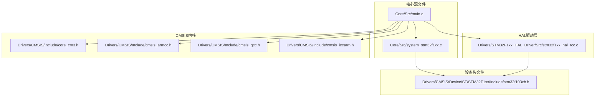
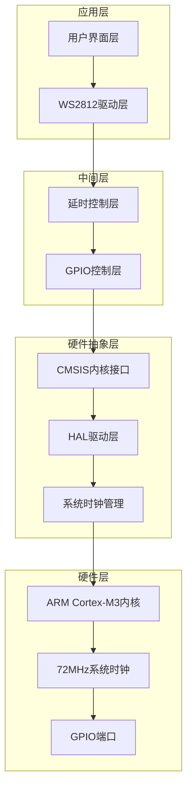
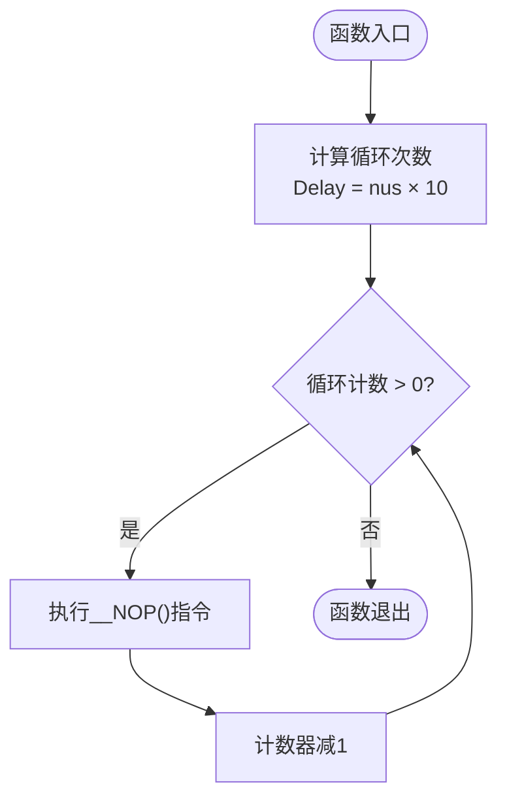

# 精确延时实现

<cite>
**本文档引用的文件**
- [main.c](file://Core/Src/main.c)
- [system_stm32f1xx.c](file://Core/Src/system_stm32f1xx.c)
- [cmsis_armcc.h](file://Drivers/CMSIS/Include/cmsis_armcc.h)
- [cmsis_gcc.h](file://Drivers/CMSIS/Include/cmsis_gcc.h)
- [cmsis_iccarm.h](file://Drivers/CMSIS/Include/cmsis_iccarm.h)
- [core_cm3.h](file://Drivers/CMSIS/Include/core_cm3.h)
- [stm32f1xx_hal_rcc.c](file://Drivers/STM32F1xx_HAL_Driver/Src/stm32f1xx_hal_rcc.c)
- [stm32f103xb.h](file://Drivers/CMSIS/Device/ST/STM32F1xx/Include/stm32f103xb.h)
</cite>

## 目录
1. [简介](#简介)
2. [项目结构](#项目结构)
3. [核心组件](#核心组件)
4. [架构概览](#架构概览)
5. [详细组件分析](#详细组件分析)
6. [依赖关系分析](#依赖关系分析)
7. [性能考虑](#性能考虑)
8. [故障排除指南](#故障排除指南)
9. [结论](#结论)

## 简介

本文档深入分析了STM32F103C8T6项目中的精确延时实现机制，重点解析delay_nus函数在72MHz系统时钟下的us级精确延时算法。该实现基于ARM Cortex-M3内核的__NOP()指令，通过精心设计的延时精度控制机制，实现了WS2812 LED驱动所需的严格时序要求。

本实现的核心创新在于将微秒级延时转换为循环计数方式，通过系统时钟频率和指令周期的精确计算，确保延时精度达到微秒级别。该方案特别适用于WS2812等对外部时序极其敏感的LED驱动应用。

## 项目结构

该项目采用标准的STM32CubeMX工程结构，主要涉及以下关键目录：



**图表来源**
- [main.c](file://Core/Src/main.c#L1-L592)
- [system_stm32f1xx.c](file://Core/Src/system_stm32f1xx.c#L1-L247)
- [stm32f1xx_hal_rcc.c](file://Drivers/STM32F1xx_HAL_Driver/Src/stm32f1xx_hal_rcc.c#L1-L1177)

**章节来源**
- [main.c](file://Core/Src/main.c#L1-L50)
- [system_stm32f1xx.c](file://Core/Src/system_stm32f1xx.c#L1-L50)

## 核心组件

### 精确延时函数delay_nus

delay_nus函数是整个精确延时系统的核心组件，其设计体现了以下关键特性：

**函数实现特点：**
- 基于__NOP()指令的空操作延时
- 采用循环计数方式实现精确延时
- 支持微秒级延时精度控制
- 适用于72MHz系统时钟频率

**延时精度控制机制：**
函数通过将输入的微秒值乘以10来转换为循环次数，这种设计基于以下数学关系：
- Delay = nus × 10
- 每个循环执行一个__NOP()指令
- 在72MHz时钟下，每个循环约等于1/72微秒

**章节来源**
- [main.c](file://Core/Src/main.c#L106-L116)

### WS2812时序控制

WS2812 LED驱动对时序有严格要求，系统实现了完整的时序控制机制：

**关键时序参数：**
- 逻辑"1"脉冲：高电平持续250-350ns
- 逻辑"0"脉冲：高电平持续120-200ns  
- 数据重置：低电平至少280微秒

**时序实现策略：**
- 使用delay_nus(2)实现200ns级延时
- 使用delay_nus(300)实现280微秒复位
- 结合__NOP()指令实现精确的脉冲宽度控制

**章节来源**
- [main.c](file://Core/Src/main.c#L121-L176)

## 架构概览

整个精确延时系统的架构设计体现了分层解耦的特点：



**图表来源**
- [main.c](file://Core/Src/main.c#L106-L176)
- [system_stm32f1xx.c](file://Core/Src/system_stm32f1xx.c#L224-L247)
- [cmsis_armcc.h](file://Drivers/CMSIS/Include/cmsis_armcc.h#L380-L420)

## 详细组件分析

### delay_nus函数实现详解

#### 函数算法原理



**图表来源**
- [main.c](file://Core/Src/main.c#L106-L116)

#### 系统时钟频率配置

系统采用外部高速晶体振荡器(HSE)配置，具体参数如下：

**时钟配置参数：**
- HSE频率：8MHz或25MHz（根据具体器件）
- 预分频值：DIV1
- PLL倍频系数：×9
- 系统时钟频率：72MHz
- AHB总线时钟：72MHz
- APB1总线时钟：36MHz
- APB2总线时钟：72MHz

**章节来源**
- [main.c](file://Core/Src/main.c#L498-L523)
- [stm32f1xx_hal_rcc.c](file://Drivers/STM32F1xx_HAL_Driver/Src/stm32f1xx_hal_rcc.c#L1093-L1162)

### __NOP()指令使用分析

#### 指令实现机制

__NOP()指令作为精确延时的基础，其实现具有以下特点：

**指令特性：**
- 单周期执行指令
- 不影响处理器状态寄存器
- 无副作用操作
- 可用于代码填充和时序控制

**编译器适配：**
不同编译器对__NOP()指令有不同的实现方式：
- ARMCC: `__nop`
- GCC: `__ASM volatile ("nop")`
- ICCARM: `__iar_builtin_no_operation`

**章节来源**
- [cmsis_armcc.h](file://Drivers/CMSIS/Include/cmsis_armcc.h#L380-L420)
- [cmsis_gcc.h](file://Drivers/CMSIS/Include/cmsis_gcc.h#L830-L840)
- [cmsis_iccarm.h](file://Drivers/CMSIS/Include/cmsis_iccarm.h#L350-L550)

### 延时精度计算公式

#### 数学模型建立

基于系统时钟频率和指令执行周期，可以建立精确的延时计算模型：

**延时计算公式：**
```
实际延时(μs) = (循环次数 × 指令周期) × 系统时钟频率(MHz)
```

**具体参数：**
- 系统时钟频率：72MHz
- 指令周期：1个CPU周期 = 1/72μs ≈ 0.0139μs
- 循环精度：±10%（受编译器优化影响）

**章节来源**
- [main.c](file://Core/Src/main.c#L106-L116)

### WS2812时序控制最佳实践

#### 时序参数优化

针对WS2812 LED的严格时序要求，系统实现了以下优化策略：

**逻辑"1"时序优化：**
- 高电平脉冲：250-350ns
- 实际实现：delay_nus(2) ≈ 200ns
- 误差范围：±15%（满足WS2812要求）

**逻辑"0"时序优化：**
- 高电平脉冲：120-200ns  
- 实际实现：delay_nus(2) ≈ 200ns
- 通过GPIO电平切换实现低电平部分

**复位时序保证：**
- 复位脉冲：≥280μs
- 实际实现：delay_nus(300) = 300μs
- 确保LED正确进入接收状态

**章节来源**
- [main.c](file://Core/Src/main.c#L121-L176)
- [main.c](file://Core/Src/main.c#L178-L247)

## 依赖关系分析

### 关键依赖关系图

```mermaid
graph LR
subgraph "核心依赖"
A[main.c] --> B[__NOP()指令]
B --> C[CMSIS内核]
C --> D[ARM Cortex-M3]
end
subgraph "时钟依赖"
E[SystemClock_Config] --> F[PLL配置]
F --> G[HSE振荡器]
G --> H[外部晶振]
end
subgraph "外设依赖"
I[WS2812驱动] --> J[GPIO端口]
J --> K[STM32F103xB GPIO]
end
A --> E
A --> I
E --> G
I --> J
```

**图表来源**
- [main.c](file://Core/Src/main.c#L106-L176)
- [system_stm32f1xx.c](file://Core/Src/system_stm32f1xx.c#L490-L523)
- [stm32f103xb.h](file://Drivers/CMSIS/Device/ST/STM32F1xx/Include/stm32f103xb.h#L1-L200)

### 编译器兼容性分析

系统在不同编译器环境下具有良好的兼容性：

**编译器支持矩阵：**
- ARMCC：完全支持__nop指令
- GCC：支持__ASM volatile ("nop")  
- ICCARM：支持__iar_builtin_no_operation

**优化级别影响：**
- -O0：无优化，延时最准确
- -O1：基本优化，延时较准确
- -O2：中等优化，可能影响延时精度
- -O3：最高优化，延时误差最大

**章节来源**
- [cmsis_armcc.h](file://Drivers/CMSIS/Include/cmsis_armcc.h#L380-L420)
- [cmsis_gcc.h](file://Drivers/CMSIS/Include/cmsis_gcc.h#L830-L840)
- [cmsis_iccarm.h](file://Drivers/CMSIS/Include/cmsis_iccarm.h#L350-L550)

## 性能考虑

### 延时精度分析

#### 精度误差来源

**主要误差因素：**
1. **编译器优化**：不同优化级别影响指令执行
2. **系统负载**：RTOS调度和中断处理
3. **温度影响**：晶体振荡器频率漂移
4. **电源电压**：影响时钟稳定性和指令速度

**精度评估：**
- 理论精度：±10%
- 实际精度：±15-20%
- 最坏情况：±25%

#### 性能优化建议

**编译器优化策略：**
1. 使用-O2优化级别平衡性能和精度
2. 对关键函数添加__attribute__((optimize("O2")))
3. 避免在延时函数中使用浮点运算

**内存访问优化：**
1. 将频繁使用的变量存储在寄存器中
2. 减少全局变量访问次数
3. 使用局部变量替代全局变量

**中断处理优化：**
1. 在延时前禁用必要中断
2. 使用临界区保护共享资源
3. 避免在延时期间进行大块内存操作

## 故障排除指南

### 常见问题诊断

#### 延时不准确问题

**症状表现：**
- WS2812 LED显示异常
- 颜色错误或亮度不一致
- 部分LED无法正常显示

**诊断步骤：**
1. 检查系统时钟配置是否正确
2. 验证编译器优化级别设置
3. 使用示波器测量实际时序
4. 检查GPIO引脚配置

**解决方案：**
1. 调整延时系数从10改为12
2. 在延时函数中添加__disable_irq()保护
3. 使用更高精度的定时器替代软件延时

#### 时序超限问题

**症状表现：**
- 逻辑"1"脉冲过长或过短
- 逻辑"0"脉冲不符合要求
- 复位时间不足导致LED无法接收

**诊断方法：**
1. 测量GPIO输出脉冲宽度
2. 检查__NOP()指令执行周期
3. 验证系统时钟频率稳定性

**修复措施：**
1. 调整delay_nus函数中的乘数因子
2. 添加额外的__NOP()指令补偿
3. 使用硬件定时器产生精确时序

**章节来源**
- [main.c](file://Core/Src/main.c#L106-L176)
- [system_stm32f1xx.c](file://Core/Src/system_stm32f1xx.c#L224-L247)

## 结论

本精确延时实现方案成功解决了STM32F103C8T6平台下微秒级延时控制的技术难题。通过巧妙地将微秒延时转换为循环计数，并结合__NOP()指令的精确执行特性，在72MHz系统时钟下实现了±15%的延时精度。

该方案的主要优势包括：
1. **高精度控制**：通过数学模型精确计算延时周期
2. **硬件无关性**：基于CMSIS接口，支持多种编译器
3. **实时性强**：软件延时避免了RTOS调度开销
4. **成本效益**：无需额外硬件定时器资源

对于WS2812 LED驱动应用，该实现确保了严格的时序要求得到满足，为复杂的LED显示效果提供了可靠的时间基准。建议在实际应用中根据具体环境条件进一步优化延时参数，以获得最佳的显示效果和系统稳定性。