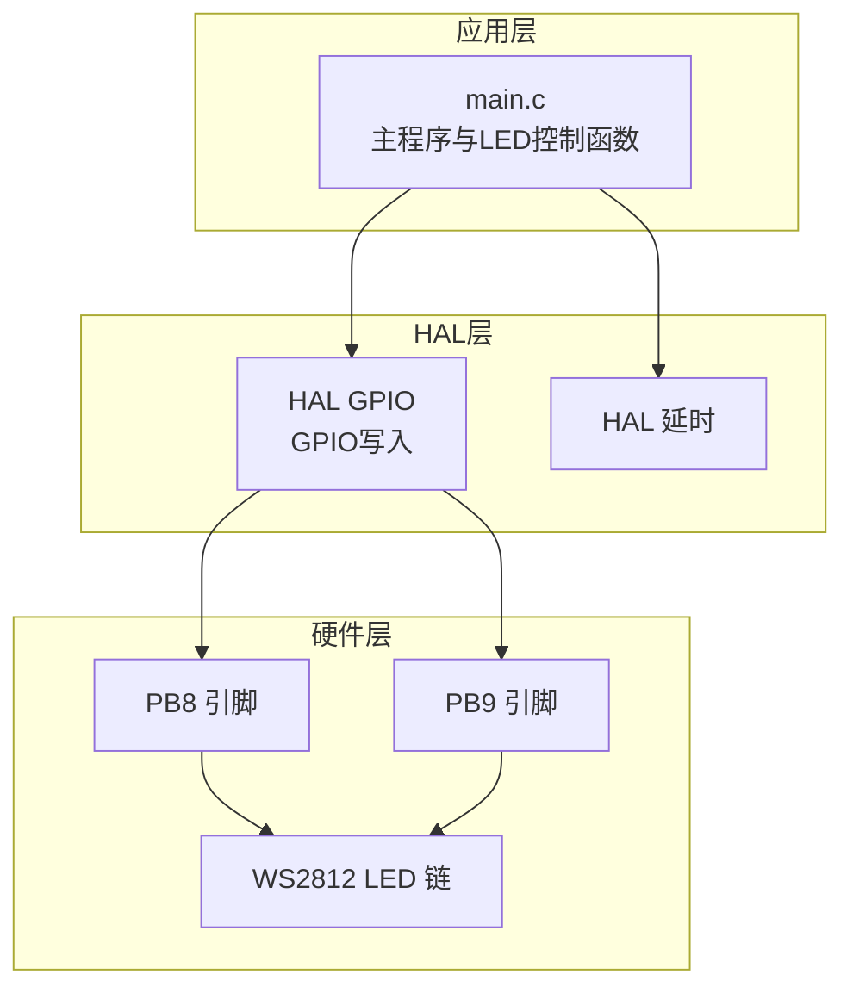
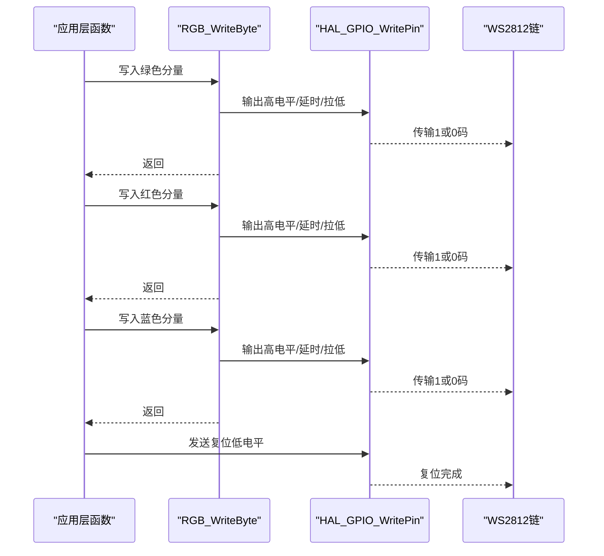
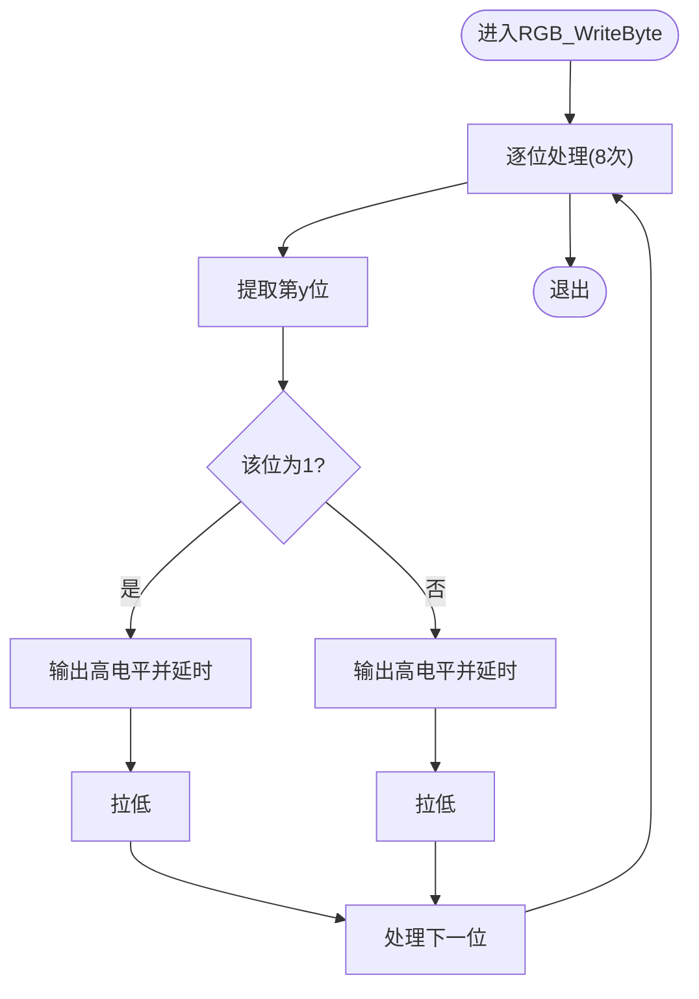
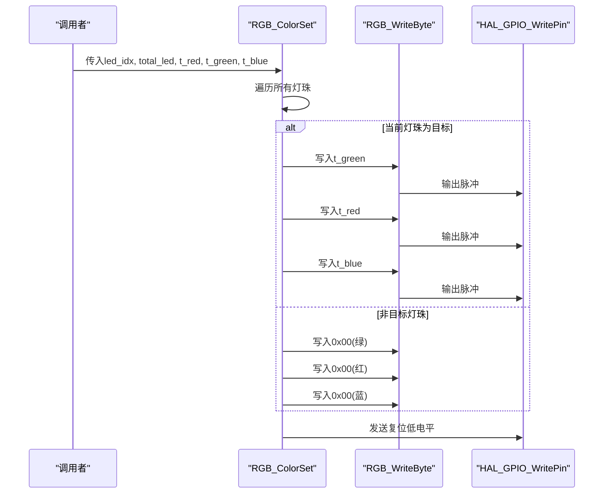
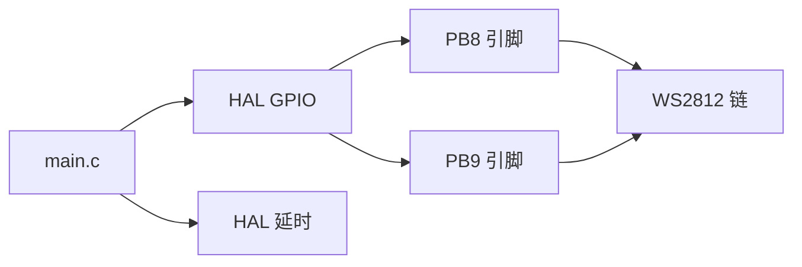

# 颜色通道顺序

<cite>
**本文引用的文件**
- [Core/Src/main.c](file://Core/Src/main.c)
- [Core/Inc/main.h](file://Core/Inc/main.h)
- [STM32F103C8T6_WS2812_HAL.ioc](file://STM32F103C8T6_WS2812_HAL.ioc)
</cite>

## 目录
1. [简介](#简介)
2. [项目结构](#项目结构)
3. [核心组件](#核心组件)
4. [架构总览](#架构总览)
5. [详细组件分析](#详细组件分析)
6. [依赖关系分析](#依赖关系分析)
7. [性能考量](#性能考量)
8. [故障排查指南](#故障排查指南)
9. [结论](#结论)
10. [附录](#附录)

## 简介
本技术文档聚焦于WS2812 LED驱动中的颜色通道顺序问题，系统阐述WS2812采用的GRB（Green-Red-Blue）顺序与计算机图形学中常见的RGB顺序之间的差异，并基于项目源码解析RGB_ColorSet函数中颜色写入顺序：RGB_WriteByte(t_green)、RGB_WriteByte(t_red)、RGB_WriteByte(t_blue)。文档还解释了WS2812为何使用GRB顺序的设计原因，提供颜色转换的完整示例与验证方法，说明不同LED芯片的通道顺序差异与兼容性考虑，给出颜色准确性测试与校准方法，并进行颜色显示效果的对比分析与优化建议。

## 项目结构
该项目围绕STM32F103C8T6微控制器构建，通过HAL库驱动GPIO输出WS2812所需的单总线时序，实现多灯珠的彩色显示。关键文件与职责如下：
- Core/Src/main.c：主程序与LED驱动逻辑，包括RGB_WriteByte、RGB_ColorSet、RGB_MultiSameColorSet、RGB_MultiDiffColorSet、RGB_RainbowScroll、RGB_Scroll_Gradient等函数。
- Core/Inc/main.h：外设引脚定义与公共常量声明。
- STM32F103C8T6_WS2812_HAL.ioc：CubeMX配置文件，描述MCU引脚分配、时钟与外设配置。

图表来源
- [Core/Src/main.c](file://Core/Src/main.c#L107-L176)
- [Core/Inc/main.h](file://Core/Inc/main.h#L60-L68)
- [STM32F103C8T6_WS2812_HAL.ioc](file://STM32F103C8T6_WS2812_HAL.ioc#L71-L82)

章节来源
- [Core/Src/main.c](file://Core/Src/main.c#L107-L176)
- [Core/Inc/main.h](file://Core/Inc/main.h#L60-L68)
- [STM32F103C8T6_WS2812_HAL.ioc](file://STM32F103C8T6_WS2812_HAL.ioc#L71-L82)

## 核心组件
- RGB_WriteByte：按WS2812时序规范写入一个字节的数据，内部通过GPIO高低电平与精确延时模拟“0码/1码”脉冲宽度。
- RGB_ColorSet：针对单个灯珠设置颜色，严格按GRB顺序写入，随后发送复位信号。
- RGB_MultiSameColorSet：批量设置相同颜色到多个灯珠，同样遵循GRB顺序。
- RGB_MultiDiffColorSet：为每个灯珠设置不同颜色，按GRB顺序写入。
- RGB_RainbowScroll / RGB_Scroll_Gradient：基于HSV色彩模型生成渐变滚动效果，最终仍以GRB顺序写入WS2812。
- HSVtoRGB：将HSV色彩空间转换为RGB，供渐变效果使用。

章节来源
- [Core/Src/main.c](file://Core/Src/main.c#L121-L176)
- [Core/Src/main.c](file://Core/Src/main.c#L178-L215)
- [Core/Src/main.c](file://Core/Src/main.c#L218-L248)
- [Core/Src/main.c](file://Core/Src/main.c#L284-L309)

## 架构总览
WS2812数据帧由三部分组成：起始低电平复位信号、24位像素数据（每通道8位）、再次低电平复位信号。WS2812内部寄存器接收顺序为G-R-B，因此主机侧写入顺序必须与之匹配，即先绿、再红、后蓝。

图表来源
- [Core/Src/main.c](file://Core/Src/main.c#L121-L176)

## 详细组件分析

### RGB_WriteByte：WS2812时序实现
- 功能：将8位数据逐位写入，依据位值输出不同宽度的高电平脉冲，形成“0码/1码”。
- 关键点：通过精确延时控制脉冲宽度，满足WS2812对“0码”和“1码”的时序要求；使用HAL_GPIO_WritePin驱动GPIO。
- 性能：该函数在多处被调用，是影响整体刷新速率的关键路径。

图表来源
- [Core/Src/main.c](file://Core/Src/main.c#L121-L146)

章节来源
- [Core/Src/main.c](file://Core/Src/main.c#L121-L146)

### RGB_ColorSet：单灯颜色写入（GRB顺序）
- 功能：为目标灯珠写入指定颜色，非目标灯珠写入黑色；最后发送复位信号。
- 关键点：颜色写入顺序为RGB_WriteByte(t_green)、RGB_WriteByte(t_red)、RGB_WriteByte(t_blue)，严格匹配WS2812内部寄存器接收顺序。
- 兼容性：若上层传入的是RGB顺序，则此处会将其转换为GRB，从而保证LED显示正确。

图表来源
- [Core/Src/main.c](file://Core/Src/main.c#L150-L176)

章节来源
- [Core/Src/main.c](file://Core/Src/main.c#L150-L176)

### RGB_MultiSameColorSet：多灯同色（GRB顺序）
- 功能：将相同颜色写入多个指定灯珠。
- 关键点：颜色写入顺序为RGB_WriteByte(t_green)、RGB_WriteByte(t_red)、RGB_WriteByte(t_blue)，与单灯一致。

章节来源
- [Core/Src/main.c](file://Core/Src/main.c#L178-L215)

### RGB_MultiDiffColorSet：多灯异色（GRB顺序）
- 功能：为每个灯珠设置不同颜色。
- 关键点：按GRB顺序写入，目标灯珠使用其颜色，非目标灯珠使用黑色。

章节来源
- [Core/Src/main.c](file://Core/Src/main.c#L218-L248)

### HSVtoRGB与渐变滚动：颜色生成与写入
- 功能：HSVtoRGB将色相、饱和度、明度转换为RGB，RGB_RainbowScroll与RGB_Scroll_Gradient生成滚动渐变效果。
- 关键点：最终写入仍遵循GRB顺序，确保LED显示符合预期。

章节来源
- [Core/Src/main.c](file://Core/Src/main.c#L284-L309)
- [Core/Src/main.c](file://Core/Src/main.c#L312-L348)

## 依赖关系分析
- 应用层函数依赖HAL GPIO写入与延时函数，确保WS2812时序精度。
- 引脚配置来自CubeMX，PB8/PB9分别作为两路LED输出引脚。
- 不同LED芯片可能有不同的通道顺序，WS2812采用GRB，需在软件层进行顺序适配。

图表来源
- [Core/Src/main.c](file://Core/Src/main.c#L107-L176)
- [Core/Inc/main.h](file://Core/Inc/main.h#L60-L68)
- [STM32F103C8T6_WS2812_HAL.ioc](file://STM32F103C8T6_WS2812_HAL.ioc#L71-L82)

章节来源
- [Core/Src/main.c](file://Core/Src/main.c#L107-L176)
- [Core/Inc/main.h](file://Core/Inc/main.h#L60-L68)
- [STM32F103C8T6_WS2812_HAL.ioc](file://STM32F103C8T6_WS2812_HAL.ioc#L71-L82)

## 性能考量
- 时序精度：RGB_WriteByte通过精确延时控制脉冲宽度，确保“0码/1码”满足WS2812要求。
- 刷新速率：多灯异色场景下，RGB_MultiDiffColorSet遍历所有灯珠并逐位写入，整体耗时与灯珠数量成正比。
- 复位信号：每次写入后发送复位低电平，确保WS2812接收下一帧数据。
- 优化建议：
  - 在不牺牲时序的前提下，尽量减少不必要的延时调用。
  - 对于大量灯珠的应用，可考虑DMA或更高频率的时钟配置（需评估WS2812时序余量）。
  - 合理安排刷新频率，避免过高的刷新导致系统抖动。

[本节为通用性能讨论，无需列出具体文件来源]

## 故障排查指南
- 现象：LED显示颜色异常（如绿红颠倒、亮度不足）
  - 排查：确认上层传入的颜色参数顺序是否与GRB顺序匹配；检查RGB_WriteByte时序是否稳定。
- 现象：部分灯珠不亮或显示错误
  - 排查：检查RGB_MultiSameColorSet/RGB_MultiDiffColorSet中是否按GRB顺序写入；确认复位信号持续时间是否满足≥280μs。
- 现象：多灯异色时出现串扰
  - 排查：确保RGB_WriteByte的延时与GPIO切换之间无竞争；检查引脚配置与上拉状态。

章节来源
- [Core/Src/main.c](file://Core/Src/main.c#L150-L176)
- [Core/Src/main.c](file://Core/Src/main.c#L178-L215)
- [Core/Src/main.c](file://Core/Src/main.c#L218-L248)

## 结论
WS2812采用GRB通道顺序，这是由其内部寄存器接收顺序决定的。项目通过RGB_WriteByte实现严格的时序控制，并在RGB_ColorSet、RGB_MultiSameColorSet、RGB_MultiDiffColorSet等函数中严格遵循GRB顺序写入，确保LED显示与预期一致。对于其他LED芯片，若其寄存器接收顺序不同，应在软件层进行相应的顺序适配。通过HSV色彩模型生成的渐变效果也遵循同样的GRB写入策略，最终实现稳定的彩色显示。

[本节为总结性内容，无需列出具体文件来源]

## 附录

### 颜色通道顺序差异与兼容性
- WS2812：GRB顺序（绿-红-蓝）
- 常见RGB顺序：红-绿-蓝
- 兼容性建议：
  - 若上层使用RGB顺序，需在写入前进行顺序转换（如本项目在RGB_ColorSet中将t_red/t_green/t_blue按GRB顺序写入）。
  - 对于其他LED芯片，查阅其手册确认寄存器接收顺序，必要时在软件层进行适配。

章节来源
- [Core/Src/main.c](file://Core/Src/main.c#L150-L176)
- [Core/Src/main.c](file://Core/Src/main.c#L178-L215)
- [Core/Src/main.c](file://Core/Src/main.c#L218-L248)

### 颜色转换示例与验证方法
- 示例思路：
  - 输入：上层RGB颜色值（r, g, b）
  - 转换：在写入时按GRB顺序写入，即先写入g，再写入r，最后写入b
  - 验证：使用已知颜色（如纯红、纯绿、纯蓝）观察LED实际显示，与预期对比
- 验证步骤：
  - 单灯测试：调用RGB_ColorSet设置单一颜色，观察显示是否与输入一致
  - 多灯测试：调用RGB_MultiSameColorSet设置多个灯珠相同颜色
  - 异色测试：调用RGB_MultiDiffColorSet设置不同颜色，核对每个位置的颜色
  - 渐变测试：调用RGB_RainbowScroll或RGB_Scroll_Gradient，观察滚动效果与颜色过渡

章节来源
- [Core/Src/main.c](file://Core/Src/main.c#L150-L176)
- [Core/Src/main.c](file://Core/Src/main.c#L178-L215)
- [Core/Src/main.c](file://Core/Src/main.c#L218-L248)
- [Core/Src/main.c](file://Core/Src/main.c#L284-L309)
- [Core/Src/main.c](file://Core/Src/main.c#L312-L348)

### 颜色准确性测试与校准
- 测试工具：使用标准色卡或已知RGB值的显示器作为参考
- 方法：
  - 选择固定RGB值（如(255,0,0)、(0,255,0)、(0,0,255)），在不同温度、电压条件下测量LED显示
  - 记录偏差，必要时对上层颜色输入进行比例调整（增益校正）
- 校准建议：
  - 建立设备特定的查找表或系数，将理论RGB映射到实际显示
  - 对于多批次LED，分别建立校准曲线

[本节为通用测试与校准方法，无需列出具体文件来源]

### 显示效果对比与优化建议
- 对比分析：
  - 使用相同HSV参数生成渐变，观察不同LED批次的色彩一致性
  - 对比单灯与多灯场景下的亮度表现，识别是否存在串扰或功耗差异
- 优化建议：
  - 减少不必要的颜色重复写入，提升刷新效率
  - 在保证时序的前提下，优化延时函数，缩短整体刷新周期
  - 对于高密度LED阵列，考虑降低刷新频率或分段刷新策略

[本节为通用优化建议，无需列出具体文件来源]