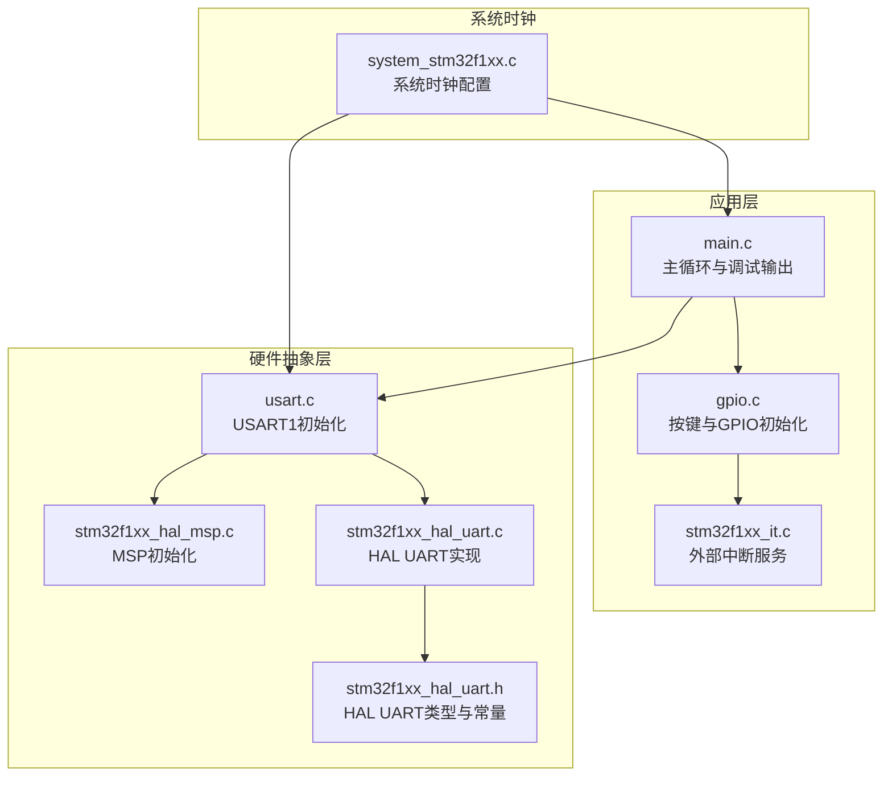
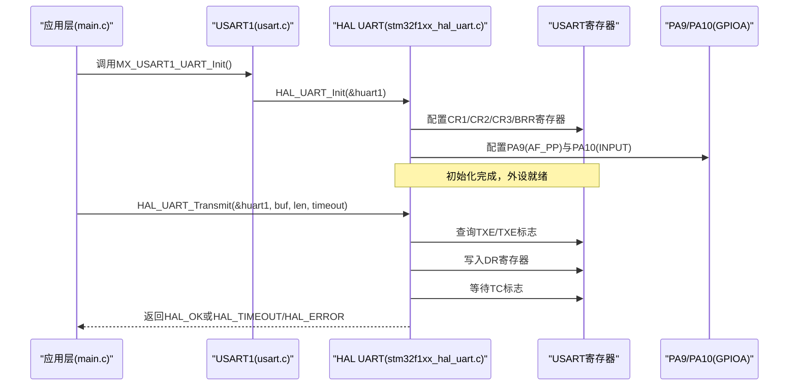
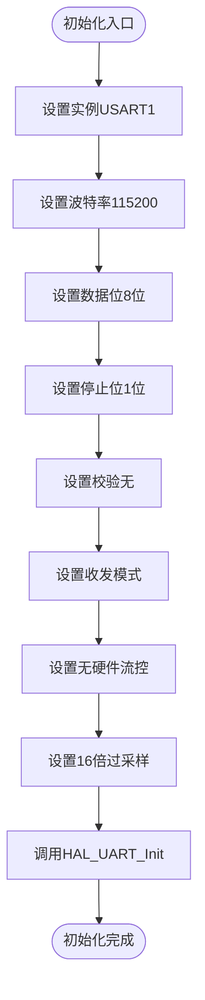
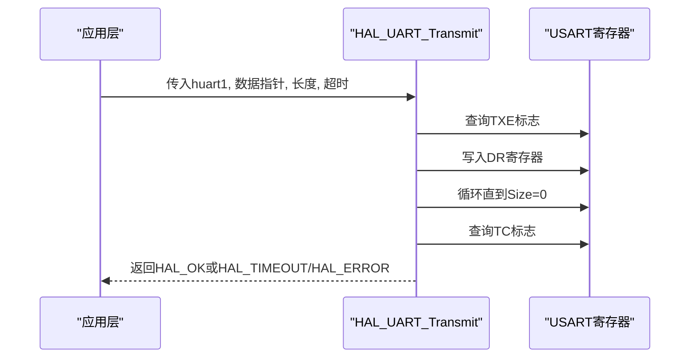
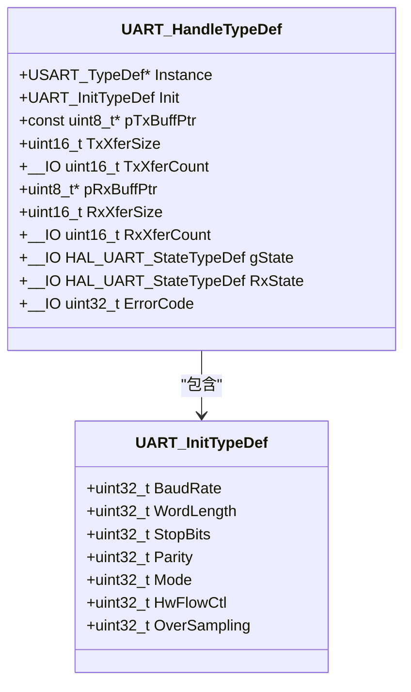
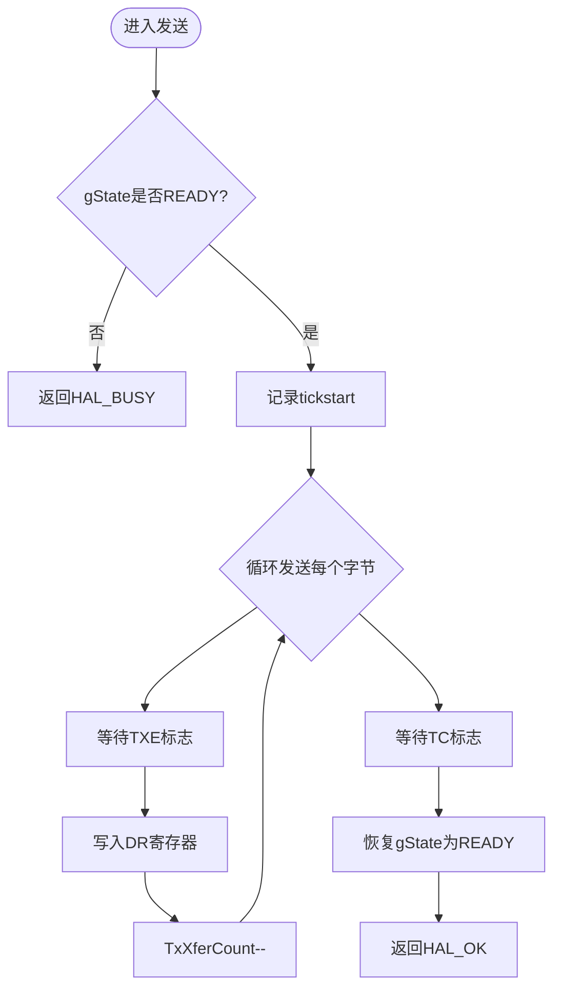
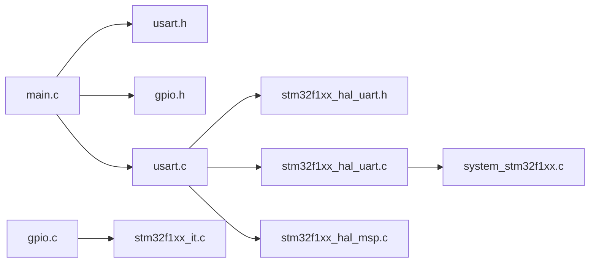

# 串口调试系统

<cite>
**本文引用的文件列表**
- [main.c](file://Core/Src/main.c)
- [usart.c](file://Core/Src/usart.c)
- [usart.h](file://Core/Inc/usart.h)
- [gpio.c](file://Core/Src/gpio.c)
- [stm32f1xx_it.c](file://Core/Src/stm32f1xx_it.c)
- [stm32f1xx_hal_uart.h](file://Drivers/STM32F1xx_HAL_Driver/Inc/stm32f1xx_hal_uart.h)
- [stm32f1xx_hal_uart.c](file://Drivers/STM32F1xx_HAL_Driver/Src/stm32f1xx_hal_uart.c)
- [system_stm32f1xx.c](file://Core/Src/system_stm32f1xx.c)
- [stm32f1xx_hal_msp.c](file://Core/Src/stm32f1xx_hal_msp.c)
</cite>

## 目录
1. [简介](#简介)
2. [项目结构](#项目结构)
3. [核心组件](#核心组件)
4. [架构总览](#架构总览)
5. [详细组件分析](#详细组件分析)
6. [依赖关系分析](#依赖关系分析)
7. [性能考量](#性能考量)
8. [故障排查指南](#故障排查指南)
9. [结论](#结论)
10. [附录](#附录)

## 简介
本技术文档围绕基于STM32F103C8T6的串口调试系统展开，重点覆盖USART1外设的初始化配置（波特率、数据位、停止位等）、HAL_UART_Transmit函数的使用方法与参数配置、调试信息输出格式规范、串口通信协议原理与寄存器配置、优势与局限性分析、扩展方法（调试命令与状态查询）、错误处理与超时机制，以及串口调试工具使用指南与常见场景应用。文档旨在帮助开发者高效利用串口进行系统调试与状态监控。

## 项目结构
该项目采用典型的CubeMX工程布局，核心源文件位于Core目录，HAL驱动位于Drivers目录，MDK-ARM为编译与调试产物目录。与串口调试直接相关的模块包括：
- USART1初始化与GPIO复用配置（Core/Src/usart.c、Core/Src/stm32f1xx_hal_msp.c）
- 主程序中的调试输出与按键触发（Core/Src/main.c）
- HAL UART接口与底层实现（Drivers/STM32F1xx_HAL_Driver）
- GPIO按键中断与NVIC配置（Core/Src/gpio.c、Core/Src/stm32f1xx_it.c）

图表来源
- [main.c](file://Core/Src/main.c#L396-L421)
- [usart.c](file://Core/Src/usart.c#L31-L57)
- [gpio.c](file://Core/Src/gpio.c#L42-L89)
- [stm32f1xx_it.c](file://Core/Src/stm32f1xx_it.c#L204-L241)
- [stm32f1xx_hal_uart.c](file://Drivers/STM32F1xx_HAL_Driver/Src/stm32f1xx_hal_uart.c#L1138-L1210)
- [stm32f1xx_hal_uart.h](file://Drivers/STM32F1xx_HAL_Driver/Inc/stm32f1xx_hal_uart.h#L46-L75)
- [system_stm32f1xx.c](file://Core/Src/system_stm32f1xx.c#L175-L200)

章节来源
- [main.c](file://Core/Src/main.c#L396-L421)
- [usart.c](file://Core/Src/usart.c#L31-L57)
- [gpio.c](file://Core/Src/gpio.c#L42-L89)
- [stm32f1xx_it.c](file://Core/Src/stm32f1xx_it.c#L204-L241)
- [stm32f1xx_hal_uart.h](file://Drivers/STM32F1xx_HAL_Driver/Inc/stm32f1xx_hal_uart.h#L46-L75)
- [stm32f1xx_hal_uart.c](file://Drivers/STM32F1xx_HAL_Driver/Src/stm32f1xx_hal_uart.c#L1138-L1210)
- [system_stm32f1xx.c](file://Core/Src/system_stm32f1xx.c#L175-L200)

## 核心组件
- USART1外设初始化：配置波特率为115200、8位数据位、1停止位、无校验、收发模式、无硬件流控、16倍过采样。
- HAL_UART_Transmit：阻塞式发送接口，支持超时控制与错误返回。
- 调试输出：在主循环与按键中断中通过HAL_UART_Transmit输出状态信息。
- GPIO按键中断：KEY1/KEY2/KEY3触发显示开关、关闭与模式切换，并同步串口输出状态。
- HAL UART状态与错误码：READY/BUSY、BUSY_TX、BUSY_RX、TIMEOUT、ERROR等状态与错误类型。

章节来源
- [usart.c](file://Core/Src/usart.c#L41-L52)
- [main.c](file://Core/Src/main.c#L416-L418)
- [main.c](file://Core/Src/main.c#L534-L555)
- [stm32f1xx_hal_uart.h](file://Drivers/STM32F1xx_HAL_Driver/Inc/stm32f1xx_hal_uart.h#L116-L135)
- [stm32f1xx_hal_uart.h](file://Drivers/STM32F1xx_HAL_Driver/Inc/stm32f1xx_hal_uart.h#L253-L264)

## 架构总览
下图展示从应用层到HAL层再到外设寄存器的数据通路与控制流程。

图表来源
- [usart.c](file://Core/Src/usart.c#L31-L57)
- [stm32f1xx_hal_uart.c](file://Drivers/STM32F1xx_HAL_Driver/Src/stm32f1xx_hal_uart.c#L1138-L1210)
- [stm32f1xx_hal_uart.c](file://Drivers/STM32F1xx_HAL_Driver/Src/stm32f1xx_hal_uart.c#L3695-L3757)
- [stm32f1xx_hal_uart.h](file://Drivers/STM32F1xx_HAL_Driver/Inc/stm32f1xx_hal_uart.h#L46-L75)

## 详细组件分析

### USART1初始化配置
- 外设实例：USART1
- 波特率：115200
- 数据位：8位（WordLength_8B）
- 停止位：1位（StopBits_1）
- 校验：无（Parity_NONE）
- 模式：收发（Mode_TX_RX）
- 硬件流控：禁用（HWCONTROL_NONE）
- 过采样：16倍（OVERSAMPLING_16）
- GPIO复用：PA9为推挽复用输出（TX），PA10为上拉输入（RX）

图表来源
- [usart.c](file://Core/Src/usart.c#L41-L52)
- [usart.c](file://Core/Src/usart.c#L31-L57)

章节来源
- [usart.c](file://Core/Src/usart.c#L41-L52)
- [usart.c](file://Core/Src/usart.c#L69-L84)

### HAL_UART_Transmit使用与参数
- 函数原型：HAL_UART_Transmit(UART_HandleTypeDef*, const uint8_t*, uint16_t, uint32_t)
- 参数说明：
  - huart：UART句柄（如huart1）
  - pData：待发送数据缓冲区指针
  - Size：数据长度（字节数）
  - Timeout：超时时间（毫秒）
- 行为特征：
  - 阻塞式发送，内部轮询TXE标志，发送完成后等待TC标志
  - 支持9位无校验模式（按uint16_t处理）
  - 超时返回HAL_TIMEOUT，忙状态返回HAL_BUSY，非法参数返回HAL_ERROR
- 典型调用示例路径：
  - 应用启动时输出提示信息
  - 按键触发时输出状态字符串

图表来源
- [stm32f1xx_hal_uart.c](file://Drivers/STM32F1xx_HAL_Driver/Src/stm32f1xx_hal_uart.c#L1138-L1210)
- [main.c](file://Core/Src/main.c#L416-L418)
- [main.c](file://Core/Src/main.c#L534-L555)

章节来源
- [stm32f1xx_hal_uart.h](file://Drivers/STM32F1xx_HAL_Driver/Inc/stm32f1xx_hal_uart.h#L748-L750)
- [stm32f1xx_hal_uart.c](file://Drivers/STM32F1xx_HAL_Driver/Src/stm32f1xx_hal_uart.c#L1138-L1210)
- [main.c](file://Core/Src/main.c#L416-L418)
- [main.c](file://Core/Src/main.c#L534-L555)

### 调试信息输出格式规范
- 输出内容：以字符串形式输出，包含换行符（\r\n），便于终端识别行尾
- 输出时机：
  - 系统启动时输出提示信息
  - 按键触发时输出状态字符串（如显示开关、模式切换）
- 建议格式：
  - 时间戳（可选）+消息体+换行
  - 关键状态变更前后对比
  - 错误码或错误描述（可选）

章节来源
- [main.c](file://Core/Src/main.c#L416-L418)
- [main.c](file://Core/Src/main.c#L534-L555)

### 串口通信协议与寄存器配置
- 协议原理：异步串行通信，帧格式为起始位+数据位+（可选）奇偶校验位+停止位；波特率决定每秒传输的符号数。
- STM32F1 USART寄存器关键字段：
  - CR1：M位（数据位）、PCE/PS（校验）、TE/RE（收发使能）、OVER8（过采样）
  - CR2：STOP[1:0]（停止位）
  - CR3：RTSE/CTSE（硬件流控）
  - BRR：波特率分频系数（根据PCLK与OVERSAMPLING计算）
- HAL配置流程：HAL_UART_Init -> UART_SetConfig -> 配置CR1/CR2/CR3/BRR

图表来源
- [stm32f1xx_hal_uart.h](file://Drivers/STM32F1xx_HAL_Driver/Inc/stm32f1xx_hal_uart.h#L160-L213)
- [stm32f1xx_hal_uart.h](file://Drivers/STM32F1xx_HAL_Driver/Inc/stm32f1xx_hal_uart.h#L46-L75)

章节来源
- [stm32f1xx_hal_uart.c](file://Drivers/STM32F1xx_HAL_Driver/Src/stm32f1xx_hal_uart.c#L3695-L3757)
- [stm32f1xx_hal_uart.h](file://Drivers/STM32F1xx_HAL_Driver/Inc/stm32f1xx_hal_uart.h#L46-L75)

### 串口调试的优势与局限性
- 优势：
  - 实现简单、成本低、通用性强
  - 可实时输出系统状态、日志与诊断信息
  - 支持多种终端工具（串口助手、脚本化工具）
- 局限性：
  - 带宽有限，大数据量传输效率低
  - 无确认/重传机制，易受噪声影响
  - 与主任务共享资源，可能影响实时性
  - 仅适合调试阶段，不适合长期生产监控

[本节为概念性总结，不直接分析具体文件]

### 串口调试扩展方法
- 添加调试命令解析：在主循环中接收一行数据，解析命令关键字，执行相应动作（如读取传感器、切换模式、打印状态）
- 状态查询接口：提供查询命令（如“status”、“version”、“mode”），返回系统当前状态与配置
- 结构化输出：采用JSON或表格格式输出，便于自动化工具解析
- 日志级别：区分DEBUG/INFO/WARN/ERROR等级，按需输出
- 命令历史与自动补全：在终端侧实现（可选），提升交互体验

[本节为概念性总结，不直接分析具体文件]

### 串口通信错误处理与超时机制
- 超时控制：HAL_UART_Transmit内部使用HAL_GetTick与超时参数进行轮询，超时返回HAL_TIMEOUT
- 错误状态：gState包含READY/BUSY、BUSY_TX、BUSY_RX、TIMEOUT、ERROR等；ErrorCode包含PE/NE/FE/ORE/DMA等错误类型
- 推荐实践：
  - 对于关键路径，设置合理超时（如100ms），避免阻塞
  - 在发送前检查huart->gState，避免重复发送
  - 对于非关键信息，可使用较短超时或轮询后立即返回
  - 异常分支统一调用Error_Handler或记录错误码

图表来源
- [stm32f1xx_hal_uart.c](file://Drivers/STM32F1xx_HAL_Driver/Src/stm32f1xx_hal_uart.c#L1138-L1210)
- [stm32f1xx_hal_uart.c](file://Drivers/STM32F1xx_HAL_Driver/Src/stm32f1xx_hal_uart.c#L3185-L3200)

章节来源
- [stm32f1xx_hal_uart.h](file://Drivers/STM32F1xx_HAL_Driver/Inc/stm32f1xx_hal_uart.h#L116-L135)
- [stm32f1xx_hal_uart.h](file://Drivers/STM32F1xx_HAL_Driver/Inc/stm32f1xx_hal_uart.h#L253-L264)
- [stm32f1xx_hal_uart.c](file://Drivers/STM32F1xx_HAL_Driver/Src/stm32f1xx_hal_uart.c#L1138-L1210)

### 串口调试工具使用指南与常见场景
- 工具选择：Tera Term、SecureCRT、Putty、Python脚本（pyserial）
- 常见场景：
  - 启动日志：观察系统初始化与外设配置结果
  - 按键事件：验证KEY1/KEY2/KEY3触发逻辑与状态输出
  - 模式切换：验证显示模式变更与对应输出
  - 性能测试：测量发送吞吐与时延，评估超时参数合理性
- 建议：
  - 终端设置：115200-8-N-1，启用本地回显（可选）
  - 自动化脚本：读取特定关键词（如“Display ON!”、“ALL LEDs OFF!”）进行状态判断

[本节为概念性总结，不直接分析具体文件]

## 依赖关系分析
- 应用层依赖：
  - main.c依赖usart.h与gpio.h，调用MX_USART1_UART_Init与HAL_UART_Transmit
  - gpio.c提供按键中断与GPIO初始化，中断服务在stm32f1xx_it.c中转发
- HAL层依赖：
  - usart.c依赖stm32f1xx_hal_uart.h与stm32f1xx_hal_uart.c
  - HAL UART实现依赖系统时钟（system_stm32f1xx.c）以计算BRR
- MSP层：
  - stm32f1xx_hal_msp.c负责USART1时钟与GPIO复用配置

图表来源
- [main.c](file://Core/Src/main.c#L20-L22)
- [usart.c](file://Core/Src/usart.c#L21-L22)
- [gpio.c](file://Core/Src/gpio.c#L22-L23)
- [stm32f1xx_it.c](file://Core/Src/stm32f1xx_it.c#L204-L241)
- [stm32f1xx_hal_uart.c](file://Drivers/STM32F1xx_HAL_Driver/Src/stm32f1xx_hal_uart.c#L3695-L3757)
- [system_stm32f1xx.c](file://Core/Src/system_stm32f1xx.c#L175-L200)

章节来源
- [main.c](file://Core/Src/main.c#L20-L22)
- [usart.c](file://Core/Src/usart.c#L21-L22)
- [gpio.c](file://Core/Src/gpio.c#L22-L23)
- [stm32f1xx_it.c](file://Core/Src/stm32f1xx_it.c#L204-L241)

## 性能考量
- 波特率与带宽：115200bps在典型PC端口上满足一般调试需求，但不适合大块数据传输
- 超时设置：根据数据长度与系统负载设定合理超时，避免长时间阻塞
- 中断与DMA：对于高吞吐场景，建议使用中断或DMA方式发送，减少CPU占用
- 任务调度：将串口发送置于低优先级任务或空闲时执行，避免影响主循环实时性

[本节为通用指导，不直接分析具体文件]

## 故障排查指南
- 无输出或乱码：
  - 检查终端波特率设置是否为115200
  - 检查串口线连接与电源
- 发送阻塞或超时：
  - 检查huart->gState是否为READY
  - 调整超时参数或改为非阻塞发送
- 按键无响应：
  - 检查KEY引脚上拉电阻与中断优先级
  - 确认EXTI中断已使能且ISR正确转发
- 错误码定位：
  - 通过ErrorCode与gState判断具体错误类型（PE/NE/FE/ORE/DMA）

章节来源
- [main.c](file://Core/Src/main.c#L565-L574)
- [stm32f1xx_hal_uart.h](file://Drivers/STM32F1xx_HAL_Driver/Inc/stm32f1xx_hal_uart.h#L253-L264)
- [gpio.c](file://Core/Src/gpio.c#L66-L70)
- [stm32f1xx_it.c](file://Core/Src/stm32f1xx_it.c#L204-L241)

## 结论
本串口调试系统以USART1为核心，结合HAL UART的阻塞发送与GPIO按键中断，实现了简洁高效的调试输出与状态切换。通过合理的初始化配置、超时控制与错误处理，系统能够在大多数嵌入式调试场景中稳定工作。为进一步提升可用性，建议引入命令解析、结构化输出与非阻塞发送等扩展能力。

[本节为总结性内容，不直接分析具体文件]

## 附录
- 关键宏与常量参考：
  - 波特率、数据位、停止位、校验、模式、硬件流控、过采样等枚举定义
- 相关头文件路径：
  - [stm32f1xx_hal_uart.h](file://Drivers/STM32F1xx_HAL_Driver/Inc/stm32f1xx_hal_uart.h#L269-L336)
  - [usart.h](file://Core/Inc/usart.h#L41-L41)

[本节为补充说明，不直接分析具体文件]