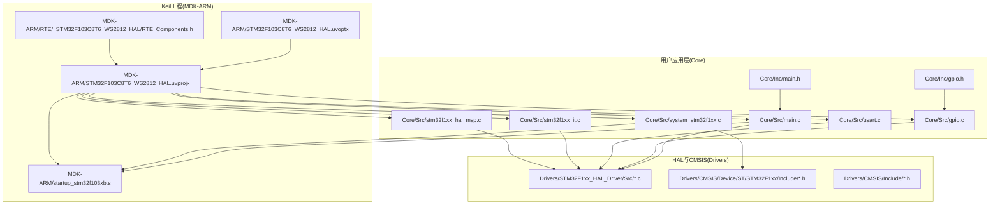
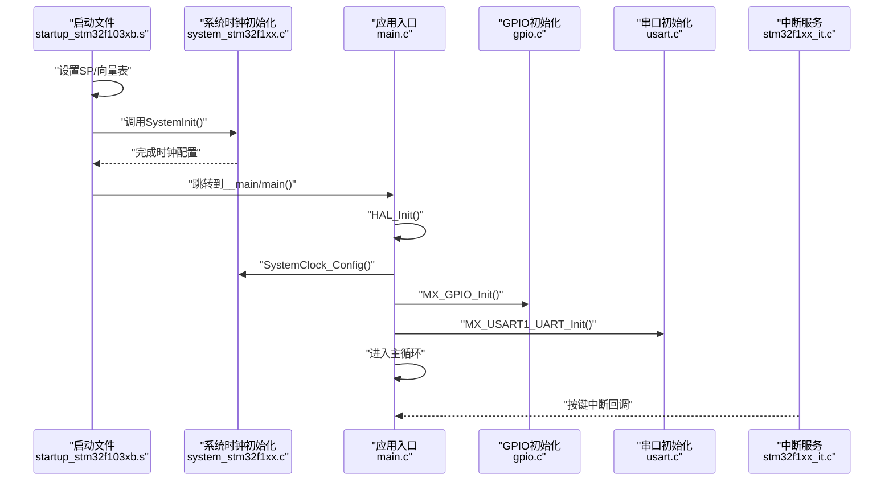
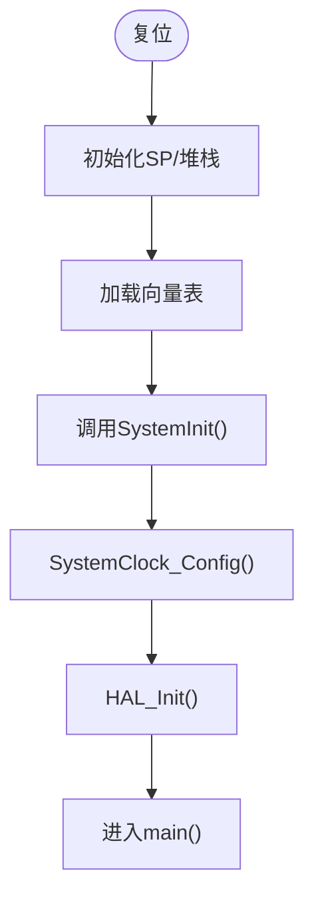
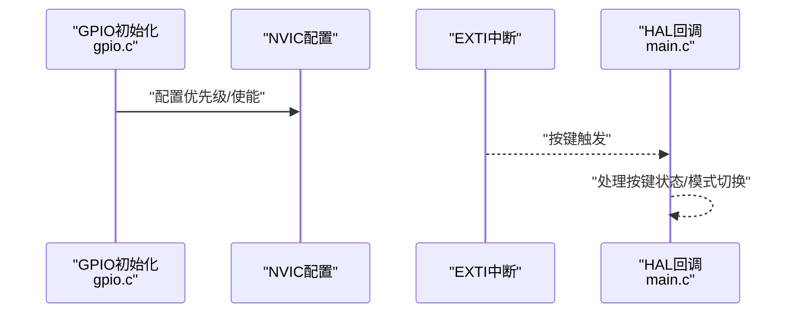
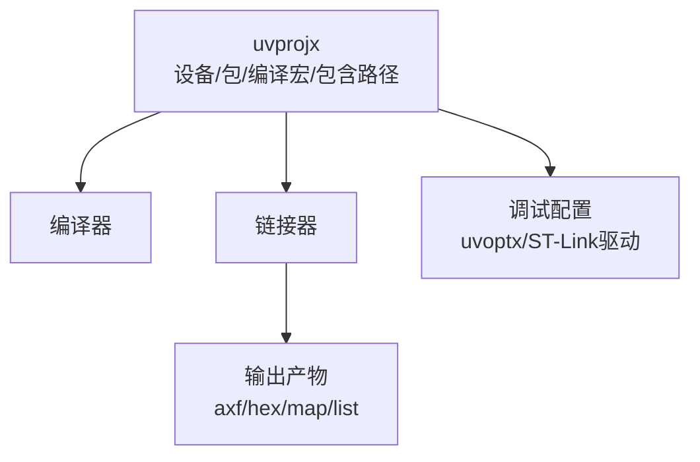
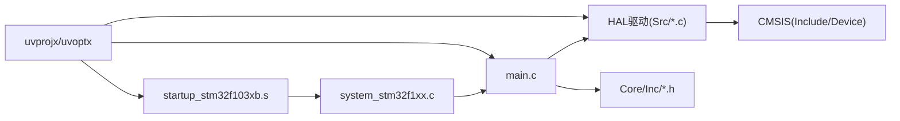

# 开发环境与工具

<cite>
**本文引用的文件**
- [main.c](file://Core/Src/main.c)
- [startup_stm32f103xb.s](file://MDK-ARM/startup_stm32f103xb.s)
- [system_stm32f1xx.c](file://Core/Src/system_stm32f1xx.c)
- [STM32F103C8T6_WS2812_HAL.ioc](file://STM32F103C8T6_WS2812_HAL.ioc)
- [uvprojx](file://MDK-ARM/STM32F103C8T6_WS2812_HAL.uvprojx)
- [uvoptx](file://MDK-ARM/STM32F103C8T6_WS2812_HAL.uvoptx)
- [RTE_Components.h](file://MDK-ARM/RTE/_STM32F103C8T6_WS2812_HAL/RTE_Components.h)
- [gpio.c](file://Core/Src/gpio.c)
- [usart.c](file://Core/Src/usart.c)
- [stm32f1xx_it.c](file://Core/Src/stm32f1xx_it.c)
- [main.h](file://Core/Inc/main.h)
- [gpio.h](file://Core/Inc/gpio.h)
- [stm32f1xx_hal_msp.c](file://Core/Src/stm32f1xx_hal_msp.c)
</cite>

## 目录
1. [简介](#简介)
2. [项目结构](#项目结构)
3. [核心组件](#核心组件)
4. [架构总览](#架构总览)
5. [详细组件分析](#详细组件分析)
6. [依赖关系分析](#依赖关系分析)
7. [性能考虑](#性能考虑)
8. [故障排查指南](#故障排查指南)
9. [结论](#结论)
10. [附录](#附录)

## 简介
本指南面向STM32F103系列MCU的嵌入式开发，围绕Keil MDK-ARM与STM32CubeMX两大工具链，系统讲解从项目生成、Keil工程配置、启动文件与系统时钟初始化、外设配置、编译与调试，到代码优化与常见问题处理的完整流程。结合本仓库中的实际工程，帮助开发者快速上手并高效完成基于HAL库的项目开发。

## 项目结构
该工程采用典型的分层组织方式：
- Core：用户应用层源码与头文件
- Drivers：HAL驱动与CMSIS内核支持
- MDK-ARM：Keil工程文件、启动文件与调试配置
- STM32F103C8T6_WS2812_HAL.ioc：CubeMX项目配置文件

图表来源
- [uvprojx](file://MDK-ARM/STM32F103C8T6_WS2812_HAL.uvprojx#L383-L502)
- [uvoptx](file://MDK-ARM/STM32F103C8T6_WS2812_HAL.uvoptx#L184-L452)
- [startup_stm32f103xb.s](file://MDK-ARM/startup_stm32f103xb.s#L54-L126)

章节来源
- [uvprojx](file://MDK-ARM/STM32F103C8T6_WS2812_HAL.uvprojx#L1-L520)
- [uvoptx](file://MDK-ARM/STM32F103C8T6_WS2812_HAL.uvoptx#L1-L453)

## 核心组件
- 启动文件与系统时钟：负责复位后栈指针、向量表、系统时钟初始化与进入main。
- 应用主程序：实现WS2812灯带控制、按键中断处理、串口打印等。
- HAL外设驱动：GPIO、UART、RCC、EXTI等外设的初始化与封装。
- Keil工程配置：设备、内存映射、编译器宏、包含路径、调试驱动等。

章节来源
- [startup_stm32f103xb.s](file://MDK-ARM/startup_stm32f103xb.s#L127-L136)
- [system_stm32f1xx.c](file://Core/Src/system_stm32f1xx.c#L175-L187)
- [main.c](file://Core/Src/main.c#L373-L484)
- [gpio.c](file://Core/Src/gpio.c#L42-L89)
- [usart.c](file://Core/Src/usart.c#L31-L57)
- [stm32f1xx_it.c](file://Core/Src/stm32f1xx_it.c#L204-L241)

## 架构总览
下图展示从复位到main执行、系统时钟配置、外设初始化以及中断服务的总体流程。

图表来源
- [startup_stm32f103xb.s](file://MDK-ARM/startup_stm32f103xb.s#L127-L136)
- [system_stm32f1xx.c](file://Core/Src/system_stm32f1xx.c#L175-L187)
- [main.c](file://Core/Src/main.c#L382-L399)
- [gpio.c](file://Core/Src/gpio.c#L42-L89)
- [usart.c](file://Core/Src/usart.c#L31-L57)
- [stm32f1xx_it.c](file://Core/Src/stm32f1xx_it.c#L204-L241)

## 详细组件分析

### 启动文件与系统时钟
- 启动文件作用
  - 初始化堆栈与堆区大小
  - 定义异常向量表
  - 在复位后调用SystemInit与__main
- system_stm32f1xx.c
  - 提供SystemInit与SystemCoreClockUpdate
  - 配置向量表重定位、外部SRAM等（F1系列特定）
- main.c中的SystemClock_Config
  - 使用HSE+PLL配置系统时钟至72MHz
  - 设置AHB/APB分频与Flash等待周期

图表来源
- [startup_stm32f103xb.s](file://MDK-ARM/startup_stm32f103xb.s#L26-L48)
- [startup_stm32f103xb.s](file://MDK-ARM/startup_stm32f103xb.s#L54-L126)
- [system_stm32f1xx.c](file://Core/Src/system_stm32f1xx.c#L175-L187)
- [main.c](file://Core/Src/main.c#L490-L523)

章节来源
- [startup_stm32f103xb.s](file://MDK-ARM/startup_stm32f103xb.s#L1-L306)
- [system_stm32f1xx.c](file://Core/Src/system_stm32f1xx.c#L1-L407)
- [main.c](file://Core/Src/main.c#L490-L523)

### 外设初始化与中断
- GPIO初始化
  - 使能端口时钟、配置PC13为输出、PB8/PB9为推挽输出、按键为下降沿EXTI
  - 配置NVIC优先级与使能
- UART初始化
  - USART1配置为115200-8N1、TX/RX引脚复用配置
- 中断服务
  - SysTick_Handler更新节拍
  - EXTI0/1/2分别转发到HAL回调，由main.c处理按键事件

图表来源
- [gpio.c](file://Core/Src/gpio.c#L42-L89)
- [stm32f1xx_it.c](file://Core/Src/stm32f1xx_it.c#L204-L241)
- [main.c](file://Core/Src/main.c#L526-L559)

章节来源
- [gpio.c](file://Core/Src/gpio.c#L42-L89)
- [usart.c](file://Core/Src/usart.c#L31-L57)
- [stm32f1xx_it.c](file://Core/Src/stm32f1xx_it.c#L183-L192)
- [main.c](file://Core/Src/main.c#L526-L559)

### Keil工程与编译配置
- 设备与包
  - 目标设备：STM32F103C8
  - PackID：Keil.STM32F1xx_DFP.2.4.1
- 编译器与宏
  - 宏：USE_HAL_DRIVER、STM32F103xB
  - 包含路径：Core/Inc、HAL驱动、Legacy、CMSIS设备与内核
- 链接与内存
  - IRAM/IROM配置、起始地址与大小
- 调试与下载
  - ST-Link驱动注册、SWD协议、调试时钟
- 生成产物
  - axf、hex、map、list等

图表来源
- [uvprojx](file://MDK-ARM/STM32F103C8T6_WS2812_HAL.uvprojx#L17-L344)
- [uvoptx](file://MDK-ARM/STM32F103C8T6_WS2812_HAL.uvoptx#L117-L129)

章节来源
- [uvprojx](file://MDK-ARM/STM32F103C8T6_WS2812_HAL.uvprojx#L1-L520)
- [uvoptx](file://MDK-ARM/STM32F103C8T6_WS2812_HAL.uvoptx#L1-L453)
- [RTE_Components.h](file://MDK-ARM/RTE/_STM32F103C8T6_WS2812_HAL/RTE_Components.h#L1-L22)

### CubeMX配置与代码生成
- 工程信息
  - MCU型号：STM32F103C8Tx
  - 时钟树：HSE=8MHz、PLL=9倍、SYSCLK=72MHz、AHB=72MHz、APB1=36MHz、APB2=72MHz
  - 外设：USART1、GPIO、NVIC、RCC等
- 生成策略
  - 选择MDK-ARM工具链、保持用户代码、堆栈与堆大小
  - 生成后在Keil中直接打开.uvprojx即可构建

章节来源
- [STM32F103C8T6_WS2812_HAL.ioc](file://STM32F103C8T6_WS2812_HAL.ioc#L1-L156)

## 依赖关系分析
- 启动文件依赖CMSIS系统函数
- main.c依赖HAL库与外设初始化
- HAL驱动依赖CMSIS与设备头文件
- Keil工程通过uvprojx统一管理编译、链接与调试

图表来源
- [startup_stm32f103xb.s](file://MDK-ARM/startup_stm32f103xb.s#L127-L136)
- [system_stm32f1xx.c](file://Core/Src/system_stm32f1xx.c#L175-L187)
- [main.c](file://Core/Src/main.c#L373-L484)
- [uvprojx](file://MDK-ARM/STM32F103C8T6_WS2812_HAL.uvprojx#L383-L502)

章节来源
- [uvprojx](file://MDK-ARM/STM32F103C8T6_WS2812_HAL.uvprojx#L383-L502)

## 性能考虑
- 时钟配置
  - HSE+PLL至72MHz，满足多数外设需求；注意Flash等待周期与AHB/APB分频
- 代码优化
  - Keil编译器优化等级可在uvprojx中调整（如Optim级别）
  - 合理使用内联与寄存器访问以降低开销
- 外设配置
  - UART波特率115200，适合串口调试；若需更高带宽可调整
  - GPIO输出速度高频，确保LED驱动信号质量
- 中断优先级
  - EXTI优先级一致，避免抢占冲突；SysTick用于节拍

章节来源
- [main.c](file://Core/Src/main.c#L490-L523)
- [usart.c](file://Core/Src/usart.c#L42-L48)
- [gpio.c](file://Core/Src/gpio.c#L74-L77)
- [uvprojx](file://MDK-ARM/STM32F103C8T6_WS2812_HAL.uvprojx#L317-L344)

## 故障排查指南
- 启动失败或复位循环
  - 检查HSE是否正常、PLL配置是否正确、向量表是否重定位
- 串口无输出
  - 确认USART1引脚复用、时钟使能、波特率设置
- 按键无响应
  - 检查GPIO上拉/下拉、EXTI线绑定、NVIC优先级与使能
- 下载/调试异常
  - 确认ST-Link驱动注册、协议选择、调试时钟设置
- 代码未生效
  - 确认Keil工程包含路径、宏定义、RTE组件启用

章节来源
- [startup_stm32f103xb.s](file://MDK-ARM/startup_stm32f103xb.s#L127-L136)
- [usart.c](file://Core/Src/usart.c#L63-L89)
- [gpio.c](file://Core/Src/gpio.c#L66-L87)
- [uvoptx](file://MDK-ARM/STM32F103C8T6_WS2812_HAL.uvoptx#L117-L129)

## 结论
本指南基于实际工程，系统梳理了Keil MDK-ARM与STM32CubeMX的配合使用流程，覆盖启动文件、系统时钟、外设初始化、中断处理、工程配置与调试下载等关键环节。遵循本文步骤，开发者可快速搭建稳定高效的STM32F103项目开发环境，并在此基础上扩展功能与优化性能。

## 附录

### 开发环境与工具使用步骤
- 安装与准备
  - 安装Keil MDK-ARM与STM32CubeMX
  - 在CubeMX中新建工程，选择STM32F103C8Tx，配置HSE、PLL与外设
  - 生成代码并选择MDK-ARM工具链
- 导入Keil工程
  - 打开生成的.uvprojx文件
  - 确认设备、包、包含路径与编译宏已正确加载
- 配置调试与下载
  - 在uvoptx中确认ST-Link驱动注册与调试参数
  - 连接目标板，选择SWD协议
- 编译与下载
  - 生成项目，下载到芯片，观察串口输出与LED状态
- 优化与验证
  - 根据需求调整编译优化等级与外设参数
  - 使用调试器观察变量与调用栈，定位问题

章节来源
- [STM32F103C8T6_WS2812_HAL.ioc](file://STM32F103C8T6_WS2812_HAL.ioc#L92-L116)
- [uvprojx](file://MDK-ARM/STM32F103C8T6_WS2812_HAL.uvprojx#L17-L344)
- [uvoptx](file://MDK-ARM/STM32F103C8T6_WS2812_HAL.uvoptx#L117-L129)