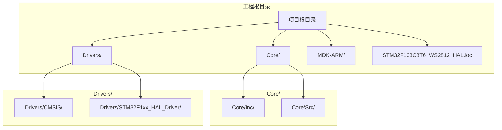
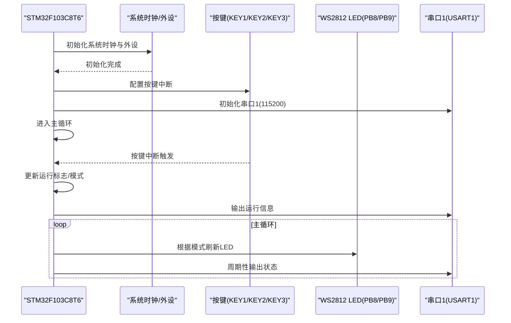
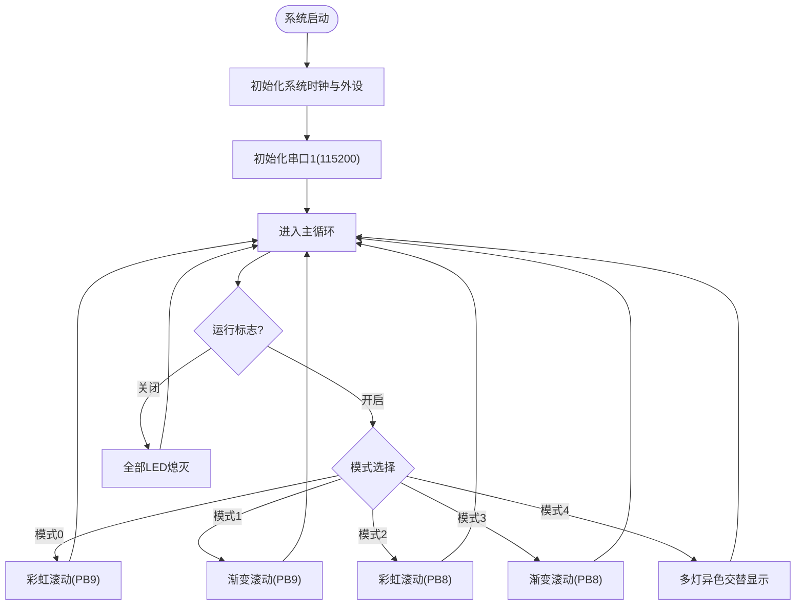
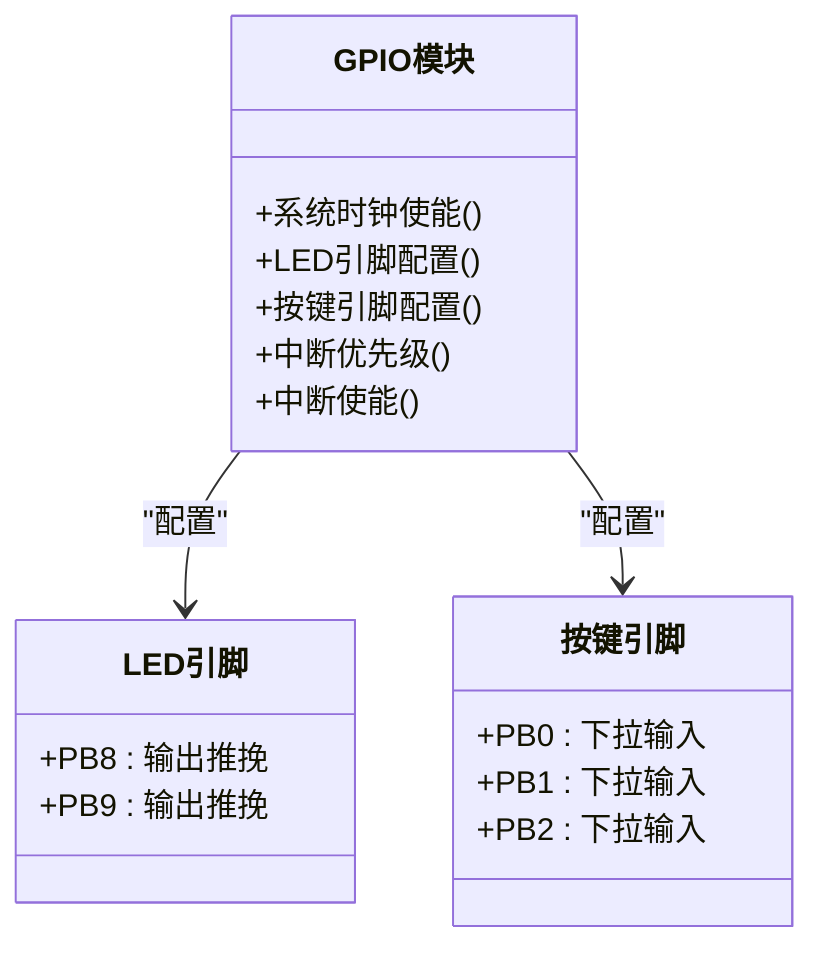
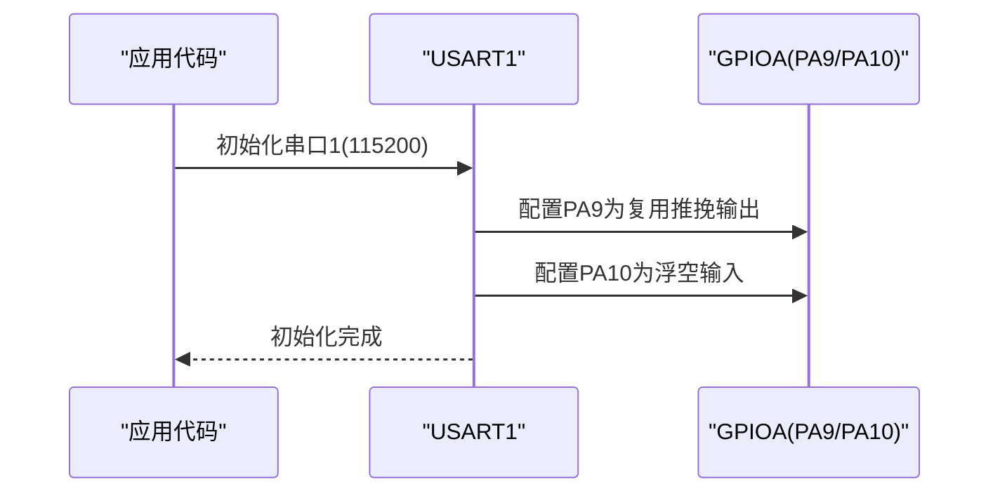
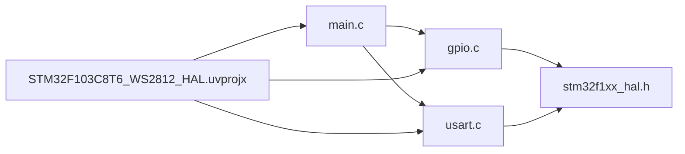

# 快速开始

<cite>
**本文引用的文件列表**
- [main.c](file://Core/Src/main.c)
- [main.h](file://Core/Inc/main.h)
- [gpio.c](file://Core/Src/gpio.c)
- [gpio.h](file://Core/Inc/gpio.h)
- [usart.c](file://Core/Src/usart.c)
- [usart.h](file://Core/Inc/usart.h)
- [STM32F103C8T6_WS2812_HAL.ioc](file://STM32F103C8T6_WS2812_HAL.ioc)
- [STM32F103C8T6_WS2812_HAL.uvprojx](file://MDK-ARM/STM32F103C8T6_WS2812_HAL.uvprojx)
- [stm32f1xx_hal.h](file://Drivers/STM32F1xx_HAL_Driver/Inc/stm32f1xx_hal.h)
</cite>

## 目录
1. [简介](#简介)
2. [项目结构](#项目结构)
3. [核心组件](#核心组件)
4. [架构概览](#架构概览)
5. [详细组件分析](#详细组件分析)
6. [依赖关系分析](#依赖关系分析)
7. [性能考虑](#性能考虑)
8. [故障排除指南](#故障排除指南)
9. [结论](#结论)
10. [附录](#附录)

## 简介
本指南面向初学者，帮助您快速搭建STM32F103C8T6开发环境并成功运行WS2812 LED控制示例。项目基于STM32CubeMX进行外设配置，使用Keil MDK-ARM进行编译下载，通过串口调试助手观察运行状态。您将学会：
- 安装配置Keil MDK-ARM和STM32CubeMX
- 硬件连接WS2812 LED、按键和串口
- 导入项目并完成编译构建
- 首次下载与常见问题解决
- 基础测试验证软硬件功能

## 项目结构
该项目采用标准的STM32 HAL工程组织方式，主要目录与文件如下：
- Core/Src：用户应用代码（主程序、GPIO、USART等）
- Core/Inc：头文件（主程序、GPIO、USART等）
- Drivers：HAL驱动与CMSIS库
- MDK-ARM：Keil工程文件与构建产物
- STM32F103C8T6_WS2812_HAL.ioc：STM32CubeMX项目配置文件

图表来源
- [STM32F103C8T6_WS2812_HAL.ioc](file://STM32F103C8T6_WS2812_HAL.ioc#L1-L156)
- [STM32F103C8T6_WS2812_HAL.uvprojx](file://MDK-ARM/STM32F103C8T6_WS2812_HAL.uvprojx#L1-L520)

章节来源
- [STM32F103C8T6_WS2812_HAL.ioc](file://STM32F103C8T6_WS2812_HAL.ioc#L1-L156)
- [STM32F103C8T6_WS2812_HAL.uvprojx](file://MDK-ARM/STM32F103C8T6_WS2812_HAL.uvprojx#L1-L520)

## 核心组件
- 主程序模块：负责系统时钟配置、外设初始化、LED控制算法、按键中断处理与串口通信
- GPIO模块：按键输入配置（KEY1/KEY2/KEY3）与LED输出引脚配置（PB8/PB9）
- USART模块：串口1初始化，波特率115200，用于调试信息输出
- HAL驱动：STM32F1系列标准外设库，提供底层驱动支持

章节来源
- [main.c](file://Core/Src/main.c#L373-L484)
- [gpio.c](file://Core/Src/gpio.c#L42-L89)
- [usart.c](file://Core/Src/usart.c#L31-L57)
- [stm32f1xx_hal.h](file://Drivers/STM32F1xx_HAL_Driver/Inc/stm32f1xx_hal.h#L1-L200)

## 架构概览
系统运行时序：上电后初始化系统时钟与外设，进入主循环；按键触发中断改变运行状态；主循环根据状态执行不同的LED显示模式；通过串口输出运行信息。

图表来源
- [main.c](file://Core/Src/main.c#L396-L484)
- [gpio.c](file://Core/Src/gpio.c#L66-L87)
- [usart.c](file://Core/Src/usart.c#L31-L57)

## 详细组件分析

### 主程序模块（main.c）
- 系统时钟配置：使用外部高速晶振，PLL倍频至72MHz
- 外设初始化：GPIO、USART1
- LED控制算法：
  - 单灯设置：指定索引的LED显示指定颜色，其余熄灭
  - 多灯同色：指定多个索引同时显示同一颜色
  - 多灯异色：每个索引显示不同颜色
  - 渐变滚动：中心灯最亮，向两侧递减亮度形成滚动效果
  - 彩虹滚动：基于HSV色彩模型，实现彩虹色滚动
- 按键中断处理：KEY1启动显示、KEY2关闭显示、KEY3切换模式
- 串口通信：初始化USART1，通过串口输出调试信息

图表来源
- [main.c](file://Core/Src/main.c#L425-L484)
- [main.c](file://Core/Src/main.c#L430-L464)

章节来源
- [main.c](file://Core/Src/main.c#L373-L484)
- [main.c](file://Core/Src/main.c#L526-L558)

### GPIO模块（gpio.c）
- 系统时钟使能：PC、PD、PB、PA
- LED引脚配置：PB8、PB9输出推挽，初始高电平
- 按键引脚配置：PB0/PB1/PB2输入下拉，触发中断
- 中断优先级与使能：EXTI0/EXTI1/EXTI2

图表来源
- [gpio.c](file://Core/Src/gpio.c#L42-L89)
- [main.h](file://Core/Inc/main.h#L60-L68)

章节来源
- [gpio.c](file://Core/Src/gpio.c#L42-L89)
- [gpio.h](file://Core/Inc/gpio.h#L39-L43)
- [main.h](file://Core/Inc/main.h#L60-L68)

### USART模块（usart.c）
- 串口1初始化：波特率115200，8数据位，1停止位，无校验，收发模式
- 引脚配置：PA9推挽复用输出（TX），PA10浮空输入（RX）
- MSP初始化/反初始化：启用时钟与引脚配置

图表来源
- [usart.c](file://Core/Src/usart.c#L31-L57)
- [usart.c](file://Core/Src/usart.c#L63-L84)

章节来源
- [usart.c](file://Core/Src/usart.c#L31-L57)
- [usart.h](file://Core/Inc/usart.h#L35-L41)

### HAL驱动（stm32f1xx_hal.h）
- 提供STM32F1系列HAL驱动接口声明
- 包含tick频率、DBGMCU冻结等功能常量与宏

章节来源
- [stm32f1xx_hal.h](file://Drivers/STM32F1xx_HAL_Driver/Inc/stm32f1xx_hal.h#L1-L200)

## 依赖关系分析
- main.c依赖GPIO与USART模块进行外设控制
- gpio.c依赖HAL驱动进行GPIO初始化
- usart.c依赖HAL驱动进行串口初始化
- 工程文件uvprojx定义了编译器、包含路径、链接器参数等

图表来源
- [main.c](file://Core/Src/main.c#L20-L22)
- [gpio.c](file://Core/Src/gpio.c#L22-L22)
- [usart.c](file://Core/Src/usart.c#L21-L21)
- [STM32F103C8T6_WS2812_HAL.uvprojx](file://MDK-ARM/STM32F103C8T6_WS2812_HAL.uvprojx#L341-L343)

章节来源
- [main.c](file://Core/Src/main.c#L20-L22)
- [gpio.c](file://Core/Src/gpio.c#L22-L22)
- [usart.c](file://Core/Src/usart.c#L21-L21)
- [STM32F103C8T6_WS2812_HAL.uvprojx](file://MDK-ARM/STM32F103C8T6_WS2812_HAL.uvprojx#L341-L343)

## 性能考虑
- WS2812时序要求严格：代码通过精确延时函数保证高低电平时间满足WS2812时序
- 按键消抖：使用下降沿触发中断，配合软件延时消除机械按键抖动
- 串口调试：115200波特率满足实时调试需求，避免阻塞主循环

## 故障排除指南
- 编译错误：确认Keil工程包含路径正确，已添加HAL与CMSIS头文件路径
- 下载失败：检查目标设备选择与调试器连接，确保Flash驱动可用
- LED不亮：检查PB8/PB9引脚配置与上拉/下拉设置，确认电源与限流电阻
- 按键无响应：确认按键引脚配置为下拉输入，中断优先级设置合理
- 串口无输出：检查USART1初始化参数与PA9/PA10引脚配置

章节来源
- [STM32F103C8T6_WS2812_HAL.uvprojx](file://MDK-ARM/STM32F103C8T6_WS2812_HAL.uvprojx#L341-L343)
- [gpio.c](file://Core/Src/gpio.c#L66-L87)
- [usart.c](file://Core/Src/usart.c#L42-L48)

## 结论
通过本指南，您已完成STM32F103C8T6 WS2812 LED控制项目的环境搭建与首次运行。建议进一步实践：
- 修改LED数量与显示模式
- 添加更多按键或传感器输入
- 使用DMA优化串口传输
- 扩展到多路LED控制

## 附录

### 开发环境搭建步骤
- 安装Keil MDK-ARM：安装完成后，在工程选项中配置编译器版本与包含路径
- 安装STM32CubeMX：打开.ioc文件，确认MCU型号与外设配置

章节来源
- [STM32F103C8T6_WS2812_HAL.ioc](file://STM32F103C8T6_WS2812_HAL.ioc#L8-L33)
- [STM32F103C8T6_WS2812_HAL.uvprojx](file://MDK-ARM/STM32F103C8T6_WS2812_HAL.uvprojx#L13-L19)

### 硬件连接方法
- WS2812 LED：使用PB8或PB9作为数据输入引脚，注意数据线与限流电阻
- 按键：KEY1连接PB0，KEY2连接PB1，KEY3连接PB2，均配置为下拉输入
- 串口：PA9为TX，PA10为RX，连接USB转串口模块

章节来源
- [gpio.c](file://Core/Src/gpio.c#L66-L77)
- [usart.c](file://Core/Src/usart.c#L72-L84)
- [main.h](file://Core/Inc/main.h#L60-L68)

### 项目导入与编译流程
- 在Keil中打开.uvprojx工程文件
- 点击编译按钮生成hex文件
- 通过调试器下载到目标板

章节来源
- [STM32F103C8T6_WS2812_HAL.uvprojx](file://MDK-ARM/STM32F103C8T6_WS2812_HAL.uvprojx#L1-L520)

### 第一次编译与下载
- 首次编译：确保所有源文件被包含，编译器版本匹配
- 下载：选择正确的目标设备与调试器，点击下载按钮
- 观察：通过串口助手查看运行信息

章节来源
- [main.c](file://Core/Src/main.c#L416-L418)
- [usart.c](file://Core/Src/usart.c#L31-L57)

### 测试步骤
- 启动显示：按下KEY1，观察LED开始滚动显示
- 停止显示：按下KEY2，LED全部熄灭
- 切换模式：按下KEY3，循环切换不同显示模式
- 串口输出：确认串口助手能收到调试信息

章节来源
- [main.c](file://Core/Src/main.c#L526-L558)
- [main.c](file://Core/Src/main.c#L416-L418)