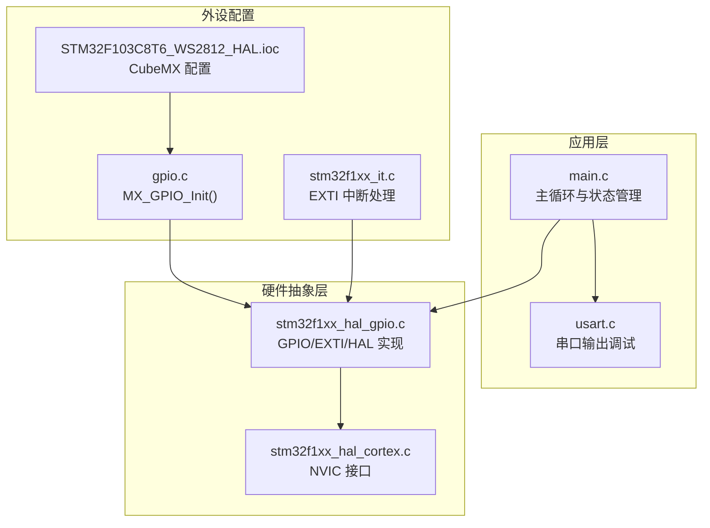
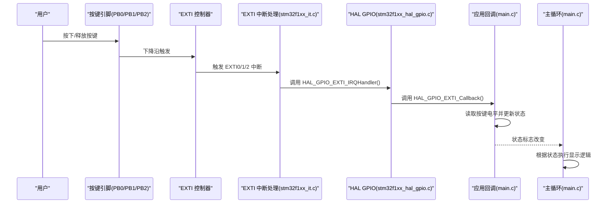
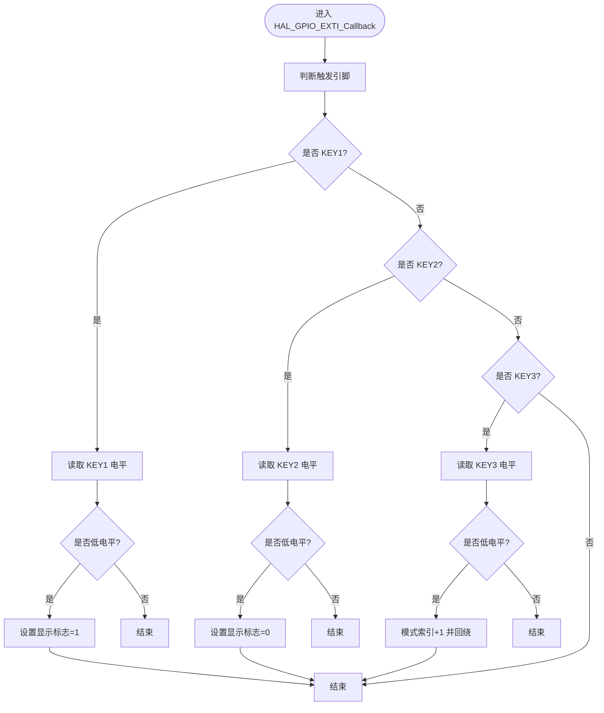
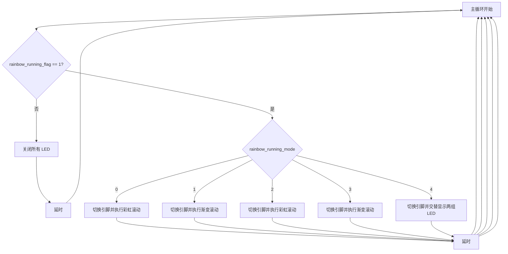
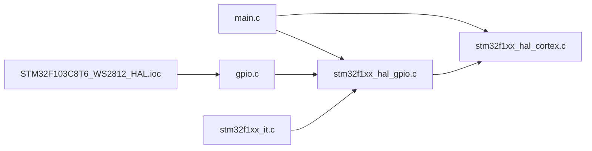

# 按键交互系统

<cite>
**本文引用的文件**
- [Core/Src/main.c](file://Core/Src/main.c)
- [Core/Src/gpio.c](file://Core/Src/gpio.c)
- [Core/Src/stm32f1xx_it.c](file://Core/Src/stm32f1xx_it.c)
- [Core/Inc/main.h](file://Core/Inc/main.h)
- [STM32F103C8T6_WS2812_HAL.ioc](file://STM32F103C8T6_WS2812_HAL.ioc)
- [Drivers/STM32F1xx_HAL_Driver/Src/stm32f1xx_hal_gpio.c](file://Drivers/STM32F1xx_HAL_Driver/Src/stm32f1xx_hal_gpio.c)
- [Drivers/STM32F1xx_HAL_Driver/Src/stm32f1xx_hal_cortex.c](file://Drivers/STM32F1xx_HAL_Driver/Src/stm32f1xx_hal_cortex.c)
</cite>

## 目录
1. [简介](#简介)
2. [项目结构](#项目结构)
3. [核心组件](#核心组件)
4. [架构概览](#架构概览)
5. [详细组件分析](#详细组件分析)
6. [依赖关系分析](#依赖关系分析)
7. [性能考虑](#性能考虑)
8. [故障排查指南](#故障排查指南)
9. [结论](#结论)
10. [附录](#附录)

## 简介
本技术文档围绕按键交互系统进行深入解析，涵盖按键硬件配置（上拉电阻与按键状态检测）、外部中断回调函数的实现与触发机制、按键状态管理（rainbow_running_flag 与 rainbow_running_mode 的控制）、NVIC 中断优先级配置、按键响应时间与中断处理效率优化、按键组合使用与扩展思路，以及常见问题诊断与解决方案。目标是帮助开发者理解并自定义按键交互行为。

## 项目结构
按键交互系统主要由以下模块构成：
- 主程序入口与状态管理：负责全局状态变量、主循环逻辑与 WS2812 控制流程
- GPIO 初始化与按键配置：配置按键引脚为输入上拉、配置外部中断线与 NVIC
- 中断服务例程：将具体按键映射到 HAL GPIO 中断处理
- HAL GPIO 回调：在回调中读取按键电平并更新状态标志

图表来源
- [Core/Src/main.c](file://Core/Src/main.c#L373-L484)
- [Core/Src/gpio.c](file://Core/Src/gpio.c#L42-L89)
- [Core/Src/stm32f1xx_it.c](file://Core/Src/stm32f1xx_it.c#L204-L241)
- [Drivers/STM32F1xx_HAL_Driver/Src/stm32f1xx_hal_gpio.c](file://Drivers/STM32F1xx_HAL_Driver/Src/stm32f1xx_hal_gpio.c#L551-L565)
- [Drivers/STM32F1xx_HAL_Driver/Src/stm32f1xx_hal_cortex.c](file://Drivers/STM32F1xx_HAL_Driver/Src/stm32f1xx_hal_cortex.c#L445-L469)
- [STM32F103C8T6_WS2812_HAL.ioc](file://STM32F103C8T6_WS2812_HAL.ioc#L53-L70)

章节来源
- [Core/Src/main.c](file://Core/Src/main.c#L373-L484)
- [Core/Src/gpio.c](file://Core/Src/gpio.c#L42-L89)
- [Core/Src/stm32f1xx_it.c](file://Core/Src/stm32f1xx_it.c#L204-L241)
- [Core/Inc/main.h](file://Core/Inc/main.h#L60-L68)
- [STM32F103C8T6_WS2812_HAL.ioc](file://STM32F103C8T6_WS2812_HAL.ioc#L53-L70)

## 核心组件
- 按键硬件配置
  - 按键引脚配置为输入模式，启用上拉电阻，下降沿触发外部中断
  - 三个按键分别连接到 PB0、PB1、PB2，映射至 EXTI0、EXTI1、EXTI2
- 外部中断回调
  - HAL_GPIO_EXTI_Callback 在按键触发后被调用，读取按键电平并更新全局状态标志
- 状态管理
  - rainbow_running_flag 控制显示启停
  - rainbow_running_mode 控制显示模式（0-4）
- NVIC 配置
  - 三个按键对应的中断线优先级相同，均设置为最高优先级

章节来源
- [Core/Src/gpio.c](file://Core/Src/gpio.c#L66-L70)
- [Core/Inc/main.h](file://Core/Inc/main.h#L60-L68)
- [Core/Src/stm32f1xx_it.c](file://Core/Src/stm32f1xx_it.c#L204-L241)
- [Core/Src/main.c](file://Core/Src/main.c#L526-L558)
- [STM32F103C8T6_WS2812_HAL.ioc](file://STM32F103C8T6_WS2812_HAL.ioc#L53-L70)

## 架构概览
按键交互系统采用“硬件配置—中断触发—回调处理—状态更新—主循环响应”的分层架构。CubeMX 将按键引脚配置为输入上拉与下降沿触发；HAL 层将外部中断映射到回调函数；应用层在回调中更新全局状态，并在主循环中根据状态执行相应显示逻辑。

图表来源
- [Core/Src/stm32f1xx_it.c](file://Core/Src/stm32f1xx_it.c#L204-L241)
- [Drivers/STM32F1xx_HAL_Driver/Src/stm32f1xx_hal_gpio.c](file://Drivers/STM32F1xx_HAL_Driver/Src/stm32f1xx_hal_gpio.c#L551-L565)
- [Core/Src/main.c](file://Core/Src/main.c#L526-L558)
- [Core/Src/main.c](file://Core/Src/main.c#L425-L482)

## 详细组件分析

### 按键硬件配置与上拉电阻使用
- 引脚模式与上拉电阻
  - 按键引脚配置为输入模式并启用上拉电阻，按键未按下时引脚为高电平，按下时通过外部电路拉低
  - CubeMX 配置中明确设置了上拉与下降沿触发
- 中断触发条件
  - 使用下降沿触发，按键按下时产生中断请求
- 输出引脚配置
  - PB8/PB9 配置为推挽输出，初始状态为高电平，用于驱动 WS2812 数据线

章节来源
- [Core/Src/gpio.c](file://Core/Src/gpio.c#L66-L70)
- [Core/Src/gpio.c](file://Core/Src/gpio.c#L72-L77)
- [STM32F103C8T6_WS2812_HAL.ioc](file://STM32F103C8T6_WS2812_HAL.ioc#L53-L70)

### 外部中断回调函数 HAL_GPIO_EXTI_Callback 实现
- 回调入口与参数
  - 回调接收触发的 GPIO 引脚编号，应用层根据具体引脚判断按键事件
- 按键状态检测机制
  - 回调中再次读取按键引脚电平，确认为低电平（按键按下）后再更新状态
  - 这种做法可以避免误触发或抖动导致的状态错误
- 状态更新策略
  - KEY1：按下置位显示标志，启动显示
  - KEY2：按下清零显示标志，停止显示
  - KEY3：按下递增模式索引，超过范围回绕到 0
- 串口反馈
  - 每次按键触发后通过串口输出提示信息，便于调试

图表来源
- [Core/Src/main.c](file://Core/Src/main.c#L526-L558)

章节来源
- [Core/Src/main.c](file://Core/Src/main.c#L526-L558)

### 按键状态管理逻辑（rainbow_running_flag 与 rainbow_running_mode）
- rainbow_running_flag
  - 控制显示启停：1 表示运行，0 表示停止
  - 在主循环中作为显示流程的总开关，停止时会关闭所有 LED
- rainbow_running_mode
  - 控制显示模式：0-4 共五种模式
  - 每次按键触发后递增并回绕，主循环根据该索引选择不同的显示路径
- 主循环中的状态使用
  - 根据 flag 与 mode 选择不同的显示函数或直接关闭 LED
  - 模式 4 为交替显示两组不同颜色的 LED

图表来源
- [Core/Src/main.c](file://Core/Src/main.c#L425-L482)
- [Core/Src/main.c](file://Core/Src/main.c#L430-L464)

章节来源
- [Core/Src/main.c](file://Core/Src/main.c#L68-L69)
- [Core/Src/main.c](file://Core/Src/main.c#L425-L482)

### 中断优先级配置与 NVIC 设置
- 中断线与优先级
  - KEY1→EXTI0、KEY2→EXTI1、KEY3→EXTI2
  - 三个中断线优先级组均为 0（抢占优先级 0，子优先级 0），属于最高优先级
- NVIC 启用
  - 对应中断线已启用，确保按键按下能正确触发中断
- HAL 层接口
  - HAL_NVIC_SetPriority 与 HAL_NVIC_EnableIRQ 提供统一的 NVIC 配置接口

章节来源
- [Core/Src/gpio.c](file://Core/Src/gpio.c#L79-L87)
- [Core/Inc/main.h](file://Core/Inc/main.h#L60-L68)
- [Drivers/STM32F1xx_HAL_Driver/Src/stm32f1xx_hal_cortex.c](file://Drivers/STM32F1xx_HAL_Driver/Src/stm32f1xx_hal_cortex.c#L445-L469)

### 按键响应时间与中断处理效率优化
- 中断触发与回调
  - 下降沿触发，按键按下即刻产生中断，回调中仅进行状态更新与串口输出，处理开销极小
- 响应延迟来源
  - 主要延迟来自主循环的延时与显示函数的刷新周期
  - 模式 0/2 使用 RGB_RainbowScroll，模式 1/3 使用 RGB_Scroll_Gradient，两者均包含 HAL_Delay 控制滚动速度
- 优化建议
  - 若需更快响应，可减少主循环中的延时或在回调中仅设置标志，将耗时操作放入任务队列或后台处理
  - 对于高频按键，可考虑在回调中加入简单的软件滤波（如短时间窗口内只允许一次有效触发）

章节来源
- [Core/Src/main.c](file://Core/Src/main.c#L526-L558)
- [Core/Src/main.c](file://Core/Src/main.c#L256-L282)
- [Core/Src/main.c](file://Core/Src/main.c#L319-L348)

### 按键组合使用与扩展方法
- 当前实现
  - 三个按键独立触发，分别控制启停与模式切换
- 组合按键思路
  - 可在回调中记录按键按下的时间窗，若在短时间内检测到多个按键同时按下，则视为组合按键
  - 组合按键可用于快速切换到特定模式或执行特殊功能（如一键清屏、恢复出厂设置等）
- 扩展方法
  - 增加按键数量：在 CubeMX 中新增按键引脚并配置对应的 EXTI 线与中断处理
  - 功能映射：将组合按键映射到新的状态标志或模式索引
  - 软件滤波：在回调中增加去抖动与防重复触发逻辑

章节来源
- [Core/Src/main.c](file://Core/Src/main.c#L526-L558)
- [STM32F103C8T6_WS2812_HAL.ioc](file://STM32F103C8T6_WS2812_HAL.ioc#L53-L70)

## 依赖关系分析
按键交互系统的依赖关系如下：
- 应用层依赖 HAL GPIO 与 NVIC 接口
- GPIO 初始化依赖 HAL GPIO 配置
- 中断处理依赖 HAL EXTI 与 NVIC
- 状态管理依赖主循环与显示函数

图表来源
- [Core/Src/main.c](file://Core/Src/main.c#L373-L484)
- [Core/Src/gpio.c](file://Core/Src/gpio.c#L42-L89)
- [Core/Src/stm32f1xx_it.c](file://Core/Src/stm32f1xx_it.c#L204-L241)
- [Drivers/STM32F1xx_HAL_Driver/Src/stm32f1xx_hal_gpio.c](file://Drivers/STM32F1xx_HAL_Driver/Src/stm32f1xx_hal_gpio.c#L551-L565)
- [Drivers/STM32F1xx_HAL_Driver/Src/stm32f1xx_hal_cortex.c](file://Drivers/STM32F1xx_HAL_Driver/Src/stm32f1xx_hal_cortex.c#L445-L469)
- [STM32F103C8T6_WS2812_HAL.ioc](file://STM32F103C8T6_WS2812_HAL.ioc#L53-L70)

章节来源
- [Core/Src/main.c](file://Core/Src/main.c#L373-L484)
- [Core/Src/gpio.c](file://Core/Src/gpio.c#L42-L89)
- [Core/Src/stm32f1xx_it.c](file://Core/Src/stm32f1xx_it.c#L204-L241)
- [Drivers/STM32F1xx_HAL_Driver/Src/stm32f1xx_hal_gpio.c](file://Drivers/STM32F1xx_HAL_Driver/Src/stm32f1xx_hal_gpio.c#L551-L565)
- [Drivers/STM32F1xx_HAL_Driver/Src/stm32f1xx_hal_cortex.c](file://Drivers/STM32F1xx_HAL_Driver/Src/stm32f1xx_hal_cortex.c#L445-L469)
- [STM32F103C8T6_WS2812_HAL.ioc](file://STM32F103C8T6_WS2812_HAL.ioc#L53-L70)

## 性能考虑
- 中断处理开销
  - 回调中仅进行状态更新与串口输出，处理时间极短，不会阻塞其他中断
- 主循环延时
  - 显示函数内部使用 HAL_Delay 控制滚动速度，延时越大响应越慢
- 优先级设置
  - 三个按键中断线优先级相同且最高，可保证按键响应及时性
- 建议
  - 如需更高实时性，可将耗时操作放入后台任务或 DMA/定时器中断中

[本节为通用性能讨论，无需列出章节来源]

## 故障排查指南
- 按键无响应
  - 检查按键引脚是否正确配置为输入上拉与下降沿触发
  - 确认 CubeMX 配置与实际代码一致
  - 检查 NVIC 是否启用对应中断线
- 按键误触发或抖动
  - 回调中已通过再次读取电平确认按键状态，若仍出现误触发，可在回调中增加软件滤波或延时消抖
- 模式切换无效
  - 确认 rainbow_running_mode 的更新逻辑与主循环中的模式分支一致
  - 检查串口输出是否正常，以验证按键触发是否被识别
- LED 不亮或异常
  - 检查 WS2812 数据线连接与 PB8/PB9 输出电平
  - 确认主循环在停止状态下会关闭所有 LED

章节来源
- [Core/Src/gpio.c](file://Core/Src/gpio.c#L66-L70)
- [Core/Src/main.c](file://Core/Src/main.c#L526-L558)
- [Core/Src/main.c](file://Core/Src/main.c#L425-L482)
- [STM32F103C8T6_WS2812_HAL.ioc](file://STM32F103C8T6_WS2812_HAL.ioc#L53-L70)

## 结论
本按键交互系统通过 CubeMX 的直观配置与 HAL 层的标准化接口，实现了按键硬件、中断与应用层的清晰分离。回调函数简洁高效，状态管理逻辑清晰，NVIC 优先级设置合理。开发者可根据需求扩展按键组合与功能映射，并结合软件滤波与后台任务进一步提升系统稳定性与实时性。

[本节为总结性内容，无需列出章节来源]

## 附录
- 关键宏与引脚定义
  - KEY1、KEY2、KEY3 的引脚与中断线定义
- 相关 HAL 函数
  - HAL_GPIO_EXTI_Callback、HAL_NVIC_SetPriority、HAL_NVIC_EnableIRQ

章节来源
- [Core/Inc/main.h](file://Core/Inc/main.h#L60-L68)
- [Drivers/STM32F1xx_HAL_Driver/Src/stm32f1xx_hal_cortex.c](file://Drivers/STM32F1xx_HAL_Driver/Src/stm32f1xx_hal_cortex.c#L445-L469)