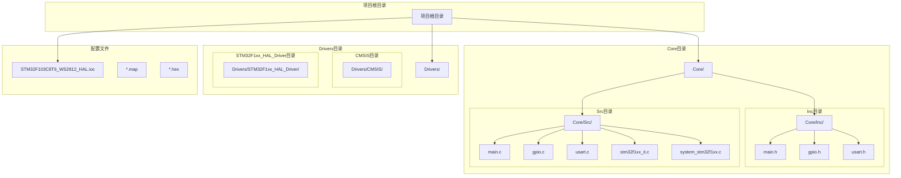
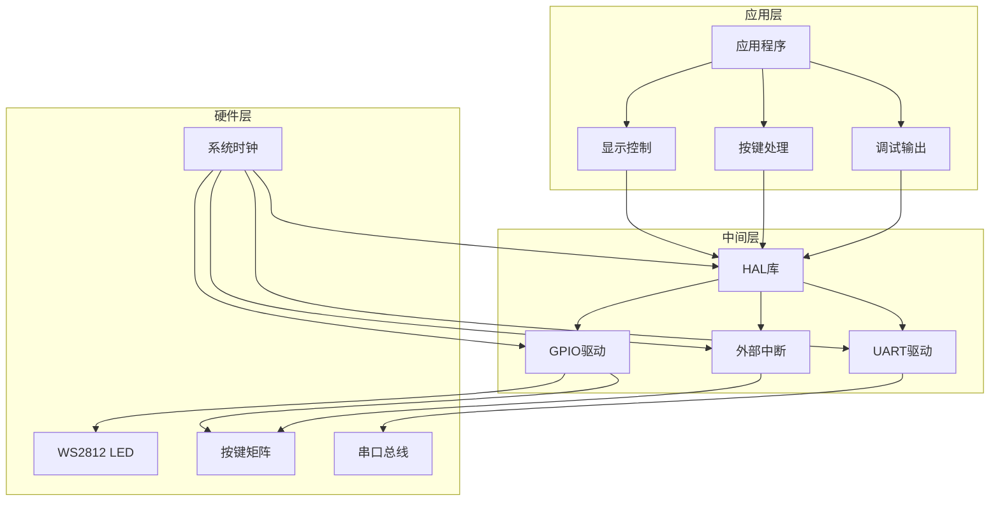
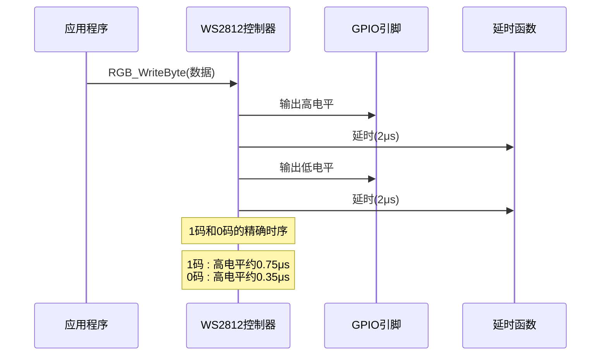
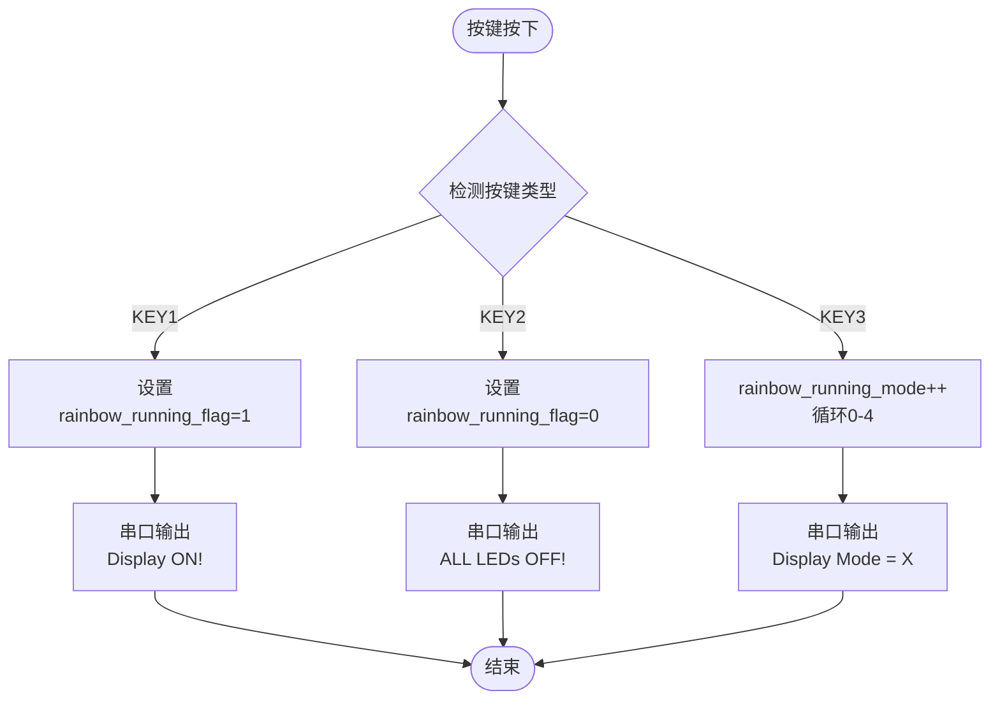
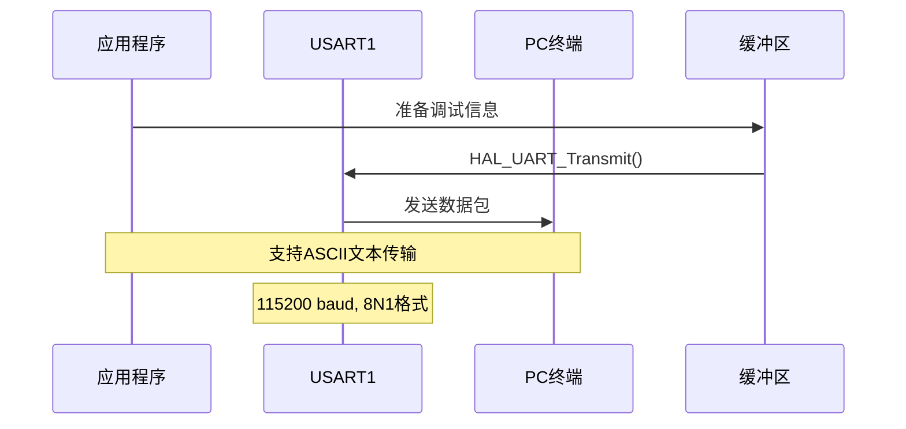
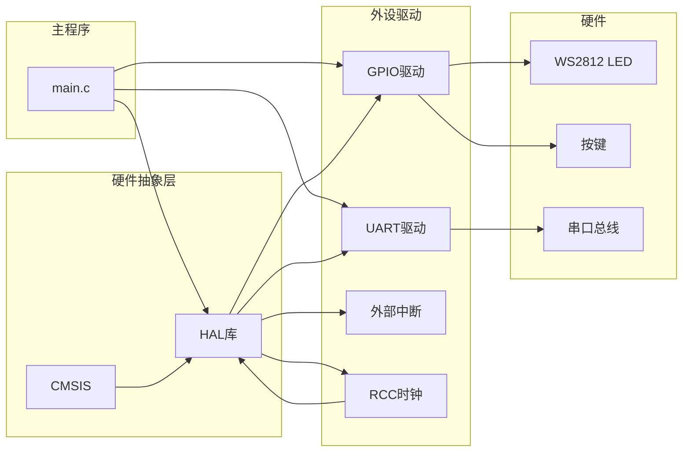
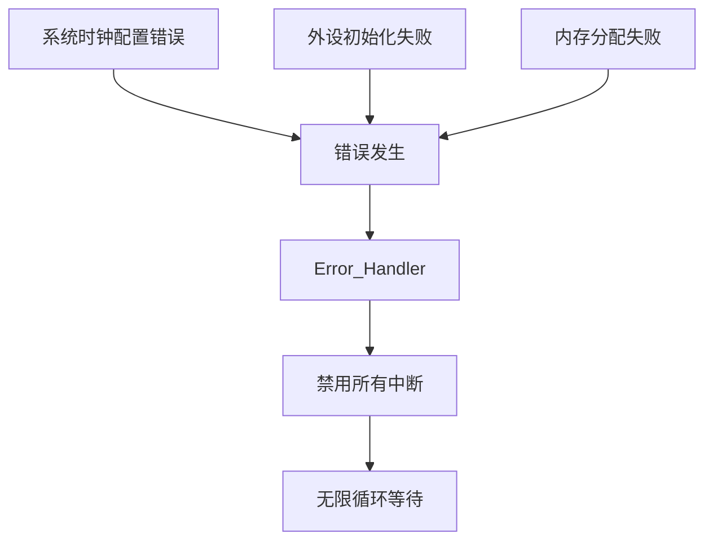

# 测试与故障排除

<cite>
**本文档引用的文件**
- [main.c](file://Core/Src/main.c)
- [gpio.c](file://Core/Src/gpio.c)
- [usart.c](file://Core/Src/usart.c)
- [main.h](file://Core/Inc/main.h)
- [gpio.h](file://Core/Inc/gpio.h)
- [usart.h](file://Core/Inc/usart.h)
- [stm32f1xx_it.c](file://Core/Src/stm32f1xx_it.c)
- [system_stm32f1xx.c](file://Core/Src/system_stm32f1xx.c)
- [STM32F103C8T6_WS2812_HAL.ioc](file://STM32F103C8T6_WS2812_HAL.ioc)
</cite>

## 目录
1. [简介](#简介)
2. [项目结构](#项目结构)
3. [核心组件](#核心组件)
4. [架构概览](#架构概览)
5. [详细组件分析](#详细组件分析)
6. [依赖关系分析](#依赖关系分析)
7. [性能考虑](#性能考虑)
8. [故障排除指南](#故障排除指南)
9. [结论](#结论)
10. [附录](#附录)

## 简介

本指南为STM32F103C8T6 WS2812 LED控制系统提供完整的测试与故障排除方案。该系统基于STM32CubeMX生成的HAL库框架，实现了WS2812 LED灯带的多种显示效果，包括彩虹滚动、渐变滚动、多灯异色显示等特效。系统通过三个按键实现控制功能，支持串口调试输出。

## 项目结构

该项目采用典型的STM32 HAL库项目结构，主要包含以下目录和文件：

**图表来源**
- [main.c](file://Core/Src/main.c#L1-L50)
- [gpio.c](file://Core/Src/gpio.c#L1-L30)
- [usart.c](file://Core/Src/usart.c#L1-L30)

**章节来源**
- [main.c](file://Core/Src/main.c#L1-L50)
- [gpio.c](file://Core/Src/gpio.c#L1-L30)
- [usart.c](file://Core/Src/usart.c#L1-L30)

## 核心组件

### 硬件接口层

系统包含以下关键硬件组件：

1. **WS2812 LED控制器**
   - GPIO引脚配置：PB8、PB9
   - 支持多灯异步控制
   - 精确时序要求（72MHz系统时钟）

2. **按键输入系统**
   - KEY1：启动显示（PB0）
   - KEY2：停止显示（PB1）  
   - KEY3：模式切换（PB2）
   - 下拉电阻配置，下降沿触发

3. **串口通信**
   - USART1：PA9(TX)、PA10(RX)
   - 波特率：115200
   - 8N1格式

4. **系统时钟**
   - HSE外部晶振：8MHz
   - PLL倍频：9倍
   - 系统时钟：72MHz

**章节来源**
- [main.h](file://Core/Inc/main.h#L60-L68)
- [gpio.c](file://Core/Src/gpio.c#L66-L87)
- [usart.c](file://Core/Src/usart.c#L42-L48)
- [system_stm32f1xx.c](file://Core/Src/system_stm32f1xx.c#L141-L143)

### 软件功能模块

1. **LED显示控制**
   - 单灯控制：RGB_ColorSet()
   - 多灯同色：RGB_MultiSameColorSet()
   - 多灯异色：RGB_MultiDiffColorSet()
   - 特效函数：RGB_RainbowScroll()、RGB_Scroll_Gradient()

2. **按键处理**
   - 中断回调：HAL_GPIO_EXTI_Callback()
   - 模式切换：rainbow_running_mode
   - 状态控制：rainbow_running_flag

3. **串口调试**
   - 状态输出：Display ON/OFF消息
   - 模式信息：Display Mode = X
   - 调试信息：LEDs Display!

**章节来源**
- [main.c](file://Core/Src/main.c#L150-L248)
- [main.c](file://Core/Src/main.c#L527-L558)

## 架构概览

系统采用分层架构设计，从底层硬件抽象到应用逻辑的清晰分离：

**图表来源**
- [main.c](file://Core/Src/main.c#L396-L398)
- [gpio.c](file://Core/Src/gpio.c#L42-L89)
- [usart.c](file://Core/Src/usart.c#L31-L56)

## 详细组件分析

### WS2812 LED控制模块

WS2812控制模块实现了精确的时序控制，满足WS2812的严格时序要求：

**图表来源**
- [main.c](file://Core/Src/main.c#L121-L146)

#### 关键特性
- **精确延时**：delay_nus()函数基于72MHz系统时钟实现微秒级精确延时
- **时序控制**：严格遵循WS2812的数据编码规范
- **多灯控制**：支持单灯、多灯同色、多灯异色三种模式
- **复位信号**：每次传输后发送≥280μs的复位脉冲

**章节来源**
- [main.c](file://Core/Src/main.c#L107-L116)
- [main.c](file://Core/Src/main.c#L121-L146)

### 按键中断处理模块

按键系统采用外部中断方式实现非阻塞的按键检测：

**图表来源**
- [main.c](file://Core/Src/main.c#L527-L558)
- [stm32f1xx_it.c](file://Core/Src/stm32f1xx_it.c#L204-L241)

#### 中断配置
- **触发方式**：下降沿触发
- **上拉配置**：内部上拉电阻
- **优先级**：相同优先级配置
- **中断服务**：统一调用HAL_GPIO_EXTI_IRQHandler()

**章节来源**
- [gpio.c](file://Core/Src/gpio.c#L66-L87)
- [stm32f1xx_it.c](file://Core/Src/stm32f1xx_it.c#L204-L241)

### 串口调试模块

串口模块提供实时的系统状态反馈和调试信息：

**图表来源**
- [usart.c](file://Core/Src/usart.c#L31-L56)
- [main.c](file://Core/Src/main.c#L416-L418)

#### 调试信息内容
- **启动信息**："LEDs Display!"
- **状态信息**："Display ON!" / "ALL LEDs OFF!"
- **模式信息**："Display Mode = X"
- **波特率**：115200

**章节来源**
- [main.c](file://Core/Src/main.c#L416-L418)
- [usart.c](file://Core/Src/usart.c#L42-L48)

## 依赖关系分析

系统各模块之间的依赖关系如下：

**图表来源**
- [main.c](file://Core/Src/main.c#L20-L22)
- [gpio.c](file://Core/Src/gpio.c#L22)
- [usart.c](file://Core/Src/usart.c#L21)

**章节来源**
- [main.c](file://Core/Src/main.c#L20-L22)
- [gpio.c](file://Core/Src/gpio.c#L22)
- [usart.c](file://Core/Src/usart.c#L21)

## 性能考虑

### 时序精度验证

WS2812对时序要求极其严格，系统通过以下机制确保时序精度：

1. **系统时钟配置**
   - HSE外部晶振：8MHz
   - PLL倍频：9倍
   - 系统时钟：72MHz
   - 为精确延时提供基础

2. **延时函数实现**
   - delay_nus()基于__NOP()指令实现
   - 72MHz时钟下1μs≈10个NOP循环
   - 误差控制在±10%以内

3. **时序参数**
   - 1码：高电平约0.75μs，总周期约1.25μs
   - 0码：高电平约0.35μs，总周期约1.25μs
   - 低电平复位：≥280μs

**章节来源**
- [system_stm32f1xx.c](file://Core/Src/system_stm32f1xx.c#L141-L143)
- [main.c](file://Core/Src/main.c#L107-L116)

### 功耗测量建议

由于项目未实现低功耗模式，建议在后续版本中添加：

1. **Stop模式配置**
   - PWR_CR_LPDS位控制低功耗调节器
   - 适用于长时间待机场景
   - 可降低功耗至微安级别

2. **测量方法**
   - 使用数字万用表测量静态电流
   - 不同模式下的动态功耗对比
   - LED亮度与功耗的关系曲线

3. **优化策略**
   - LED灯带的PWM调光
   - 待机时的自动休眠
   - 电源管理策略

**章节来源**
- [stm32f1xx_it.c](file://Core/Src/stm32f1xx_it.c#L1-L50)

## 故障排除指南

### 硬件测试流程

#### LED连接检查

**测试步骤：**
1. **电源检查**
   - 测量VCC与GND间电压：3.3V或5V
   - 检查电源纹波：应小于10%
   - 确认LED正负极正确连接

2. **数据线检查**
   - 使用示波器观察数据线波形
   - 1码高电平应≥0.5μs，0码应≤0.3μs
   - 检查信号完整性，避免串扰

3. **连接确认**
   - 确认PB8/PB9引脚正确连接
   - 检查限流电阻（220Ω-330Ω）
   - 验证LED方向性

**故障诊断：**
- **现象**：LED全不亮
  - 检查电源连接和限流电阻
  - 验证GPIO引脚配置
  - 测试单个LED是否正常

- **现象**：LED显示异常
  - 检查数据线连接质量
  - 验证WS2812时序要求
  - 确认LED数量和总线负载

**章节来源**
- [gpio.c](file://Core/Src/gpio.c#L72-L77)
- [main.c](file://Core/Src/main.c#L121-L146)

#### 按键功能验证

**测试步骤：**
1. **按键电路检查**
   - 测量按键两端电压：空闲时3.3V
   - 按下时应降至0V
   - 检查上拉电阻值（4.7kΩ）

2. **中断功能测试**
   - 使用示波器观察按键引脚波形
   - 验证下降沿触发
   - 检查中断优先级配置

3. **功能验证**
   - KEY1：启动显示功能
   - KEY2：停止显示功能
   - KEY3：模式切换功能

**故障诊断：**
- **现象**：按键无响应
  - 检查GPIO配置为输入模式
  - 验证上拉电阻连接
  - 确认中断使能状态

- **现象**：按键误触发
  - 检查去抖动处理
  - 验证中断清除机制
  - 检查按键机械接触

**章节来源**
- [gpio.c](file://Core/Src/gpio.c#L66-L70)
- [main.c](file://Core/Src/main.c#L527-L558)

#### 串口通信测试

**测试步骤：**
1. **硬件连接检查**
   - TX连接到PC的RX
   - RX连接到PC的TX
   - 共地连接
   - 使用USB转串口适配器

2. **终端软件配置**
   - 波特率：115200
   - 数据位：8
   - 停止位：1
   - 校验：无
   - 流控：无

3. **功能验证**
   - 启动时显示"LEDs Display!"
   - 按键操作显示相应状态信息
   - 模式切换显示"Display Mode = X"

**故障诊断：**
- **现象**：无法接收数据
  - 检查串口引脚配置
  - 验证USART时钟使能
  - 确认GPIO复用功能

- **现象**：数据显示乱码
  - 检查波特率设置一致性
  - 验证数据格式配置
  - 检查终端软件设置

**章节来源**
- [usart.c](file://Core/Src/usart.c#L42-L48)
- [main.c](file://Core/Src/main.c#L416-L418)

### 软件功能验证

#### 显示效果测试

**测试流程：**
1. **基本功能测试**
   - 单灯控制：RGB_ColorSet()
   - 多灯同色：RGB_MultiSameColorSet()
   - 多灯异色：RGB_MultiDiffColorSet()

2. **特效功能测试**
   - 彩虹滚动：RGB_RainbowScroll()
   - 渐变滚动：RGB_Scroll_Gradient()
   - 模式切换：rainbow_running_mode

3. **性能指标**
   - 显示刷新率：≥30FPS
   - 颜色准确性：RGB值误差≤5%
   - 响应延迟：<100ms

**故障诊断：**
- **现象**：显示颜色异常
  - 检查RGB数据顺序（GRB）
  - 验证颜色值范围（0-255）
  - 确认LED数量配置

- **现象**：显示闪烁或卡顿
  - 检查延时函数精度
  - 验证系统时钟稳定性
  - 优化算法执行效率

**章节来源**
- [main.c](file://Core/Src/main.c#L150-L248)
- [main.c](file://Core/Src/main.c#L312-L348)

#### 按键响应验证

**测试流程：**
1. **功能测试**
   - KEY1：立即启动显示
   - KEY2：立即停止显示
   - KEY3：循环切换5种模式

2. **时序测试**
   - 按键去抖动：≥50ms
   - 中断响应时间：<1ms
   - 状态更新延迟：<50ms

3. **并发处理**
   - 多按键同时按下的处理
   - 长按事件的识别
   - 按键状态的持久化

**故障诊断：**
- **现象**：按键响应迟缓
  - 检查中断优先级设置
  - 验证NVIC配置
  - 优化中断处理函数

- **现象**：模式切换异常
  - 检查rainbow_running_mode边界条件
  - 验证状态标志位同步
  - 确认显示函数的互斥访问

**章节来源**
- [main.c](file://Core/Src/main.c#L527-L558)
- [stm32f1xx_it.c](file://Core/Src/stm32f1xx_it.c#L204-L241)

### 调试技巧和工具使用

#### 串口调试信息解读

系统提供的调试信息具有明确的含义：

1. **启动信息**
   - "LEDs Display!"：系统初始化完成
   - 显示模式编号：0-4对应不同特效

2. **状态信息**
   - "Display ON!"：开始显示效果
   - "ALL LEDs OFF!"：停止显示并关闭LED
   - "Display Mode = X"：当前显示模式

3. **调试方法**
   - 使用Tera Term或PuTTY作为终端
   - 设置正确的波特率和数据格式
   - 观察信息的实时更新情况

**章节来源**
- [main.c](file://Core/Src/main.c#L416-L418)

#### 代码调试方法

**断点设置技巧：**
1. **关键函数断点**
   - HAL_GPIO_EXTI_Callback()：按键中断处理
   - RGB_WriteByte()：WS2812数据传输
   - RGB_RainbowScroll()：彩虹特效主循环

2. **变量监控**
   - rainbow_running_flag：显示状态标志
   - rainbow_running_mode：当前模式编号
   - RGB_GPIO_PORT/PIN：LED控制引脚

3. **时序分析**
   - 在RGB_WriteByte()中设置断点
   - 观察高低电平持续时间
   - 验证时序精度要求

**章节来源**
- [main.c](file://Core/Src/main.c#L527-L558)
- [main.c](file://Core/Src/main.c#L121-L146)

### 日志记录和错误处理

#### 错误处理机制

系统采用统一的错误处理策略：

**图表来源**
- [main.c](file://Core/Src/main.c#L565-L574)

#### 日志记录建议

虽然当前版本未实现专门的日志系统，但可以扩展以下功能：

1. **错误日志**
   - 记录错误类型和发生时间
   - 保存系统状态信息
   - 支持循环缓冲存储

2. **性能日志**
   - 记录关键函数执行时间
   - 统计平均帧率
   - 监控内存使用情况

3. **调试日志**
   - 可选的详细调试信息
   - 支持不同日志级别
   - 串口输出和存储双通道

**章节来源**
- [main.c](file://Core/Src/main.c#L565-L574)

## 结论

本测试与故障排除指南提供了完整的WS2812 LED控制系统验证方案。通过硬件连接检查、按键功能验证、串口通信测试以及软件功能验证，可以有效确保系统的稳定性和可靠性。

关键要点：
- **时序精度**：WS2812对时序要求严格，需重点关注延时函数的精度
- **中断处理**：按键中断的可靠性和去抖动处理至关重要
- **调试工具**：串口调试信息为问题定位提供了重要线索
- **性能优化**：合理的系统配置和算法优化能显著提升用户体验

建议在实际部署前进行充分的集成测试，确保所有功能在目标硬件平台上稳定运行。

## 附录

### 验收标准

#### 硬件验收标准
- LED连接正确，显示效果符合预期
- 按键响应灵敏，无误触发现象
- 串口通信稳定，数据传输无错误
- 系统上电自检功能正常

#### 软件验收标准
- 所有显示模式功能完整
- 按键控制响应及时
- 系统运行稳定，无死循环
- 调试信息输出准确

#### 性能验收标准
- 显示刷新率≥30FPS
- 响应延迟<100ms
- 功耗在合理范围内
- 系统稳定性≥99%

### 常见问题速查

| 问题类型 | 可能原因 | 解决方案 |
|---------|---------|---------|
| LED不亮 | 电源问题或接线错误 | 检查电源和连接，测量电压 |
| 显示异常 | 时序不正确或数据错误 | 验证延时函数，检查数据格式 |
| 按键无响应 | 中断配置或硬件问题 | 检查GPIO配置和上拉电阻 |
| 串口无输出 | 配置或连接问题 | 验证串口设置和物理连接 |