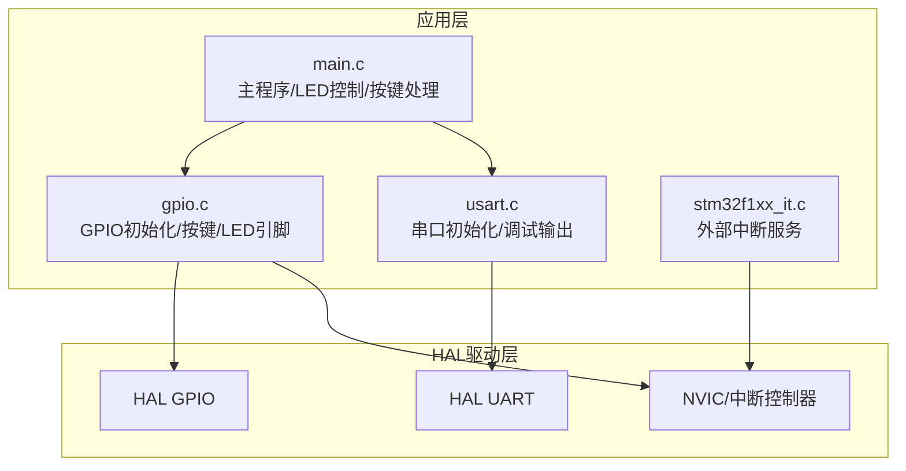
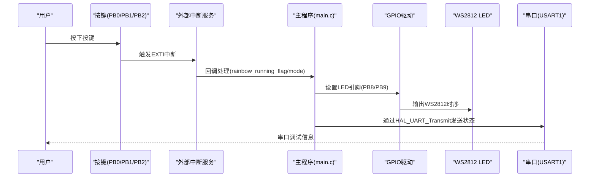
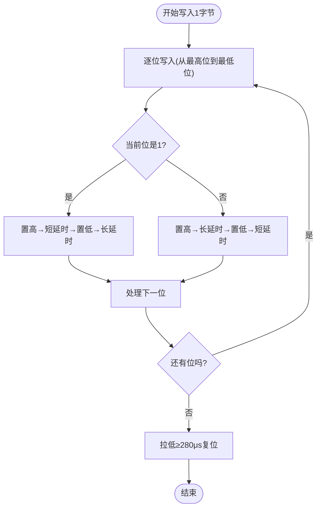
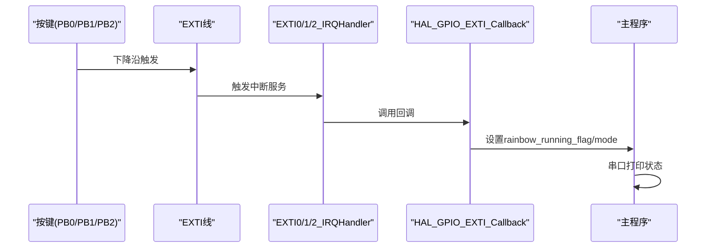
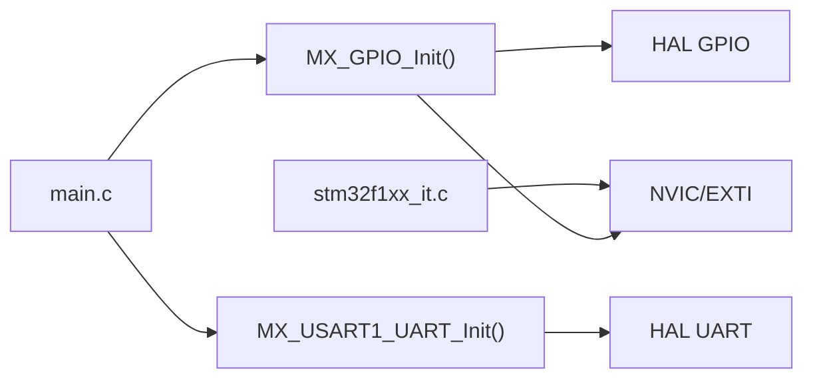
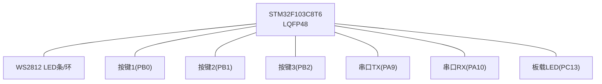

# 硬件配置与连接

<cite>
**本文引用的文件**
- [main.c](file://Core/Src/main.c)
- [gpio.c](file://Core/Src/gpio.c)
- [usart.c](file://Core/Src/usart.c)
- [main.h](file://Core/Inc/main.h)
- [gpio.h](file://Core/Inc/gpio.h)
- [usart.h](file://Core/Inc/usart.h)
- [stm32f1xx_it.c](file://Core/Src/stm32f1xx_it.c)
- [STM32F103C8T6_WS2812_HAL.ioc](file://STM32F103C8T6_WS2812_HAL.ioc)
</cite>

## 目录
1. [简介](#简介)
2. [项目结构](#项目结构)
3. [核心组件](#核心组件)
4. [架构概览](#架构概览)
5. [详细组件分析](#详细组件分析)
6. [依赖关系分析](#依赖关系分析)
7. [性能考量](#性能考量)
8. [故障排除指南](#故障排除指南)
9. [结论](#结论)
10. [附录](#附录)

## 简介
本文件面向STM32F103C8T6微控制器的WS2812 LED控制系统，提供完整的硬件配置与连接说明。内容涵盖：
- 引脚分配与电气特性（含上拉/下拉电阻）
- WS2812数据线、按键输入、串口输出的连接方式
- 电源管理、信号完整性与EMI防护建议
- 硬件故障排除指南
- 可直接用于功能验证的引脚映射表与连接图

## 项目结构
该项目采用STM32CubeMX生成的HAL工程，主要涉及以下模块：
- 主程序：LED控制逻辑、按键处理、串口通信
- GPIO初始化：按键与LED控制引脚配置
- USART初始化：串口调试输出
- 中断服务：按键外部中断处理

图表来源
- [main.c](file://Core/Src/main.c#L373-L484)
- [gpio.c](file://Core/Src/gpio.c#L42-L89)
- [usart.c](file://Core/Src/usart.c#L31-L90)
- [stm32f1xx_it.c](file://Core/Src/stm32f1xx_it.c#L204-L241)

章节来源
- [main.c](file://Core/Src/main.c#L1-L592)
- [gpio.c](file://Core/Src/gpio.c#L1-L94)
- [usart.c](file://Core/Src/usart.c#L1-L118)
- [stm32f1xx_it.c](file://Core/Src/stm32f1xx_it.c#L1-L246)

## 核心组件
- 微控制器：STM32F103C8T6（LQFP48封装）
- 外设：
  - WS2812 LED数据线：通过GPIO引脚输出（PB8/PB9）
  - 按键输入：PB0/PB1/PB2（按键1/2/3）
  - 串口输出：USART1（PA9/PA10）

章节来源
- [main.h](file://Core/Inc/main.h#L60-L68)
- [gpio.c](file://Core/Src/gpio.c#L66-L87)
- [usart.c](file://Core/Src/usart.c#L41-L84)
- [STM32F103C8T6_WS2812_HAL.ioc](file://STM32F103C8T6_WS2812_HAL.ioc#L53-L81)

## 架构概览
系统采用“按键触发→状态切换→LED更新→串口反馈”的闭环流程。WS2812数据线由GPIO直接驱动，按键通过外部中断检测，串口用于调试信息输出。

图表来源
- [stm32f1xx_it.c](file://Core/Src/stm32f1xx_it.c#L204-L241)
- [main.c](file://Core/Src/main.c#L527-L558)
- [gpio.c](file://Core/Src/gpio.c#L72-L77)
- [usart.c](file://Core/Src/usart.c#L31-L57)

## 详细组件分析

### 引脚分配与电气特性
- WS2812数据线
  - 默认使用PB9（GPIO_MODE_OUTPUT_PP，GPIO_PULLUP，高速）
  - 支持动态切换至PB8（同配置）
  - 复位信号要求低电平≥280μs
- 按键输入
  - PB0/PB1/PB2：GPIO_MODE_IT_FALLING，GPIO_PULLUP
  - 下降沿触发，按键按下时读到低电平
- 串口输出
  - PA9：USART1_TX（复用推挽输出，高速）
  - PA10：USART1_RX（浮空输入，无上下拉）
- 板载LED
  - PC13：GPIO_MODE_OUTPUT_PP，GPIO_NOPULL，低速输出

章节来源
- [main.c](file://Core/Src/main.c#L60-L62)
- [main.c](file://Core/Src/main.c#L432-L439)
- [main.c](file://Core/Src/main.c#L451-L453)
- [gpio.c](file://Core/Src/gpio.c#L66-L87)
- [usart.c](file://Core/Src/usart.c#L72-L84)
- [main.h](file://Core/Inc/main.h#L60-L68)

### WS2812驱动时序与时钟关系
WS2812对时序敏感，代码通过精确延时函数配合GPIO写操作实现“1码/0码”时序。系统时钟为72MHz，延时函数基于CPU周期实现微秒级精确延时。

图表来源
- [main.c](file://Core/Src/main.c#L121-L146)
- [main.c](file://Core/Src/main.c#L173-L176)
- [main.c](file://Core/Src/main.c#L212-L215)

章节来源
- [main.c](file://Core/Src/main.c#L107-L116)
- [main.c](file://Core/Src/main.c#L121-L146)
- [main.c](file://Core/Src/main.c#L173-L176)

### 按键输入与中断处理
- 按键配置：PB0/PB1/PB2，上拉输入，下降沿触发
- 中断优先级：相同优先级，使能对应EXTI线
- 回调处理：根据按键状态切换运行标志与显示模式，并通过串口输出提示

图表来源
- [gpio.c](file://Core/Src/gpio.c#L66-L87)
- [stm32f1xx_it.c](file://Core/Src/stm32f1xx_it.c#L204-L241)
- [main.c](file://Core/Src/main.c#L527-L558)

章节来源
- [gpio.c](file://Core/Src/gpio.c#L66-L87)
- [stm32f1xx_it.c](file://Core/Src/stm32f1xx_it.c#L204-L241)
- [main.c](file://Core/Src/main.c#L527-L558)

### 串口输出与调试
- 波特率：115200，8数据位，1停止位，无校验
- TX：PA9（复用推挽输出）
- RX：PA10（浮空输入）
- 应用中用于输出运行模式、开关提示等调试信息

章节来源
- [usart.c](file://Core/Src/usart.c#L41-L57)
- [usart.c](file://Core/Src/usart.c#L72-L84)

## 依赖关系分析
- 主程序依赖GPIO与USART初始化接口
- GPIO初始化依赖HAL GPIO驱动
- 串口初始化依赖HAL UART驱动
- 外部中断依赖NVIC与HAL EXTI回调机制

图表来源
- [main.c](file://Core/Src/main.c#L397-L398)
- [gpio.c](file://Core/Src/gpio.c#L42-L89)
- [usart.c](file://Core/Src/usart.c#L31-L57)
- [stm32f1xx_it.c](file://Core/Src/stm32f1xx_it.c#L204-L241)

章节来源
- [main.c](file://Core/Src/main.c#L397-L398)
- [gpio.c](file://Core/Src/gpio.c#L42-L89)
- [usart.c](file://Core/Src/usart.c#L31-L57)
- [stm32f1xx_it.c](file://Core/Src/stm32f1xx_it.c#L204-L241)

## 性能考量
- WS2812时序精度：依赖于72MHz系统时钟与精确延时函数，确保“1码/0码”宽度满足WS2812规格
- GPIO速度：PB8/PB9配置为高速输出，满足WS2812时序要求
- 中断响应：按键中断优先级一致，避免相互抢占导致抖动
- 串口带宽：115200波特率足以满足调试输出需求

[本节为通用性能讨论，不直接分析具体文件]

## 故障排除指南
- 现象：LED不亮或闪烁异常
  - 检查WS2812数据线是否连接到PB8或PB9，确认GPIO模式为推挽输出
  - 确认复位延时≥280μs
  - 检查系统时钟配置（PLL倍频/分频）是否正确
- 现象：按键无响应
  - 检查按键是否使用上拉输入，按下时应读到低电平
  - 确认EXTI线已使能且中断优先级设置正确
- 现象：串口无输出
  - 检查PA9/PA10引脚配置是否为复用推挽输出/浮空输入
  - 确认串口初始化参数（波特率/数据位/停止位/校验）与终端软件一致
- 现象：信号干扰/误触发
  - 在PCB布线中，按键走线尽量短且远离高频信号线
  - 在电源与地之间增加去耦电容（如0.1μF陶瓷电容）
  - 对于长线驱动，考虑在WS2812数据线上串联限流电阻（如22Ω~100Ω）

章节来源
- [gpio.c](file://Core/Src/gpio.c#L66-L87)
- [usart.c](file://Core/Src/usart.c#L41-L57)
- [main.c](file://Core/Src/main.c#L173-L176)

## 结论
本工程通过HAL库实现了对WS2812 LED的精确时序控制，结合按键输入与串口调试，提供了清晰的硬件连接与配置方案。遵循本文提供的引脚映射、电气特性与EMI防护建议，可快速搭建稳定可靠的LED控制系统原型。

[本节为总结性内容，不直接分析具体文件]

## 附录

### 硬件连接图（概念示意）

[本图为概念示意，不直接映射具体源文件]

### 引脚映射表
- WS2812数据线
  - PB8：默认LED控制引脚（可切换）
  - PB9：默认LED控制引脚（可切换）
- 按键输入
  - PB0：KEY1（上拉输入，下降沿触发）
  - PB1：KEY2（上拉输入，下降沿触发）
  - PB2：KEY3（上拉输入，下降沿触发）
- 串口输出
  - PA9：USART1_TX（复用推挽输出，高速）
  - PA10：USART1_RX（浮空输入）
- 板载LED
  - PC13：GPIO输出（低速，无上下拉）

章节来源
- [main.c](file://Core/Src/main.c#L60-L62)
- [main.c](file://Core/Src/main.c#L432-L439)
- [main.c](file://Core/Src/main.c#L451-L453)
- [main.h](file://Core/Inc/main.h#L60-L68)
- [gpio.c](file://Core/Src/gpio.c#L66-L87)
- [usart.c](file://Core/Src/usart.c#L72-L84)