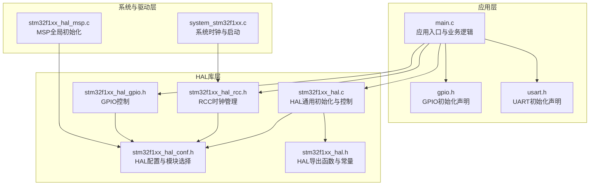
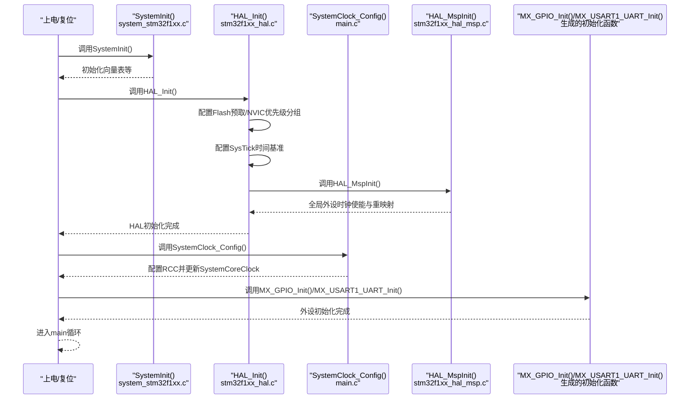
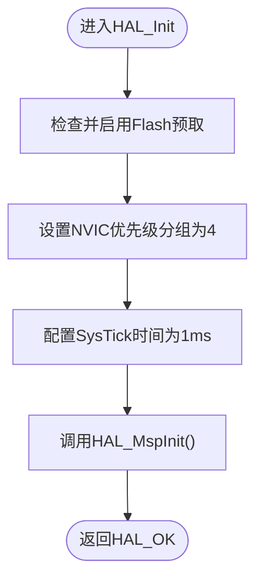
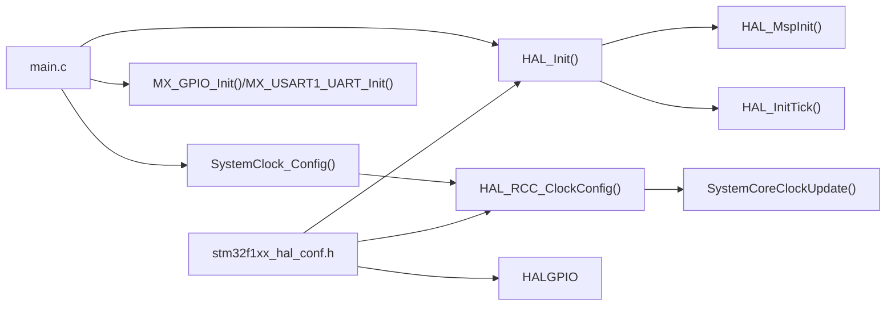

# HAL库初始化配置

<cite>
**本文档引用的文件**
- [Core/Inc/stm32f1xx_hal_conf.h](file://Core/Inc/stm32f1xx_hal_conf.h)
- [Drivers/STM32F1xx_HAL_Driver/Src/stm32f1xx_hal.c](file://Drivers/STM32F1xx_HAL_Driver/Src/stm32f1xx_hal.c)
- [Drivers/STM32F1xx_HAL_Driver/Inc/stm32f1xx_hal.h](file://Drivers/STM32F1xx_HAL_Driver/Inc/stm32f1xx_hal.h)
- [Core/Src/main.c](file://Core/Src/main.c)
- [Core/Src/system_stm32f1xx.c](file://Core/Src/system_stm32f1xx.c)
- [Core/Src/stm32f1xx_hal_msp.c](file://Core/Src/stm32f1xx_hal_msp.c)
- [Drivers/STM32F1xx_HAL_Driver/Inc/stm32f1xx_hal_rcc.h](file://Drivers/STM32F1xx_HAL_Driver/Inc/stm32f1xx_hal_rcc.h)
- [Drivers/STM32F1xx_HAL_Driver/Inc/stm32f1xx_hal_gpio.h](file://Drivers/STM32F1xx_HAL_Driver/Inc/stm32f1xx_hal_gpio.h)
- [Core/Inc/gpio.h](file://Core/Inc/gpio.h)
- [Core/Inc/usart.h](file://Core/Inc/usart.h)
- [STM32F103C8T6_WS2812_HAL.ioc](file://STM32F103C8T6_WS2812_HAL.ioc)
</cite>

## 目录
1. [简介](#简介)
2. [项目结构](#项目结构)
3. [核心组件](#核心组件)
4. [架构总览](#架构总览)
5. [详细组件分析](#详细组件分析)
6. [依赖关系分析](#依赖关系分析)
7. [性能考虑](#性能考虑)
8. [故障排查指南](#故障排查指南)
9. [结论](#结论)
10. [附录](#附录)

## 简介
本文件面向使用STM32Cube HAL库进行开发的工程师，系统性阐述STM32F1系列HAL库的初始化配置与流程，重点覆盖：
- HAL_Init()函数的作用与内部实现机制
- HAL库各模块的初始化顺序与依赖关系
- stm32f1xx_hal_conf.h配置文件中的宏定义选项及其影响
- 初始化失败的常见原因与排查方法
- 自定义HAL库配置的最佳实践
- HAL库与标准外设库的区别与优势
- 初始化流程的时间消耗分析与性能优化建议

## 项目结构
该项目基于STM32CubeMX生成，采用典型的分层组织方式：
- Core/Inc：公共头文件（含HAL配置、外设驱动接口）
- Core/Src：应用入口、系统时钟配置、外设初始化、用户逻辑
- Drivers/STM32F1xx_HAL_Driver：HAL库源码与头文件
- CMSIS：设备与内核抽象层
- MDK-ARM：Keil工程构建产物与配置
- STM32F103C8T6_WS2812_HAL.ioc：STM32CubeMX项目配置文件

图表来源
- [Core/Src/main.c](file://Core/Src/main.c#L373-L484)
- [Drivers/STM32F1xx_HAL_Driver/Src/stm32f1xx_hal.c](file://Drivers/STM32F1xx_HAL_Driver/Src/stm32f1xx_hal.c#L142-L167)
- [Core/Src/system_stm32f1xx.c](file://Core/Src/system_stm32f1xx.c#L175-L187)
- [Core/Src/stm32f1xx_hal_msp.c](file://Core/Src/stm32f1xx_hal_msp.c#L63-L82)

章节来源
- [Core/Src/main.c](file://Core/Src/main.c#L373-L484)
- [Core/Inc/stm32f1xx_hal_conf.h](file://Core/Inc/stm32f1xx_hal_conf.h#L31-L79)
- [Drivers/STM32F1xx_HAL_Driver/Inc/stm32f1xx_hal.h](file://Drivers/STM32F1xx_HAL_Driver/Inc/stm32f1xx_hal.h#L282-L314)

## 核心组件
- HAL通用初始化与控制：负责Flash预取、NVIC优先级分组、SysTick时间基准、全局MSP初始化等
- HAL配置文件：通过宏开关控制启用/禁用具体外设模块，决定编译体积与功能范围
- 系统时钟与启动：SystemInit完成外设接口初始化；SystemClock_Config通过RCC配置系统频率
- MSP全局初始化：配置电源、AFIO重映射等全局硬件资源
- 外设初始化：GPIO、UART等外设的独立初始化函数由CubeMX生成

章节来源
- [Drivers/STM32F1xx_HAL_Driver/Src/stm32f1xx_hal.c](file://Drivers/STM32F1xx_HAL_Driver/Src/stm32f1xx_hal.c#L142-L167)
- [Core/Inc/stm32f1xx_hal_conf.h](file://Core/Inc/stm32f1xx_hal_conf.h#L31-L79)
- [Core/Src/system_stm32f1xx.c](file://Core/Src/system_stm32f1xx.c#L175-L187)
- [Core/Src/stm32f1xx_hal_msp.c](file://Core/Src/stm32f1xx_hal_msp.c#L63-L82)
- [Core/Inc/gpio.h](file://Core/Inc/gpio.h#L39)
- [Core/Inc/usart.h](file://Core/Inc/usart.h#L41)

## 架构总览
下图展示从上电到应用运行的关键路径，强调HAL初始化在系统启动中的位置与作用。

图表来源
- [Core/Src/system_stm32f1xx.c](file://Core/Src/system_stm32f1xx.c#L175-L187)
- [Drivers/STM32F1xx_HAL_Driver/Src/stm32f1xx_hal.c](file://Drivers/STM32F1xx_HAL_Driver/Src/stm32f1xx_hal.c#L142-L167)
- [Core/Src/main.c](file://Core/Src/main.c#L383-L398)
- [Core/Src/stm32f1xx_hal_msp.c](file://Core/Src/stm32f1xx_hal_msp.c#L63-L82)

## 详细组件分析

### HAL_Init()函数详解
HAL_Init()是HAL库初始化的核心入口，其职责包括：
- 启用Flash预取缓冲（若配置允许）
- 设置NVIC优先级分组（固定为4组）
- 配置SysTick作为1ms时间基准（默认时钟为HSI）
- 调用HAL_MspInit()执行全局MSP初始化

图表来源
- [Drivers/STM32F1xx_HAL_Driver/Src/stm32f1xx_hal.c](file://Drivers/STM32F1xx_HAL_Driver/Src/stm32f1xx_hal.c#L142-L167)

章节来源
- [Drivers/STM32F1xx_HAL_Driver/Src/stm32f1xx_hal.c](file://Drivers/STM32F1xx_HAL_Driver/Src/stm32f1xx_hal.c#L142-L167)
- [Drivers/STM32F1xx_HAL_Driver/Inc/stm32f1xx_hal.h](file://Drivers/STM32F1xx_HAL_Driver/Inc/stm32f1xx_hal.h#L282-L286)

### HAL配置文件stm32f1xx_hal_conf.h
该文件通过宏定义控制HAL模块的启用与禁用，并提供系统配置参数：
- 模块选择宏：如HAL_RCC_MODULE_ENABLED、HAL_GPIO_MODULE_ENABLED、HAL_UART_MODULE_ENABLED等，决定编译哪些外设驱动
- 时钟与系统配置：HSE/HSI/LSE/LSI默认值、Tick中断优先级、Prefetch开关、USE_RTOS等
- 回调注册开关：针对各外设的回调注册开关，便于裁剪
- 断言宏：USE_FULL_ASSERT控制断言行为

章节来源
- [Core/Inc/stm32f1xx_hal_conf.h](file://Core/Inc/stm32f1xx_hal_conf.h#L31-L79)
- [Core/Inc/stm32f1xx_hal_conf.h](file://Core/Inc/stm32f1xx_hal_conf.h#L80-L125)
- [Core/Inc/stm32f1xx_hal_conf.h](file://Core/Inc/stm32f1xx_hal_conf.h#L127-L159)
- [Core/Inc/stm32f1xx_hal_conf.h](file://Core/Inc/stm32f1xx_hal_conf.h#L237-L364)

### 系统时钟与启动流程
- SystemInit()：在启动文件调用，完成向量表等基础初始化
- SystemClock_Config()：在main中调用，配置RCC振荡器与PLL，设置AHB/APB分频，更新SystemCoreClock
- HAL_InitTick()：在HAL_Init()中被调用，配置SysTick以1ms为基准

章节来源
- [Core/Src/system_stm32f1xx.c](file://Core/Src/system_stm32f1xx.c#L175-L187)
- [Core/Src/system_stm32f1xx.c](file://Core/Src/system_stm32f1xx.c#L224-L330)
- [Core/Src/main.c](file://Core/Src/main.c#L389-L523)
- [Drivers/STM32F1xx_HAL_Driver/Src/stm32f1xx_hal.c](file://Drivers/STM32F1xx_HAL_Driver/Src/stm32f1xx_hal.c#L234-L255)

### MSP全局初始化
HAL_MspInit()负责全局硬件资源的初始化，例如：
- 使能AFIO与PWR时钟
- 关闭JTAG-DP以释放部分IO

章节来源
- [Core/Src/stm32f1xx_hal_msp.c](file://Core/Src/stm32f1xx_hal_msp.c#L63-L82)

### 外设初始化顺序与依赖
- 应用入口：main.c中先调用HAL_Init()，再调用SystemClock_Config()，最后初始化外设（MX_GPIO_Init、MX_USART1_UART_Init）
- 依赖关系：HAL_Init()依赖SystemInit()提供的基础环境；SystemClock_Config()依赖RCC模块；外设初始化依赖对应的RCC时钟与GPIO配置

章节来源
- [Core/Src/main.c](file://Core/Src/main.c#L383-L398)
- [Core/Inc/gpio.h](file://Core/Inc/gpio.h#L39)
- [Core/Inc/usart.h](file://Core/Inc/usart.h#L41)

### HAL库与标准外设库对比
- HAL库优势：
  - 抽象统一：同一API适配多系列MCU，便于移植
  - 模块化：按需启用模块，减少编译体积
  - 可移植性：与CMSIS紧密集成，便于跨平台开发
- 标准外设库特点：
  - 更贴近寄存器操作，适合对性能极致敏感的场景
  - 配置相对繁琐，移植成本较高

章节来源
- [Core/Inc/stm32f1xx_hal_conf.h](file://Core/Inc/stm32f1xx_hal_conf.h#L31-L79)
- [Drivers/STM32F1xx_HAL_Driver/Inc/stm32f1xx_hal.h](file://Drivers/STM32F1xx_HAL_Driver/Inc/stm32f1xx_hal.h#L282-L314)

## 依赖关系分析
HAL库初始化涉及以下关键依赖链：
- main.c -> HAL_Init() -> HAL_MspInit() -> HAL_RCC_*宏与RCC配置
- main.c -> SystemClock_Config() -> HAL_RCC_ClockConfig() -> SystemCoreClockUpdate()
- 外设初始化函数（MX_GPIO_Init、MX_USART1_UART_Init）依赖HAL配置与RCC时钟

图表来源
- [Core/Src/main.c](file://Core/Src/main.c#L383-L398)
- [Drivers/STM32F1xx_HAL_Driver/Src/stm32f1xx_hal.c](file://Drivers/STM32F1xx_HAL_Driver/Src/stm32f1xx_hal.c#L142-L167)
- [Core/Src/system_stm32f1xx.c](file://Core/Src/system_stm32f1xx.c#L224-L330)
- [Core/Inc/stm32f1xx_hal_conf.h](file://Core/Inc/stm32f1xx_hal_conf.h#L237-L364)

章节来源
- [Core/Src/main.c](file://Core/Src/main.c#L383-L398)
- [Drivers/STM32F1xx_HAL_Driver/Src/stm32f1xx_hal.c](file://Drivers/STM32F1xx_HAL_Driver/Src/stm32f1xx_hal.c#L142-L167)
- [Core/Src/system_stm32f1xx.c](file://Core/Src/system_stm32f1xx.c#L224-L330)
- [Core/Inc/stm32f1xx_hal_conf.h](file://Core/Inc/stm32f1xx_hal_conf.h#L237-L364)

## 性能考虑
- 初始化耗时估算
  - HAL_Init()：主要开销来自SysTick配置与MSP初始化，通常在微秒级
  - SystemClock_Config()：涉及RCC振荡器与PLL稳定等待，典型在毫秒级
  - 外设初始化：取决于具体外设数量与复杂度，一般在微秒至毫秒级
- 优化建议
  - 启用Flash预取（PREFETCH_ENABLE=1）以提升指令缓存效率
  - 合理设置Tick中断优先级，避免与高频外设中断抢占
  - 按需启用HAL模块，减少编译体积与启动时间
  - 在非必要时关闭断言（USE_FULL_ASSERT=0），降低运行时开销

章节来源
- [Core/Inc/stm32f1xx_hal_conf.h](file://Core/Inc/stm32f1xx_hal_conf.h#L127-L135)
- [Drivers/STM32F1xx_HAL_Driver/Src/stm32f1xx_hal.c](file://Drivers/STM32F1xx_HAL_Driver/Src/stm32f1xx_hal.c#L142-L167)

## 故障排查指南
- HAL_Init()失败
  - 检查SysTick配置是否成功（HAL_SYSTICK_Config返回值）
  - 确认Tick中断优先级未越界（HAL_NVIC_SetPriority参数）
  - 排查HAL_MspInit()中时钟使能与重映射是否正确
- SystemClock_Config()失败
  - 检查HSE/HSI状态与超时配置
  - 确认PLL倍频与分频设置合理
  - 验证FLASH等待周期（FLASH_LATENCY_2）与AHB/APB分频匹配
- 外设初始化失败
  - 确认对应RCC时钟已启用
  - 检查GPIO复用与引脚配置是否符合CubeMX设置
  - 核对NVIC优先级与中断使能

章节来源
- [Drivers/STM32F1xx_HAL_Driver/Src/stm32f1xx_hal.c](file://Drivers/STM32F1xx_HAL_Driver/Src/stm32f1xx_hal.c#L234-L255)
- [Core/Src/main.c](file://Core/Src/main.c#L490-L523)
- [Core/Src/stm32f1xx_hal_msp.c](file://Core/Src/stm32f1xx_hal_msp.c#L63-L82)

## 结论
- HAL_Init()是系统启动阶段的关键节点，负责建立统一的时间基准与全局硬件环境
- 通过stm32f1xx_hal_conf.h的宏开关，可以灵活裁剪HAL模块，平衡功能与体积
- SystemClock_Config()与HAL_MspInit()分别承担时钟配置与全局硬件初始化职责
- 建议遵循“先HAL后外设”的初始化顺序，并结合项目需求进行模块裁剪与性能优化

## 附录

### HAL模块启用/禁用最佳实践
- 仅启用实际使用的外设模块，减少编译体积与启动时间
- 对于调试阶段可开启USE_FULL_ASSERT，发布版本关闭以降低开销
- 根据应用需求调整Tick频率（HAL_TICK_FREQ_10HZ/100HZ/1KHZ）

章节来源
- [Core/Inc/stm32f1xx_hal_conf.h](file://Core/Inc/stm32f1xx_hal_conf.h#L31-L79)
- [Core/Inc/stm32f1xx_hal_conf.h](file://Core/Inc/stm32f1xx_hal_conf.h#L127-L159)
- [Drivers/STM32F1xx_HAL_Driver/Inc/stm32f1xx_hal.h](file://Drivers/STM32F1xx_HAL_Driver/Inc/stm32f1xx_hal.h#L48-L54)

### STM32CubeMX配置要点
- 时钟源与倍频：HSE=8MHz，PLL=9倍，SYSCLK=72MHz
- AHB/APB分频：AHB=72MHz，APB1=36MHz，APB2=72MHz
- 外设引脚：USART1 TX/RX、按键与LED引脚配置
- NVIC优先级：SysTick优先级15，优先级分组4

章节来源
- [STM32F103C8T6_WS2812_HAL.ioc](file://STM32F103C8T6_WS2812_HAL.ioc#L122-L142)
- [STM32F103C8T6_WS2812_HAL.ioc](file://STM32F103C8T6_WS2812_HAL.ioc#L45-L47)