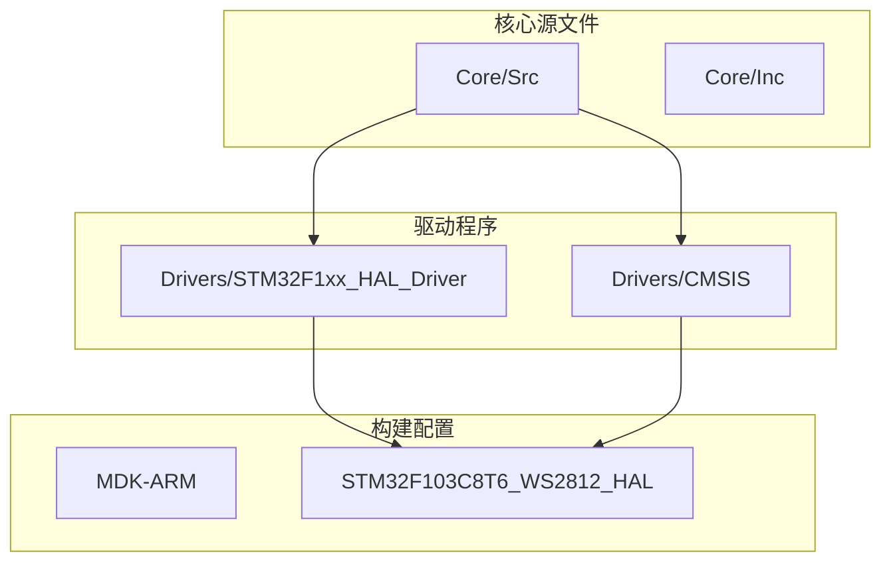
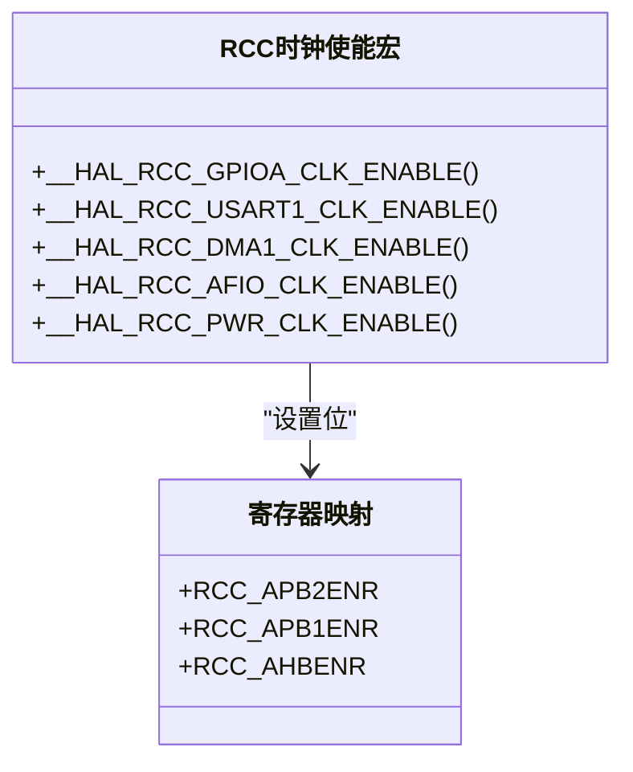
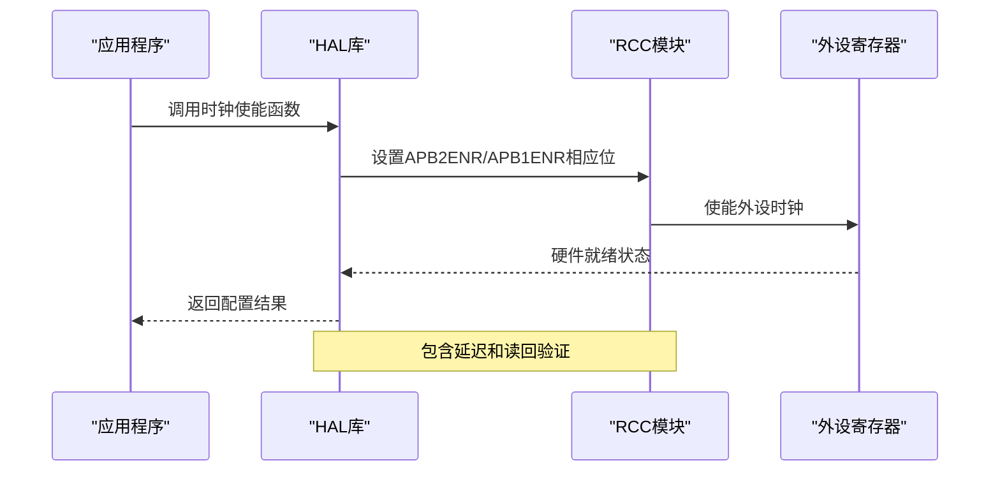
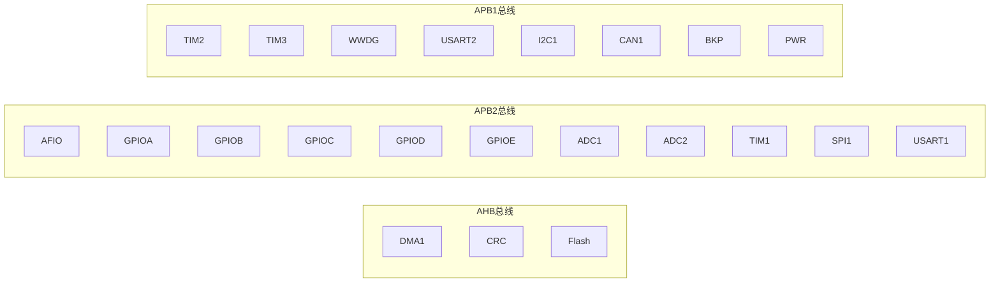
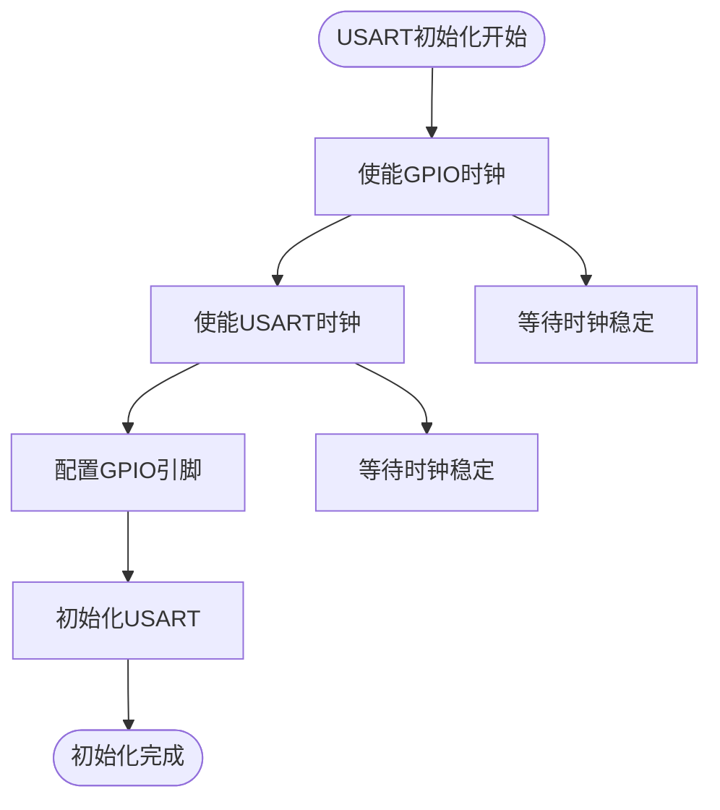
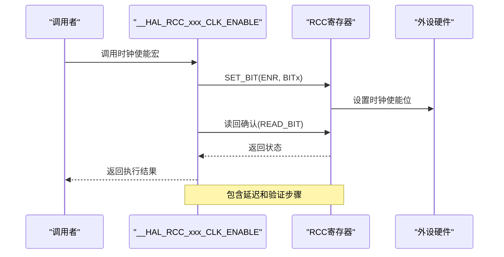
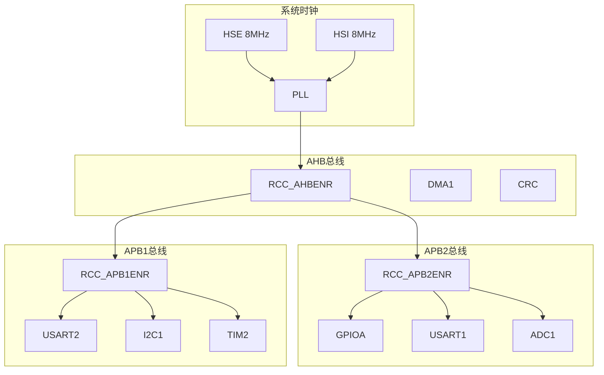
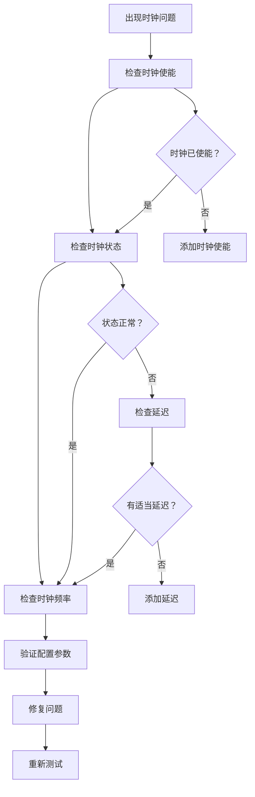

# 外设时钟使能配置

<cite>
**本文档引用的文件**
- [stm32f1xx_hal_rcc.h](file://Drivers/STM32F1xx_HAL_Driver/Inc/stm32f1xx_hal_rcc.h)
- [stm32f103xb.h](file://Drivers/CMSIS/Device/ST/STM32F1xx/Include/stm32f103xb.h)
- [main.c](file://Core/Src/main.c)
- [gpio.c](file://Core/Src/gpio.c)
- [usart.c](file://Core/Src/usart.c)
- [system_stm32f1xx.c](file://Core/Src/system_stm32f1xx.c)
- [stm32f1xx_hal_rcc.c](file://Drivers/STM32F1xx_HAL_Driver/Src/stm32f1xx_hal_rcc.c)
- [stm32f1xx_hal_conf.h](file://Core/Inc/stm32f1xx_hal_conf.h)
</cite>

## 目录
1. [简介](#简介)
2. [项目结构](#项目结构)
3. [核心组件](#核心组件)
4. [架构概览](#架构概览)
5. [详细组件分析](#详细组件分析)
6. [依赖关系分析](#依赖关系分析)
7. [性能考虑](#性能考虑)
8. [故障排除指南](#故障排除指南)
9. [结论](#结论)

## 简介

本文档详细阐述STM32F103C8T6微控制器的外设时钟使能配置，重点分析RCC_APB2ENR和RCC_APB1ENR寄存器的作用机制和配置方法。该文档基于实际项目代码，提供了完整的外设时钟配置示例，包括GPIO、USART、DMA等常用外设，并解释了时钟分频对不同外设性能的影响。

## 项目结构

该项目采用标准的STM32CubeMX项目结构，主要包含以下关键目录：

**图表来源**
- [main.c](file://Core/Src/main.c#L1-L50)
- [gpio.c](file://Core/Src/gpio.c#L1-L50)
- [usart.c](file://Core/Src/usart.c#L1-L50)

**章节来源**
- [main.c](file://Core/Src/main.c#L1-L100)
- [gpio.c](file://Core/Src/gpio.c#L1-L50)
- [usart.c](file://Core/Src/usart.c#L1-L50)

## 核心组件

### RCC时钟控制系统

STM32F103C8T6的RCC（Reset and Clock Control）模块负责管理整个系统的时钟分配。系统包含三个主要时钟域：

1. **AHB总线时钟**：连接到高性能外设如DMA、CRC等
2. **APB2总线时钟**：连接到高优先级外设如GPIO、ADC、TIM1等
3. **APB1总线时钟**：连接到低功耗外设如USART、I2C、TIM2/TIM3等

### 时钟使能宏定义

HAL库提供了统一的时钟使能接口，通过宏定义简化了寄存器操作：

**图表来源**
- [stm32f1xx_hal_rcc.h](file://Drivers/STM32F1xx_HAL_Driver/Inc/stm32f1xx_hal_rcc.h#L314-L610)

**章节来源**
- [stm32f1xx_hal_rcc.h](file://Drivers/STM32F1xx_HAL_Driver/Inc/stm32f1xx_hal_rcc.h#L314-L610)

## 架构概览

### 时钟配置流程

**图表来源**
- [stm32f1xx_hal_rcc.c](file://Drivers/STM32F1xx_HAL_Driver/Src/stm32f1xx_hal_rcc.c#L36-L46)

### 外设时钟域分布

**图表来源**
- [stm32f103xb.h](file://Drivers/CMSIS/Device/ST/STM32F1xx/Include/stm32f103xb.h#L586-L687)

**章节来源**
- [stm32f103xb.h](file://Drivers/CMSIS/Device/ST/STM32F1xx/Include/stm32f103xb.h#L586-L687)

## 详细组件分析

### GPIO外设时钟配置

GPIO外设位于APB2总线，需要通过RCC_APB2ENR寄存器进行时钟使能：

#### 寄存器位定义

| 位编号 | 外设名称 | 寄存器位定义 | 功能描述 |
|--------|----------|--------------|----------|
| 0 | AFIO | RCC_APB2ENR_AFIOEN | 备用功能I/O时钟使能 |
| 2 | GPIOA | RCC_APB2ENR_IOPAEN | I/O端口A时钟使能 |
| 3 | GPIOB | RCC_APB2ENR_IOPBEN | I/O端口B时钟使能 |
| 4 | GPIOC | RCC_APB2ENR_IOPCEN | I/O端口C时钟使能 |
| 5 | GPIOD | RCC_APB2ENR_IOPDEN | I/O端口D时钟使能 |
| 6 | GPIOE | RCC_APB2ENR_IOPEEN | I/O端口E时钟使能 |
| 9 | ADC1 | RCC_APB2ENR_ADC1EN | ADC1接口时钟使能 |
| 10 | ADC2 | RCC_APB2ENR_ADC2EN | ADC2接口时钟使能 |
| 11 | TIM1 | RCC_APB2ENR_TIM1EN | TIM1定时器时钟使能 |
| 12 | SPI1 | RCC_APB2ENR_SPI1EN | SPI1接口时钟使能 |
| 14 | USART1 | RCC_APB2ENR_USART1EN | USART1接口时钟使能 |

#### 实际配置示例

在项目中，GPIO初始化函数展示了完整的时钟使能流程：

**章节来源**
- [gpio.c](file://Core/Src/gpio.c#L47-L51)
- [stm32f103xb.h](file://Drivers/CMSIS/Device/ST/STM32F1xx/Include/stm32f103xb.h#L1277-L1314)

### USART外设时钟配置

USART外设位于APB2总线，需要通过RCC_APB2ENR寄存器进行时钟使能：

#### USART寄存器位定义

| 位编号 | 外设名称 | 寄存器位定义 | 功能描述 |
|--------|----------|--------------|----------|
| 14 | USART1 | RCC_APB2ENR_USART1EN | USART1接口时钟使能 |

#### USART配置流程

**图表来源**
- [usart.c](file://Core/Src/usart.c#L68-L89)

**章节来源**
- [usart.c](file://Core/Src/usart.c#L68-L89)

### APB1外设时钟配置

APB1总线包含多个低功耗外设，需要通过RCC_APB1ENR寄存器进行时钟使能：

#### APB1寄存器位定义

| 位编号 | 外设名称 | 寄存器位定义 | 功能描述 |
|--------|----------|--------------|----------|
| 0 | TIM2 | RCC_APB1ENR_TIM2EN | TIM2定时器时钟使能 |
| 1 | TIM3 | RCC_APB1ENR_TIM3EN | TIM3定时器时钟使能 |
| 11 | WWDG | RCC_APB1ENR_WWDGEN | 窗口看门狗时钟使能 |
| 17 | USART2 | RCC_APB1ENR_USART2EN | USART2接口时钟使能 |
| 21 | I2C1 | RCC_APB1ENR_I2C1EN | I2C1接口时钟使能 |
| 25 | CAN1 | RCC_APB1ENR_CAN1EN | CAN1接口时钟使能 |
| 27 | BKP | RCC_APB1ENR_BKPEN | 备份接口时钟使能 |
| 28 | PWR | RCC_APB1ENR_PWREN | 电源接口时钟使能 |

**章节来源**
- [stm32f103xb.h](file://Drivers/CMSIS/Device/ST/STM32F1xx/Include/stm32f103xb.h#L1319-L1346)

### 时钟使能时序要求

HAL库实现了标准的时钟使能时序，确保外设正确初始化：

**图表来源**
- [stm32f1xx_hal_rcc.h](file://Drivers/STM32F1xx_HAL_Driver/Inc/stm32f1xx_hal_rcc.h#L321-L327)

**章节来源**
- [stm32f1xx_hal_rcc.h](file://Drivers/STM32F1xx_HAL_Driver/Inc/stm32f1xx_hal_rcc.h#L321-L327)

## 依赖关系分析

### 外设时钟依赖关系

**图表来源**
- [stm32f1xx_hal_rcc.c](file://Drivers/STM32F1xx_HAL_Driver/Src/stm32f1xx_hal_rcc.c#L124-L168)

### 项目中的实际应用

在本项目中，外设时钟配置遵循以下模式：

**章节来源**
- [main.c](file://Core/Src/main.c#L396-L398)
- [gpio.c](file://Core/Src/gpio.c#L47-L51)
- [usart.c](file://Core/Src/usart.c#L68-L71)

## 性能考虑

### 时钟分频对性能的影响

STM32F103C8T6的时钟系统包含多个分频器，直接影响外设性能：

#### AHB总线时钟分频
- 无分频：1分频
- 2分频：2分频  
- 4分频：4分频
- 8分频：8分频
- 16分频：16分频
- 64分频：64分频
- 128分频：128分频
- 256分频：256分频
- 512分频：512分频

#### APB1和APB2总线时钟分频
- 1分频：不分频
- 2分频：2分频
- 4分频：4分频  
- 8分频：8分频
- 16分频：16分频

### 性能优化建议

1. **选择合适的系统时钟频率**：根据应用需求平衡性能和功耗
2. **合理配置AHB/APB分频器**：避免过高的总线频率导致EMI问题
3. **按需启用外设时钟**：只启用必要的外设，减少功耗
4. **使用时钟预分频**：为高频外设提供适当的时钟频率

**章节来源**
- [system_stm32f1xx.c](file://Core/Src/system_stm32f1xx.c#L224-L330)

## 故障排除指南

### 常见时钟配置错误

#### 错误1：忘记使能外设时钟
**症状**：外设无法正常工作，寄存器访问失败
**诊断方法**：检查对应的RCC_ENR寄存器相应位是否置位
**解决方案**：添加相应的时钟使能代码

#### 错误2：GPIO时钟未使能
**症状**：GPIO引脚输出无效，输入读数异常
**诊断方法**：验证GPIOxEN位是否置位
**解决方案**：添加GPIO时钟使能

#### 错误3：时钟使能后立即使用
**症状**：外设初始化失败或不稳定
**诊断方法**：检查是否有适当的延迟和状态检查
**解决方案**：使用HAL库提供的延迟和状态检查机制

### 诊断工具和方法

**图表来源**
- [stm32f1xx_hal_rcc.c](file://Drivers/STM32F1xx_HAL_Driver/Src/stm32f1xx_hal_rcc.c#L36-L46)

**章节来源**
- [stm32f1xx_hal_rcc.c](file://Drivers/STM32F1xx_HAL_Driver/Src/stm32f1xx_hal_rcc.c#L36-L46)

## 结论

STM32F103C8T6的外设时钟使能配置相对简单但至关重要。通过理解RCC_APB2ENR和RCC_APB1ENR寄存器的工作原理，以及HAL库提供的统一接口，开发者可以有效地管理外设时钟，实现性能和功耗的最佳平衡。

关键要点包括：
- 使用HAL库宏定义简化时钟使能操作
- 确保正确的时序要求和状态检查
- 根据应用需求合理配置时钟分频
- 按需启用外设时钟以优化功耗
- 建立完善的故障排除流程

通过遵循本文档的指导原则和最佳实践，开发者可以构建稳定可靠的嵌入式系统，充分利用STM32F103C8T6的外设能力。