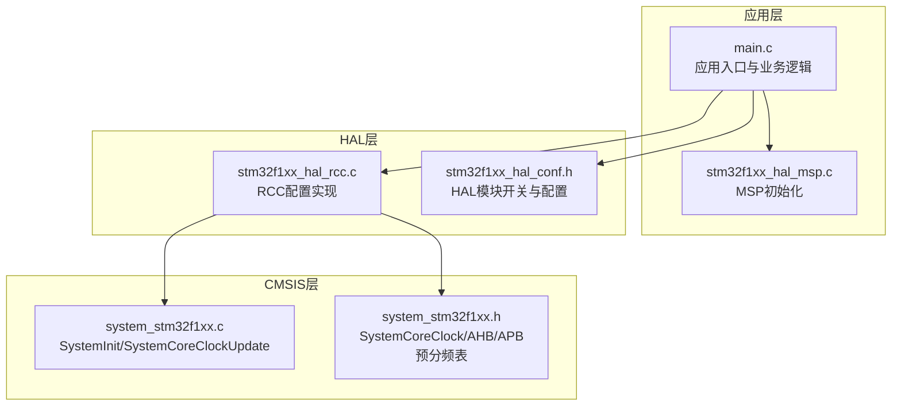
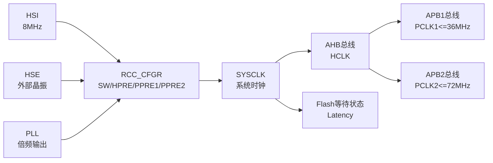
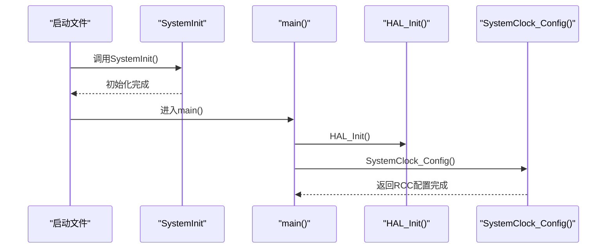
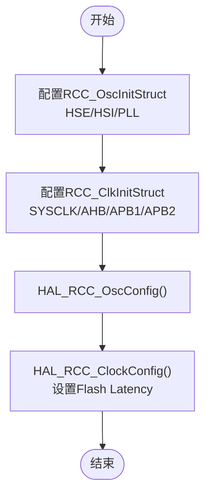
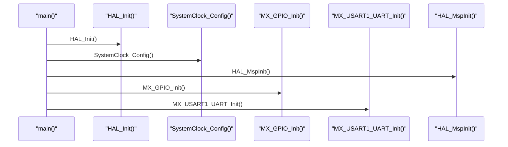
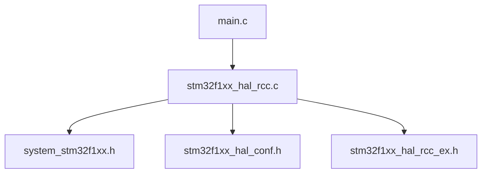

# 系统初始化与配置

<cite>
**本文引用的文件列表**
- [system_stm32f1xx.c](file://Core/Src/system_stm32f1xx.c)
- [system_stm32f1xx.h](file://Drivers/CMSIS/Device/ST/STM32F1xx/Include/system_stm32f1xx.h)
- [stm32f1xx_hal_conf.h](file://Core/Inc/stm32f1xx_hal_conf.h)
- [stm32f1xx_hal_rcc.h](file://Drivers/STM32F1xx_HAL_Driver/Inc/stm32f1xx_hal_rcc.h)
- [stm32f1xx_hal_rcc_ex.h](file://Drivers/STM32F1xx_HAL_Driver/Inc/stm32f1xx_hal_rcc_ex.h)
- [stm32f1xx_hal_rcc.c](file://Drivers/STM32F1xx_HAL_Driver/Src/stm32f1xx_hal_rcc.c)
- [main.c](file://Core/Src/main.c)
- [main.h](file://Core/Inc/main.h)
- [stm32f1xx_hal_msp.c](file://Core/Src/stm32f1xx_hal_msp.c)
</cite>

## 目录
1. [简介](#简介)
2. [项目结构](#项目结构)
3. [核心组件](#核心组件)
4. [架构总览](#架构总览)
5. [详细组件分析](#详细组件分析)
6. [依赖关系分析](#依赖关系分析)
7. [性能考量](#性能考量)
8. [故障排查指南](#故障排查指南)
9. [结论](#结论)
10. [附录](#附录)

## 简介
本文件面向STM32F103C8T6系统初始化与配置，围绕系统时钟配置展开，重点解释：
- HSE外部高速晶体振荡器的使用与PLL倍频设置
- RCC（Reset and Clock Control）配置参数与时钟树结构
- AHB/APB总线时钟分频与等待状态（Flash延迟）配置
- HAL库初始化流程（外设时钟使能与复位序列）
- 系统启动过程的时序分析与关键配置点
- 不同配置选项对功耗与性能的影响
- 配置优化建议与常见错误排查

## 项目结构
该项目采用标准CubeMX工程组织方式，关键目录与文件如下：
- Core/Src：应用入口、系统时钟配置、外设初始化与业务逻辑
- Core/Inc：公共头文件与HAL配置开关
- Drivers/STM32F1xx_HAL_Driver：HAL驱动层（含RCC）
- Drivers/CMSIS：设备与内核访问层（SystemInit、SystemCoreClock等）
- MDK-ARM：Keil编译输出与调试配置

图表来源
- [main.c](file://Core/Src/main.c#L383-L390)
- [stm32f1xx_hal_rcc.c](file://Drivers/STM32F1xx_HAL_Driver/Src/stm32f1xx_hal_rcc.c#L1-L120)
- [system_stm32f1xx.c](file://Core/Src/system_stm32f1xx.c#L175-L187)
- [system_stm32f1xx.h](file://Drivers/CMSIS/Device/ST/STM32F1xx/Include/system_stm32f1xx.h#L49-L52)

章节来源
- [main.c](file://Core/Src/main.c#L383-L390)
- [stm32f1xx_hal_conf.h](file://Core/Inc/stm32f1xx_hal_conf.h#L36-L78)

## 核心组件
- 系统时钟源与配置
  - HSE：外部高速晶体（默认8MHz，可通过HSE_VALUE调整）
  - HSI：内部高速RC（默认8MHz）
  - PLL：倍频至更高系统频率（示例配置为HSE输入、倍频9）
- 总线时钟分频
  - AHB：系统总线，可不分频或按1/2/4/8/16/64/128/256/512分频
  - APB1/APB2：外设总线，可1/2/4/8/16分频；APB1最大36MHz，APB2最大72MHz
- Flash等待状态（Latency）
  - 示例配置使用2个等待周期以适配72MHz系统频率
- HAL初始化
  - HAL_Init()后调用SystemClock_Config()完成RCC配置
  - MSP初始化启用AFIO与PWR，并禁用JTAG-SWD兼容引脚重映射

章节来源
- [main.c](file://Core/Src/main.c#L490-L523)
- [stm32f1xx_hal_rcc.h](file://Drivers/STM32F1xx_HAL_Driver/Inc/stm32f1xx_hal_rcc.h#L178-L228)
- [stm32f1xx_hal_rcc.h](file://Drivers/STM32F1xx_HAL_Driver/Inc/stm32f1xx_hal_rcc.h#L200-L228)
- [stm32f1xx_hal_conf.h](file://Core/Inc/stm32f1xx_hal_conf.h#L86-L101)

## 架构总览
STM32F103C8T6系统时钟路径与关键寄存器关系如下：
- 时钟源选择：HSI/HSE/PLL三者之一作为SYSCLK
- 预分频：AHB预分频（HPRE）、APB1/APB2预分频（PPRE1/PPRE2）
- Flash等待：根据系统频率设置等待周期（Latency）
- 外设时钟：通过AHBENR/APB1ENR/APB2ENR分别使能

图表来源
- [system_stm32f1xx.c](file://Core/Src/system_stm32f1xx.c#L141-L143)
- [system_stm32f1xx.c](file://Core/Src/system_stm32f1xx.c#L224-L330)
- [stm32f1xx_hal_rcc.h](file://Drivers/STM32F1xx_HAL_Driver/Inc/stm32f1xx_hal_rcc.h#L178-L228)

## 详细组件分析

### 系统启动与SystemInit
- 启动阶段由启动文件调用SystemInit，随后进入main
- SystemInit主要负责向量表重定位与外部SRAM控制器（如适用）初始化
- SystemCoreClockUpdate根据CFGR寄存器的SWS字段计算当前系统时钟频率

图表来源
- [system_stm32f1xx.c](file://Core/Src/system_stm32f1xx.c#L175-L187)
- [main.c](file://Core/Src/main.c#L383-L390)

章节来源
- [system_stm32f1xx.c](file://Core/Src/system_stm32f1xx.c#L175-L187)
- [system_stm32f1xx.c](file://Core/Src/system_stm32f1xx.c#L224-L330)
- [system_stm32f1xx.h](file://Drivers/CMSIS/Device/ST/STM32F1xx/Include/system_stm32f1xx.h#L49-L52)

### RCC配置参数与时钟树
- 时钟源选择
  - HSE：RCC_OscInitStruct.HSEState = RCC_HSE_ON
  - HSI：RCC_OscInitStruct.HSIState = RCC_HSI_ON
  - PLL：RCC_OscInitStruct.PLL.PLLState = RCC_PLL_ON，PLLSource = RCC_PLLSOURCE_HSE，PLL_MUL9
- 总线分频
  - AHB：RCC_ClkInitStruct.AHBCLKDivider = RCC_SYSCLK_DIV1
  - APB1：RCC_ClkInitStruct.APB1CLKDivider = RCC_HCLK_DIV2
  - APB2：RCC_ClkInitStruct.APB2CLKDivider = RCC_HCLK_DIV1
- Flash等待
  - HAL_RCC_ClockConfig(..., FLASH_LATENCY_2)

图表来源
- [main.c](file://Core/Src/main.c#L490-L523)
- [stm32f1xx_hal_rcc.h](file://Drivers/STM32F1xx_HAL_Driver/Inc/stm32f1xx_hal_rcc.h#L178-L228)

章节来源
- [main.c](file://Core/Src/main.c#L490-L523)
- [stm32f1xx_hal_rcc.h](file://Drivers/STM32F1xx_HAL_Driver/Inc/stm32f1xx_hal_rcc.h#L178-L228)

### HAL库初始化流程
- HAL_Init()：初始化Systick与Flash预取缓冲
- SystemClock_Config()：配置RCC时钟
- MX_GPIO_Init()/MX_USART1_UART_Init()：外设初始化
- MSP初始化：启用AFIO与PWR，禁用JTAG-SWD兼容引脚重映射

图表来源
- [main.c](file://Core/Src/main.c#L383-L399)
- [stm32f1xx_hal_msp.c](file://Core/Src/stm32f1xx_hal_msp.c#L63-L82)

章节来源
- [main.c](file://Core/Src/main.c#L383-L399)
- [stm32f1xx_hal_msp.c](file://Core/Src/stm32f1xx_hal_msp.c#L63-L82)

### 外设时钟使能与复位序列
- 外设时钟使能宏
  - AHB：__HAL_RCC_DMA1_CLK_ENABLE()、__HAL_RCC_CRC_CLK_ENABLE()等
  - APB1：__HAL_RCC_TIM2_CLK_ENABLE()、__HAL_RCC_USART2_CLK_ENABLE()等
  - APB2：__HAL_RCC_GPIOA_CLK_ENABLE()、__HAL_RCC_USART1_CLK_ENABLE()等
- 复位序列
  - 强制/释放复位：__HAL_RCC_APB1_FORCE_RESET()、__HAL_RCC_APB1_RELEASE_RESET()等

章节来源
- [stm32f1xx_hal_rcc.h](file://Drivers/STM32F1xx_HAL_Driver/Inc/stm32f1xx_hal_rcc.h#L321-L357)
- [stm32f1xx_hal_rcc.h](file://Drivers/STM32F1xx_HAL_Driver/Inc/stm32f1xx_hal_rcc.h#L383-L454)
- [stm32f1xx_hal_rcc.h](file://Drivers/STM32F1xx_HAL_Driver/Inc/stm32f1xx_hal_rcc.h#L486-L575)
- [stm32f1xx_hal_rcc.h](file://Drivers/STM32F1xx_HAL_Driver/Inc/stm32f1xx_hal_rcc.h#L611-L669)

### 系统启动时序与关键配置点
- 启动文件调用SystemInit，随后HAL_Init()
- SystemClock_Config()中先配置振荡器，再配置总线时钟与Flash等待
- HAL_RCC_ClockConfig返回后，SystemCoreClock已更新，可用于SysTick等

章节来源
- [system_stm32f1xx.c](file://Core/Src/system_stm32f1xx.c#L175-L187)
- [main.c](file://Core/Src/main.c#L383-L390)
- [main.c](file://Core/Src/main.c#L490-L523)

## 依赖关系分析
- main.c依赖HAL_RCC接口进行时钟配置
- HAL_RCC实现依赖CMSIS层的SystemCoreClock/AHB/APB预分频表
- HAL_RCC扩展接口（RCCEx）提供额外功能（如USB/I2S/PLL2等）

图表来源
- [main.c](file://Core/Src/main.c#L383-L390)
- [stm32f1xx_hal_rcc.c](file://Drivers/STM32F1xx_HAL_Driver/Src/stm32f1xx_hal_rcc.c#L1-L120)
- [system_stm32f1xx.h](file://Drivers/CMSIS/Device/ST/STM32F1xx/Include/system_stm32f1xx.h#L49-L52)
- [stm32f1xx_hal_conf.h](file://Core/Inc/stm32f1xx_hal_conf.h#L36-L78)
- [stm32f1xx_hal_rcc_ex.h](file://Drivers/STM32F1xx_HAL_Driver/Inc/stm32f1xx_hal_rcc_ex.h#L1-L80)

章节来源
- [main.c](file://Core/Src/main.c#L383-L390)
- [stm32f1xx_hal_rcc.c](file://Drivers/STM32F1xx_HAL_Driver/Src/stm32f1xx_hal_rcc.c#L1-L120)
- [system_stm32f1xx.h](file://Drivers/CMSIS/Device/ST/STM32F1xx/Include/system_stm32f1xx.h#L49-L52)
- [stm32f1xx_hal_conf.h](file://Core/Inc/stm32f1xx_hal_conf.h#L36-L78)
- [stm32f1xx_hal_rcc_ex.h](file://Drivers/STM32F1xx_HAL_Driver/Inc/stm32f1xx_hal_rcc_ex.h#L1-L80)

## 性能考量
- 功耗与性能平衡
  - 提高SYSCLK可提升处理性能，但会增加功耗；降低AHB/APB分频可提升外设速度，但可能超过APB1/2限制
  - 在72MHz下，建议使用2个等待周期（Latency_2）以保证稳定性
- 时钟源选择
  - HSE更稳定且精度高，适合对外设时序要求严格的场景
  - HSI无需外部器件，成本低但精度与稳定性略差
- 外设时钟管理
  - 仅启用所需外设时钟，避免不必要的功耗
  - 对高频外设（如SPI/USART）合理设置APB分频，避免超频

## 故障排查指南
- HSE无法稳定启动
  - 检查HSE_VALUE是否与实际晶振频率一致
  - 确认外部负载电容与PCB布局符合要求
- PLL无法锁定
  - 检查PLL输入是否来自HSE且未被分频（或正确配置预分频）
  - 确认PLL倍频系数在芯片允许范围内
- 系统频率异常
  - 使用HAL_RCC_GetSysClockFreq()确认当前系统频率
  - 检查AHB/APB分频与Flash等待设置是否匹配
- 外设工作异常
  - 确认对应AHB/APB时钟已使能
  - 检查复位寄存器是否被意外置位

章节来源
- [system_stm32f1xx.c](file://Core/Src/system_stm32f1xx.c#L224-L330)
- [stm32f1xx_hal_rcc.h](file://Drivers/STM32F1xx_HAL_Driver/Inc/stm32f1xx_hal_rcc.h#L1170-L1175)
- [stm32f1xx_hal_rcc.h](file://Drivers/STM32F1xx_HAL_Driver/Inc/stm32f1xx_hal_rcc.h#L321-L357)

## 结论
本项目基于STM32F103C8T6实现了清晰的系统初始化与RCC配置流程：以HSE为主时钟源，经PLL倍频至72MHz，配合合理的AHB/APB分频与Flash等待设置，确保系统稳定运行。通过HAL库封装，外设时钟使能与复位序列易于管理。开发者可根据具体需求调整HSE频率、PLL倍频与总线分频策略，在性能与功耗之间取得最佳平衡。

## 附录
- 关键配置项速查
  - HSE：RCC_OscInitStruct.HSEState、HSE_VALUE
  - PLL：RCC_OscInitStruct.PLL.PLLSource、RCC_OscInitStruct.PLL.PLLMUL
  - 总线：RCC_ClkInitStruct.AHBCLKDivider、APB1CLKDivider、APB2CLKDivider
  - Flash：HAL_RCC_ClockConfig(..., FLASH_LATENCY_2)

章节来源
- [main.c](file://Core/Src/main.c#L490-L523)
- [stm32f1xx_hal_conf.h](file://Core/Inc/stm32f1xx_hal_conf.h#L86-L101)