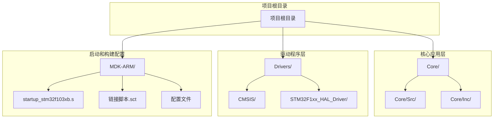
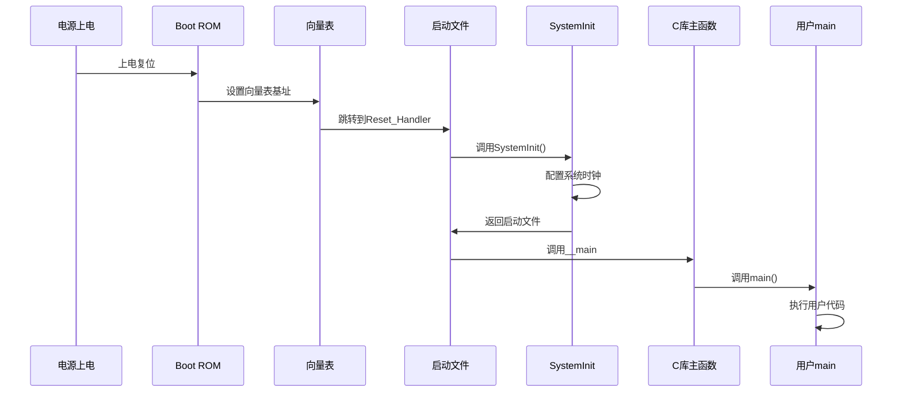
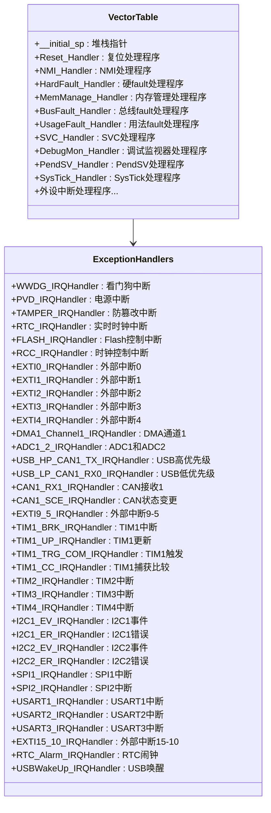
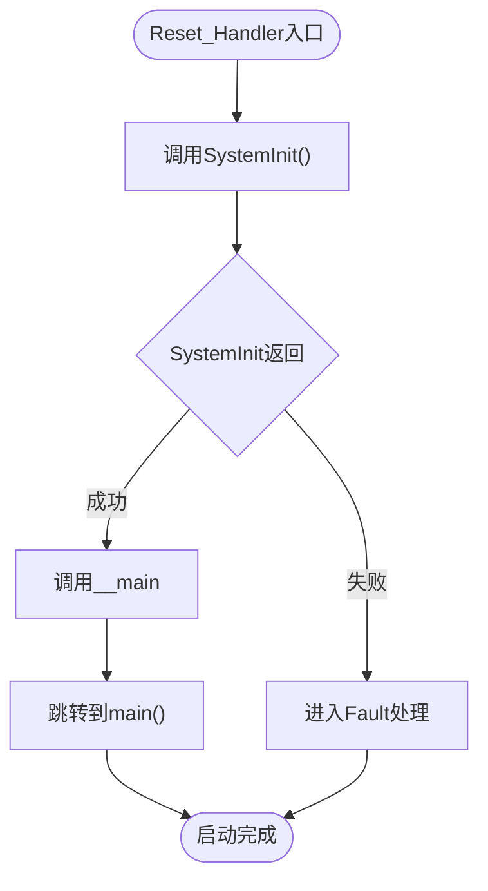
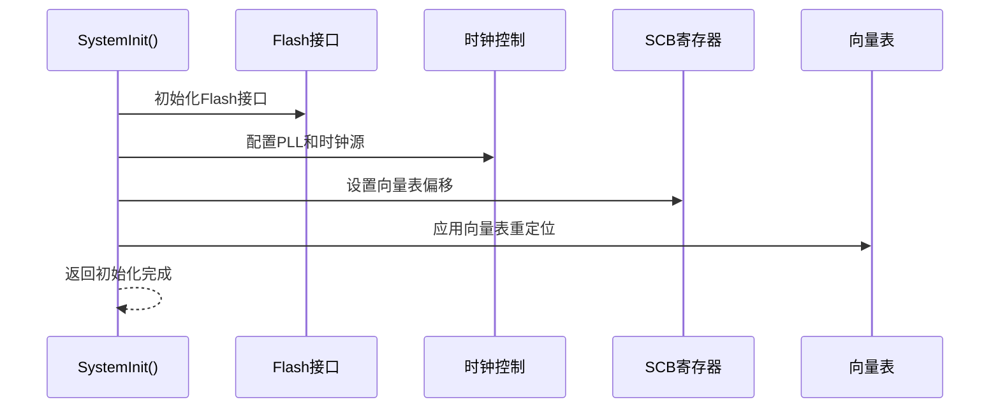
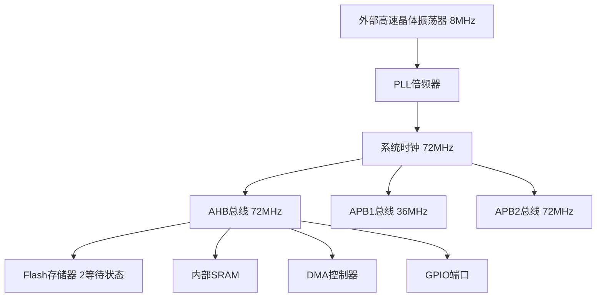
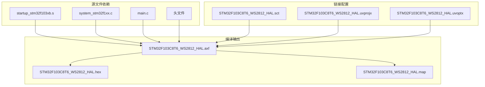
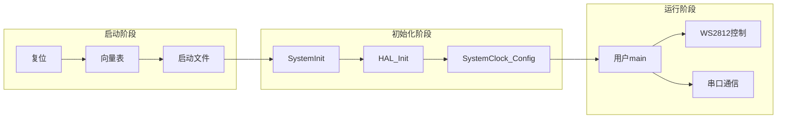
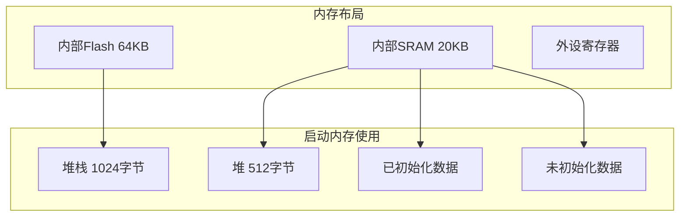

# 系统启动时序分析

<cite>
**本文档引用的文件**
- [startup_stm32f103xb.s](file://MDK-ARM/startup_stm32f103xb.s)
- [system_stm32f1xx.c](file://Core/Src/system_stm32f1xx.c)
- [system_stm32f1xx.h](file://Drivers/CMSIS/Device/ST/STM32F1xx/Include/system_stm32f1xx.h)
- [main.c](file://Core/Src/main.c)
- [STM32F103C8T6_WS2812_HAL.sct](file://MDK-ARM/STM32F103C8T6_WS2812_HAL/STM32F103C8T6_WS2812_HAL.sct)
- [STM32F103C8T6_WS2812_HAL.map](file://MDK-ARM/STM32F103C8T6_WS2812_HAL/STM32F103C8T6_WS2812_HAL.map)
- [STM32F103C8T6_WS2812_HAL.uvoptx](file://MDK-ARM/STM32F103C8T6_WS2812_HAL.uvoptx)
- [STM32F103C8T6_WS2812_HAL.uvprojx](file://MDK-ARM/STM32F103C8T6_WS2812_HAL.uvprojx)
</cite>

## 目录
1. [简介](#简介)
2. [项目结构](#项目结构)
3. [核心组件](#核心组件)
4. [架构概览](#架构概览)
5. [详细组件分析](#详细组件分析)
6. [依赖关系分析](#依赖关系分析)
7. [性能考虑](#性能考虑)
8. [故障排除指南](#故障排除指南)
9. [结论](#结论)
10. [附录](#附录)

## 简介

本文档深入分析STM32F103C8T6微控制器的系统启动时序，详细解释从上电复位到main()函数执行的完整启动流程。该分析涵盖启动文件、系统初始化、用户代码执行等各个阶段，并重点分析startup_stm32f103xb.s汇编文件中的关键初始化步骤。

STM32F103C8T6基于ARM Cortex-M3内核，具有32位RISC处理器特性，支持多种启动模式和复杂的时钟系统配置。本文将详细阐述中断向量表设置、异常处理机制、系统时钟配置以及main()函数之前的初始化顺序。

## 项目结构

该项目采用标准的STM32CubeMX项目结构，主要包含以下关键目录：



**图表来源**
- [startup_stm32f103xb.s](file://MDK-ARM/startup_stm32f103xb.s#L1-L306)
- [system_stm32f1xx.c](file://Core/Src/system_stm32f1xx.c#L1-L407)

**章节来源**
- [startup_stm32f103xb.s](file://MDK-ARM/startup_stm32f103xb.s#L1-L306)
- [system_stm32f1xx.c](file://Core/Src/system_stm32f1xx.c#L1-L407)

## 核心组件

### 启动文件组件

启动文件startup_stm32f103xb.s是整个系统启动流程的核心，负责：

1. **堆栈和堆内存初始化** - 设置初始堆栈指针和堆区域
2. **中断向量表配置** - 定义所有异常和中断处理程序的入口地址
3. **系统初始化调用** - 调用SystemInit()进行硬件初始化
4. **跳转到C库主函数** - 最终跳转到__main，然后调用main()

### 系统初始化组件

system_stm32f1xx.c提供了完整的系统初始化功能：

1. **SystemInit()函数** - 配置系统时钟、AHB/APB预分频器和Flash等待状态
2. **SystemCoreClockUpdate()函数** - 动态更新系统核心时钟频率
3. **Vector Table重定位** - 支持将中断向量表移动到RAM或外部存储器

### 用户应用程序组件

main.c包含了完整的应用程序逻辑，包括：
- HAL库初始化
- 系统时钟配置
- 外设初始化
- 主要业务逻辑实现

**章节来源**
- [startup_stm32f103xb.s](file://MDK-ARM/startup_stm32f103xb.s#L54-L136)
- [system_stm32f1xx.c](file://Core/Src/system_stm32f1xx.c#L175-L187)
- [main.c](file://Core/Src/main.c#L373-L484)

## 架构概览

STM32F103C8T6的启动架构遵循ARM Cortex-M3标准，采用分层设计：



**图表来源**
- [startup_stm32f103xb.s](file://MDK-ARM/startup_stm32f103xb.s#L127-L136)
- [system_stm32f1xx.c](file://Core/Src/system_stm32f1xx.c#L175-L187)

### 启动模式分析

STM32F103C8T6支持三种主要启动模式：

| 启动模式 | 地址范围 | 应用场景 | 特点 |
|---------|----------|----------|------|
| 从闪存启动 | 0x08000000 | 正常应用程序运行 | 默认启动方式，代码存储在内部Flash |
| 从系统存储器启动 | 0x1FFF0000 | 在线系统编程 | 通过串口或USB接口进行固件更新 |
| 从SRAM启动 | 0x20000000 | 特殊应用或调试 | 快速启动，但不持久化 |

**章节来源**
- [STM32F103C8T6_WS2812_HAL.sct](file://MDK-ARM/STM32F103C8T6_WS2812_HAL/STM32F103C8T6_WS2812_HAL.sct#L5-L15)

## 详细组件分析

### 启动文件详细分析

#### 中断向量表结构

启动文件定义了完整的中断向量表，包含19个异常和68个外设中断：



**图表来源**
- [startup_stm32f103xb.s](file://MDK-ARM/startup_stm32f103xb.s#L60-L121)

#### Reset_Handler执行流程

Reset_Handler是启动过程的核心处理程序：



**图表来源**
- [startup_stm32f103xb.s](file://MDK-ARM/startup_stm32f103xb.s#L127-L136)

**章节来源**
- [startup_stm32f103xb.s](file://MDK-ARM/startup_stm32f103xb.s#L127-L136)

### 系统初始化详细分析

#### SystemInit()函数实现

SystemInit()函数负责配置系统的基本硬件状态：



**图表来源**
- [system_stm32f1xx.c](file://Core/Src/system_stm32f1xx.c#L175-L187)

#### 系统时钟配置

系统时钟配置采用HSE作为主时钟源，通过PLL倍频到72MHz：



**图表来源**
- [main.c](file://Core/Src/main.c#L490-L523)

**章节来源**
- [system_stm32f1xx.c](file://Core/Src/system_stm32f1xx.c#L175-L187)
- [main.c](file://Core/Src/main.c#L490-L523)

### 用户代码执行分析

#### main()函数初始化流程

main()函数执行严格的初始化顺序：

```mermaid
sequenceDiagram
participant main as main()
participant HAL as HAL_Init()
participant Clock as SystemClock_Config()
participant Peripherals as 外设初始化
participant Loop as 主循环
main->>HAL : HAL_Init() - 初始化HAL库
HAL->>Clock : 配置系统时钟
Clock->>Peripherals : 初始化GPIO和UART
Peripherals->>Loop : 进入主循环
Loop->>Loop : 执行WS2812控制逻辑
```

**图表来源**
- [main.c](file://Core/Src/main.c#L373-L484)

**章节来源**
- [main.c](file://Core/Src/main.c#L373-L484)

## 依赖关系分析

### 编译时依赖关系



**图表来源**
- [STM32F103C8T6_WS2812_HAL.map](file://MDK-ARM/STM32F103C8T6_WS2812_HAL/STM32F103C8T6_WS2812_HAL.map#L1-L200)
- [STM32F103C8T6_WS2812_HAL.sct](file://MDK-ARM/STM32F103C8T6_WS2812_HAL/STM32F103C8T6_WS2812_HAL.sct#L1-L17)

### 运行时依赖关系



**图表来源**
- [startup_stm32f103xb.s](file://MDK-ARM/startup_stm32f103xb.s#L127-L136)
- [main.c](file://Core/Src/main.c#L373-L484)

**章节来源**
- [STM32F103C8T6_WS2812_HAL.map](file://MDK-ARM/STM32F103C8T6_WS2812_HAL/STM32F103C8T6_WS2812_HAL.map#L1-L200)

## 性能考虑

### 启动时间优化

基于分析，启动过程的关键性能影响因素：

1. **Flash等待状态配置** - 72MHz时钟需要2个等待状态
2. **PLL锁定时间** - HSE到PLL的稳定时间
3. **外设初始化顺序** - 减少不必要的延迟
4. **堆栈和堆大小** - 合理配置避免内存浪费

### 内存使用优化



**图表来源**
- [startup_stm32f103xb.s](file://MDK-ARM/startup_stm32f103xb.s#L32-L48)

### 启动性能优化建议

1. **减少启动延迟** - 优化SystemInit()中的初始化步骤
2. **合理配置时钟** - 使用最适合应用需求的时钟配置
3. **内存池管理** - 预分配必要的内存空间
4. **外设按需初始化** - 只初始化实际使用的外设

## 故障排除指南

### 常见启动失败原因

#### 1. 时钟配置错误
- **症状** - 系统无法稳定运行，频繁复位
- **原因** - HSE频率设置不正确或PLL配置错误
- **解决方案** - 检查外部晶振频率和PLL倍频设置

#### 2. Flash等待状态不足
- **症状** - 程序执行不稳定，数据读取错误
- **原因** - 72MHz时钟下Flash等待状态不足
- **解决方案** - 确保配置了正确的等待状态

#### 3. 向量表重定位问题
- **症状** - 中断处理异常，系统行为不可预测
- **原因** - 向量表地址配置错误
- **解决方案** - 检查VECTOR_TABLE设置

#### 4. 堆栈溢出
- **症状** - 系统崩溃，堆栈指针异常
- **原因** - 堆栈大小配置过小
- **解决方案** - 增加堆栈大小配置

### 调试方法

#### 1. 启用调试信息
- 在uVision中启用详细的调试选项
- 配置断点在关键初始化位置
- 监控寄存器状态变化

#### 2. 使用系统视图
- 利用ST-Link调试器的系统视图功能
- 观察时钟配置寄存器状态
- 检查中断向量表内容

#### 3. 内存映射分析
- 分析.map文件了解内存使用情况
- 检查堆栈和堆的使用情况
- 验证数据段和代码段的布局

**章节来源**
- [STM32F103C8T6_WS2812_HAL.uvoptx](file://MDK-ARM/STM32F103C8T6_WS2812_HAL.uvoptx#L1-L200)
- [STM32F103C8T6_WS2812_HAL.uvprojx](file://MDK-ARM/STM32F103C8T6_WS2812_HAL.uvprojx#L1-L200)

## 结论

STM32F103C8T6的启动时序是一个精心设计的分层架构，从底层硬件初始化到高层应用执行形成了完整的执行链路。通过深入分析startup_stm32f103xb.s、system_stm32f1xx.c和main.c三个关键组件，我们可以看到：

1. **启动文件**负责建立基本的运行环境，包括堆栈、向量表和基础硬件初始化
2. **系统初始化**确保硬件配置正确，特别是时钟系统和存储器接口
3. **用户代码**在严格的初始化顺序下开始执行，确保系统的稳定性和可靠性

该启动架构的优势在于其模块化设计，每个组件都有明确的职责分工，便于维护和扩展。同时，通过合理的配置和优化，可以实现高效的启动性能和稳定的运行表现。

对于开发者而言，理解这个启动时序有助于更好地进行系统调试、性能优化和故障排除，特别是在嵌入式应用开发中具有重要的指导意义。

## 附录

### 关键启动参数参考

| 参数名称 | 默认值 | 描述 |
|---------|--------|------|
| 堆栈大小 | 1024字节 | 主堆栈容量 |
| 堆大小 | 512字节 | 动态内存分配区 |
| 系统时钟 | 72MHz | 主系统频率 |
| Flash等待状态 | 2 | 72MHz时钟下的等待周期 |
| AHB预分频 | 1 | AHB总线时钟分频 |
| APB1预分频 | 2 | APB1总线时钟分频 |
| APB2预分频 | 1 | APB2总线时钟分频 |

### 启动时序关键时间点

1. **上电复位** - 约10-20μs
2. **向量表加载** - 约1-2μs
3. **SystemInit()执行** - 约100-200μs
4. **HAL库初始化** - 约50-100μs
5. **外设初始化** - 约10-50μs
6. **main()函数入口** - 约1-5μs

这些时间点构成了完整的启动时序，为系统性能优化提供了量化依据。