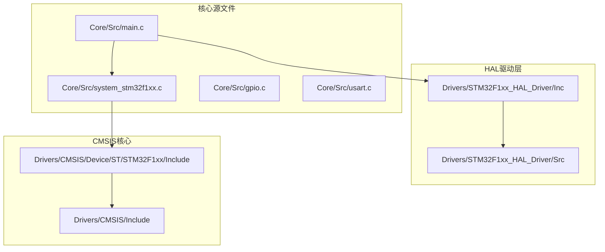
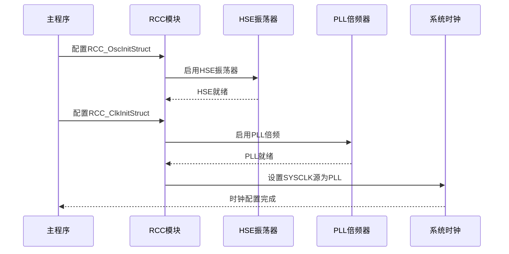
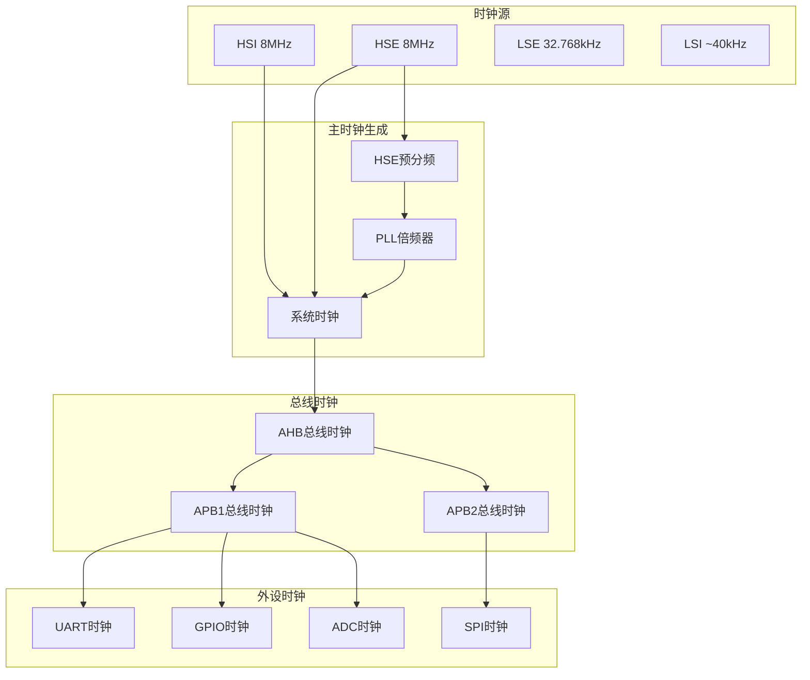
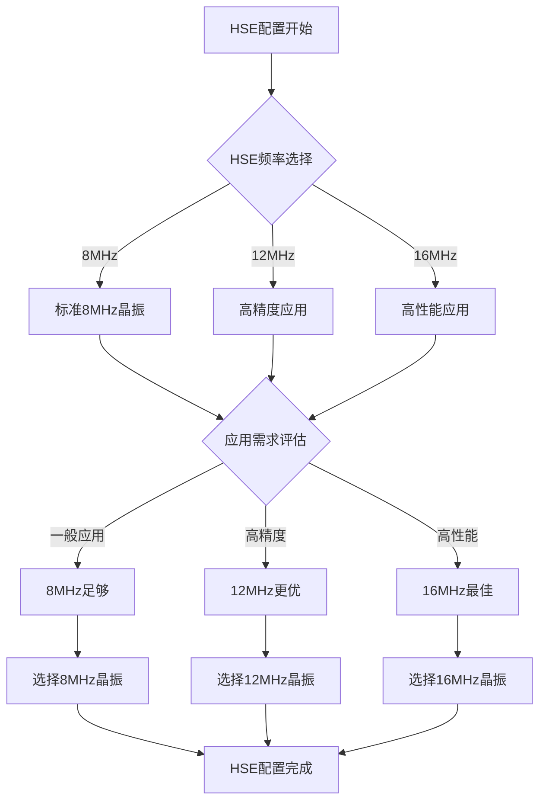
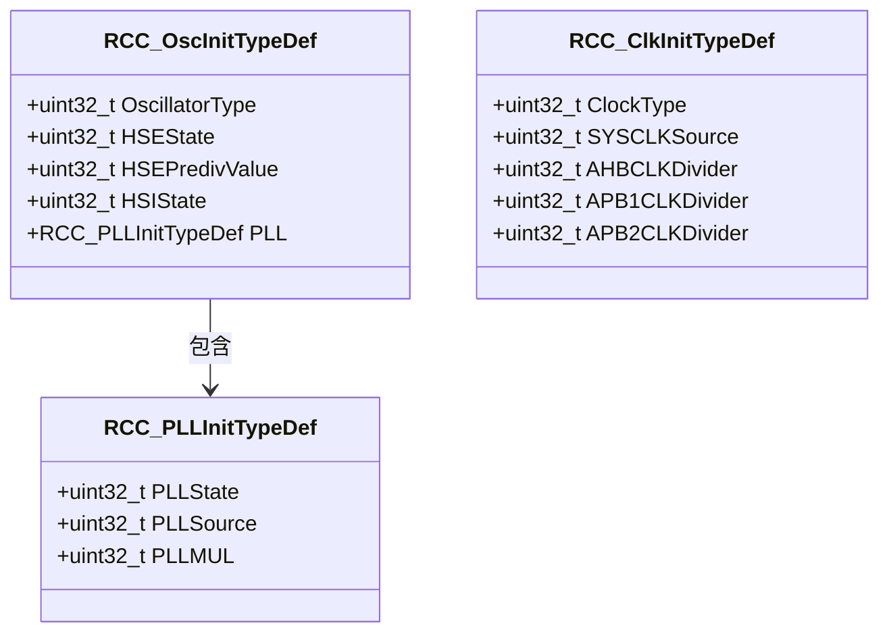
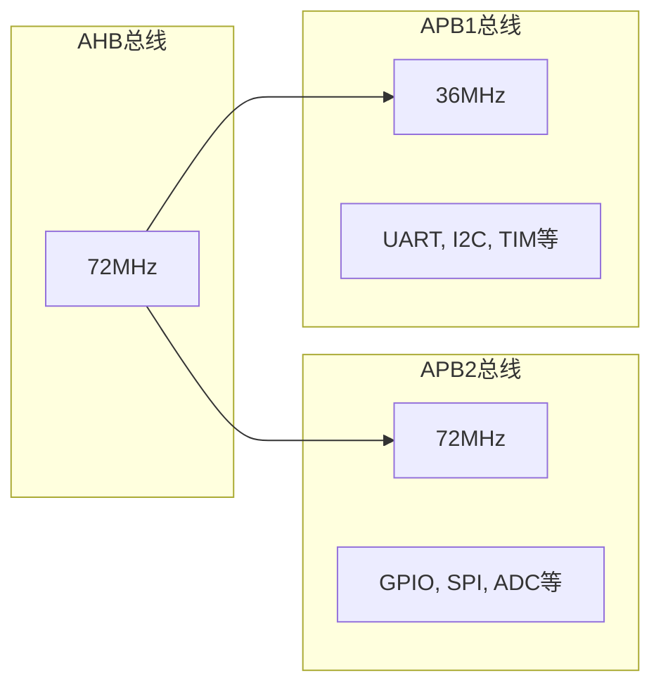
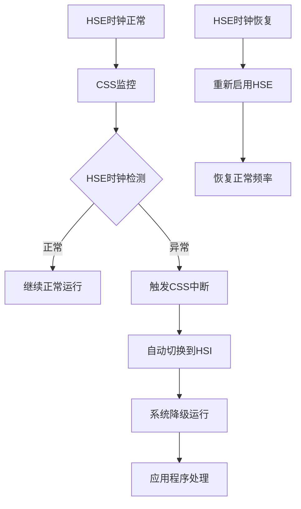
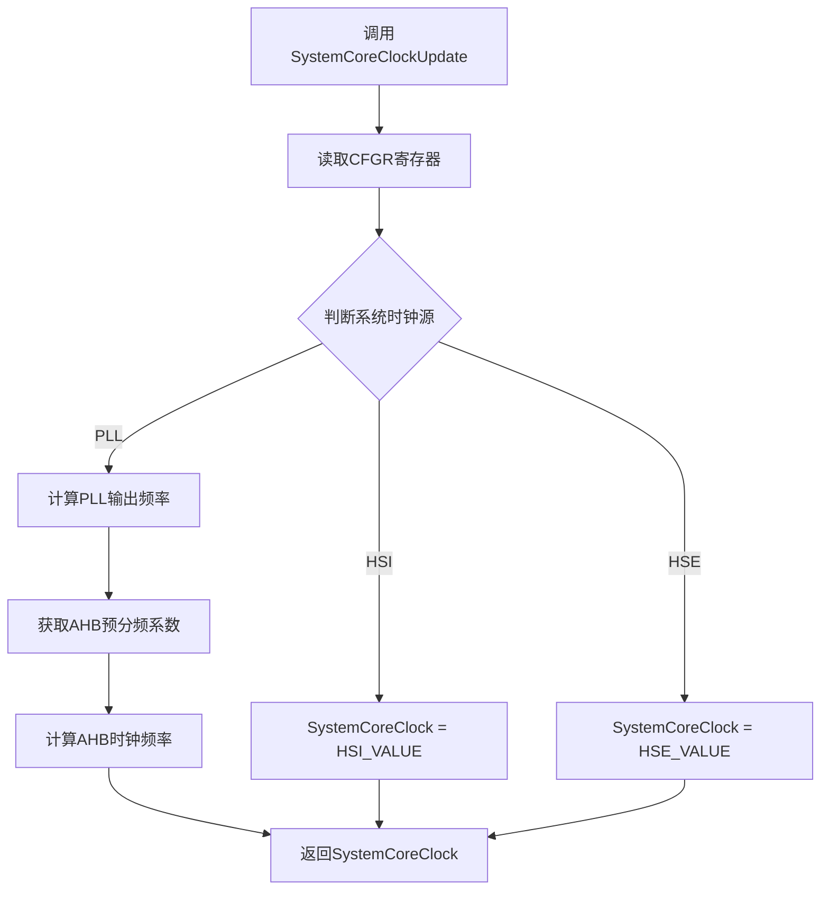
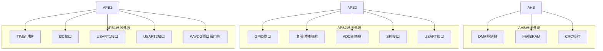
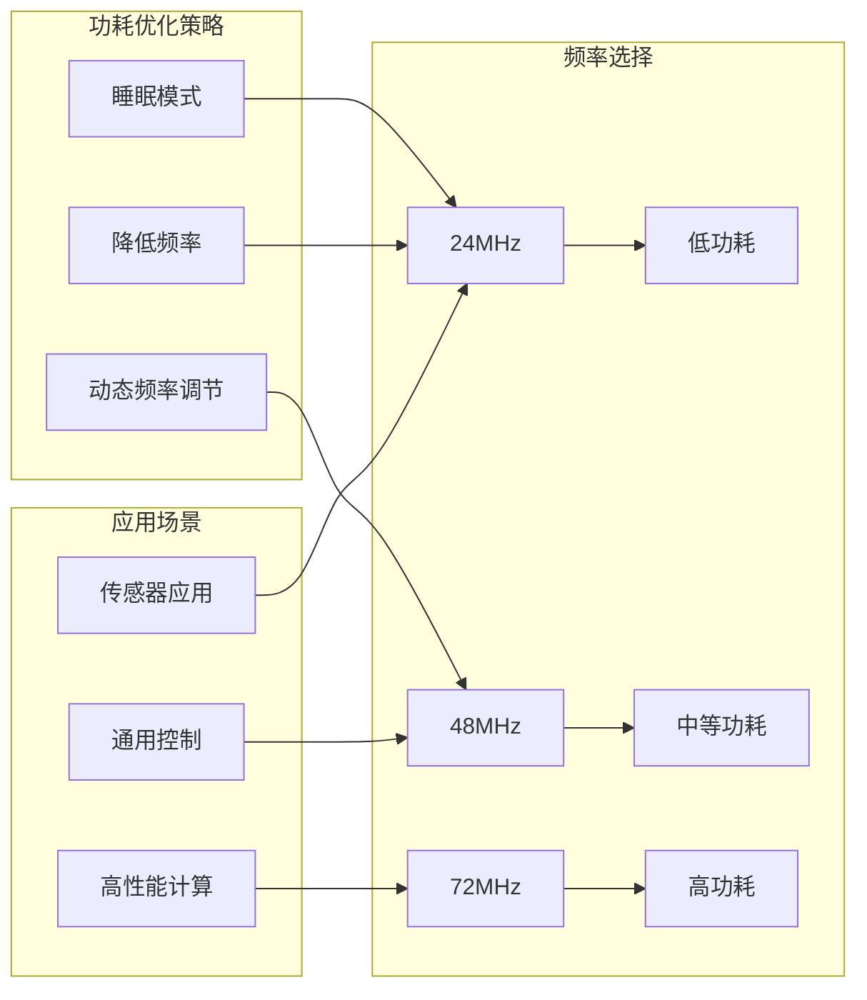

# 系统时钟配置

<cite>
**本文档引用的文件**
- [system_stm32f1xx.c](file://Core/Src/system_stm32f1xx.c)
- [main.c](file://Core/Src/main.c)
- [stm32f1xx_hal_rcc.h](file://Drivers/STM32F1xx_HAL_Driver/Inc/stm32f1xx_hal_rcc.h)
- [stm32f1xx_hal_rcc_ex.h](file://Drivers/STM32F1xx_HAL_Driver/Inc/stm32f1xx_hal_rcc_ex.h)
- [stm32f1xx_ll_rcc.h](file://Drivers/STM32F1xx_HAL_Driver/Inc/stm32f1xx_ll_rcc.h)
- [stm32f1xx_hal_rcc.c](file://Drivers/STM32F1xx_HAL_Driver/Src/stm32f1xx_hal_rcc.c)
- [stm32f103xb.h](file://Drivers/CMSIS/Device/ST/STM32F1xx/Include/stm32f103xb.h)
</cite>

## 目录
1. [简介](#简介)
2. [项目结构](#项目结构)
3. [核心组件](#核心组件)
4. [架构概览](#架构概览)
5. [详细组件分析](#详细组件分析)
6. [依赖关系分析](#依赖关系分析)
7. [性能考虑](#性能考虑)
8. [故障排除指南](#故障排除指南)
9. [结论](#结论)

## 简介

本文档深入分析STM32F103C8T6系统的时钟配置，重点解释HSE外部高速晶体振荡器的配置和使用，包括8MHz外部晶振的选择原理。详细说明PLL倍频设置，从HSE到SYSCLK的倍频过程（72MHz）。解释AHB、APB1、APB2总线时钟的分频配置及其对各外设的影响。提供SystemClock_Config()函数的完整实现分析，包括RCC_OscInitStruct和RCC_ClkInitStruct结构体的各个字段含义。解释时钟安全系统(CSS)的作用和配置。包含时钟树图解和频率计算公式。提供不同应用场景下的时钟配置优化建议和性能功耗平衡策略。

## 项目结构

该项目采用标准的STM32CubeMX工程结构，主要涉及以下关键目录和文件：



**图表来源**
- [main.c](file://Core/Src/main.c#L1-L50)
- [system_stm32f1xx.c](file://Core/Src/system_stm32f1xx.c#L1-L50)

**章节来源**
- [main.c](file://Core/Src/main.c#L1-L50)
- [system_stm32f1xx.c](file://Core/Src/system_stm32f1xx.c#L1-L50)

## 核心组件

### 时钟配置主函数

SystemClock_Config()函数是整个系统时钟配置的核心，位于main.c文件中：



**图表来源**
- [main.c](file://Core/Src/main.c#L490-L523)

### 关键时钟参数

系统采用以下标准配置：
- **HSE频率**: 8MHz（外部高速晶体振荡器）
- **PLL倍频**: 9倍（8MHz × 9 = 72MHz）
- **SYSCLK**: 72MHz（系统时钟）
- **AHB时钟**: 72MHz（不分频）
- **APB1时钟**: 36MHz（AHB时钟÷2）
- **APB2时钟**: 72MHz（AHB时钟不分频）

**章节来源**
- [main.c](file://Core/Src/main.c#L490-L523)

## 架构概览

### 时钟树结构



**图表来源**
- [system_stm32f1xx.c](file://Core/Src/system_stm32f1xx.c#L224-L330)
- [stm32f1xx_hal_rcc.h](file://Drivers/STM32F1xx_HAL_Driver/Inc/stm32f1xx_hal_rcc.h#L40-L78)

### 频率计算公式

基于STM32F103系列的时钟计算规则：

**系统时钟频率计算**：
- 当使用HSE作为系统时钟源：SYSCLK = HSE × PLL倍频因子
- 当使用HSI作为系统时钟源：SYSCLK = HSI（8MHz）
- 当使用PLL作为系统时钟源：SYSCLK = (HSE/预分频) × PLL倍频因子

**总线时钟频率计算**：
- AHB时钟 = SYSCLK ÷ AHB预分频系数
- APB1时钟 = AHB时钟 ÷ APB1预分频系数（最大2倍）
- APB2时钟 = AHB时钟 ÷ APB2预分频系数（最大1倍）

**章节来源**
- [system_stm32f1xx.c](file://Core/Src/system_stm32f1xx.c#L224-L330)
- [stm32f1xx_ll_rcc.h](file://Drivers/STM32F1xx_HAL_Driver/Inc/stm32f1xx_ll_rcc.h#L547-L719)

## 详细组件分析

### HSE外部高速晶体振荡器配置

#### HSE选择原理

STM32F103C8T6的HSE配置具有以下特点：



**图表来源**
- [stm32f1xx_hal_rcc.h](file://Drivers/STM32F1xx_HAL_Driver/Inc/stm32f1xx_hal_rcc.h#L112-L120)

#### HSE配置参数详解

在SystemClock_Config()函数中，HSE配置的关键参数：

| 参数名称 | 取值 | 含义 | 作用 |
|---------|------|------|------|
| OscillatorType | RCC_OSCILLATORTYPE_HSE | 振荡器类型 | 指定使用HSE振荡器 |
| HSEState | RCC_HSE_ON | HSE状态 | 启用HSE振荡器 |
| HSEPredivValue | RCC_HSE_PREDIV_DIV1 | HSE预分频 | 不进行预分频（直接使用8MHz） |
| HSIState | RCC_HSI_ON | HSI状态 | 同时启用HSI作为备用时钟源 |
| PLL.PLLState | RCC_PLL_ON | PLL状态 | 启用PLL倍频功能 |
| PLL.PLLSource | RCC_PLLSOURCE_HSE | PLL输入源 | 选择HSE作为PLL输入 |
| PLL.PLLMUL | RCC_PLL_MUL9 | PLL倍频因子 | 将HSE频率乘以9倍 |

**章节来源**
- [main.c](file://Core/Src/main.c#L492-L504)

### PLL倍频设置分析

#### PLL配置结构体



**图表来源**
- [stm32f1xx_hal_rcc.h](file://Drivers/STM32F1xx_HAL_Driver/Inc/stm32f1xx_hal_rcc.h#L47-L78)

#### PLL倍频计算过程

对于STM32F103C8T6的PLL配置：

1. **输入时钟**: HSE = 8MHz
2. **预分频**: HSEPredivValue = RCC_HSE_PREDIV_DIV1（不预分频）
3. **PLL倍频**: PLL.PLLMUL = RCC_PLL_MUL9（9倍）
4. **输出时钟**: SYSCLK = 8MHz × 9 = 72MHz

**章节来源**
- [main.c](file://Core/Src/main.c#L492-L504)
- [system_stm32f1xx.c](file://Core/Src/system_stm32f1xx.c#L249-L277)

### 总线时钟分频配置

#### AHB总线时钟配置

AHB总线时钟配置采用不分频策略：

- **AHBCLKDivider**: RCC_SYSCLK_DIV1（不分频）
- **AHB时钟频率**: 72MHz（与SYSCLK相同）

这种配置确保了AHB总线能够获得最高频率，为CPU和DMA等高性能外设提供充足的时钟资源。

#### APB1和APB2总线时钟配置



**图表来源**
- [main.c](file://Core/Src/main.c#L512-L517)

#### APB总线分频规则

| 总线类型 | 配置值 | 分频系数 | 实际频率 |
|---------|--------|----------|----------|
| AHB | RCC_SYSCLK_DIV1 | 1 | 72MHz |
| APB2 | RCC_SYSCLK_DIV1 | 1 | 72MHz |
| APB1 | RCC_HCLK_DIV2 | 2 | 36MHz |

**章节来源**
- [main.c](file://Core/Src/main.c#L512-L517)

### 时钟安全系统(CSS)配置

#### CSS功能概述

时钟安全系统(CSS)是STM32F103的重要保护机制：



**图表来源**
- [stm32f1xx_hal_rcc.c](file://Drivers/STM32F1xx_HAL_Driver/Src/stm32f1xx_hal_rcc.c#L139-L143)

#### CSS配置方法

CSS的启用和配置通过以下方式实现：

1. **启用CSS功能**: 使用`__HAL_RCC_CSS_ENABLE()`宏
2. **CSS中断处理**: 实现`HAL_RCC_CSSCallback()`回调函数
3. **自动切换机制**: 当HSE失效时自动切换到HSI

**章节来源**
- [stm32f1xx_hal_rcc.c](file://Drivers/STM32F1xx_HAL_Driver/Src/stm32f1xx_hal_rcc.c#L139-L143)

### SystemCoreClockUpdate函数分析

该函数负责动态更新SystemCoreClock变量，确保系统时钟频率的准确性：



**图表来源**
- [system_stm32f1xx.c](file://Core/Src/system_stm32f1xx.c#L224-L330)

**章节来源**
- [system_stm32f1xx.c](file://Core/Src/system_stm32f1xx.c#L224-L330)

## 依赖关系分析

### 外设时钟配置

基于AHB和APB总线的时钟分配，各外设的时钟配置如下：



**图表来源**
- [stm32f103xb.h](file://Drivers/CMSIS/Device/ST/STM32F1xx/Include/stm32f103xb.h#L582-L687)

### 时钟配置的硬件实现

STM32F103C8T6的时钟配置通过以下寄存器实现：

| 寄存器名称 | 功能 | 位定义 | 配置值 |
|-----------|------|--------|--------|
| RCC_CR | 时钟控制寄存器 | HSEON, HSION, CSSON | HSEON, HSION, CSSON |
| RCC_CFGR | 时钟配置寄存器 | SW, HPRE, PPRE1, PPRE2, PLLSRC, PLLMULL | SW_PLL, HPRE_DIV1, PPRE1_DIV2, PPRE2_DIV1 |
| RCC_CIR | 时钟中断寄存器 | HSERDYIE, CSSC | HSERDYIE, CSSC |

**章节来源**
- [stm32f103xb.h](file://Drivers/CMSIS/Device/ST/STM32F1xx/Include/stm32f103xb.h#L423-L437)

## 性能考虑

### 频率与功耗的关系

基于STM32F103C8T6的特性，频率与功耗的关系如下：



### 不同应用场景的时钟配置建议

#### 低功耗应用配置

对于电池供电或对功耗敏感的应用：

```c
// 建议配置：24MHz
RCC_OscInitStruct.PLL.PLLMUL = RCC_PLL_MUL3;  // 8MHz × 3 = 24MHz
RCC_ClkInitStruct.AHBCLKDivider = RCC_SYSCLK_DIV3;  // 24MHz
RCC_ClkInitStruct.APB1CLKDivider = RCC_HCLK_DIV1;   // 24MHz
```

#### 一般控制应用配置

对于常见的嵌入式控制系统：

```c
// 推荐配置：48MHz
RCC_OscInitStruct.PLL.PLLMUL = RCC_PLL_MUL6;  // 8MHz × 6 = 48MHz
RCC_ClkInitStruct.AHBCLKDivider = RCC_SYSCLK_DIV1;  // 48MHz
RCC_ClkInitStruct.APB1CLKDivider = RCC_HCLK_DIV2;   // 24MHz
RCC_ClkInitStruct.APB2CLKDivider = RCC_HCLK_DIV1;   // 48MHz
```

#### 高性能应用配置

对于需要更高处理能力的应用：

```c
// 最佳配置：72MHz
RCC_OscInitStruct.PLL.PLLMUL = RCC_PLL_MUL9;  // 8MHz × 9 = 72MHz
RCC_ClkInitStruct.AHBCLKDivider = RCC_SYSCLK_DIV1;  // 72MHz
RCC_ClkInitStruct.APB1CLKDivider = RCC_HCLK_DIV2;   // 36MHz
RCC_ClkInitStruct.APB2CLKDivider = RCC_HCLK_DIV1;   // 72MHz
```

### Flash等待状态配置

根据系统频率选择合适的Flash等待状态：

| SYSCLK频率范围(MHz) | Flash等待状态 | 描述 |
|--------------------|---------------|------|
| 0 - 24 | 0WS | 无需等待，最高效率 |
| 24 - 48 | 1WS | 1个等待周期 |
| 48 - 72 | 2WS | 2个等待周期 |

**章节来源**
- [stm32f1xx_hal_rcc.c](file://Drivers/STM32F1xx_HAL_Driver/Src/stm32f1xx_hal_rcc.c#L173-L184)

## 故障排除指南

### 常见时钟配置问题

#### HSE启动失败

**症状**: HSE无法稳定工作，系统时钟切换失败

**排查步骤**:
1. 检查外部晶振连接是否正确
2. 验证晶振频率是否符合要求（8MHz）
3. 确认去耦电容值是否合适（通常22pF）
4. 检查PC14和PC15引脚的配置

**解决方案**:
```c
// 确保HSE配置正确
RCC_OscInitStruct.HSEState = RCC_HSE_ON;
RCC_OscInitStruct.HSEPredivValue = RCC_HSE_PREDIV_DIV1;
```

#### PLL锁定失败

**症状**: PLL无法锁定，系统时钟不稳定

**排查步骤**:
1. 检查HSE频率是否准确
2. 验证PLL倍频因子是否在允许范围内
3. 确认电源电压是否稳定

**解决方案**:
```c
// 调整PLL倍频因子
RCC_OscInitStruct.PLL.PLLMUL = RCC_PLL_MUL9;  // 8MHz × 9 = 72MHz
```

#### 时钟安全系统(CSS)中断

**症状**: 系统频繁触发CSS中断

**排查步骤**:
1. 检查HSE输入信号质量
2. 验证外部晶振的稳定性
3. 检查PC14和PC15引脚的配置

**解决方案**:
```c
// 启用CSS并实现回调函数
__HAL_RCC_CSS_ENABLE();
// 在用户代码中实现HAL_RCC_CSSCallback()
```

**章节来源**
- [stm32f1xx_hal_rcc.c](file://Drivers/STM32F1xx_HAL_Driver/Src/stm32f1xx_hal_rcc.c#L1374-L1382)

### 时钟配置验证方法

#### 系统时钟频率测量

使用以下方法验证系统时钟配置的正确性：

1. **软件测量**: 通过SysTick定时器测量系统时钟频率
2. **硬件测量**: 使用示波器测量HSE和SYSCLK引脚的波形
3. **功能测试**: 通过串口通信测试验证时钟配置

#### 时钟配置调试技巧

```c
// 在SystemClock_Config()中添加调试信息
printf("HSE Frequency: %d Hz\n", HSE_VALUE);
printf("SYSCLK Frequency: %d Hz\n", HAL_RCC_GetSysClockFreq());
printf("HCLK Frequency: %d Hz\n", HAL_RCC_GetHCLKFreq());
printf("PCLK1 Frequency: %d Hz\n", HAL_RCC_GetPCLK1Freq());
printf("PCLK2 Frequency: %d Hz\n", HAL_RCC_GetPCLK2Freq());
```

## 结论

本文档详细分析了STM32F103C8T6系统的时钟配置，重点涵盖了HSE外部高速晶体振荡器的配置原理、PLL倍频设置、总线时钟分频配置以及时钟安全系统(CSS)的工作机制。通过SystemClock_Config()函数的完整实现分析，我们了解了从8MHz外部晶振到72MHz系统时钟的完整路径。

关键配置要点：
- **HSE配置**: 8MHz外部晶振，直接使用不进行预分频
- **PLL倍频**: 9倍倍频，实现72MHz系统时钟
- **总线分频**: AHB不分频，APB1半分频，APB2不分频
- **CSS保护**: 启用时钟安全系统，确保系统可靠性

在实际应用中，应根据具体的应用场景和功耗要求选择合适的时钟配置。对于低功耗应用，建议使用较低的系统频率；对于高性能应用，则可以使用72MHz的全速配置。同时，合理配置Flash等待状态和启用CSS保护机制，可以进一步提升系统的稳定性和可靠性。