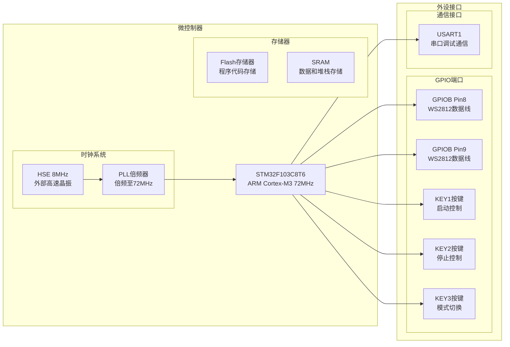
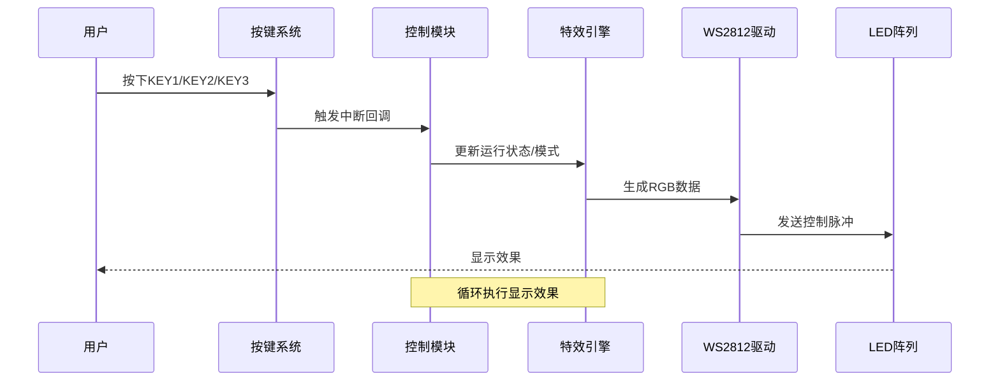
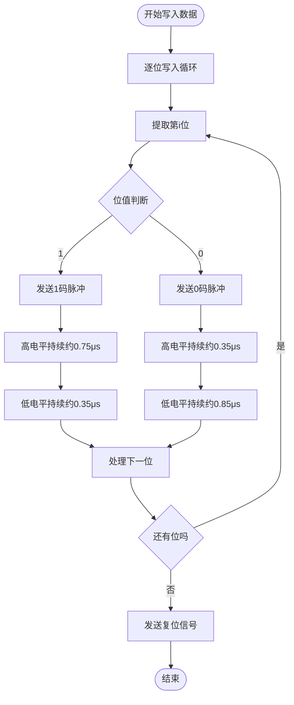
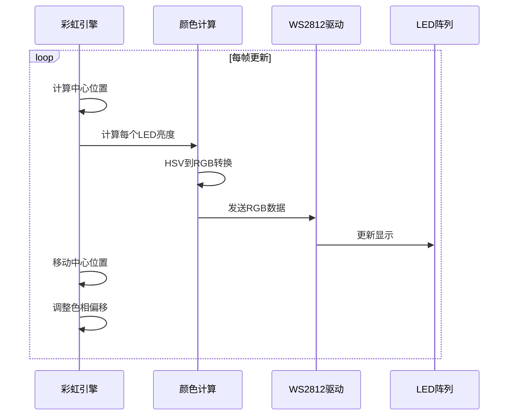
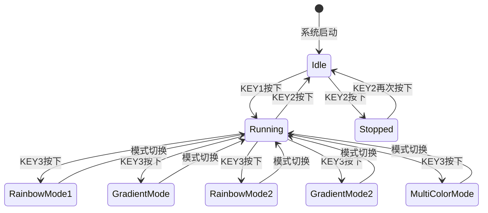
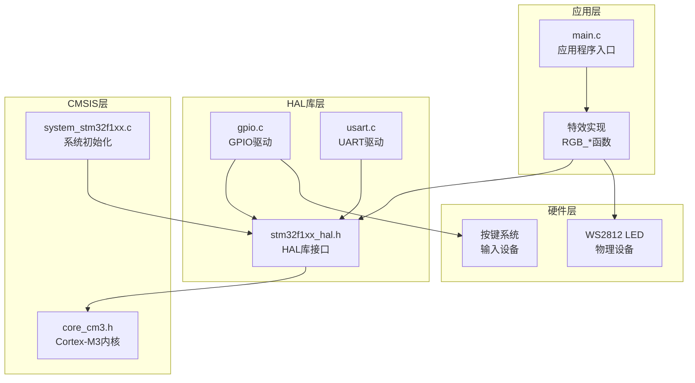

# 项目概述

<cite>
**本文档引用的文件**
- [main.c](file://Core/Src/main.c)
- [main.h](file://Core/Inc/main.h)
- [gpio.c](file://Core/Src/gpio.c)
- [usart.c](file://Core/Src/usart.c)
- [system_stm32f1xx.c](file://Core/Src/system_stm32f1xx.c)
- [stm32f1xx_hal.h](file://Drivers/STM32F1xx_HAL_Driver/Inc/stm32f1xx_hal.h)
- [STM32F103C8T6_WS2812_HAL.ioc](file://STM32F103C8T6_WS2812_HAL.ioc)
</cite>

## 目录
1. [简介](#简介)
2. [项目结构](#项目结构)
3. [核心组件](#核心组件)
4. [架构概览](#架构概览)
5. [详细组件分析](#详细组件分析)
6. [依赖关系分析](#依赖关系分析)
7. [性能考虑](#性能考虑)
8. [故障排除指南](#故障排除指南)
9. [结论](#结论)

## 简介

本项目是一个基于STM32F103C8T6微控制器的WS2812 RGB LED控制系统。WS2812是一种集成了控制电路和RGB三色LED的智能像素灯珠，广泛应用于装饰照明、艺术装置和交互式显示等领域。该项目实现了精确的时序控制，支持多种显示效果，包括彩虹滚动、渐变滚动和多色同步显示等。

### 项目目标

- 实现WS2812 RGB LED的精确时序控制
- 提供多种视觉显示效果和模式切换
- 支持用户通过按键进行实时控制
- 构建稳定可靠的嵌入式LED控制系统

### 技术特点

- 基于STM32F103C8T6 ARM Cortex-M3处理器
- 采用HAL库进行硬件抽象层编程
- 实现精确的微秒级延时控制
- 支持多种显示模式和效果
- 具备完整的错误处理机制

## 项目结构

项目采用标准的STM32CubeMX工程结构，主要包含以下目录：

```mermaid
graph TB
subgraph "项目根目录"
Root["项目根目录"]
subgraph "Core"
Core["Core/"]
Inc["Inc/ - 头文件"]
Src["Src/ - 源代码"]
end
subgraph "Drivers"
Drivers["Drivers/"]
CMSIS["CMSIS/ - ARM CMSIS内核接口"]
HAL["STM32F1xx_HAL_Driver/ - STM32 HAL驱动"]
end
subgraph "MDK_ARM"
MDK["MDK-ARM/ - Keil MDK项目文件"]
end
subgraph "配置文件"
Config["STM32F103C8T6_WS2812_HAL.ioc - STM32CubeMX配置"]
Qoder[".qoder/ - AI辅助工具配置"]
end
end
Root --> Core
Root --> Drivers
Root --> MDK
Root --> Config
Root --> Qoder
Core --> Inc
Core --> Src
Drivers --> CMSIS
Drivers --> HAL
```

**图表来源**
- [main.c](file://Core/Src/main.c#L1-L50)
- [STM32F103C8T6_WS2812_HAL.ioc](file://STM32F103C8T6_WS2812_HAL.ioc#L1-L30)

**章节来源**
- [main.c](file://Core/Src/main.c#L1-L50)
- [STM32F103C8T6_WS2812_HAL.ioc](file://STM32F103C8T6_WS2812_HAL.ioc#L1-L50)

## 核心组件

### 硬件平台选择

**STM32F103C8T6选择原因：**
- **高性能性价比**：ARM Cortex-M3内核，72MHz主频，适合实时控制应用
- **丰富的外设资源**：内置GPIO、UART、定时器等，满足LED控制需求
- **广泛的生态系统**：成熟的开发工具链和社区支持
- **成本效益**：作为入门级微控制器，价格亲民且功能完整

### 开发环境配置

**Keil MDK-ARM选择原因：**
- **官方支持**：ST官方推荐的开发工具
- **调试功能**：强大的在线调试和性能分析能力
- **优化编译**：高效的编译器，生成优化的机器代码
- **集成开发**：完整的IDE环境，包含项目管理、编译、调试一体化

**STM32CubeMX配置优势：**
- **图形化配置**：直观的硬件外设配置界面
- **自动代码生成**：自动生成初始化代码框架
- **时钟配置**：精确的系统时钟和外设时钟配置
- **引脚分配**：可视化引脚映射和复用功能配置

### 关键硬件组件



**图表来源**
- [gpio.c](file://Core/Src/gpio.c#L42-L89)
- [usart.c](file://Core/Src/usart.c#L31-L57)
- [STM32F103C8T6_WS2812_HAL.ioc](file://STM32F103C8T6_WS2812_HAL.ioc#L71-L82)

**章节来源**
- [gpio.c](file://Core/Src/gpio.c#L42-L89)
- [usart.c](file://Core/Src/usart.c#L31-L57)
- [STM32F103C8T6_WS2812_HAL.ioc](file://STM32F103C8T6_WS2812_HAL.ioc#L71-L82)

## 架构概览

### 系统架构设计

```mermaid
graph TB
subgraph "应用层"
App[应用程序层<br/>main.c]
Effects[特效引擎<br/>RGB_RainbowScroll()<br/>RGB_Scroll_Gradient()]
Control[控制逻辑<br/>按键处理<br/>模式切换]
end
subgraph "中间件层"
HAL[STM32 HAL库<br/>stm32f1xx_hal.h]
Drivers[设备驱动<br/>GPIO/UART驱动]
end
subgraph "硬件抽象层"
GPIO[GPIO外设<br/>PB8/PB9输出]
UART[UART外设<br/>USART1调试]
SysTick[SystemTick定时器<br/>精确延时]
end
subgraph "物理层"
WS2812[WS2812 LED<br/>RGB像素灯珠]
Buttons[按键输入<br/>KEY1/KEY2/KEY3]
Debug[调试接口<br/>串口输出]
end
App --> Effects
App --> Control
Effects --> HAL
Control --> HAL
HAL --> GPIO
HAL --> UART
HAL --> SysTick
GPIO --> WS2812
GPIO --> Buttons
UART --> Debug
```

**图表来源**
- [main.c](file://Core/Src/main.c#L373-L484)
- [stm32f1xx_hal.h](file://Drivers/STM32F1xx_HAL_Driver/Inc/stm32f1xx_hal.h#L28-L30)
- [gpio.c](file://Core/Src/gpio.c#L42-L89)

### 数据流架构



**图表来源**
- [main.c](file://Core/Src/main.c#L526-L558)
- [main.c](file://Core/Src/main.c#L425-L482)

**章节来源**
- [main.c](file://Core/Src/main.c#L373-L484)
- [main.h](file://Core/Inc/main.h#L60-L68)

## 详细组件分析

### WS2812控制核心

#### 时序控制实现

WS2812对时序要求极其严格，需要精确控制高电平和低电平的持续时间：



**图表来源**
- [main.c](file://Core/Src/main.c#L121-L146)

#### RGB数据格式转换

WS2812采用特殊的RGB数据格式，需要进行颜色通道重排：

| 数据格式 | WS2812要求 | 程序实现 |
|---------|-----------|---------|
| GRB序列 | Green → Red → Blue | 程序按此顺序发送 |
| 8位精度 | 每个颜色分量8bit | 使用uint8_t存储 |
| 时序要求 | 1码/0码严格时序 | 精确微秒级延时 |

**章节来源**
- [main.c](file://Core/Src/main.c#L121-L146)
- [main.c](file://Core/Src/main.c#L150-L176)

### 显示效果引擎

#### 彩虹滚动效果

彩虹滚动是项目的核心特效之一，实现了动态的色彩流动效果：



**图表来源**
- [main.c](file://Core/Src/main.c#L312-L348)

#### 渐变滚动效果

渐变滚动提供了柔和的亮度过渡效果：

| 参数 | 值 | 说明 |
|------|----|-----|
| 滚动速度 | 100ms | 可调节的延时参数 |
| 亮度衰减 | 255-距离×35 | 线性亮度递减 |
| 最大影响范围 | 距离≤3 | 距离超过3的LED熄灭 |

**章节来源**
- [main.c](file://Core/Src/main.c#L250-L282)
- [main.c](file://Core/Src/main.c#L312-L348)

### 用户交互系统

#### 按键控制系统

系统配备了三个独立的按键，提供完整的用户交互：



**图表来源**
- [main.c](file://Core/Src/main.c#L526-L558)

**章节来源**
- [main.c](file://Core/Src/main.c#L526-L558)
- [main.h](file://Core/Inc/main.h#L60-L68)

### 通信与调试

#### UART调试接口

系统通过USART1提供调试信息输出：

| 参数 | 值 | 说明 |
|------|----|-----|
| 波特率 | 115200 | 标准调试波特率 |
| 数据位 | 8位 | ASCII字符传输 |
| 停止位 | 1位 | 标准协议格式 |
| 校验位 | 无 | 简化调试输出 |

**章节来源**
- [usart.c](file://Core/Src/usart.c#L31-L57)

## 依赖关系分析

### 软件架构依赖



**图表来源**
- [main.c](file://Core/Src/main.c#L20-L22)
- [stm32f1xx_hal.h](file://Drivers/STM32F1xx_HAL_Driver/Inc/stm32f1xx_hal.h#L28-L30)

### 外设配置依赖

```mermaid
graph LR
subgraph "时钟配置"
HSE[HSE 8MHz]<br/>外部晶振
PLL[PLL倍频器]
SYSCLK[SYSCLK 72MHz]
end
subgraph "AHB总线"
GPIOB[GPIOB时钟]
DMA[DMA时钟]
end
subgraph "APB1总线"
USART1[USART1时钟]
TIM2[TIM2时钟]
end
subgraph "APB2总线"
AFIO[AFIO时钟]
ADC1[ADC1时钟]
end
HSE --> PLL --> SYSCLK
SYSCLK --> GPIOB
SYSCLK --> USART1
SYSCLK --> TIM2
SYSCLK --> AFIO
SYSCLK --> ADC1
```

**图表来源**
- [STM32F103C8T6_WS2812_HAL.ioc](file://STM32F103C8T6_WS2812_HAL.ioc#L122-L142)

**章节来源**
- [STM32F103C8T6_WS2812_HAL.ioc](file://STM32F103C8T6_WS2812_HAL.ioc#L122-L142)

## 性能考虑

### 时序精度优化

WS2812对时序的要求极高，项目采用了多种技术保证精度：

1. **精确延时控制**：使用72MHz系统时钟的精确微秒延时
2. **内联汇编优化**：关键路径使用__NOP()指令保证时序
3. **寄存器直接操作**：避免函数调用开销，直接操作GPIO寄存器

### 内存使用优化

- **静态内存分配**：LED颜色缓冲区在栈上分配，减少heap使用
- **紧凑的数据结构**：LED_Color结构体仅包含必要字段
- **常量数据存储**：颜色表存储在只读区域

### 功耗管理

- **GPIO配置优化**：输出引脚配置为推挽输出，降低功耗
- **时钟频率选择**：72MHz主频在性能和功耗间平衡
- **休眠策略**：空闲时使用HAL_Delay()进入低功耗状态

## 故障排除指南

### 常见问题诊断

#### LED不亮或显示异常

**可能原因及解决方案：**

1. **WS2812引脚配置错误**
   - 检查GPIOB8/PB9的正确配置
   - 验证引脚复用功能设置

2. **时序控制问题**
   - 确认delay_nus()函数的准确性
   - 检查系统时钟配置是否正确

3. **电源供应不足**
   - 验证LED供电电压和电流
   - 检查限流电阻是否合适

#### 按键无响应

**诊断步骤：**

1. **检查按键硬件连接**
   - 验证按键与GPIO的正确连接
   - 检查上拉电阻配置

2. **确认中断配置**
   - 验证EXTI中断优先级设置
   - 检查NVIC中断使能状态

#### 串口调试无输出

**排查方法：**

1. **检查USART配置**
   - 验证波特率设置
   - 确认GPIO引脚复用配置

2. **验证调试线连接**
   - 检查USB转串口线连接
   - 确认串口调试软件设置

**章节来源**
- [main.c](file://Core/Src/main.c#L565-L574)
- [gpio.c](file://Core/Src/gpio.c#L79-L87)

### 调试技巧

1. **使用printf调试**：通过USART1输出调试信息
2. **逻辑分析仪测试**：验证WS2812时序波形
3. **示波器测量**：检查关键信号的时序特性
4. **逐步注释法**：通过注释代码定位问题范围

## 结论

本项目成功实现了基于STM32F103C8T6的WS2812 RGB LED控制系统，展现了以下技术亮点：

### 技术成就

- **精确时序控制**：实现了WS2812严格的时序要求，确保LED显示的可靠性
- **多样化显示效果**：提供了彩虹滚动、渐变滚动等多种视觉效果
- **用户友好交互**：通过按键实现实时控制和模式切换
- **完善的错误处理**：具备健壮的错误检测和恢复机制

### 应用价值

该系统不仅适用于教育和学习目的，还可扩展应用于：
- 装饰照明控制系统
- 艺术装置和互动展示
- 嵌入式显示系统
- DIY电子制作项目

### 技术创新点

1. **灵活的硬件配置**：通过宏定义轻松调整LED数量和引脚配置
2. **模块化的代码结构**：清晰的功能分离便于维护和扩展
3. **精确的性能优化**：针对嵌入式环境进行了全面的性能优化

该项目为WS2812 LED控制提供了一个完整、可靠且易于理解的参考实现，既适合初学者学习嵌入式开发，也为有经验的开发者提供了实用的技术方案。